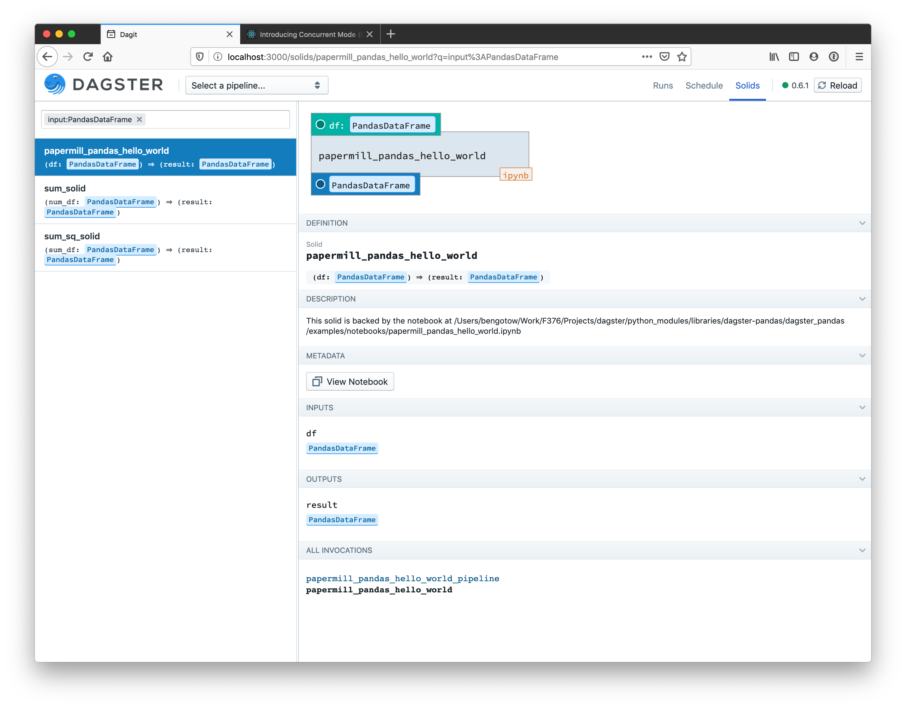
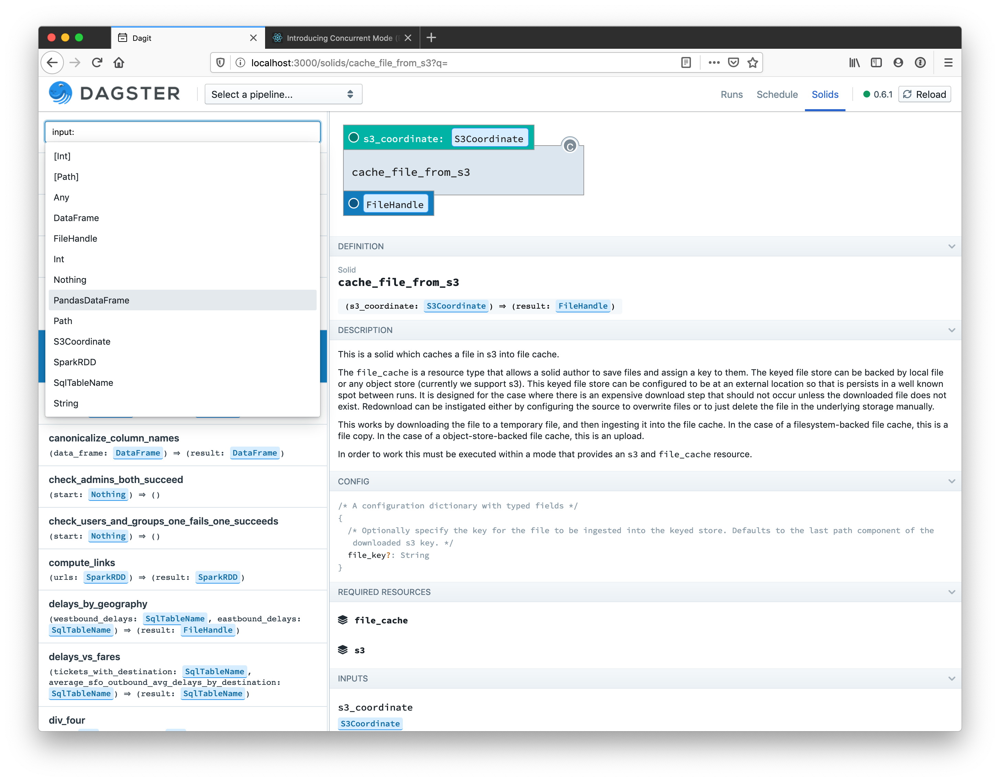
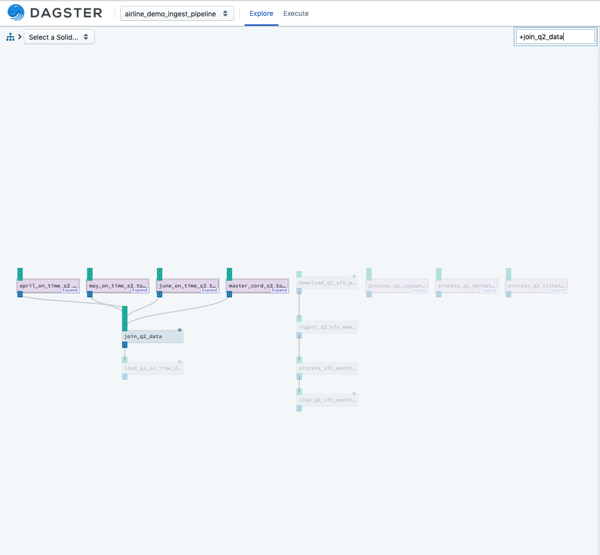
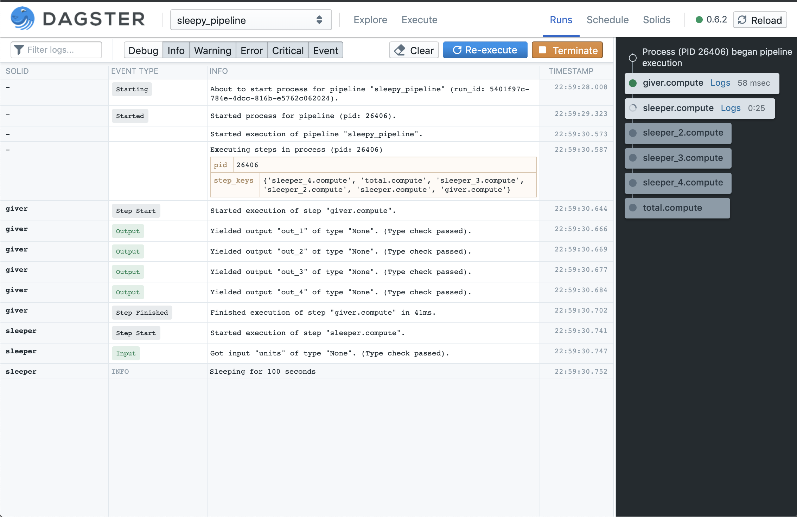

# Changelog

## 0.10.5 (upcoming)

**New**

* [k8s] Changed our weekly docker image releases (the default images in the helm chart). `dagster/dagster-k8s` and `dagster/dagster-celery-k8s` can be
  used for all processes which don't require user code (Dagit, Daemon, and Celery workers when using the CeleryK8sExecutor). `user-code-example` can
  be used for a sample user repository. The prior images (`k8s-dagit`, `k8s-celery-worker`, `k8s-example`)
  are deprecated.

## 0.10.4

**Bugfixes**

* Fixed an issue with daemon heartbeat backwards compatibility. Resolves an error on Dagit's Daemon Status page

## 0.10.3

**New**

* [dagster] Sensors can now specify a `minimum_interval_seconds` argument, which determines the minimum amount of time between sensor evaluations.
* [dagit] After manually reloading the current repository, users will now be prompted to regenerate preset-based or partition-set based run configs in the Playground view. This helps ensure that the generated run config is up to date when launching new runs. The prompt does not occur when the repository is automatically reloaded.

**Bugfixes**

* Updated the `-n`/`--max_workers` default value for the `dagster api grpc` command to be `None`. When set to `None`, the gRPC server will use the default number of workers which is based on the CPU count. If you were previously setting this value to `1`, we recommend removing the argument or increasing the number.
* Fixed issue loading the schedule tick history graph for new schedules that have not been turned on.
* In Dagit, newly launched runs will open in the current tab instead of a new tab.
* Dagit bugfixes and improvements, including changes to loading state spinners.
* When a user specifies both an intermediate storage and an IO manager for a particular output, we no longer silently ignore the IO manager


## 0.10.2

**Community Contributions**

* [docs] Update URL to telemetry info (thanks @emilmelnikov (https://github.com/dagster-io/dagster/commits?author=emilmelnikov)!)
* [dagster-azure] Fix for listing files on ADL example (thanks @ericct!)

**New**

* [dagstermill] Users can now specify custom tags & descriptions for notebook solids.
* [dagster-pagerduty / dagster-slack] Added built-in hook integrations to create pagerduty/slack alerts when solids fail.
* [dagit] Added ability to preview runs for upcoming schedule ticks.

**Bugfixes**

* Fixed an issue where run start times and end times were displayed in the wrong timezone in Dagit when using Postgres storage.
* Schedules with partitions that weren’t able to execute due to not being able to find a partition will now display the name of the partition they were unable to find on the “Last tick” entry for that schedule.

* Improved timing information display for queued and canceled runs within the Runs table view and on individual Run pages in Dagit.
* Improvements to the tick history view for schedules and sensors.
* Fixed formatting issues on the Dagit instance configuration page.
* Miscellaneous Dagit bugfixes and improvements.
* The dagster pipeline launch command will now respect run concurrency limits if they are applied on your instance.
* Fixed an issue where re-executing a run created by a sensor would cause the daemon to stop executing any additional runs from that sensor.
* Sensor runs with invalid run configuration will no longer create a failed run - instead, an error will appear on the page for the sensor, allowing you to fix the configuration issue.
* General dagstermill housekeeping: test refactoring & type annotations, as well as repinning ipykernel to solve #3401

**Documentation**

* Improved dagster-dbt example.
* Added examples to demonstrate experimental features, including Memoized Development and Dynamic Graph.
* Added a PR template and how to pick an issue for the first time contributors

## 0.10.1

**Community Contributions**

* Reduced image size of `k8s-example` by 25% (104 MB) (thanks @alex-treebeard and @mrdavidlaing!)
* [dagster-snowflake] `snowflake_resource` can now be configured to use the SQLAlchemy connector (thanks @basilvetas!)

**New**

* When setting `userDeployments.deployments` in the Helm chart, `replicaCount` now defaults to 1 if not specified.

**Bugfixes**

* Fixed an issue where the Dagster daemon process couldn’t launch runs in repository locations containing more than one repository.
* Fixed an issue where Helm chart was not correctly templating `env`, `envConfigMaps`, and `envSecrets`.

**Documentation**

* Added new [troubleshooting guide](https://docs.dagster.io/troubleshooting) for problems encountered while using the `QueuedRunCoordinator` to limit run concurrency.
* Added documentation for the sensor command-line interface.

## 0.10.0

### Major Changes

* A **native scheduler** with support for exactly-once, fault tolerant, timezone-aware scheduling.
  A new Dagster daemon process has been added to manage your schedules and sensors with a
  reconciliation loop, ensuring that all runs are executed exactly once, even if the Dagster daemon
  experiences occasional failure. See the
  [Migration Guide](https://github.com/dagster-io/dagster/blob/master/MIGRATION.md) for
  instructions on moving from `SystemCronScheduler` or `K8sScheduler` to the new scheduler.
* **First-class sensors**, built on the new Dagster daemon, allow you to instigate runs based on
  changes in external state - for example, files on S3 or assets materialized by other Dagster
  pipelines. See the [Sensors Overview](http://docs.dagster.io/overview/schedules-sensors/sensors)
  for more information.
* Dagster now supports **pipeline run queueing**. You can apply instance-level run concurrency
  limits and prioritization rules by adding the QueuedRunCoordinator to your Dagster instance. See
  the [Run Concurrency Overview](http://docs.dagster.io/overview/pipeline-runs/limiting-run-concurrency)
  for more information.
* The `IOManager` abstraction provides a new, streamlined primitive for granular control over where
  and how solid outputs are stored and loaded. This is intended to replace the (deprecated)
  intermediate/system storage abstractions, See the
  [IO Manager Overview](http://docs.dagster.io/overview/io-managers/io-managers) for more
  information.
* A new **Partitions page** in Dagit lets you view your your pipeline runs organized by partition.
  You can also **launch backfills from Dagit** and monitor them from this page.
* A new **Instance Status page** in Dagit lets you monitor the health of your Dagster instance,
  with repository location information, daemon statuses, instance-level schedule and sensor
  information, and linkable instance configuration.
* **Resources can now declare their dependencies on other resources** via the
  `required_resource_keys` parameter on `@resource`.
* Our support for deploying on **Kubernetes** is now mature and battle-tested  Our Helm chart is
  now easier to configure and deploy, and we’ve made big investments in observability and
  reliability. You can view Kubernetes interactions in the structured event log and use Dagit to
  help you understand what’s happening in your deployment. The defaults in the Helm chart will
  give you graceful degradation and failure recovery right out of the box.
* Experimental support for **dynamic orchestration** with the new `DynamicOutputDefinition` API.
  Dagster can now map the downstream dependencies over a dynamic output at runtime.

### Breaking Changes

**Dropping Python 2 support**

* We’ve dropped support for Python 2.7, based on community usage and enthusiasm for Python 3-native
  public APIs.

**Removal of deprecated APIs**

_These APIs were marked for deprecation with warnings in the 0.9.0 release, and have been removed in
the 0.10.0 release._

* The decorator `input_hydration_config`  has been removed. Use the `dagster_type_loader` decorator
  instead.
* The decorator `output_materialization_config` has been removed. Use `dagster_type_materializer`
  instead.
* The system storage subsystem has been removed. This includes `SystemStorageDefinition`,
  `@system_storage`, and `default_system_storage_defs` . Use the new `IOManagers` API instead. See
  the [IO Manager Overview](http://docs.dagster.io/overview/io-managers/io-managers) for more
  information.
* The `config_field` argument on decorators and definitions classes has been removed and replaced
  with `config_schema`. This is a drop-in rename.
* The argument `step_keys_to_execute` to the functions `reexecute_pipeline` and
  `reexecute_pipeline_iterator` has been removed. Use the `step_selection` argument to select
  subsets for execution instead.
* Repositories can no longer be loaded using the legacy `repository` key in your `workspace.yaml`;
  use `load_from` instead. See the
  [Workspaces Overview](https://docs.dagster.io/overview/repositories-workspaces/workspaces) for
  documentation about how to define a workspace.

**Breaking API Changes**

* `SolidExecutionResult.compute_output_event_dict` has been renamed to
  `SolidExecutionResult.compute_output_events_dict`. A solid execution result is returned from
  methods such as `result_for_solid`. Any call sites will need to be updated.
* The `.compute` suffix is no longer applied to step keys. Step keys that were previously named
  `my_solid.compute` will now be named `my_solid`. If you are using any API method that takes a
  step_selection argument, you will need to update the step keys accordingly.
* The `pipeline_def` property has been removed from the `InitResourceContext` passed to functions
  decorated with `@resource`.

**Dagstermill**
* If you are using `define_dagstermill_solid` with the `output_notebook` parameter set to `True`,
  you will now need to provide a file manager resource (subclass of
  `dagster.core.storage.FileManager`) on your pipeline mode under the resource key `"file_manager"`,
  e.g.:

  ```python
  from dagster import ModeDefinition, local_file_manager, pipeline
  from dagstermill import define_dagstermill_solid

  my_dagstermill_solid = define_dagstermill_solid("my_dagstermill_solid", output_notebook=True, ...)

  @pipeline(mode_defs=[ModeDefinition(resource_defs={"file_manager": local_file_manager})])
  def my_dagstermill_pipeline():
      my_dagstermill_solid(...)
  ```

**Helm Chart**

* The schema for the `scheduler` values in the helm chart has changed. Instead of a simple toggle
  on/off, we now require an explicit `scheduler.type` to specify usage of the
  `DagsterDaemonScheduler`, `K8sScheduler`, or otherwise. If your specified `scheduler.type` has
  required config, these fields must be specified under `scheduler.config`.
* `snake_case` fields have been changed to `camelCase`. Please update your `values.yaml` as follows:
    * `pipeline_run` → `pipelineRun`
    * `dagster_home` → `dagsterHome`
    * `env_secrets` → `envSecrets`
    * `env_config_maps` → `envConfigMaps`
* The Helm values `celery` and `k8sRunLauncher` have now been consolidated under the Helm value
  `runLauncher` for simplicity. Use the field `runLauncher.type` to specify usage of the
  `K8sRunLauncher`, `CeleryK8sRunLauncher`, or otherwise. By default, the `K8sRunLauncher` is
  enabled.
* All Celery message brokers (i.e. RabbitMQ and Redis) are disabled by default. If you are using
  the `CeleryK8sRunLauncher`, you should explicitly enable your message broker of choice.
* `userDeployments` are now enabled by default.

### Core

* Event log messages streamed to `stdout` and `stderr` have been streamlined to be a single line
  per event.
* Experimental support for memoization and versioning lets you execute pipelines incrementally,
  selecting which solids need to be rerun based on runtime criteria and versioning their outputs
  with configurable identifiers that capture their upstream dependencies.

  To set up memoized step selection, users can provide a `MemoizableIOManager`, whose `has_output`
  function decides whether a given solid output needs to be computed or already exists. To execute
  a pipeline with memoized step selection, users can supply the `dagster/is_memoized_run` run tag
  to `execute_pipeline`.

  To set the version on a solid or resource, users can supply the `version` field on the definition.
  To access the derived version for a step output, users can access the `version` field on the
  `OutputContext` passed to the `handle_output` and `load_input` methods of `IOManager` and the
  `has_output` method of `MemoizableIOManager`.
* Schedules that are executed using the new `DagsterDaemonScheduler` can now execute in any
  timezone by adding an `execution_timezone` parameter to the schedule. Daylight Savings Time
  transitions are also supported. See the
  [Schedules Overview](http://docs.dagster.io/overview/schedules-sensors/schedules#timezones) for
  more information and examples.

### Dagit

* Countdown and refresh buttons have been added for pages with regular polling queries (e.g. Runs,
  Schedules).
* Confirmation and progress dialogs are now presented when performing run terminations and
  deletions. Additionally, hanging/orphaned runs can now be forced to terminate, by selecting
  "Force termination immediately" in the run termination dialog.
* The Runs page now shows counts for "Queued" and "In progress" tabs, and individual run pages
  show timing, tags, and configuration metadata.
* The backfill experience has been improved with means to view progress and terminate the entire
  backfill via the partition set page. Additionally, errors related to backfills are now surfaced
  more clearly.
* Shortcut hints are no longer displayed when attempting to use the screen capture command.
* The asset page has been revamped to include a table of events and enable organizing events by
  partition. Asset key escaping issues in other views have been fixed as well.
* Miscellaneous bug fixes, frontend performance tweaks, and other improvements are also included.

### Kubernetes/Helm

* The [Dagster Kubernetes documentation](https://docs.dagster.io/deploying/kubernetes) has been refreshed.

**Helm**

* We've added schema validation to our Helm chart. You can now check that your values YAML file is
  correct by running:

    ```bash
    helm lint helm/dagster -f helm/dagster/values.yaml
    ```

* Added support for resource annotations throughout our Helm chart.
* Added Helm deployment of the dagster daemon & daemon scheduler.
* Added Helm support for configuring a compute log manager in your dagster instance.
* User code deployments now include a user `ConfigMap` by default.
* Changed the default liveness probe for Dagit to use `httpGet "/dagit_info"` instead of
  `tcpSocket:80`

**Dagster-K8s [Kubernetes]**

* Added support for user code deployments on Kubernetes.
* Added support for tagging pipeline executions.
* Fixes to support version 12.0.0 of the Python Kubernetes client.
* Improved implementation of Kubernetes+Dagster retries.
* Many logging improvements to surface debugging information and failures in the structured event
  log.

**Dagster-Celery-K8s**

* Improved interrupt/termination handling in Celery workers.

### Integrations & Libraries

* Added a new `dagster-docker` library with a `DockerRunLauncher` that launches each run in its own
  Docker container. (See [Deploying with Docker docs](https://docs.dagster.io/examples/deploy_docker)
  for an example.)
* Added support for AWS Athena. (Thanks @jmsanders!)
* Added mocks for AWS S3, Athena, and Cloudwatch in tests. (Thanks @jmsanders!)
* Allow setting of S3 endpoint through env variables. (Thanks @marksteve!)
* Various bug fixes and new features for the Azure, Databricks, and Dask integrations.
* Added a `create_databricks_job_solid` for creating solids that launch Databricks jobs.


## 0.9.22.post0

**Bugfixes**

- [Dask] Pin dask[dataframe] to <=2.30.0 and distributed to <=2.30.1

## 0.9.22

**New**

- When using a solid selection in the Dagit Playground, non-matching solids are hidden in the
  RunPreview panel.
- The CLI command dagster pipeline launch now accepts --run-id

**Bugfixes**

- [Helm/K8s] Fixed whitespacing bug in ingress.yaml Helm template.

## 0.9.21

**Community Contributions**

- Fixed helm chart to only add flower to the K8s ingress when enabled (thanks [@PenguinToast](https://github.com/PenguinToast)!)
- Updated helm chart to use more lenient timeouts for liveness probes on user code deployments (thanks [@PenguinToast](https://github.com/PenguinToast)!)

**Bugfixes**

- [Helm/K8s] Due to Flower being incompatible with Celery 5.0, the Helm chart for Dagster now uses a specific image `mher/flower:0.9.5` for the Flower pod.

## 0.9.20

**New**

- [Dagit] Show recent runs on individual schedule pages
- [Dagit] It’s no longer required to run `dagster schedule up` or press the Reconcile button before turning on a new schedule for the first time
- [Dagit] Various improvements to the asset view. Expanded the Last Materialization Event view. Expansions to the materializations over time view, allowing for both a list view and a graphical view of materialization data.

**Community Contributions**

- Updated many dagster-aws tests to use mocked resources instead of depending on real cloud resources, making it possible to run these tests locally. (thanks @jmsanders!)

**Bugfixes**

- fixed an issue with retries in step launchers
- [Dagit] bugfixes and improvements
- Fixed an issue where dagit sometimes left hanging processes behind after exiting

**Experimental**

- [K8s] The dagster daemon is now optionally deployed by the helm chart. This enables run-level queuing with the QueuedRunCoordinator.

## 0.9.19

**New**

- Improved error handling when the intermediate storage stores and retrieves objects.
- New URL scheme in Dagit, with repository details included on all paths for pipelines, solids, and schedules
- Relaxed constraints for the AssetKey constructor, to enable arbitrary strings as part of the key path.
- When executing a subset of a pipeline, configuration that does not apply to the current subset but would be valid in the original pipeline is now allowed and ignored.
- GCSComputeLogManager was added, allowing for compute logs to be persisted to Google cloud storage
- The step-partition matrix in Dagit now auto-reloads runs

**Bugfixes**

- Dagit bugfixes and improvements
- When specifying a namespace during helm install, the same namespace will now be used by the K8sScheduler or K8sRunLauncher, unless overridden.
- `@pipeline` decorated functions with -> None typing no longer cause unexpected problems.
- Fixed an issue where compute logs might not always be complete on Windows.

## 0.9.18

**Breaking Changes**

- `CliApiRunLauncher` and `GrpcRunLauncher` have been combined into `DefaultRunLauncher`.
  If you had one of these run launchers in your `dagster.yaml`, replace it with `DefaultRunLauncher`
  or remove the `run_launcher:` section entirely.

**New**

- Added a type loader for typed dictionaries: can now load typed dictionaries from config.

**Bugfixes**

- Dagit bugfixes and improvements
  - Added error handling for repository errors on startup and reload
  - Repaired timezone offsets
  - Fixed pipeline explorer state for empty pipelines
  - Fixed Scheduler table
- User-defined k8s config in the pipeline run tags (with key `dagster-k8s/config`) will now be
  passed to the k8s jobs when using the `dagster-k8s` and `dagster-celery-k8s` run launchers.
  Previously, only user-defined k8s config in the pipeline definition’s tag was passed down.

**Experimental**

- Run queuing: the new `QueuedRunCoordinator` enables limiting the number of concurrent runs.
  The `DefaultRunCoordinator` launches jobs directly from Dagit, preserving existing behavior.

## 0.9.17

**New**

- [dagster-dask] Allow connecting to an existing scheduler via its address
- [dagster-aws] Importing dagster_aws.emr no longer transitively importing dagster_spark
- [dagster-dbr] CLI solids now emit materializations

**Community contributions**

- Docs fix (Thanks @kaplanbora!)

**Bug fixes**

- `PipelineDefinition` 's that do not meet resource requirements for its types will now fail at definition time
- Dagit bugfixes and improvements
- Fixed an issue where a run could be left hanging if there was a failure during launch

**Deprecated**

- We now warn if you return anything from a function decorated with `@pipeline`. This return value actually had no impact at all and was ignored, but we are making changes that will use that value in the future. By changing your code to not return anything now you will avoid any breaking changes with zero user-visible impact.

## 0.9.16

**Breaking Changes**

- Removed `DagsterKubernetesPodOperator` in `dagster-airflow`.
- Removed the `execute_plan` mutation from `dagster-graphql`.
- `ModeDefinition`, `PartitionSetDefinition`, `PresetDefinition`, `@repository`, `@pipeline`, and `ScheduleDefinition` names must pass the regular expression `r"^[A-Za-z0-9_]+$"` and not be python keywords or disallowed names. See `DISALLOWED_NAMES` in `dagster.core.definitions.utils` for exhaustive list of illegal names.
- `dagster-slack` is now upgraded to use slackclient 2.x - this means that this resource will only support Python 3.6 and above.
- [K8s] Added a health check to the helm chart for user deployments, which relies on a new `dagster api grpc-health-check` cli command present in Dagster `0.9.16` and later.

**New**

- Add helm chart configurations to allow users to configure a `K8sRunLauncher`, in place of the `CeleryK8sRunLauncher`.
- “Copy URL” button to preserve filter state on Run page in dagit

**Community Contributions**

- Dagster CLI options can now be passed in via environment variables (Thanks @xinbinhuang!)
- New `--limit` flag on the `dagster run list` command (Thanks @haydarai!)

**Bugfixes**

- Addressed performance issues loading the /assets table in dagit. Requires a data migration to create a secondary index by running dagster instance reindex.
- Dagit bugfixes and improvements

## 0.9.15

**Breaking Changes**

- CeleryDockerExecutor no longer requires a repo_location_name config field.
- `executeRunInProcess` was removed from `dagster-graphql`.

**New**

- Dagit: Warn on tab removal in playground
- Display versions CLI: Added a new CLI that displays version information for a memoized run. Called via dagster pipeline list_versions.
- CeleryDockerExecutor accepts a network field to configure the network settings for the Docker container it connects to for execution.
- Dagit will now set a statement timeout on supported instance DBs. Defaults to 5s and can be controlled with the --db-statement-timeout flag

**Community Contributions**

- dagster grpc requirements are now more friendly for users (thanks @jmo-qap!)
- dagster.utils now has is_str (thanks @monicayao!)
- dagster-pandas can now load dataframes from pickle (thanks @mrdrprofuroboros!)
- dagster-ge validation solid factory now accepts name (thanks @haydarai!)

**Bugfixes**

- Dagit bugfixes and improvements
- Fixed an issue where dagster could fail to load large pipelines.
- Fixed a bug where experimental arg warning would be thrown even when not using versioned dagster type loaders.
- Fixed a bug where CeleryDockerExecutor was failing to execute pipelines unless they used a legacy workspace config.
- Fixed a bug where pipeline runs using IntMetadataEntryData could not be visualized in dagit.

**Experimental**

- Improve the output structure of dagster-dbt solids.
- Version-based memoization over outputs stored in the intermediate store now works

**Documentation**

- Fix a code snippet rendering issue in Overview: Assets & Materializations
- Fixed all python code snippets alignment across docs examples

## 0.9.14

**New**

- Steps down stream of a failed step no longer report skip events and instead simply do not execute.
- dagit-debug can load multiple debug files.
- dagit now has a Debug Console Logging feature flag accessible at /flags .
- Telemetry metrics are now taken when scheduled jobs are executed.
- With memoized reexecution, we now only copy outputs that current plan won't generate
- Document titles throughout dagit

**Community Contributions**

- [dagster-ge] solid factory can now handle arbitrary types (thanks @sd2k!)
- [dagster-dask] utility options are now available in loader/materializer for Dask DataFrame (thanks @kinghuang!)

**Bugfixes**

- Fixed an issue where run termination would sometimes be ignored or leave the execution process hanging
- [dagster-k8s] fixed issue that would cause timeouts on clusters with many jobs
- Fixed an issue where reconstructable was unusable in an interactive environment, even when the pipeline is defined in a different module.
- Bugfixes and UX improvements in dagit

**Experimental**

- AssetMaterializations now have an optional “partition” attribute

## 0.9.13

**Bugfixes**

- Fixes an issue using `build_reconstructable_pipeline`.
- Improved loading times for the asset catalog in Dagit.

**Documentations**

- Improved error messages when invoking dagit from the CLI with bad arguments.

## 0.9.12

**Breaking Changes**

- Dagster now warns when a solid, pipeline, or other definition is created with an invalid name (for example, a Python keyword). This warning will become an error in the 0.9.13 release.

**Community Contributions**

- Added an int type to `EventMetadataEntry` (Thanks @[ChocoletMousse](https://github.com/ChocoletMousse)!)
- Added a `build_composite_solid_definition` method to Lakehouse (Thanks @[sd2k](https://github.com/sd2k)!)
- Improved broken link detection in Dagster docs (Thanks @[keyz](https://github.com/keyz)!)

**New**

- Improvements to log filtering on Run view in Dagit
- Improvements to instance level scheduler page
- Log engine events when pipeline termination is initiated

**Bugfixes**

- Syntax errors in user code now display the file and line number with the error in Dagit
- Dask executor no longer fails when using intermediate_storage
- In the Celery K8s executor, we now mark the step as failed when the step job fails
- Changed the `DagsterInvalidAssetKey` error so that it no longer fails upon being thrown

**Documentation**

- Added API docs for dagster-dbt experimental library
- Fixed some cosmetic issues with docs.dagster.io
- Added code snippets from Solids examples to test path, and fixed some inconsistencies regarding parameter ordering
- Changed to using markers instead of exact line numbers to mark out code snippets

## 0.9.10

**Breaking Changes**

- [dagster-dask] Removed the `compute` option from Dask DataFrame materialization configs for all output types. Setting this option to `False` (default `True`) would result in a future that is never computed, leading to missing materializations

**Community Contributions**

- Added a Dask resource (Thanks @[kinghuang](https://github.com/kinghuang)!)

**New**

- Console log messages are now streamlined to live on a single line per message
- Added better messaging around `$DAGSTER_HOME` if it is not set or improperly setup when starting up a Dagster instance
- Tools for exporting a file for debugging a run have been added:
  - `dagster debug export` - a new CLI entry added for exporting a run by id to a file
  - `dagit-debug` - a new CLI added for loading dagit with a run to debug
  - `dagit` now has a button to download the debug file for a run via the action menu on the runs page
- The `dagster api grpc` command now defaults to the current working directory if none is specified
- Added retries to dagster-postgres connections
- Fixed faulty warning message when invoking the same solid multiple times in the same context
- Added ability to specify custom liveness probe for celery workers in kubernetes deployment

**Bugfixes**

- Fixed a bug where Dagster types like List/Set/Tuple/Dict/Optional were not displaying properly on dagit logs
- Fixed endless spinners on `dagit --empty-workspace`
- Fixed incorrect snapshot banner on pipeline view
- Fixed visual overlapping of overflowing dagit logs
- Fixed a bug where hanging runs when executing against a gRPC server could cause the Runs page to be unable to load
- Fixed a bug in celery integration where celery tasks could return `None` when an iterable is expected, causing errors in the celery execution loop.

**Experimental**

- [lakehouse] Each time a Lakehouse solid updates an asset, it automatically generates an AssetMaterialization event
- [lakehouse] Lakehouse computed_assets now accept a version argument that describes the version of the computation
- Setting the “dagster/is_memoized_run” tag to true will cause the run to skip any steps whose versions match the versions of outputs produced in prior runs.
- [dagster-dbt] Solids for running dbt CLI commands
- Added extensive documentation to illuminate how versions are computed
- Added versions for step inputs from config, default values, and from other step outputs

## 0.9.9

**New**

- [Databricks] solids created with create_databricks_job_solid now log a URL for accessing the job in the Databricks UI.
- The pipeline execute command now defaults to using your current directory if you don’t specify a working directory.

**Bugfixes**

- [Celery-K8s] Surface errors to Dagit that previously were not caught in the Celery workers.
- Fix issues with calling add_run_tags on tags that already exist.
- Add “Unknown” step state in Dagit’s pipeline run logs view for when pipeline has completed but step has not emitted a completion event

**Experimental**

- Version tags for resources and external inputs.

**Documentation**

- Fix rendering of example solid config in “Basics of Solids” tutorial.

## 0.9.8

**New**

- Support for the Dagster step selection DSL: `reexecute_pipeline` now takes `step_selection`, which accepts queries like `*solid_a.compute++` (i.e., `solid_a.compute`, all of its ancestors, its immediate descendants, and their immediate descendants). `steps_to_execute` is deprecated and will be removed in 0.10.0.

**Community contributions**

- [dagster-databricks] Improved setup of Databricks environment (Thanks @[sd2k](https://github.com/sd2k)!)
- Enabled frozenlist pickling (Thanks @[kinghuang](https://github.com/kinghuang)!)

**Bugfixes**

- Fixed a bug that pipeline-level hooks were not correctly applied on a pipeline subset.
- Improved error messages when execute command can't load a code pointer.
- Fixed a bug that prevented serializing Spark intermediates with configured intermediate storages.

**Dagit**

- Enabled subset reexecution via Dagit when part of the pipeline is still running.
- Made `Schedules` clickable and link to View All page in the schedule section.
- Various Dagit UI improvements.

**Experimental**

- [lakehouse] Added CLI command for building and executing a pipeline that updates a given set of assets: `house update --module package.module —assets my_asset*`

**Documentation**

- Fixes and improvements.

## 0.9.7

**Bugfixes**

- Fixed an issue in the dagstermill library that caused solid config fetch to be non-deterministic.
- Fixed an issue in the K8sScheduler where multiple pipeline runs were kicked off for each scheduled
  execution.

## 0.9.6

**New**

- Added ADLS2 storage plugin for Spark DataFrame (Thanks @sd2k!)
- Added feature in the Dagit Playground to automatically remove extra configuration that does not conform to a pipeline’s config schema.
- [Dagster-Celery/Celery-K8s/Celery-Docker] Added Celery worker names and pods to the logs for each step execution

**Community contributions**

- Re-enabled dagster-azure integration tests in dagster-databricks tests (Thanks @sd2k!)
- Moved dict_without_keys from dagster-pandas into dagster.utils (Thanks @DavidKatz-il)
- Moved Dask DataFrame read/to options under read/to keys (Thanks @kinghuang)

**Bugfixes**

- Fixed helper for importing data from GCS paths into Bigquery (Thanks @grabangomb (https://github.com/grabangomb)!)
- Postgres event storage now waits to open a thread to watch runs until it is needed

**Experimental**

- Added version computation function for DagsterTypeLoader. (Actual versioning will be supported in 0.10.0)
- Added version attribute to solid and SolidDefinition. (Actual versioning will be supported in 0.10.0)

## 0.9.5

**New**

- UI improvements to the backfill partition selector
- Enabled sorting of steps by failure in the partition run matrix in Dagit

**Bugfixes**

- [dagstermill] fixes an issue with output notebooks and s3 storage
- [dagster_celery] bug fixed in pythonpath calculation (thanks @enima2648!)
- [dagster_pandas] marked create_structured_dataframe_type and ConstraintWithMetadata as experimental APIs
- [dagster_k8s] reduced default job backoff limit to 0

**Docs**

- Various docs site improvements

## 0.9.4

**Breaking Changes**

- When using the `configured` API on a solid or composite solid, a new solid name must be provided.
- The image used by the K8sScheduler to launch scheduled executions is now specified under the “scheduler” section of the Helm chart (previously under “pipeline_run” section).

**New**

- Added an experimental mode that speeds up interactions in dagit by launching a gRPC server on startup for each repository location in your workspace. To enable it, add the following to your `dagster.yaml`:

```yaml
opt_in:
  local_servers: true
```

- Intermediate Storage and System Storage now default to the first provided storage definition when no configuration is provided. Previously, it would be necessary to provide a run config for storage whenever providing custom storage definitions, even if that storage required no run configuration. Now, if the first provided storage definition requires no run configuration, the system will default to using it.
- Added a timezone picker to Dagit, and made all timestamps timezone-aware
- Added solid_config to hook context which provides the access to the config schema variable of the corresponding solid.
- Hooks can be directly set on `PipelineDefinition` or `@pipeline`, e.g. `@pipeline(hook_defs={hook_a})`. It will apply the hooks on every single solid instance within the pipeline.
- Added Partitions tab for partitioned pipelines, with new backfill selector.

## 0.9.3

**Breaking Changes**

- Removed deprecated `--env` flag from CLI
- The `--host` CLI param has been renamed to `--grpc_host` to avoid conflict with the dagit `--host` param.

**New**

- Descriptions for solid inputs and outputs will now be inferred from doc blocks if available (thanks [@AndersonReyes](https://github.com/dagster-io/dagster/commits?author=AndersonReyes) !)
- Various documentation improvements (thanks [@jeriscc](https://github.com/dagster-io/dagster/commits?author=jeriscc) !)
- Load inputs from pyspark dataframes (thanks [@davidkatz-il](https://github.com/dagster-io/dagster/commits?author=davidkatz-il) !)
- Added step-level run history for partitioned schedules on the schedule view
- Added great_expectations integration, through the `dagster_ge` library. Example usage is under a new example, called `ge_example`, and documentation for the library can be found under the libraries section of the api docs.
- `PythonObjectDagsterType` can now take a tuple of types as well as a single type, more closely mirroring `isinstance` and allowing Union types to be represented in Dagster.
- The `configured` API can now be used on all definition types (including `CompositeDefinition`). Example usage has been updated in the [configuration documentation](https://docs.dagster.io/overview/configuration).
- Updated Helm chart to include auto-generated user code configmap in user code deployment by default

**Bugfixes**

- Databricks now checks intermediate storage instead of system storage
- Fixes a bug where applying hooks on a pipeline with composite solids would flatten the top-level solids. Now applying hooks on pipelines or composite solids means attaching hooks to every single solid instance within the pipeline or the composite solid.
- Fixes the GraphQL playground hosted by dagit
- Fixes a bug where K8s CronJobs were stopped unnecessarily during schedule reconciliation

**Experimental**

- New `dagster-k8s/config` tag that lets users pass in custom configuration to the Kubernetes `Job`, `Job` metadata, `JobSpec`, `PodSpec`, and `PodTemplateSpec` metadata.
  - This allows users to specify settings like eviction policy annotations and node affinities.
  - Example:
  ```python
    @solid(
      tags = {
        'dagster-k8s/config': {
          'container_config': {
            'resources': {
              'requests': { 'cpu': '250m', 'memory': '64Mi' },
              'limits': { 'cpu': '500m', 'memory': '2560Mi' },
            }
          },
          'pod_template_spec_metadata': {
            'annotations': { "cluster-autoscaler.kubernetes.io/safe-to-evict": "true"}
          },
          'pod_spec_config': {
            'affinity': {
              'nodeAffinity': {
                'requiredDuringSchedulingIgnoredDuringExecution': {
                  'nodeSelectorTerms': [{
                    'matchExpressions': [{
                      'key': 'beta.kubernetes.io/os', 'operator': 'In', 'values': ['windows', 'linux'],
                    }]
                  }]
                }
              }
            }
          },
        },
      },
    )
    def my_solid(context):
      context.log.info('running')
  ```

## 0.9.2

**Breaking Changes**

- The `--env` flag no longer works for the `pipeline launch` or `pipeline execute` commands. Use `--config` instead.
- The `pipeline execute` command no longer accepts the `--workspace` argument.
  To execute pipelines in a workspace, use `pipeline launch` instead.

**New**

- Added `ResourceDefinition.mock_resource` helper for magic mocking resources. Example usage can be found [here](https://git.io/JJ7tz)
- Remove the `row_count` metadata entry from the Dask DataFrame type check (thanks [@kinghuang](https://github.com/kinghuang)!)
- Add [`orient`](https://docs.dask.org/en/latest/dataframe-api.html#dask.dataframe.to_json) to the config options when materializing a Dask DataFrame to `json` (thanks [@kinghuang](https://github.com/kinghuang)!)

**Bugfixes**

- Fixed a bug where applying `configured` to a solid definition would overwrite inputs from run config.
- Fixed a bug where pipeline tags would not apply to solid subsets.
- Improved error messages for repository-loading errors in CLI commands.
- Fixed a bug where pipeline execution error messages were not being surfaced in Dagit.

## 0.9.1

**Bugfixes**

- Fixes an issue in the `dagster-k8s-celery` executor when executing solid subsets

**Breaking Changes**

- Deprecated the `IntermediateStore` API. `IntermediateStorage` now wraps an ObjectStore, and `TypeStoragePlugin` now accepts an `IntermediateStorage` instance instead of an `IntermediateStore` instance. (Noe that `IntermediateStore` and `IntermediateStorage` are both internal APIs that are used in some non-core libraries).

## 0.9.0

**Breaking Changes**

- The `dagit` key is no longer part of the instance configuration schema and must be removed from `dagster.yaml` files before they can be used.
- `-d` can no longer be used as a command-line argument to specify a mode. Use `--mode` instead.
- Use `--preset` instead of `--preset-name` to specify a preset to the `pipeline launch` command.
- We have removed the `config` argument to the `ConfigMapping`, `@composite_solid`, `@solid`, `SolidDefinition`, `@executor`, `ExecutorDefinition`, `@logger`, `LoggerDefinition`, `@resource`, and `ResourceDefinition` APIs, which we deprecated in 0.8.0. Use `config_schema` instead.

**New**

- Python 3.8 is now fully supported.
- `-d` or `--working-directory` can be used to specify a working directory in any command that
  takes in a `-f` or `--python_file` argument.
- Removed the deprecation of `create_dagster_pandas_dataframe_type`. This is the currently
  supported API for custom pandas data frame type creation.
- Removed gevent dependency from dagster
- New `configured` API for predefining configuration for various definitions: https://docs.dagster.io/overview/configuration/#configured
- Added hooks to enable success and failure handling policies on pipelines. This enables users to set up policies on all solids within a pipeline or on a per solid basis. Example usage can be found [here](https://docs.dagster.io/examples/hooks)
- New instance level view of Scheduler and running schedules
- dagster-graphql is now only required in dagit images.

## 0.8.11

**Breaking Changes**

- `AssetMaterializations` no longer accepts a `dagster_type` argument. This reverts the change
  billed as "`AssetMaterializations` can now have type information attached as metadata." in the
  previous release.

## 0.8.10

**New**

- Added new GCS and Azure file manager resources
- `AssetMaterializations` can now have type information attached as metadata. See the materializations tutorial for more
- Added verification for resource arguments (previously only validated at runtime)

**Bugfixes**

- Fixed bug with order-dependent python module resolution seen with some packages (e.g. numpy)
- Fixed bug where Airflow's `context['ts']` was not passed properly
- Fixed a bug in celery-k8s when using `task_acks_late: true` that resulted in a `409 Conflict error` from Kubernetes. The creation of a Kubernetes Job will now be aborted if another Job with the same name exists
- Fixed a bug with composite solid output results when solids are skipped
- Hide the re-execution button in Dagit when the pipeline is not re-executable in the currently loaded repository

**Docs**

- Fixed code example in the advanced scheduling doc (Thanks @wingyplus!)
- Various other improvements

## 0.8.9

**New**

- `CeleryK8sRunLauncher` supports termination of pipeline runs. This can be accessed via the
  “Terminate” button in Dagit’s Pipeline Run view or via “Cancel” in Dagit’s All Runs page. This
  will terminate the run master K8s Job along with all running step job K8s Jobs; steps that are
  still in the Celery queue will not create K8s Jobs. The pipeline and all impacted steps will
  be marked as failed. We recommend implementing resources as context managers and we will execute
  the finally block upon termination.
- `K8sRunLauncher` supports termination of pipeline runs.
- `AssetMaterialization` events display the asset key in the Runs view.
- Added a new "Actions" button in Dagit to allow to cancel or delete mulitple runs.

**Bugfixes**

- Fixed an issue where `DagsterInstance` was leaving database connections open due to not being
  garbage collected.
- Fixed an issue with fan-in inputs skipping when upstream solids have skipped.
- Fixed an issue with getting results from composites with skippable outputs in python API.
- Fixed an issue where using `Enum` in resource config schemas resulted in an error.

## 0.8.8

**New**

- The new `configured` API makes it easy to create configured versions of resources.
- Deprecated the `Materialization` event type in favor of the new `AssetMaterialization` event type,
  which requires the `asset_key` parameter. Solids yielding `Materialization` events will continue
  to work as before, though the `Materialization` event will be removed in a future release.
- We are starting to deprecate "system storages" - instead of pipelines having a system storage
  definition which creates an intermediate storage, pipelines now directly have an intermediate
  storage definition.
  - We have added an `intermediate_storage_defs` argument to `ModeDefinition`, which accepts a
    list of `IntermediateStorageDefinition`s, e.g. `s3_plus_default_intermediate_storage_defs`.
    As before, the default includes an in-memory intermediate and a local filesystem intermediate
    storage.
  - We have deprecated `system_storage_defs` argument to `ModeDefinition` in favor of
    `intermediate_storage_defs`. `system_storage_defs` will be removed in 0.10.0 at the earliest.
  - We have added an `@intermediate_storage` decorator, which makes it easy to define intermediate
    storages.
  - We have added `s3_file_manager` and `local_file_manager` resources to replace the file managers
    that previously lived inside system storages. The airline demo has been updated to include
    an example of how to do this:
    https://github.com/dagster-io/dagster/blob/0.8.8/examples/airline_demo/airline_demo/solids.py#L171.
- The help panel in the dagit config editor can now be resized and toggled open or closed, to
  enable easier editing on smaller screens.

**Bugfixes**

- Opening new Dagit browser windows maintains your current repository selection. #2722
- Pipelines with the same name in different repositories no longer incorrectly share playground state. #2720
- Setting `default_value` config on a field now works as expected. #2725
- Fixed rendering bug in the dagit run reviewer where yet-to-be executed execution steps were
  rendered on left-hand side instead of the right.

## 0.8.7

**Breaking Changes**

- Loading python modules reliant on the working directory being on the PYTHONPATH is no longer
  supported. The `dagster` and `dagit` CLI commands no longer add the working directory to the
  PYTHONPATH when resolving modules, which may break some imports. Explicitly installed python
  packages can be specified in workspaces using the `python_package` workspace yaml config option.
  The `python_module` config option is deprecated and will be removed in a future release.

**New**

- Dagit can be hosted on a sub-path by passing `--path-prefix` to the dagit CLI. #2073
- The `date_partition_range` util function now accepts an optional `inclusive` boolean argument. By default, the function does not return include the partition for which the end time of the date range is greater than the current time. If `inclusive=True`, then the list of partitions returned will include the extra partition.
- `MultiDependency` or fan-in inputs will now only cause the solid step to skip if all of the
  fanned-in inputs upstream outputs were skipped

**Bugfixes**

- Fixed accidental breaking change with `input_hydration_config` arguments
- Fixed an issue with yaml merging (thanks @shasha79!)
- Invoking `alias` on a solid output will produce a useful error message (thanks @iKintosh!)
- Restored missing run pagination controls
- Fixed error resolving partition-based schedules created via dagster schedule decorators (e.g. `daily_schedule`) for certain workspace.yaml formats

## 0.8.6

**Breaking Changes**

- The `dagster-celery` module has been broken apart to manage dependencies more coherently. There
  are now three modules: `dagster-celery`, `dagster-celery-k8s`, and `dagster-celery-docker`.
- Related to above, the `dagster-celery worker start` command now takes a required `-A` parameter
  which must point to the `app.py` file within the appropriate module. E.g if you are using the
  `celery_k8s_job_executor` then you must use the `-A dagster_celery_k8s.app` option when using the
  `celery` or `dagster-celery` cli tools. Similar for the `celery_docker_executor`:
  `-A dagster_celery_docker.app` must be used.
- Renamed the `input_hydration_config` and `output_materialization_config` decorators to
  `dagster_type_` and `dagster_type_materializer` respectively. Renamed DagsterType's
  `input_hydration_config` and `output_materialization_config` arguments to `loader` and `materializer` respectively.

**New**

- New pipeline scoped runs tab in Dagit
- Add the following Dask Job Queue clusters: moab, sge, lsf, slurm, oar (thanks @DavidKatz-il!)
- K8s resource-requirements for run coordinator pods can be specified using the `dagster-k8s/ resource_requirements` tag on pipeline definitions:

  ```python
  @pipeline(
      tags={
          'dagster-k8s/resource_requirements': {
              'requests': {'cpu': '250m', 'memory': '64Mi'},
              'limits': {'cpu': '500m', 'memory': '2560Mi'},
          }
      },
  )
  def foo_bar_pipeline():
  ```

- Added better error messaging in dagit for partition set and schedule configuration errors
- An initial version of the CeleryDockerExecutor was added (thanks @mrdrprofuroboros!). The celery
  workers will launch tasks in docker containers.
- **Experimental:** Great Expectations integration is currently under development in the new library
  dagster-ge. Example usage can be found [here](https://github.com/dagster-io/dagster/blob/master/python_modules/libraries/dagster-ge/dagster_ge/examples/ge_demo.py)

## 0.8.5

**Breaking Changes**

- Python 3.5 is no longer under test.
- `Engine` and `ExecutorConfig` have been deleted in favor of `Executor`. Instead of the `@executor` decorator decorating a function that returns an `ExecutorConfig` it should now decorate a function that returns an `Executor`.

**New**

- The python built-in `dict` can be used as an alias for `Permissive()` within a config schema declaration.
- Use `StringSource` in the `S3ComputeLogManager` configuration schema to support using environment variables in the configuration (Thanks @mrdrprofuroboros!)
- Improve Backfill CLI help text
- Add options to spark_df_output_schema (Thanks @DavidKatz-il!)
- Helm: Added support for overriding the PostgreSQL image/version used in the init container checks.
- Update celery k8s helm chart to include liveness checks for celery workers and flower
- Support step level retries to celery k8s executor

**Bugfixes**

- Improve error message shown when a RepositoryDefinition returns objects that are not one of the allowed definition types (Thanks @sd2k!)
- Show error message when `$DAGSTER_HOME` environment variable is not an absolute path (Thanks @AndersonReyes!)
- Update default value for `staging_prefix` in the `DatabricksPySparkStepLauncher` configuration to be an absolute path (Thanks @sd2k!)
- Improve error message shown when Databricks logs can't be retrieved (Thanks @sd2k!)
- Fix errors in documentation fo `input_hydration_config` (Thanks @joeyfreund!)

## 0.8.4

**Bugfix**

- Reverted changed in 0.8.3 that caused error during run launch in certain circumstances
- Updated partition graphs on schedule page to select most recent run
- Forced reload of partitions for partition sets to ensure not serving stale data

**New**

- Added reload button to dagit to reload current repository
- Added option to wipe a single asset key by using `dagster asset wipe <asset_key>`
- Simplified schedule page, removing ticks table, adding tags for last tick attempt
- Better debugging tools for launch errors

## 0.8.3

**Breaking Changes**

- Previously, the `gcs_resource` returned a `GCSResource` wrapper which had a single `client` property that returned a `google.cloud.storage.client.Client`. Now, the `gcs_resource` returns the client directly.

  To update solids that use the `gcp_resource`, change:

  ```
  context.resources.gcs.client
  ```

  To:

  ```
  context.resources.gcs
  ```

**New**

- Introduced a new Python API `reexecute_pipeline` to reexecute an existing pipeline run.
- Performance improvements in Pipeline Overview and other pages.
- Long metadata entries in the asset details view are now scrollable.
- Added a `project` field to the `gcs_resource` in `dagster_gcp`.
- Added new CLI command `dagster asset wipe` to remove all existing asset keys.

**Bugfix**

- Several Dagit bugfixes and performance improvements
- Fixes pipeline execution issue with custom run launchers that call `executeRunInProcess`.
- Updates `dagster schedule up` output to be repository location scoped

## 0.8.2

**Bugfix**

- Fixes issues with `dagster instance migrate`.
- Fixes bug in `launch_scheduled_execution` that would mask configuration errors.
- Fixes bug in dagit where schedule related errors were not shown.
- Fixes JSON-serialization error in `dagster-k8s` when specifying per-step resources.

**New**

- Makes `label` optional parameter for materializations with `asset_key` specified.
- Changes `Assets` page to have a typeahead selector and hierarchical views based on asset_key path.
- _dagster-ssh_
  - adds SFTP get and put functions to `SSHResource`, replacing sftp_solid.

**Docs**

- Various docs corrections

## 0.8.1

**Bugfix**

- Fixed a file descriptor leak that caused `OSError: [Errno 24] Too many open files` when enough
  temporary files were created.
- Fixed an issue where an empty config in the Playground would unexpectedly be marked as invalid
  YAML.
- Removed "config" deprecation warnings for dask and celery executors.

**New**

- Improved performance of the Assets page.

## 0.8.0 "In The Zone"

**Major Changes**

Please see the `080_MIGRATION.md` migration guide for details on updating existing code to be
compatible with 0.8.0

- _Workspace, host and user process separation, and repository definition_ Dagit and other tools no
  longer load a single repository containing user definitions such as pipelines into the same
  process as the framework code. Instead, they load a "workspace" that can contain multiple
  repositories sourced from a variety of different external locations (e.g., Python modules and
  Python virtualenvs, with containers and source control repositories soon to come).

  The repositories in a workspace are loaded into their own "user" processes distinct from the
  "host" framework process. Dagit and other tools now communicate with user code over an IPC
  mechanism. This architectural change has a couple of advantages:

  - Dagit no longer needs to be restarted when there is an update to user code.
  - Users can use repositories to organize their pipelines, but still work on all of their
    repositories using a single running Dagit.
  - The Dagit process can now run in a separate Python environment from user code so pipeline
    dependencies do not need to be installed into the Dagit environment.
  - Each repository can be sourced from a separate Python virtualenv, so teams can manage their
    dependencies (or even their own Python versions) separately.

  We have introduced a new file format, `workspace.yaml`, in order to support this new architecture.
  The workspace yaml encodes what repositories to load and their location, and supersedes the
  `repository.yaml` file and associated machinery.

  As a consequence, Dagster internals are now stricter about how pipelines are loaded. If you have
  written scripts or tests in which a pipeline is defined and then passed across a process boundary
  (e.g., using the `multiprocess_executor` or dagstermill), you may now need to wrap the pipeline
  in the `reconstructable` utility function for it to be reconstructed across the process boundary.

  In addition, rather than instantiate the `RepositoryDefinition` class directly, users should now
  prefer the `@repository` decorator. As part of this change, the `@scheduler` and
  `@repository_partitions` decorators have been removed, and their functionality subsumed under
  `@repository`.

* _Dagit organization_ The Dagit interface has changed substantially and is now oriented around
  pipelines. Within the context of each pipeline in an environment, the previous "Pipelines" and
  "Solids" tabs have been collapsed into the "Definition" tab; a new "Overview" tab provides
  summary information about the pipeline, its schedules, its assets, and recent runs; the previous
  "Playground" tab has been moved within the context of an individual pipeline. Related runs (e.g.,
  runs created by re-executing subsets of previous runs) are now grouped together in the Playground
  for easy reference. Dagit also now includes more advanced support for display of scheduled runs
  that may not have executed ("schedule ticks"), as well as longitudinal views over scheduled runs,
  and asset-oriented views of historical pipeline runs.

* _Assets_ Assets are named materializations that can be generated by your pipeline solids, which
  support specialized views in Dagit. For example, if we represent a database table with an asset
  key, we can now index all of the pipelines and pipeline runs that materialize that table, and
  view them in a single place. To use the asset system, you must enable an asset-aware storage such
  as Postgres.

* _Run launchers_ The distinction between "starting" and "launching" a run has been effaced. All
  pipeline runs instigated through Dagit now make use of the `RunLauncher` configured on the
  Dagster instance, if one is configured. Additionally, run launchers can now support termination of
  previously launched runs. If you have written your own run launcher, you may want to update it to
  support termination. Note also that as of 0.7.9, the semantics of `RunLauncher.launch_run` have
  changed; this method now takes the `run_id` of an existing run and should no longer attempt to
  create the run in the instance.

* _Flexible reexecution_ Pipeline re-execution from Dagit is now fully flexible. You may
  re-execute arbitrary subsets of a pipeline's execution steps, and the re-execution now appears
  in the interface as a child run of the original execution.

* _Support for historical runs_ Snapshots of pipelines and other Dagster objects are now persisted
  along with pipeline runs, so that historial runs can be loaded for review with the correct
  execution plans even when pipeline code has changed. This prepares the system to be able to diff
  pipeline runs and other objects against each other.

* _Step launchers and expanded support for PySpark on EMR and Databricks_ We've introduced a new
  `StepLauncher` abstraction that uses the resource system to allow individual execution steps to
  be run in separate processes (and thus on separate execution substrates). This has made extensive
  improvements to our PySpark support possible, including the option to execute individual PySpark
  steps on EMR using the `EmrPySparkStepLauncher` and on Databricks using the
  `DatabricksPySparkStepLauncher` The `emr_pyspark` example demonstrates how to use a step launcher.

* _Clearer names_ What was previously known as the environment dictionary is now called the
  `run_config`, and the previous `environment_dict` argument to APIs such as `execute_pipeline` is
  now deprecated. We renamed this argument to focus attention on the configuration of the run
  being launched or executed, rather than on an ambiguous "environment". We've also renamed the
  `config` argument to all use definitions to be `config_schema`, which should reduce ambiguity
  between the configuration schema and the value being passed in some particular case. We've also
  consolidated and improved documentation of the valid types for a config schema.

* _Lakehouse_ We're pleased to introduce Lakehouse, an experimental, alternative programming model
  for data applications, built on top of Dagster core. Lakehouse allows developers to define data
  applications in terms of data assets, such as database tables or ML models, rather than in terms
  of the computations that produce those assets. The `simple_lakehouse` example gives a taste of
  what it's like to program in Lakehouse. We'd love feedback on whether this model is helpful!

* _Airflow ingest_ We've expanded the tooling available to teams with existing Airflow installations
  that are interested in incrementally adopting Dagster. Previously, we provided only injection
  tools that allowed developers to write Dagster pipelines and then compile them into Airflow DAGs
  for execution. We've now added ingestion tools that allow teams to move to Dagster for execution
  without having to rewrite all of their legacy pipelines in Dagster. In this approach, Airflow
  DAGs are kept in their own container/environment, compiled into Dagster pipelines, and run via
  the Dagster orchestrator. See the `airflow_ingest` example for details!

**Breaking Changes**

- _dagster_

  - The `@scheduler` and `@repository_partitions` decorators have been removed. Instances of
    `ScheduleDefinition` and `PartitionSetDefinition` belonging to a repository should be specified
    using the `@repository` decorator instead.
  - Support for the Dagster solid selection DSL, previously introduced in Dagit, is now uniform
    throughout the Python codebase, with the previous `solid_subset` arguments (`--solid-subset` in
    the CLI) being replaced by `solid_selection` (`--solid-selection`). In addition to the names of
    individual solids, this argument now supports selection queries like `*solid_name++` (i.e.,
    `solid_name`, all of its ancestors, its immediate descendants, and their immediate descendants).
  - The built-in Dagster type `Path` has been removed.
  - `PartitionSetDefinition` names, including those defined by a `PartitionScheduleDefinition`,
    must now be unique within a single repository.
  - Asset keys are now sanitized for non-alphanumeric characters. All characters besides
    alphanumerics and `_` are treated as path delimiters. Asset keys can also be specified using
    `AssetKey`, which accepts a list of strings as an explicit path. If you are running 0.7.10 or
    later and using assets, you may need to migrate your historical event log data for asset keys
    from previous runs to be attributed correctly. This `event_log` data migration can be invoked
    as follows:

    ```python
    from dagster.core.storage.event_log.migration import migrate_event_log_data
    from dagster import DagsterInstance

    migrate_event_log_data(instance=DagsterInstance.get())
    ```

  - The interface of the `Scheduler` base class has changed substantially. If you've written a
    custom scheduler, please get in touch!
  - The partitioned schedule decorators now generate `PartitionSetDefinition` names using
    the schedule name, suffixed with `_partitions`.
  - The `repository` property on `ScheduleExecutionContext` is no longer available. If you were
    using this property to pass to `Scheduler` instance methods, this interface has changed
    significantly. Please see the `Scheduler` class documentation for details.
  - The CLI option `--celery-base-priority` is no longer available for the command:
    `dagster pipeline backfill`. Use the tags option to specify the celery priority, (e.g.
    `dagster pipeline backfill my_pipeline --tags '{ "dagster-celery/run_priority": 3 }'`
  - The `execute_partition_set` API has been removed.
  - The deprecated `is_optional` parameter to `Field` and `OutputDefinition` has been removed.
    Use `is_required` instead.
  - The deprecated `runtime_type` property on `InputDefinition` and `OutputDefinition` has been
    removed. Use `dagster_type` instead.
  - The deprecated `has_runtime_type`, `runtime_type_named`, and `all_runtime_types` methods on
    `PipelineDefinition` have been removed. Use `has_dagster_type`, `dagster_type_named`, and
    `all_dagster_types` instead.
  - The deprecated `all_runtime_types` method on `SolidDefinition` and `CompositeSolidDefinition`
    has been removed. Use `all_dagster_types` instead.
  - The deprecated `metadata` argument to `SolidDefinition` and `@solid` has been removed. Use
    `tags` instead.
  - The graphviz-based DAG visualization in Dagster core has been removed. Please use Dagit!

- _dagit_

  - `dagit-cli` has been removed, and `dagit` is now the only console entrypoint.

- _dagster-aws_

  - The AWS CLI has been removed.
  - `dagster_aws.EmrRunJobFlowSolidDefinition` has been removed.

- _dagster-bash_

  - This package has been renamed to dagster-shell. The`bash_command_solid` and `bash_script_solid`
    solid factory functions have been renamed to `create_shell_command_solid` and
    `create_shell_script_solid`.

- _dagster-celery_

  - The CLI option `--celery-base-priority` is no longer available for the command:
    `dagster pipeline backfill`. Use the tags option to specify the celery priority, (e.g.
    `dagster pipeline backfill my_pipeline --tags '{ "dagster-celery/run_priority": 3 }'`

- _dagster-dask_

  - The config schema for the `dagster_dask.dask_executor` has changed. The previous config should
    now be nested under the key `local`.

- _dagster-gcp_

  - The `BigQueryClient` has been removed. Use `bigquery_resource` instead.

- _dagster-dbt_

  - The dagster-dbt package has been removed. This was inadequate as a reference integration, and
    will be replaced in 0.8.x.

- _dagster-spark_

  - `dagster_spark.SparkSolidDefinition` has been removed - use `create_spark_solid` instead.
  - The `SparkRDD` Dagster type, which only worked with an in-memory engine, has been removed.

- _dagster-twilio_

  - The `TwilioClient` has been removed. Use `twilio_resource` instead.

**New**

- _dagster_

  - You may now set `asset_key` on any `Materialization` to use the new asset system. You will also
    need to configure an asset-aware storage, such as Postgres. The `longitudinal_pipeline` example
    demonstrates this system.
  - The partitioned schedule decorators now support an optional `end_time`.
  - Opt-in telemetry now reports the Python version being used.

- _dagit_

  - Dagit's GraphQL playground is now available at `/graphiql` as well as at `/graphql`.

- _dagster-aws_

  - The `dagster_aws.S3ComputeLogManager` may now be configured to override the S3 endpoint and
    associated SSL settings.
  - Config string and integer values in the S3 tooling may now be set using either environment
    variables or literals.

- _dagster-azure_

  - We've added the dagster-azure package, with support for Azure Data Lake Storage Gen2; you can
    use the `adls2_system_storage` or, for direct access, the `adls2_resource` resource. (Thanks
    @sd2k!)

- _dagster-dask_

  - Dask clusters are now supported by `dagster_dask.dask_executor`. For full support, you will need
    to install extras with `pip install dagster-dask[yarn, pbs, kube]`. (Thanks @DavidKatz-il!)

- _dagster-databricks_

  - We've added the dagster-databricks package, with support for running PySpark steps on Databricks
    clusters through the `databricks_pyspark_step_launcher`. (Thanks @sd2k!)

- _dagster-gcp_

  - Config string and integer values in the BigQuery, Dataproc, and GCS tooling may now be set
    using either environment variables or literals.

- _dagster-k8s_

  - Added the `CeleryK8sRunLauncher` to submit execution plan steps to Celery task queues for
    execution as k8s Jobs.
  - Added the ability to specify resource limits on a per-pipeline and per-step basis for k8s Jobs.
  - Many improvements and bug fixes to the dagster-k8s Helm chart.

- _dagster-pandas_

  - Config string and integer values in the dagster-pandas input and output schemas may now be set
    using either environment variables or literals.

- _dagster-papertrail_

  - Config string and integer values in the `papertrail_logger` may now be set using either
    environment variables or literals.

- _dagster-pyspark_

  - PySpark solids can now run on EMR, using the `emr_pyspark_step_launcher`, or on Databricks using
    the new dagster-databricks package. The `emr_pyspark` example demonstrates how to use a step
    launcher.

- _dagster-snowflake_

  - Config string and integer values in the `snowflake_resource` may now be set using either
    environment variables or literals.

- _dagster-spark_

  - `dagster_spark.create_spark_solid` now accepts a `required_resource_keys` argument, which
    enables setting up a step launcher for Spark solids, like the `emr_pyspark_step_launcher`.

**Bugfix**

- `dagster pipeline execute` now sets a non-zero exit code when pipeline execution fails.

## 0.7.16

**Bugfix**

- Enabled `NoOpComputeLogManager` to be configured as the `compute_logs` implementation in
  `dagster.yaml`
- Suppressed noisy error messages in logs from skipped steps

## 0.7.15

**New**

- Improve dagster scheduler state reconciliation.

## 0.7.14

**New**

- Dagit now allows re-executing arbitrary step subset via step selector syntax, regardless of
  whether the previous pipeline failed or not.
- Added a search filter for the root Assets page
- Adds tooltip explanations for disabled run actions
- The last output of the cron job command created by the scheduler is now stored in a file. A new
  `dagster schedule logs {schedule_name}` command will show the log file for a given schedule. This
  helps uncover errors like missing environment variables and import errors.
- The Dagit schedule page will now show inconsistency errors between schedule state and the cron
  tab that were previously only displayed by the `dagster schedule debug` command. As before, these
  errors can be resolve using `dagster schedule up`

**Bugfix**

- Fixes an issue with config schema validation on Arrays
- Fixes an issue with initializing K8sRunLauncher when configured via `dagster.yaml`
- Fixes a race condition in Airflow injection logic that happens when multiple Operators try to
  create PipelineRun entries simultaneously.
- Fixed an issue with schedules that had invalid config not logging the appropriate error.

## 0.7.13

**Breaking Changes**

- `dagster pipeline backfill` command no longer takes a `mode` flag. Instead, it uses the mode
  specified on the `PartitionSetDefinition`. Similarly, the runs created from the backfill also use
  the `solid_subset` specified on the `PartitionSetDefinition`

**BugFix**

- Fixes a bug where using solid subsets when launching pipeline runs would fail config validation.
- (dagster-gcp) allow multiple "bq_solid_for_queries" solids to co-exist in a pipeline
- Improve scheduler state reconciliation with dagster-cron scheduler. `dagster schedule` debug
  command will display issues related to missing crob jobs, extraneous cron jobs, and duplicate cron
  jobs. Running `dagster schedule up` will fix any issues.

**New**

- The dagster-airflow package now supports loading Airflow dags without depending on initialized
  Airflow db
- Improvements to the longitudinal partitioned schedule view, including live updates, run filtering,
  and better default states.
- Added user warning for dagster library packages that are out of sync with the core `dagster`
  package.

## 0.7.12

**Bugfix**

- We now only render the subset of an execution plan that has actually executed, and persist that
  subset information along with the snapshot.
- @pipeline and @composite_solid now correctly capture `__doc__` from the function they decorate.
- Fixed a bug with using solid subsets in the Dagit playground

## 0.7.11

**Bugfix**

- Fixed an issue with strict snapshot ID matching when loading historical snapshots, which caused
  errors on the Runs page when viewing historical runs.
- Fixed an issue where `dagster_celery` had introduced a spurious dependency on `dagster_k8s`
  (#2435)
- Fixed an issue where our Airflow, Celery, and Dask integrations required S3 or GCS storage and
  prevented use of filesystem storage. Filesystem storage is now also permitted, to enable use of
  these integrations with distributed filesystems like NFS (#2436).

## 0.7.10

**New**

- `RepositoryDefinition` now takes `schedule_defs` and `partition_set_defs` directly. The loading
  scheme for these definitions via `repository.yaml` under the `scheduler:` and `partitions:` keys
  is deprecated and expected to be removed in 0.8.0.
- Mark published modules as python 3.8 compatible.
- The dagster-airflow package supports loading all Airflow DAGs within a directory path, file path,
  or Airflow DagBag.
- The dagster-airflow package supports loading all 23 DAGs in Airflow example_dags folder and
  execution of 17 of them (see: `make_dagster_repo_from_airflow_example_dags`).
- The dagster-celery CLI tools now allow you to pass additional arguments through to the underlying
  celery CLI, e.g., running `dagster-celery worker start -n my-worker -- --uid=42` will pass the
  `--uid` flag to celery.
- It is now possible to create a `PresetDefinition` that has no environment defined.
- Added `dagster schedule debug` command to help debug scheduler state.
- The `SystemCronScheduler` now verifies that a cron job has been successfully been added to the
  crontab when turning a schedule on, and shows an error message if unsuccessful.

**Breaking Changes**

- A `dagster instance migrate` is required for this release to support the new experimental assets
  view.
- Runs created prior to 0.7.8 will no longer render their execution plans as DAGs. We are only
  rendering execution plans that have been persisted. Logs are still available.
- `Path` is no longer valid in config schemas. Use `str` or `dagster.String` instead.
- Removed the `@pyspark_solid` decorator - its functionality, which was experimental, is subsumed by
  requiring a StepLauncher resource (e.g. emr_pyspark_step_launcher) on the solid.

**Dagit**

- Merged "re-execute", "single-step re-execute", "resume/retry" buttons into one "re-execute" button
  with three dropdown selections on the Run page.

**Experimental**

- Added new `asset_key` string parameter to Materializations and created a new “Assets” tab in Dagit
  to view pipelines and runs associated with these keys. The API and UI of these asset-based are
  likely to change, but feedback is welcome and will be used to inform these changes.
- Added an `emr_pyspark_step_launcher` that enables launching PySpark solids in EMR. The
  "simple_pyspark" example demonstrates how it’s used.

**Bugfix**

- Fixed an issue when running Jupyter notebooks in a Python 2 kernel through dagstermill with
  Dagster running in Python 3.
- Improved error messages produced when dagstermill spins up an in-notebook context.
- Fixed an issue with retrieving step events from `CompositeSolidResult` objects.

## 0.7.9

**Breaking Changes**

- If you are launching runs using `DagsterInstance.launch_run`, this method now takes a run id
  instead of an instance of `PipelineRun`. Additionally, `DagsterInstance.create_run` and
  `DagsterInstance.create_empty_run` have been replaced by `DagsterInstance.get_or_create_run` and
  `DagsterInstance.create_run_for_pipeline`.
- If you have implemented your own `RunLauncher`, there are two required changes:
  - `RunLauncher.launch_run` takes a pipeline run that has already been created. You should remove
    any calls to `instance.create_run` in this method.
  - Instead of calling `startPipelineExecution` (defined in the
    `dagster_graphql.client.query.START_PIPELINE_EXECUTION_MUTATION`) in the run launcher, you
    should call `startPipelineExecutionForCreatedRun` (defined in
    `dagster_graphql.client.query.START_PIPELINE_EXECUTION_FOR_CREATED_RUN_MUTATION`).
  - Refer to the `RemoteDagitRunLauncher` for an example implementation.

**New**

- Improvements to preset and solid subselection in the playground. An inline preview of the pipeline
  instead of a modal when doing subselection, and the correct subselection is chosen when selecting
  a preset.
- Improvements to the log searching. Tokenization and autocompletion for searching messages types
  and for specific steps.
- You can now view the structure of pipelines from historical runs, even if that pipeline no longer
  exists in the loaded repository or has changed structure.
- Historical execution plans are now viewable, even if the pipeline has changed structure.
- Added metadata link to raw compute logs for all StepStart events in PipelineRun view and Step
  view.
- Improved error handling for the scheduler. If a scheduled run has config errors, the errors are
  persisted to the event log for the run and can be viewed in Dagit.

**Bugfix**

- No longer manually dispose sqlalchemy engine in dagster-postgres
- Made boto3 dependency in dagster-aws more flexible (#2418)
- Fixed tooltip UI cleanup in partitioned schedule view

**Documentation**

- Brand new documentation site, available at https://docs.dagster.io
- The tutorial has been restructured to multiple sections, and the examples in intro_tutorial have
  been rearranged to separate folders to reflect this.

## 0.7.8

**Breaking Changes**

- The `execute_pipeline_with_mode` and `execute_pipeline_with_preset` APIs have been dropped in
  favor of new top level arguments to `execute_pipeline`, `mode` and `preset`.
- The use of `RunConfig` to pass options to `execute_pipeline` has been deprecated, and `RunConfig`
  will be removed in 0.8.0.
- The `execute_solid_within_pipeline` and `execute_solids_within_pipeline` APIs, intended to support
  tests, now take new top level arguments `mode` and `preset`.

**New**

- The dagster-aws Redshift resource now supports providing an error callback to debug failed
  queries.
- We now persist serialized execution plans for historical runs. They will render correctly even if
  the pipeline structure has changed or if it does not exist in the current loaded repository.
- Clicking on a pipeline tag in the `Runs` view will apply that tag as a filter.

**Bugfix**

- Fixed a bug where telemetry logger would create a log file (but not write any logs) even when
  telemetry was disabled.

**Experimental**

- The dagster-airflow package supports ingesting Airflow dags and running them as dagster pipelines
  (see: `make_dagster_pipeline_from_airflow_dag`). This is in the early experimentation phase.
- Improved the layout of the experimental partition runs table on the `Schedules` detailed view.

**Documentation**

- Fixed a grammatical error (Thanks @flowersw!)

## 0.7.7

**Breaking Changes**

- The default sqlite and `dagster-postgres` implementations have been altered to extract the
  event `step_key` field as a column, to enable faster per-step queries. You will need to run
  `dagster instance migrate` to update the schema. You may optionally migrate your historical event
  log data to extract the `step_key` using the `migrate_event_log_data` function. This will ensure
  that your historical event log data will be captured in future step-key based views. This
  `event_log` data migration can be invoked as follows:

  ```python
  from dagster.core.storage.event_log.migration import migrate_event_log_data
  from dagster import DagsterInstance

  migrate_event_log_data(instance=DagsterInstance.get())
  ```

- We have made pipeline metadata serializable and persist that along with run information.
  While there are no user-facing features to leverage this yet, it does require an instance
  migration. Run `dagster instance migrate`. If you have already run the migration for the
  `event_log` changes above, you do not need to run it again. Any unforeseen errors related to the
  new `snapshot_id` in the `runs` table or the new `snapshots` table are related to this migration.
- dagster-pandas `ColumnTypeConstraint` has been removed in favor of `ColumnDTypeFnConstraint` and
  `ColumnDTypeInSetConstraint`.

**New**

- You can now specify that dagstermill output notebooks be yielded as an output from dagstermill
  solids, in addition to being materialized.
- You may now set the extension on files created using the `FileManager` machinery.
- dagster-pandas typed `PandasColumn` constructors now support pandas 1.0 dtypes.
- The Dagit Playground has been restructured to make the relationship between Preset, Partition
  Sets, Modes, and subsets more clear. All of these buttons have be reconciled and moved to the
  left side of the Playground.
- Config sections that are required but not filled out in the Dagit playground are now detected
  and labeled in orange.
- dagster-celery config now support using `env:` to load from environment variables.

**Bugfix**

- Fixed a bug where selecting a preset in `dagit` would not populate tags specified on the pipeline
  definition.
- Fixed a bug where metadata attached to a raised `Failure` was not displayed in the error modal in
  `dagit`.
- Fixed an issue where reimporting dagstermill and calling `dagstermill.get_context()` outside of
  the parameters cell of a dagstermill notebook could lead to unexpected behavior.
- Fixed an issue with connection pooling in dagster-postgres, improving responsiveness when using
  the Postgres-backed storages.

**Experimental**

- Added a longitudinal view of runs for on the `Schedule` tab for scheduled, partitioned pipelines.
  Includes views of run status, execution time, and materializations across partitions. The UI is
  in flux and is currently optimized for daily schedules, but feedback is welcome.

## 0.7.6

**Breaking Changes**

- `default_value` in `Field` no longer accepts native instances of python enums. Instead
  the underlying string representation in the config system must be used.
- `default_value` in `Field` no longer accepts callables.
- The `dagster_aws` imports have been reorganized; you should now import resources from
  `dagster_aws.<AWS service name>`. `dagster_aws` provides `s3`, `emr`, `redshift`, and `cloudwatch`
  modules.
- The `dagster_aws` S3 resource no longer attempts to model the underlying boto3 API, and you can
  now just use any boto3 S3 API directly on a S3 resource, e.g.
  `context.resources.s3.list_objects_v2`. (#2292)

**New**

- New `Playground` view in `dagit` showing an interactive config map
- Improved storage and UI for showing schedule attempts
- Added the ability to set default values in `InputDefinition`
- Added CLI command `dagster pipeline launch` to launch runs using a configured `RunLauncher`
- Added ability to specify pipeline run tags using the CLI
- Added a `pdb` utility to `SolidExecutionContext` to help with debugging, available within a solid
  as `context.pdb`
- Added `PresetDefinition.with_additional_config` to allow for config overrides
- Added resource name to log messages generated during resource initialization
- Added grouping tags for runs that have been retried / reexecuted.

**Bugfix**

- Fixed a bug where date range partitions with a specified end date was clipping the last day
- Fixed an issue where some schedule attempts that failed to start would be marked running forever.
- Fixed the `@weekly` partitioned schedule decorator
- Fixed timezone inconsistencies between the runs view and the schedules view
- Integers are now accepted as valid values for Float config fields
- Fixed an issue when executing dagstermill solids with config that contained quote characters.

**dagstermill**

- The Jupyter kernel to use may now be specified when creating dagster notebooks with the `--kernel`
  flag.

**dagster-dbt**

- `dbt_solid` now has a `Nothing` input to allow for sequencing

**dagster-k8s**

- Added `get_celery_engine_config` to select celery engine, leveraging Celery infrastructure

**Documentation**

- Improvements to the airline and bay bikes demos
- Improvements to our dask deployment docs (Thanks jswaney!!)

## 0.7.5

**New**

- Added the `IntSource` type, which lets integers be set from environment variables in config.
- You may now set tags on pipeline definitions. These will resolve in the following cases:

  1. Loading in the playground view in Dagit will pre-populate the tag container.
  2. Loading partition sets from the preset/config picker will pre-populate the tag container with
     the union of pipeline tags and partition tags, with partition tags taking precedence.
  3. Executing from the CLI will generate runs with the pipeline tags.
  4. Executing programmatically using the `execute_pipeline` api will create a run with the union
     of pipeline tags and `RunConfig` tags, with `RunConfig` tags taking precedence.
  5. Scheduled runs (both launched and executed) will have the union of pipeline tags and the
     schedule tags function, with the schedule tags taking precedence.

- Output materialization configs may now yield multiple Materializations, and the tutorial has
  been updated to reflect this.

- We now export the `SolidExecutionContext` in the public API so that users can correctly type hint
  solid compute functions.

**Dagit**

- Pipeline run tags are now preserved when resuming/retrying from Dagit.
- Scheduled run stats are now grouped by partition.
- A "preparing" section has been added to the execution viewer. This shows steps that are in
  progress of starting execution.
- Markers emitted by the underlying execution engines are now visualized in the Dagit execution
  timeline.

**Bugfix**

- Resume/retry now works as expected in the presence of solids that yield optional outputs.
- Fixed an issue where dagster-celery workers were failing to start in the presence of config
  values that were `None`.
- Fixed an issue with attempting to set `threads_per_worker` on Dask distributed clusters.

**dagster-postgres**

- All postgres config may now be set using environment variables in config.

**dagster-aws**

- The `s3_resource` now exposes a `list_objects_v2` method corresponding to the underlying boto3
  API. (Thanks, @basilvetas!)
- Added the `redshift_resource` to access Redshift databases.

**dagster-k8s**

- The `K8sRunLauncher` config now includes the `load_kubeconfig` and `kubeconfig_file` options.

**Documentation**

- Fixes and improvements.

**Dependencies**

- dagster-airflow no longer pins its werkzeug dependency.

**Community**

- We've added opt-in telemetry to Dagster so we can collect usage statistics in order to inform
  development priorities. Telemetry data will motivate projects such as adding features in
  frequently-used parts of the CLI and adding more examples in the docs in areas where users
  encounter more errors.

  We will not see or store solid definitions (including generated context) or pipeline definitions
  (including modes and resources). We will not see or store any data that is processed within solids
  and pipelines.

  If you'd like to opt in to telemetry, please add the following to `$DAGSTER_HOME/dagster.yaml`:

      telemetry:
        enabled: true

- Thanks to @basilvetas and @hspak for their contributions!

## 0.7.4

**New**

- It is now possible to use Postgres to back schedule storage by configuring
  `dagster_postgres.PostgresScheduleStorage` on the instance.
- Added the `execute_pipeline_with_mode` API to allow executing a pipeline in test with a specific
  mode without having to specify `RunConfig`.
- Experimental support for retries in the Celery executor.
- It is now possible to set run-level priorities for backfills run using the Celery executor by
  passing `--celery-base-priority` to `dagster pipeline backfill`.
- Added the `@weekly` schedule decorator.

**Deprecations**

- The `dagster-ge` library has been removed from this release due to drift from the underlying
  Great Expectations implementation.

**dagster-pandas**

- `PandasColumn` now includes an `is_optional` flag, replacing the previous
  `ColumnExistsConstraint`.
- You can now pass the `ignore_missing_values flag` to `PandasColumn` in order to apply column
  constraints only to the non-missing rows in a column.

**dagster-k8s**

- The Helm chart now includes provision for an Ingress and for multiple Celery queues.

**Documentation**

- Improvements and fixes.

## 0.7.3

**New**

- It is now possible to configure a Dagit instance to disable executing pipeline runs in a local
  subprocess.
- Resource initialization, teardown, and associated failure states now emit structured events
  visible in Dagit. Structured events for pipeline errors and multiprocess execution have been
  consolidated and rationalized.
- Support Redis queue provider in `dagster-k8s` Helm chart.
- Support external postgresql in `dagster-k8s` Helm chart.

**Bugfix**

- Fixed an issue with inaccurate timings on some resource initializations.
- Fixed an issue that could cause the multiprocess engine to spin forever.
- Fixed an issue with default value resolution when a config value was set using `SourceString`.
- Fixed an issue when loading logs from a pipeline belonging to a different repository in Dagit.
- Fixed an issue with where the CLI command `dagster schedule up` would fail in certain scenarios
  with the `SystemCronScheduler`.

**Pandas**

- Column constraints can now be configured to permit NaN values.

**Dagstermill**

- Removed a spurious dependency on sklearn.

**Docs**

- Improvements and fixes to docs.
- Restored dagster.readthedocs.io.

**Experimental**

- An initial implementation of solid retries, throwing a `RetryRequested` exception, was added.
  This API is experimental and likely to change.

**Other**

- Renamed property `runtime_type` to `dagster_type` in definitions. The following are deprecated
  and will be removed in a future version.
  - `InputDefinition.runtime_type` is deprecated. Use `InputDefinition.dagster_type` instead.
  - `OutputDefinition.runtime_type` is deprecated. Use `OutputDefinition.dagster_type` instead.
  - `CompositeSolidDefinition.all_runtime_types` is deprecated. Use
    `CompositeSolidDefinition.all_dagster_types` instead.
  - `SolidDefinition.all_runtime_types` is deprecated. Use `SolidDefinition.all_dagster_types`
    instead.
  - `PipelineDefinition.has_runtime_type` is deprecated. Use `PipelineDefinition.has_dagster_type`
    instead.
  - `PipelineDefinition.runtime_type_named` is deprecated. Use
    `PipelineDefinition.dagster_type_named` instead.
  - `PipelineDefinition.all_runtime_types` is deprecated. Use
    `PipelineDefinition.all_dagster_types` instead.

## 0.7.2

**Docs**

- New docs site at docs.dagster.io.
- dagster.readthedocs.io is currently stale due to availability issues.

**New**

- Improvements to S3 Resource. (Thanks @dwallace0723!)
- Better error messages in Dagit.
- Better font/styling support in Dagit.
- Changed `OutputDefinition` to take `is_required` rather than `is_optional` argument. This is to
  remain consistent with changes to `Field` in 0.7.1 and to avoid confusion
  with python's typing and dagster's definition of `Optional`, which indicates None-ability,
  rather than existence. `is_optional` is deprecated and will be removed in a future version.
- Added support for Flower in dagster-k8s.
- Added support for environment variable config in dagster-snowflake.

**Bugfixes**

- Improved performance in Dagit waterfall view.
- Fixed bug when executing solids downstream of a skipped solid.
- Improved navigation experience for pipelines in Dagit.
- Fixed for the dagster-aws CLI tool.
- Fixed issue starting Dagit without DAGSTER_HOME set on windows.
- Fixed pipeline subset execution in partition-based schedules.

## 0.7.1

**Dagit**

- Dagit now looks up an available port on which to run when the default port is
  not available. (Thanks @rparrapy!)

**dagster_pandas**

- Hydration and materialization are now configurable on `dagster_pandas` dataframes.

**dagster_aws**

- The `s3_resource` no longer uses an unsigned session by default.

**Bugfixes**

- Type check messages are now displayed in Dagit.
- Failure metadata is now surfaced in Dagit.
- Dagit now correctly displays the execution time of steps that error.
- Error messages now appear correctly in console logging.
- GCS storage is now more robust to transient failures.
- Fixed an issue where some event logs could be duplicated in Dagit.
- Fixed an issue when reading config from an environment variable that wasn't set.
- Fixed an issue when loading a repository or pipeline from a file target on Windows.
- Fixed an issue where deleted runs could cause the scheduler page to crash in Dagit.

**Documentation**

- Expanded and improved docs and error messages.

## 0.7.0 "Waiting to Exhale"

**Breaking Changes**

There are a substantial number of breaking changes in the 0.7.0 release.
Please see `070_MIGRATION.md` for instructions regarding migrating old code.

**_Scheduler_**

- The scheduler configuration has been moved from the `@schedules` decorator to `DagsterInstance`.
  Existing schedules that have been running are no longer compatible with current storage. To
  migrate, remove the `scheduler` argument on all `@schedules` decorators:

  instead of:

  ```
  @schedules(scheduler=SystemCronScheduler)
  def define_schedules():
    ...
  ```

  Remove the `scheduler` argument:

  ```
  @schedules
  def define_schedules():
    ...
  ```

  Next, configure the scheduler on your instance by adding the following to
  `$DAGSTER_HOME/dagster.yaml`:

  ```
  scheduler:
    module: dagster_cron.cron_scheduler
    class: SystemCronScheduler
  ```

  Finally, if you had any existing schedules running, delete the existing `$DAGSTER_HOME/schedules`
  directory and run `dagster schedule wipe && dagster schedule up` to re-instatiate schedules in a
  valid state.

- The `should_execute` and `environment_dict_fn` argument to `ScheduleDefinition` now have a
  required first argument `context`, representing the `ScheduleExecutionContext`

**_Config System Changes_**

- In the config system, `Dict` has been renamed to `Shape`; `List` to `Array`; `Optional` to
  `Noneable`; and `PermissiveDict` to `Permissive`. The motivation here is to clearly delineate
  config use cases versus cases where you are using types as the inputs and outputs of solids as
  well as python typing types (for mypy and friends). We believe this will be clearer to users in
  addition to simplifying our own implementation and internal abstractions.

  Our recommended fix is _not_ to use `Shape` and `Array`, but instead to use our new condensed
  config specification API. This allow one to use bare dictionaries instead of `Shape`, lists with
  one member instead of `Array`, bare types instead of `Field` with a single argument, and python
  primitive types (`int`, `bool` etc) instead of the dagster equivalents. These result in
  dramatically less verbose config specs in most cases.

  So instead of

  ```
  from dagster import Shape, Field, Int, Array, String
  # ... code
  config=Shape({ # Dict prior to change
        'some_int' : Field(Int),
        'some_list: Field(Array[String]) # List prior to change
    })
  ```

  one can instead write:

  ```
  config={'some_int': int, 'some_list': [str]}
  ```

  No imports and much simpler, cleaner syntax.

- `config_field` is no longer a valid argument on `solid`, `SolidDefinition`, `ExecutorDefintion`,
  `executor`, `LoggerDefinition`, `logger`, `ResourceDefinition`, `resource`, `system_storage`, and
  `SystemStorageDefinition`. Use `config` instead.
- For composite solids, the `config_fn` no longer takes a `ConfigMappingContext`, and the context
  has been deleted. To upgrade, remove the first argument to `config_fn`.

  So instead of

  ```
  @composite_solid(config={}, config_fn=lambda context, config: {})
  ```

  one must instead write:

  ```
  @composite_solid(config={}, config_fn=lambda config: {})
  ```

- `Field` takes a `is_required` rather than a `is_optional` argument. This is to avoid confusion
  with python's typing and dagster's definition of `Optional`, which indicates None-ability,
  rather than existence. `is_optional` is deprecated and will be removed in a future version.

**_Required Resources_**

- All solids, types, and config functions that use a resource must explicitly list that
  resource using the argument `required_resource_keys`. This is to enable efficient
  resource management during pipeline execution, especially in a multiprocessing or
  remote execution environment.

- The `@system_storage` decorator now requires argument `required_resource_keys`, which was
  previously optional.

**_Dagster Type System Changes_**

- `dagster.Set` and `dagster.Tuple` can no longer be used within the config system.
- Dagster types are now instances of `DagsterType`, rather than a class than inherits from
  `RuntimeType`. Instead of dynamically generating a class to create a custom runtime type, just
  create an instance of a `DagsterType`. The type checking function is now an argument to the
  `DagsterType`, rather than an abstract method that has to be implemented in
  a subclass.
- `RuntimeType` has been renamed to `DagsterType` is now an encouraged API for type creation.
- Core type check function of DagsterType can now return a naked `bool` in addition
  to a `TypeCheck` object.
- `type_check_fn` on `DagsterType` (formerly `type_check` and `RuntimeType`, respectively) now
  takes a first argument `context` of type `TypeCheckContext` in addition to the second argument of
  `value`.
- `define_python_dagster_type` has been eliminated in favor of `PythonObjectDagsterType` .
- `dagster_type` has been renamed to `usable_as_dagster_type`.
- `as_dagster_type` has been removed and similar capabilities added as
  `make_python_type_usable_as_dagster_type`.
- `PythonObjectDagsterType` and `usable_as_dagster_type` no longer take a `type_check` argument. If
  a custom type_check is needed, use `DagsterType`.
- As a consequence of these changes, if you were previously using `dagster_pyspark` or
  `dagster_pandas` and expecting Pyspark or Pandas types to work as Dagster types, e.g., in type
  annotations to functions decorated with `@solid` to indicate that they are input or output types
  for a solid, you will need to call `make_python_type_usable_as_dagster_type` from your code in
  order to map the Python types to the Dagster types, or just use the Dagster types
  (`dagster_pandas.DataFrame` instead of `pandas.DataFrame`) directly.

**_Other_**

- We no longer publish base Docker images. Please see the updated deployment docs for an example
  Dockerfile off of which you can work.
- `step_metadata_fn` has been removed from `SolidDefinition` & `@solid`.
- `SolidDefinition` & `@solid` now takes `tags` and enforces that values are strings or
  are safely encoded as JSON. `metadata` is deprecated and will be removed in a future version.
- `resource_mapper_fn` has been removed from `SolidInvocation`.

**New**

- Dagit now includes a much richer execution view, with a Gantt-style visualization of step
  execution and a live timeline.
- Early support for Python 3.8 is now available, and Dagster/Dagit along with many of our libraries
  are now tested against 3.8. Note that several of our upstream dependencies have yet to publish
  wheels for 3.8 on all platforms, so running on Python 3.8 likely still involves building some
  dependencies from source.
- `dagster/priority` tags can now be used to prioritize the order of execution for the built-in
  in-process and multiprocess engines.
- `dagster-postgres` storages can now be configured with separate arguments and environment
  variables, such as:

  ```
  run_storage:
    module: dagster_postgres.run_storage
    class: PostgresRunStorage
    config:
      postgres_db:
        username: test
        password:
          env: ENV_VAR_FOR_PG_PASSWORD
        hostname: localhost
        db_name: test
  ```

- Support for `RunLauncher`s on `DagsterInstance` allows for execution to be "launched" outside of
  the Dagit/Dagster process. As one example, this is used by `dagster-k8s` to submit pipeline
  execution as a Kubernetes Job.
- Added support for adding tags to runs initiated from the `Playground` view in Dagit.
- Added `@monthly_schedule` decorator.
- Added `Enum.from_python_enum` helper to wrap Python enums for config. (Thanks @kdungs!)
- **[dagster-bash]** The Dagster bash solid factory now passes along `kwargs` to the underlying
  solid construction, and now has a single `Nothing` input by default to make it easier to create a
  sequencing dependency. Also, logs are now buffered by default to make execution less noisy.
- **[dagster-aws]** We've improved our EMR support substantially in this release. The
  `dagster_aws.emr` library now provides an `EmrJobRunner` with various utilities for creating EMR
  clusters, submitting jobs, and waiting for jobs/logs. We also now provide a
  `emr_pyspark_resource`, which together with the new `@pyspark_solid` decorator makes moving
  pyspark execution from your laptop to EMR as simple as changing modes.
  **[dagster-pandas]** Added `create_dagster_pandas_dataframe_type`, `PandasColumn`, and
  `Constraint` API's in order for users to create custom types which perform column validation,
  dataframe validation, summary statistics emission, and dataframe serialization/deserialization.
- **[dagster-gcp]** GCS is now supported for system storage, as well as being supported with the
  Dask executor. (Thanks @habibutsu!) Bigquery solids have also been updated to support the new API.

**Bugfix**

- Ensured that all implementations of `RunStorage` clean up pipeline run tags when a run
  is deleted. Requires a storage migration, using `dagster instance migrate`.
- The multiprocess and Celery engines now handle solid subsets correctly.
- The multiprocess and Celery engines will now correctly emit skip events for steps downstream of
  failures and other skips.
- The `@solid` and `@lambda_solid` decorators now correctly wrap their decorated functions, in the
  sense of `functools.wraps`.
- Performance improvements in Dagit when working with runs with large configurations.
- The Helm chart in `dagster_k8s` has been hardened against various failure modes and is now
  compatible with Helm 2.
- SQLite run and event log storages are more robust to concurrent use.
- Improvements to error messages and to handling of user code errors in input hydration and output
  materialization logic.
- Fixed an issue where the Airflow scheduler could hang when attempting to load dagster-airflow
  pipelines.
- We now handle our SQLAlchemy connections in a more canonical way (thanks @zzztimbo!).
- Fixed an issue using S3 system storage with certain custom serialization strategies.
- Fixed an issue leaking orphan processes from compute logging.
- Fixed an issue leaking semaphores from Dagit.
- Setting the `raise_error` flag in `execute_pipeline` now actually raises user exceptions instead
  of a wrapper type.

**Documentation**

- Our docs have been reorganized and expanded (thanks @habibutsu, @vatervonacht, @zzztimbo). We'd
  love feedback and contributions!

**Thank you**
Thank you to all of the community contributors to this release!! In alphabetical order: @habibutsu,
@kdungs, @vatervonacht, @zzztimbo.

## 0.6.9

**Bugfix**

- Improved SQLite concurrency issues, uncovered while using concurrent nodes in Airflow
- Fixed sqlalchemy warnings (thanks @zzztimbo!)
- Fixed Airflow integration issue where a Dagster child process triggered a signal handler of a
  parent Airflow process via a process fork
- Fixed GCS and AWS intermediate store implementations to be compatible with read/write mode
  serialization strategies
- Improve test stability

**Documentation**

- Improved descriptions for setting up the cron scheduler (thanks @zzztimbo!)

## 0.6.8

**New**

- Added the dagster-github library, a community contribution from @Ramshackle-Jamathon and
  @k-mahoney!

**dagster-celery**

- Simplified and improved config handling.
- An engine event is now emitted when the engine fails to connect to a broker.

**Bugfix**

- Fixes a file descriptor leak when running many concurrent dagster-graphql queries (e.g., for
  backfill).
- The `@pyspark_solid` decorator now handles inputs correctly.
- The handling of solid compute functions that accept kwargs but which are decorated with explicit
  input definitions has been rationalized.
- Fixed race conditions in concurrent execution using SQLite event log storage with concurrent
  execution, uncovered by upstream improvements in the Python inotify library we use.

**Documentation**

- Improved error messages when using system storages that don't fulfill executor requirements.

## 0.6.7

**New**

- We are now more permissive when specifying configuration schema in order make constructing
  configuration schema more concise.
- When specifying the value of scalar inputs in config, one can now specify that value directly as
  the key of the input, rather than having to embed it within a `value` key.

**Breaking**

- The implementation of SQL-based event log storages has been consolidated,
  which has entailed a schema change. If you have event logs stored in a
  Postgres- or SQLite-backed event log storage, and you would like to maintain
  access to these logs, you should run `dagster instance migrate`. To check
  what event log storages you are using, run `dagster instance info`.
- Type matches on both sides of an `InputMapping` or `OutputMapping` are now enforced.

**New**

- Dagster is now tested on Python 3.8
- Added the dagster-celery library, which implements a Celery-based engine for parallel pipeline
  execution.
- Added the dagster-k8s library, which includes a Helm chart for a simple Dagit installation on a
  Kubernetes cluster.

**Dagit**

- The Explore UI now allows you to render a subset of a large DAG via a new solid
  query bar that accepts terms like `solid_name+*` and `+solid_name+`. When viewing
  very large DAGs, nothing is displayed by default and `*` produces the original behavior.
- Performance improvements in the Explore UI and config editor for large pipelines.
- The Explore UI now includes a zoom slider that makes it easier to navigate large DAGs.
- Dagit pages now render more gracefully in the presence of inconsistent run storage and event logs.
- Improved handling of GraphQL errors and backend programming errors.
- Minor display improvements.

**dagster-aws**

- A default prefix is now configurable on APIs that use S3.
- S3 APIs now parametrize `region_name` and `endpoint_url`.

**dagster-gcp**

- A default prefix is now configurable on APIs that use GCS.

**dagster-postgres**

- Performance improvements for Postgres-backed storages.

**dagster-pyspark**

- Pyspark sessions may now be configured to be held open after pipeline execution completes, to
  enable extended test cases.

**dagster-spark**

- `spark_outputs` must now be specified when initializing a `SparkSolidDefinition`, rather than in
  config.
- Added new `create_spark_solid` helper and new `spark_resource`.
- Improved EMR implementation.

**Bugfix**

- Fixed an issue retrieving output values using `SolidExecutionResult` (e.g., in test) for
  dagster-pyspark solids.
- Fixes an issue when expanding composite solids in Dagit.
- Better errors when solid names collide.
- Config mapping in composite solids now works as expected when the composite solid has no top
  level config.
- Compute log filenames are now guaranteed not to exceed the POSIX limit of 255 chars.
- Fixes an issue when copying and pasting solid names from Dagit.
- Termination now works as expected in the multiprocessing executor.
- The multiprocessing executor now executes parallel steps in the expected order.
- The multiprocessing executor now correctly handles solid subsets.
- Fixed a bad error condition in `dagster_ssh.sftp_solid`.
- Fixed a bad error message giving incorrect log level suggestions.

**Documentation**

- Minor fixes and improvements.

**Thank you**
Thank you to all of the community contributors to this release!! In alphabetical order: @cclauss,
@deem0n, @irabinovitch, @pseudoPixels, @Ramshackle-Jamathon, @rparrapy, @yamrzou.

## 0.6.6

**Breaking**

- The `selector` argument to `PipelineDefinition` has been removed. This API made it possible to
  construct a `PipelineDefinition` in an invalid state. Use `PipelineDefinition.build_sub_pipeline`
  instead.

**New**

- Added the `dagster_prometheus` library, which exposes a basic Prometheus resource.
- Dagster Airflow DAGs may now use GCS instead of S3 for storage.
- Expanded interface for schedule management in Dagit.

**Dagit**

- Performance improvements when loading, displaying, and editing config for large pipelines.
- Smooth scrolling zoom in the explore tab replaces the previous two-step zoom.
- No longer depends on internet fonts to run, allowing fully offline dev.
- Typeahead behavior in search has improved.
- Invocations of composite solids remain visible in the sidebar when the solid is expanded.
- The config schema panel now appears when the config editor is first opened.
- Interface now includes hints for autocompletion in the config editor.
- Improved display of solid inputs and output in the explore tab.
- Provides visual feedback while filter results are loading.
- Better handling of pipelines that aren't present in the currently loaded repo.

**Bugfix**

- Dagster Airflow DAGs previously could crash while handling Python errors in DAG logic.
- Step failures when running Dagster Airflow DAGs were previously not being surfaced as task
  failures in Airflow.
- Dagit could previously get into an invalid state when switching pipelines in the context of a
  solid subselection.
- `frozenlist` and `frozendict` now pass Dagster's parameter type checks for `list` and `dict`.
- The GraphQL playground in Dagit is now working again.

**Nits**

- Dagit now prints its pid when it loads.
- Third-party dependencies have been relaxed to reduce the risk of version conflicts.
- Improvements to docs and example code.

## 0.6.5

**Breaking**

- The interface for type checks has changed. Previously the `type_check_fn` on a custom type was
  required to return None (=passed) or else raise `Failure` (=failed). Now, a `type_check_fn` may
  return `True`/`False` to indicate success/failure in the ordinary case, or else return a
  `TypeCheck`. The new`success` field on `TypeCheck` now indicates success/failure. This obviates
  the need for the `typecheck_metadata_fn`, which has been removed.
- Executions of individual composite solids (e.g. in test) now produce a
  `CompositeSolidExecutionResult` rather than a `SolidExecutionResult`.
- `dagster.core.storage.sqlite_run_storage.SqliteRunStorage` has moved to
  `dagster.core.storage.runs.SqliteRunStorage`. Any persisted `dagster.yaml` files should be updated
  with the new classpath.
- `is_secret` has been removed from `Field`. It was not being used to any effect.
- The `environmentType` and `configTypes` fields have been removed from the dagster-graphql
  `Pipeline` type. The `configDefinition` field on `SolidDefinition` has been renamed to
  `configField`.

**Bugfix**

- `PresetDefinition.from_files` is now guaranteed to give identical results across all Python
  minor versions.
- Nested composite solids with no config, but with config mapping functions, now behave as expected.
- The dagster-airflow `DagsterKubernetesPodOperator` has been fixed.
- Dagit is more robust to changes in repositories.
- Improvements to Dagit interface.

**New**

- dagster_pyspark now supports remote execution on EMR with the `@pyspark_solid` decorator.

**Nits**

- Documentation has been improved.
- The top level config field `features` in the `dagster.yaml` will no longer have any effect.
- Third-party dependencies have been relaxed to reduce the risk of version conflicts.

## 0.6.4

- Scheduler errors are now visible in Dagit
- Run termination button no longer persists past execution completion
- Fixes run termination for multiprocess execution
- Fixes run termination on Windows
- `dagit` no longer prematurely returns control to terminal on Windows
- `raise_on_error` is now available on the `execute_solid` test utility
- `check_dagster_type` added as a utility to help test type checks on custom types
- Improved support in the type system for `Set` and `Tuple` types
- Allow composite solids with config mapping to expose an empty config schema
- Simplified graphql API arguments to single-step re-execution to use `retryRunId`, `stepKeys`
  execution parameters instead of a `reexecutionConfig` input object
- Fixes missing step-level stdout/stderr from dagster CLI

## 0.6.3

- Adds a `type_check` parameter to `PythonObjectType`, `as_dagster_type`, and `@as_dagster_type` to
  enable custom type checks in place of default `isinstance` checks.
  See documentation here:
  https://dagster.readthedocs.io/en/latest/sections/learn/tutorial/types.html#custom-type-checks
- Improved the type inference experience by automatically wrapping bare python types as dagster
  types.
- Reworked our tutorial (now with more compelling/scary breakfast cereal examples) and public API
  documentation.
  See the new tutorial here:
  https://dagster.readthedocs.io/en/latest/sections/learn/tutorial/index.html
- New solids explorer in Dagit allows you to browse and search for solids used across the
  repository.

  
  

- Enabled solid dependency selection in the Dagit search filter.

  - To select a solid and its upstream dependencies, search `+{solid_name}`.
  - To select a solid and its downstream dependents, search `{solid_name}+`.
  - For both search `+{solid_name}+`.

  For example. In the Airline demo, searching `+join_q2_data` will get the following:

  

- Added a terminate button in Dagit to terminate an active run.

  

- Added an `--output` flag to `dagster-graphql` CLI.
- Added confirmation step for `dagster run wipe` and `dagster schedule wipe` commands (Thanks
  @shahvineet98).
- Fixed a wrong title in the `dagster-snowflake` library README (Thanks @Step2Web).

## 0.6.2

- Changed composition functions `@pipeline` and `@composite_solid` to automatically give solids
  aliases with an incrementing integer suffix when there are conflicts. This removes to the need
  to manually alias solid definitions that are used multiple times.
- Add `dagster schedule wipe` command to delete all schedules and remove all schedule cron jobs
- `execute_solid` test util now works on composite solids.
- Docs and example improvements: https://dagster.readthedocs.io/
- Added `--remote` flag to `dagster-graphql` for querying remote Dagit servers.
- Fixed issue with duplicate run tag autocomplete suggestions in Dagit (#1839)
- Fixed Windows 10 / py3.6+ bug causing pipeline execution failures

## 0.6.1

- Fixed an issue where Dagster public images tagged `latest` on Docker Hub were erroneously
  published with an older version of Dagster (#1814)
- Fixed an issue where the most recent scheduled run was not displayed in Dagit (#1815)
- Fixed a bug with the `dagster schedule start --start-all` command (#1812)
- Added a new scheduler command to restart a schedule: `dagster schedule restart`. Also added a
  flag to restart all running schedules: `dagster schedule restart --restart-all-running`.

## 0.6.0 "Impossible Princess"

**New**

This major release includes features for scheduling, operating, and executing pipelines
that elevate Dagit and dagster from a local development tool to a deployable service.

- `DagsterInstance` introduced as centralized system to control run, event, compute log,
  and local intermediates storage.
- A `Scheduler` abstraction has been introduced along side an initial implementation of
  `SystemCronScheduler` in `dagster-cron`.
- `dagster-aws` has been extended with a CLI for deploying dagster to AWS. This can spin
  up a Dagit node and all the supporting infrastructure—security group, RDS PostgreSQL
  instance, etc.—without having to touch the AWS console, and for deploying your code
  to that instance.
- **Dagit**
  - `Runs`: a completely overhauled Runs history page. Includes the ability to `Retry`,
    `Cancel`, and `Delete` pipeline runs from the new runs page.
  - `Scheduler`: a page for viewing and interacting with schedules.
  - `Compute Logs`: stdout and stderr are now viewable on a per execution step basis in each run.
    This is available in real time for currently executing runs and for historical runs.
  - A `Reload` button in the top right in Dagit restarts the web-server process and updates
    the UI to reflect repo changes, including DAG structure, solid names, type names, etc.
    This replaces the previous file system watching behavior.

**Breaking Changes**

- `--log` and `--log-dir` no longer supported as CLI args. Existing runs and events stored
  via these flags are no longer compatible with current storage.
- `raise_on_error` moved from in process executor config to argument to arguments in
  python API methods such as `execute_pipeline`

## 0.5.9

- Fixes an issue using custom types for fan-in dependencies with intermediate storage.

## 0.5.8

- Fixes an issue running some Dagstermill notebooks on Windows.
- Fixes a transitive dependency issue with Airflow.
- Bugfixes, performance improvements, and better documentation.

## 0.5.7

- Fixed an issue with specifying composite output mappings (#1674)
- Added support for specifying
  [Dask worker resources](https://distributed.dask.org/en/latest/resources.html) (#1679)
- Fixed an issue with launching Dagit on Windows

## 0.5.6

- Execution details are now configurable. The new top-level `ExecutorDefinition` and `@executor`
  APIs are used to define in-process, multiprocess, and Dask executors, and may be used by users to
  define new executors. Like loggers and storage, executors may be added to a `ModeDefinition` and
  may be selected and configured through the `execution` field in the environment dict or YAML,
  including through Dagit. Executors may no longer be configured through the `RunConfig`.
- The API of dagster-dask has changed. Pipelines are now executed on Dask using the
  ordinary `execute_pipeline` API, and the Dask executor is configured through the environment.
  (See the dagster-dask README for details.)
- Added the `PresetDefinition.from_files` API for constructing a preset from a list of environment
  files (replacing the old usage of this class). `PresetDefinition` may now be directly
  instantiated with an environment dict.
- Added a prototype integration with [dbt](https://www.getdbt.com/).
- Added a prototype integration with [Great Expectations](https://greatexpectations.io/).
- Added a prototype integration with [Papertrail](https://papertrailapp.com/).
- Added the dagster-bash library.
- Added the dagster-ssh library.
- Added the dagster-sftp library.
- Loosened the PyYAML compatibility requirement.
- The dagster CLI no longer takes a `--raise-on-error` or `--no-raise-on-error` flag. Set this
  option in executor config.
- Added a `MarkdownMetadataEntryData` class, so events yielded from client code may now render
  markdown in their metadata.
- Bug fixes, documentation improvements, and improvements to error display.

## 0.5.5

- Dagit now accepts parameters via environment variables prefixed with `DAGIT_`, e.g. `DAGIT_PORT`.
- Fixes an issue with reexecuting Dagstermill notebooks from Dagit.
- Bug fixes and display improvments in Dagit.

## 0.5.4

- Reworked the display of structured log information and system events in Dagit, including support
  for structured rendering of client-provided event metadata.
- Dagster now generates events when intermediates are written to filesystem and S3 storage, and
  these events are displayed in Dagit and exposed in the GraphQL API.
- Whitespace display styling in Dagit can now be toggled on and off.
- Bug fixes, display nits and improvements, and improvements to JS build process, including better
  display for some classes of errors in Dagit and improvements to the config editor in Dagit.

## 0.5.3

- Pinned RxPY to 1.6.1 to avoid breaking changes in 3.0.0 (py3-only).
- Most definition objects are now read-only, with getters corresponding to the previous properties.
- The `valueRepr` field has been removed from `ExecutionStepInputEvent` and
  `ExecutionStepOutputEvent`.
- Bug fixes and Dagit UX improvements, including SQL highlighting and error handling.

## 0.5.2

- Added top-level `define_python_dagster_type` function.
- Renamed `metadata_fn` to `typecheck_metadata_fn` in all runtime type creation APIs.
- Renamed `result_value` and `result_values` to `output_value` and `output_values` on
  `SolidExecutionResult`
- Dagstermill: Reworked public API now contains only `define_dagstermill_solid`, `get_context`,
  `yield_event`, `yield_result`, `DagstermillExecutionContext`, `DagstermillError`, and
  `DagstermillExecutionError`. Please see the new
  [guide](https://dagster.readthedocs.io/en/0.5.2/sections/learn/guides/data_science/data_science.html)
  for details.
- Bug fixes, including failures for some dagster CLI invocations and incorrect handling of Airflow
  timestamps.
