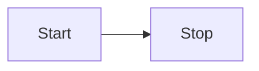

# Contributing documentation

## Content

### Links

Docusaurus doesn't always render relative links correctly, which can result in users seeing intermittent 404s when accessing those links. Use full paths instead of relative links, like this:

```
For more information, see "[Defining assets](/guides/build/assets/defining-assets)".
```

instead of this:

```
For more information, see "[Defining assets](defining-assets)".
```

### Partials

Docusaurus supports [markdown partials](https://docusaurus.io/docs/markdown-features/react#importing-markdown) for including content in multiple places.

These files are to be prefixed with `_` and saved in the `docs/partials/` directory.

```bash
$ ls -1 docs/partials/
_Beta.md
_Deprecated.md
_InspirationList.md
_KindsTags.md
_Preview.md
_Superseded.md
```

The partial can then be imported and included as an HTML tag:

```
import Deprecated from '@site/docs/partials/\_Deprecated.md';

<Deprecated />
```

### API documentation

API documentation lives in reStructuredText files in the [/docs/sphinx/sections/api/apidocs](https://github.com/dagster-io/dagster/tree/master/docs/sphinx/sections/api/apidocs) directory. These files reference modules, classes, and methods from Python files in the [python_modules](https://github.com/dagster-io/dagster/tree/master/python_modules) directory (mainly the `dagster`, `dagster-pipes`, and `libraries` directories). When the API docs are built, Sphinx populates them with the docstrings from those modules, classes, and methods.

When you make changes to the API, you may need to do some or all of the following:

- Add or update docstrings in Python files
- Update reStructuredText files to reference new modules, classes, or methods

#### Formatting API documentation

When updating API docstrings or reStructuredText files, you will need to follow the [reStructuredText syntax](https://www.sphinx-doc.org/en/master/usage/restructuredtext/basics.html). Headings are formatted as follows:

```
H1 heading
==========

H2 heading
----------

H3 heading
^^^^^^^^^^
```

## Formatting

### PyObject references

To create a link to the Python API docs, use the `PyObject` component. Previously, we were able to parse the Sphinx search index to determine the section that the module resides. As we no longer have this, a `section` prop was added to the component:

Before:

```
<PyObject
  module="dagster"
  object="MaterializeResult"
/>
```

After:

```
<PyObject
  section="assets"
  module="dagster"
  object="MaterializeResult"
/>
```

Note that the `method` property causes the build to break -- use `object` instead, and prepend the class name to the method, if it is different from the module.

### Images

#### Screenshots

Screenshots are to be at least 1920x1080 resolution, and can be captured using your preferred screenshot tool.

On MacOS the Command+Shift+5 hotkey opens a screenshot utility that can be useful for capturing windows and selections.

#### Location

Images are located in [/docs/static/images](https://github.com/dagster-io/dagster/tree/master/docs/static/images).

#### Formatting

```

```

### Notes

```
:::note
This guide is applicable to Dagster+
:::
```

### Header boundaries

Previously, horizontal rules had to be defined between each level-two header: `---`.

This is no longer required, as the horizontal rule has been included in the CSS rules.

### Reference tables

Use Markdown tables for reference tables.

| Key                                  | Value                                                                                                     |
| ------------------------------------ | --------------------------------------------------------------------------------------------------------- |
| `DAGSTER_CLOUD_DEPLOYMENT_NAME`      | The name of the Dagster+ deployment. <br/><br/> **Example:** `prod`.                                      |
| `DAGSTER_CLOUD_IS_BRANCH_DEPLOYMENT` | `1` if the deployment is a [branch deployment](/dagster-plus/features/ci-cd/branch-deployments/index.md). |

#### Line breaks and lists in tables

[Use HTML](https://www.markdownguide.org/hacks/#table-formatting) to add line breaks and lists to tables.

### Prerequisites

Use `<details>` for prerequisites:

```
<details>
  <summary>Prerequisites</summary>

  - Install this
  - Configure that

</details>
```

A prerequisites section should only include steps that the reader must take in order to successfully complete the steps in the documentation. Recommended reading should be formatted as a note:

```
:::note

This article assumes familiarity with [assets](example-link).

:::
```

### Admonitions

[Admonitions](https://docusaurus.io/docs/next/markdown-features/admonitions) are formatted as follows:

```
:::note

Here's a note

:::
```

Available admonitions:

- `:::note`
- `:::tip`
- `:::info`
- `:::warning`
- `:::danger`

You can specify your own title for admonitions:

```
:::note My cool title

Here's a note.

:::
```

### Code examples

To include code snippets, use the following format:

```
<CodeExample path="path/to/file.py" />
```

You can optionally include [additional properties](https://github.com/dagster-io/dagster/blob/master/docs/src/components/CodeExample.tsx#L6), such as `language`, `title`, `lineStart`, `lineEnd`, `startAfter`, and `endBefore`:

```
<CodeExample path="path/to/file.py" language="python" startAfter="start-after-comment" endBefore="end-before-comment" title="My example" />
```

The `path` is relative to the `./examples/` directory for maximum flexibility; it is sometimes useful to be able to reference the fully-featured projects in `/examples/`. However, if you're writing new example code for docs that consists of one or a few short scripts to demonstrate the use of a single feature, you should put that code in the `/examples/docs_snippets/docs_snippets/` directory.

At minimum, all `.py` files in the `docs_snippets` directory are tested by attempting to load the Python files.
You can write additional tests for them in the `docs_snippets_test` folder. See the folder for more information.

To type-check the code snippets during development, run the following command from the Dagster root folder.
This will run `pyright` on all new/changed files relative to the master branch.

```
make quick_pyright
```

#### Line selection

When referencing a subset of lines from a file, it is recommended to use the `startAfter` and `endBefore` props, which requires creating comments in the original source code. For example:

```
<CodeExample
  path="docs_snippets/docs_snippets/concepts/assets/multi_component_asset_key.py"
  startAfter="start_marker"
  endBefore="end_marker"
/>
```

```python
from dagster import AssetIn, asset


# start_marker
@asset(key_prefix=["one", "two", "three"])
def upstream_asset():
    return [1, 2, 3]
# end_marker


@asset(ins={"upstream_asset": AssetIn(key_prefix=["one", "two", "three"])})
def downstream_asset(upstream_asset):
    return upstream_asset + [4]

```

#### Line highlighting

Highlighting code examples can be done by creating `highlight-start` and `highlight-end` comments.

```python
@dg.asset
# highlight-start
def iris_dataset(iris_db: SnowflakeResource) -> None:
    # highlight-end
    iris_df = pd.read_csv("https://docs.dagster.io/assets/iris.csv")
```

### CLI invocation examples

CLI invocations often include both a command and its output, which are logically separate and which users might want to copy and paste separately. We have a special component for this:

```
<CliInvocationExample path="path/to/file.txt" />
```

The `path` is relative to the `./examples/` directory for maximum flexibility. The contents of the file are expected to either contain just a command, or a command and its output, separated by a blank line. The syntax of the command is bash.

Some CLI invocations may be brief enough that we don't want to include them in a separate file. In that case, we can use the `contents` prop:

```
<CliInvocationExample contents="uv add dagster-sling" />
```

For more information on testing the CLI commands used in docs, see [the README in docs tests](../../examples/docs_snippets/docs_snippets_tests/snippet_checks/README.md).

### Code reference links

To create a custom admonition linking GitHub at the specific version of code used in the docs, the `CodeReferenceLink` component can be used.

```
<CodeReferenceLink filePath="examples/tutorial_notebook_assets/" />
```

On the 1.10 version of docs this creates a link to `https://github.com/dagster-io/dagster/tree/1.10.0/examples/tutorial_notebook_assets/`.

### Diagrams

You can use [Mermaid.js](https://mermaid.js.org/syntax/flowchart.html) to create diagrams. For example:



Refer to the [Mermaid.js documentation](https://mermaid.js.org/) for more info.

Generally try and match the Dagster color palette:

```
%%{
  init: {
    'theme': 'base',
    'themeVariables': {
      'primaryColor': '#4F43DD',
      'primaryTextColor': '#FFFFFF',
      'primaryBorderColor': '#231F1B',
      'lineColor': '#DEDDFF',
      'secondaryColor': '#BDBAB7',
      'tertiaryColor': '#FFFFFF'
    }
  }
}%%
```

### Tabs

Tabs are formatted as follows:

```
<Tabs>
  <TabItem value="github" label="GitHub" default>
    This is AWS-specific content.
  </TabItem>
  <TabItem value="gitlab" label="GitLab">
    This is GCP-specific content.
  </TabItem>
</Tabs>
```

You can add labels to tags, customize headings, and sync tab choices with the `groupId` prop. For more information, see the [Docusaurus Tabs docs](https://docusaurus.io/docs/markdown-features/tabs).

Use `**strong**` to emphasize content in tabs. Do not use Markdown headings, since those will generate confusing items in the right sidebar.

#### Synced tabs

Groups of tabs can be synced with the `groupId` parameter:

```html
<Tabs groupId="operating-systems">
  <TabItem value="win" label="Windows">Use Ctrl + C to copy.</TabItem>
  <TabItem value="mac" label="macOS">Use Command + C to copy.</TabItem>
</Tabs>

<Tabs groupId="operating-systems">
  <TabItem value="win" label="Windows">Use Ctrl + V to paste.</TabItem>
  <TabItem value="mac" label="macOS">Use Command + V to paste.</TabItem>
</Tabs>
```

For more information, see the [Docusaurus documentation](https://docusaurus.io/docs/markdown-features/tabs#syncing-tab-choices).

## Front matter

Each Docusaurus doc can include [front matter](https://docusaurus.io/docs/markdown-features#front-matter), which is metadata about the doc. For a list of accepted fields, see the [Docusaurus docs](https://docusaurus.io/docs/api/plugins/@docusaurus/plugin-content-docs#markdown-front-matter).

### Descriptions

The llms-txt plugin recreates llms.txt and llms-full.txt in the `build` folder every time `yarn build` is run. This plugin appends each page's title and front matter description to llms.txt, and the entire contents of each page to llms-full.txt.

### Integrations pages front matter

The front matter for integration pages (e.g. [Databricks](https://docs.dagster.io/integrations/libraries/databricks) or [Delta Lake](https://docs.dagster.io/integrations/libraries/deltalake/)) is aligned with the public API that is used in the integrations marketplace -- please check with the @dagster-io/docs team before changing it.

Dagster-supported integrations pages use the following front matter:

```
title: Dagster & CoolIntegration
sidebar_label: CoolIntegration
description: A very cool integration.
tags: [dagster-supported, etl]
source: https://github.com/tree/master/path/to/coolintegration/code
pypi: https://pypi.org/project/cool-integration/
sidebar_custom_props:
  logo: images/integrations/coolintegration.svg
```

Community-supported integrations have a slightly different set of tags and sidebar_custom_props:

```
title: Dagster & CoolIntegration
sidebar_label: CoolIntegration
description: A very cool integration from the community.
tags: [community-supported, etl]
source: https://github.com/tree/master/path/to/coolintegration/code
pypi: https://pypi.org/project/cool-integration/
sidebar_custom_props:
  logo: images/integrations/coolintegration.svg
  community: true
```

[Tags](https://docusaurus.io/docs/create-doc#doc-tags) can be defined inline or in [tags.yml](https://github.com/dagster-io/dagster/blob/master/docs/docs/tags.yml). Tags defined in tags.yml allow creation of tag landing pages, like https://docs.dagster.io/tags/integrations/etl. If you create a new kind of tag, be sure to update tags.yml so a landing page is created for the tag.

The `sidebar_custom_props` values are used to render the doc cards on the integrations index page.
