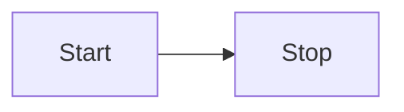

# Contributing documentation

## Formatting

### PyObject references

To create a link to the Python API docs, use the `PyObject` component. Previously, we were able to parse the Sphinx search index to determine the section that the module resides. As we no longer have this, a `section` prop was added to the component.

Before:

```
<PyObject
  module="dagster"
  object="MaterializeResult"
/>
```

After:

```
<PyObject
  section="assets"
  module="dagster"
  object="MaterializeResult"
/>
```

Note that the `method` property causes the build to break -- use `object` instead, and prepend the class name to the method, if it is different from the module.


### Images

#### Location

Images are located in [/docs/static/images](https://github.com/dagster-io/dagster/tree/master/docs/static/images).

#### Formatting

```

```

### Notes

```
:::note
This guide is applicable to Dagster+
:::
```

### Header boundaries

Previously, horizontal rules had to be defined between each level-two header: `---`.

This is no longer required, as the horizontal rule has been included in the CSS rules.

### Reference tables

Use Markdown tables for reference tables.

| Key                                  | Value                                                                                                     |
| ------------------------------------ | --------------------------------------------------------------------------------------------------------- |
| `DAGSTER_CLOUD_DEPLOYMENT_NAME`      | The name of the Dagster+ deployment. <br/><br/> **Example:** `prod`.                                      |
| `DAGSTER_CLOUD_IS_BRANCH_DEPLOYMENT` | `1` if the deployment is a [branch deployment](/dagster-plus/features/ci-cd/branch-deployments/index.md). |

#### Line breaks and lists in tables

[Use HTML](https://www.markdownguide.org/hacks/#table-formatting) to add line breaks and lists to tables.

### Prerequisites

Use `<details>` for prerequisites:

```
<details>
  <summary>Prerequisites</summary>

  - Install this
  - Configure that

</details>
```

A prerequisites section should only include steps that the reader must take in order to successfully complete the steps in the documentation. Recommended reading should be formatted as a note:

```
:::note

This article assumes familiarity with [assets](example-link).

:::
```

### Admonitions

[Admonitions](https://docusaurus.io/docs/next/markdown-features/admonitions) are formatted as follows:

```
:::note

Here's a note

:::
```

Available admonitions:

* `:::note`
* `:::tip`
* `:::info`
* `:::warning`
* `:::danger`

You can specify your own title for admonitions:

```
:::note My cool title

Here's a note.

:::
```

### Code examples

To include code snippets, use the following format:

```
<CodeExample path="path/to/file.py" />
```

You can optionally include [additional properties](https://github.com/dagster-io/dagster/blob/master/docs/src/components/CodeExample.tsx#L6), such as `language`, `title`, `lineStart`, `lineEnd`, `startAfter`, and `endBefore`:

```
<CodeExample path="path/to/file.py" language="python" startAfter="start-after-comment" endBefore="end-before-comment" title="My example" />
```

The `path` is relative to the `./examples/` directory for maximum flexibility; it is sometimes useful to be able to reference the fully-featured projects in `/examples/`. However, if you're writing new example code for docs that consists of one or a few short scripts to demonstrate the use of a single feature, you should put that code in the `/examples/docs_snippets/docs_snippets/` directory.

At minimum, all `.py` files in the `docs_snippets` directory are tested by attempting to load the Python files.
You can write additional tests for them in the `docs_snippets_test` folder. See the folder for more information.

To type-check the code snippets during development, run the following command from the Dagster root folder.
This will run `pyright` on all new/changed files relative to the master branch.

```
make quick_pyright
```

### CLI Invocation Examples

Since CLI invocations often include both a command and its output, which are logically separate and which users might want to copy and paste separately, we have a special component for this.

```
<CliInvocationExample path="path/to/file.txt" />
```

The `path` is relative to the `./examples/` directory for maximum flexibility. The contents of the file are expected to either contain just a command, or a command and its output, separated by a blank line. The syntax of the command is bash.

Some CLI invocations may be brief enough that we don't want to include them in a separate file. In that case, we can use the `contents` prop:

```
<CliInvocationExample contents="uv add 'dagster-components[sling]'" />
```

For more information on testing the CLI commands used in docs, see [the README in docs tests](../../examples/docs_beta_snippets/docs_beta_snippets_tests/snippet_checks/README.md).

### Diagrams

You can use [Mermaid.js](https://mermaid.js.org/syntax/flowchart.html) to create diagrams. For example:



Refer to the [Mermaid.js documentation](https://mermaid.js.org/) for more info.

Generally try and match the Dagster color palette:

```
%%{
  init: {
    'theme': 'base',
    'themeVariables': {
      'primaryColor': '#4F43DD',
      'primaryTextColor': '#FFFFFF',
      'primaryBorderColor': '#231F1B',
      'lineColor': '#DEDDFF',
      'secondaryColor': '#BDBAB7',
      'tertiaryColor': '#FFFFFF'
    }
  }
}%%
```

### Tabs

Tabs are formatted as follows:

```
<Tabs>
  <TabItem value="github" label="GitHub" default>
    This is AWS-specific content.
  </TabItem>
  <TabItem value="gitlab" label="GitLab">
    This is GCP-specific content.
  </TabItem>
</Tabs>
```

You can add labels to tags, customize headings, and sync tab choices with the `groupId` prop. For more information, see the [Docusaurus Tabs docs](https://docusaurus.io/docs/markdown-features/tabs).

Use `**strong**` to emphasize content in tabs. Do not use Markdown headings, since those will generate confusing items in the right sidebar.
