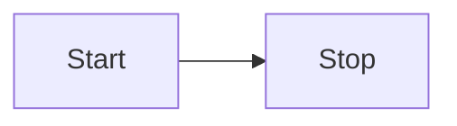

# Contributing

## Migration from legacy docs

There are some features in the previous docs that require changes to be made to work in the new Docusaurus-based documentation site.

### PyObject references

To create a link to the Python API docs, use the `PyObject` component. Previously, we were able to parse the Sphinx search index to determine the section that the module resides. As we no longer have this, a `section` prop was added to the component.

Before:

```
<PyObject
  module="dagster"
  object="MaterializeResult"
/>
```

After:

```
<PyObject
  section="assets"
  module="dagster"
  object="MaterializeResult"
/>
```

### Images

#### Location

Old images are in the [/docs/next/public/images](https://github.com/dagster-io/dagster/tree/master/docs/next/public/images) directory. You will need to copy them to [/docs/docs-beta/static/images](https://github.com/dagster-io/dagster/tree/master/docs/docs-beta/static/images).

#### Formatting

Before:

```
<Image
  alt="Highlighted Redeploy option in the dropdown menu next to a code location in Dagster+"
  src="/images/dagster-cloud/developing-testing/code-locations/redeploy-code-location.png"
  width={1920}
  height={284}
/>
```

After:

```

```

### Notes

Before:

```
<Note>This guide is applicable to Dagster+.</Note>
```

After:

```
:::note
This guide is applicable to Dagster+
:::
```

### Tabs

Before:

```
<TabGroup>
  <TabItem name="Amazon ECS">
  ...
  </TabItem>
</TabGroup>
```

After:

```
<Tabs>
  <TabItem value="Amazon ECS">
  ...
  </TabItem>
</Tabs>
```

### Header boundaries

Previously, horizontal rules had to be defined between each level-two header: `---`.

This is no longer required, as the horizontal rule has been included in the CSS rules.

### Reference tables

Before:

```
<ReferenceTable>
  <ReferenceTableItem propertyName="DAGSTER_CLOUD_DEPLOYMENT_NAME">
    The name of the Dagster+ deployment. For example, <code>prod</code>.
  </ReferenceTableItem>
  <ReferenceTableItem propertyName="DAGSTER_CLOUD_IS_BRANCH_DEPLOYMENT">
    If <code>1</code>, the deployment is a{" "}
    <a href="/dagster-plus/managing-deployments/branch-deployments">
      branch deployment
    </a>
    . Refer to the <a href="#reserved-branch-deployment-variables">
      Branch Deployment variables section
    </a> for a list of variables available in branch deployments.
  </ReferenceTableItem>
</ReferenceTable>
```

After:

| Key                                  | Value                                                                                                     |
| ------------------------------------ | --------------------------------------------------------------------------------------------------------- |
| `DAGSTER_CLOUD_DEPLOYMENT_NAME`      | The name of the Dagster+ deployment. <br/><br/> **Example:** `prod`.                                      |
| `DAGSTER_CLOUD_IS_BRANCH_DEPLOYMENT` | `1` if the deployment is a [branch deployment](/dagster-plus/features/ci-cd/branch-deployments/index.md). |

#### Line breaks and lists in tables

[Use HTML](https://www.markdownguide.org/hacks/#table-formatting) to add line breaks and lists to tables.

### Whitespace via `{" "}`

Forcing empty space using the `{" "}` interpolation is not supported, and must be removed.

### Prerequisites

Before:

```
## Prerequisites

- Install this
- Configure that
```

After:

```
<details>
  <summary>Prerequisites</summary>

  - Install this
  - Configure that

</details>
```

A prerequisites section should only include steps that the reader must take in order to run the example code in the article. Recommended reading should be formatted as a note:

```
:::note

This article assumes familiarity with [assets](example-link).

:::
```
---

## Admonitions

[Admonitions](https://docusaurus.io/docs/next/markdown-features/admonitions) are formatted as follows:

```
:::note

Here's a note

:::
```

Available admonitions:

* `:::note`
* `:::tip`
* `:::info`
* `:::warning`
* `:::danger`

You can specify your own title for admonitions:

```
:::note My cool title

Here's a note.

:::
```

---

## Code examples

To include code snippets, use the following format:

```
<CodeExample filePath="path/to/file.py" />
```

The `filePath` is relative to the `./examples/docs_beta_snippets/docs_beta_snippets/` directory.

At minimum, all `.py` files in the `docs_beta_snippets` directory are tested by attempting to load the Python files.
You can write additional tests for them in the `docs_beta_snippets_test` folder. See the folder for more information.

To type-check the code snippets during development, run the following command from the Dagster root folder.
This will run `pyright` on all new/changed files relative to the master branch.

```
make quick_pyright
```

---

## Diagrams

You can use [Mermaid.js](https://mermaid.js.org/syntax/flowchart.html) to create diagrams. For example:



Refer to the [Mermaid.js documentation](https://mermaid.js.org/) for more info.

---

## Tabs

[Tabs](https://docusaurus.io/docs/markdown-features/tabs) are formatted as follows:

```
<Tabs>
  <TabItem value="github" label="GitHub" default>
    This is AWS-specific content.
  </TabItem>
  <TabItem value="gitlab" label="GitLab">
    This is GCP-specific content.
  </TabItem>
</Tabs>
```

Use `**strong**` to emphasize content in tabs. Do not use Markdown headings, since that will generate confusing items in the right sidebar for the page.