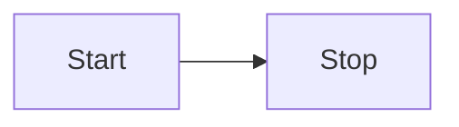

# Dagster Docs - Beta

This is the home of the new Dagster documentation. It is currently in beta and incomplete.
The documentation site is built using [Docusaurus](https://docusaurus.io/), a modern static website generator.

---

## Installation

The site uses [yarn](https://yarnpkg.com/) for package management.

To install dependencies:

```
yarn install
```

**Note**: The yarn binary is checked in, so you do not need to install yarn yourself.

It also uses [Vale](https://vale.sh/) to check for issues in the documentation.

Install Vale with:

```bash
brew install vale
```

or

```bash
pip install vale
```

---

## Overview of the docs

- `./src` contains custom components, styles, themes, and layouts.
- `./content-templates` contains the templates for the documentation pages.
- `./docs/` is the source of truth for the documentation.
- `/examples/docs_beta_snippets/docs_beta_snippets/` contains all code examples for the documentation.

The docs are broken down into the following sections:

- [Tutorials](./docs/tutorials/)
- [Guides](./docs/guides/)
- [Concepts](./docs/concepts/)

`sidebar.ts` and `docusaurus.config.ts` are the main configuration files for the documentation.

---

## Local Development

To start the local development server:

```bash
yarn start
```

This command starts a local development server and opens up a browser window. Most changes are reflected live without having to restart the server. Access the website at [http://localhost:3050](http://localhost:3050).

### Linters

To check the documentation for different issues, use the following:

```bash
## Lints all content, applies lint autofixes and prettier changes
yarn lint

## Lints documentation content using Vale Server
## Checks for style guide adherence, grammar, spelling, etc.
yarn vale
yarn vale /path/to/file      ## check individual file
yarn vale --no-wrap          ## remove wrapping from output
```

### Diagrams

You can use [Mermaid.js](https://mermaid.js.org/syntax/flowchart.html) to create diagrams. For example:



Refer to the [Mermaid.js documentation](https://mermaid.js.org/) for more info.

### Code examples

To include code snippets, use the following format:

```
<CodeExample filePath="path/to/file.py" />
```

The `filePath` is relative to the `./examples/docs_beta_snippets/docs_beta_snippets/` directory.

At minimum, all `.py` files in the `docs_beta_snippets` directory are tested by attempting to load the Python files.
You can write additional tests for them in the `docs_beta_snippets_test` folder. See the folder for more information.

To type-check the code snippets during development, run the following command from the Dagster root folder.
This will run `pyright` on all new/changed files relative to the master branch.

```
make quick_pyright
```

---

## Build

To build the site for production:

```bash
yarn build
```

This command generates static content into the `build` directory and can be served using any static contents hosting service. This also checks for any broken links in the documentation.

## Deployment

This site is built and deployed using Vercel.

### API Documentation

API documentation is built in Vercel by overriding the _Build Command_ to the following:

```sh
yarn sync-api-docs && yarn build
```

This runs the `scripts/vercel-sync-api-docs.sh` script which builds the MDX files using the custom `sphinx-mdx-builder`, and copies the resulting MDX files to `docs/api`.

## Search

Algolia search is used for search results on the website, as configured in `docusaurus.config.ts`.

The following environment variables must be configured in Vercel:

- `ALGOLIA_APP_ID`
- `ALGOLIA_API_KEY`
- `ALGOLIA_INDEX_NAME`

These variables are not loaded when `process.env.ENV === 'development'`.
