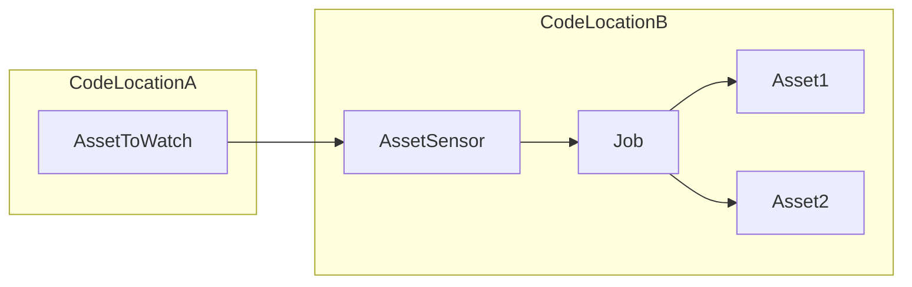
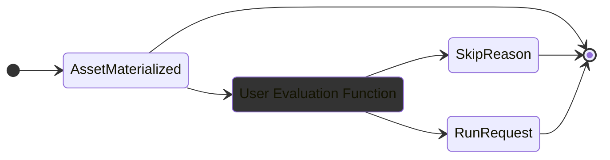

Asset sensors in Dagster provide a powerful mechanism for monitoring asset materializations and triggering downstream computations or notifications based on those events.

This guide covers the most common use cases for asset sensors such as defining cross-job and cross-code location dependencies.

Prerequisites

- Familiarity with [Assets](/concepts/assets)
- Familiarity with [Ops and Jobs](/concepts/ops-jobs)

## Define cross-job and cross-code location dependencies

Asset Sensors enable dependencies across different jobs and even different code locations. This flexibility allows for more modular and decoupled workflows.

Here's a minimal example of an asset sensor that triggers a job when an asset is materialized. The `daily_sales_data` asset is in the same code location for this example, but the same pattern can be applied to assets in different code locations.

<CodeExample filePath="guides/automation/simple-asset-sensor-example.py" language="python" title="Simple Asset Sensor Example" />

## Customize evaluation logic

The evaluation function of an asset sensor can be customized to include custom logic for determining when to trigger a run. This allows for fine-grained control over the conditions under which downstream jobs are executed.

In this example, the `@asset_sensor` decorator allows you to define a custom evaluation function that returns a `RunRequest` object when the asset is materialized and certain metadata is present,
otherwise it skips the run.

<CodeExample filePath="guides/automation/asset-sensor-custom-eval.py" language="python" title="Asset Sensor with Custom Evaluation Logic" />

## Trigger a job with configuration

By providing a configuration to the `RunRequest` object, you can trigger a job with a specific configuration. This is useful when you want to trigger a job with custom parameters based on custom logic you define. For example, you might use a sensor to trigger a job when an asset is materialized, but also pass metadata about that materialization to the job.

<CodeExample filePath="guides/automation/asset-sensor-with-config.py" language="python" title="Asset Sensor with Config" />

## Monitor multiple assets

The previous examples showed how to use a single asset sensor to monitor a single asset and trigger a job when it's materialized. This example uses a multi-asset sensor to monitor multiple assets and trigger a job when any of the monitored assets are materialized.

<CodeExample filePath="guides/automation/multi-asset-sensor.py" language="python" title="Multi-Asset Sensor" />

## Next steps

- Learn more about asset sensors in [Understanding Automation](/concepts/automation)
- Explore [Declarative Automation](/concepts/automation/declarative-automation) as an alternative to asset sensors
