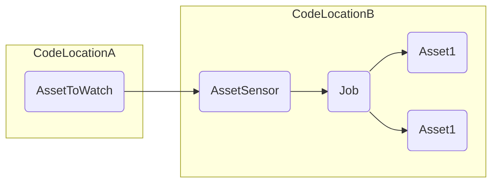
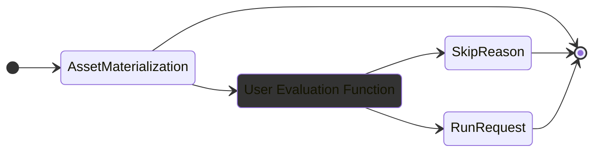

Asset sensors in Dagster provide a powerful mechanism for monitoring asset materializations and triggering downstream computations or notifications based on those events.

This guide covers the most common use cases for asset sensors, such as defining cross-job and cross-code location dependencies.

Prerequisites

To follow this guide, you'll need:

- Familiarity with [Assets](/concepts/assets)
- Familiarity with [Ops and Jobs](/concepts/ops-jobs)

## Getting started

Asset sensors monitor an asset for new materialization events and target a job when a new materialization occurs.

Typically, asset sensors return a `RunRequest` when a new job is to be triggered. However, they may provide a `SkipReason` if the asset materialization doesn't trigger a job.

For example, you may wish to monitor an asset that's materialized daily, but don't want to trigger jobs on holidays.

## Cross-job and cross-code location dependencies

Asset sensors enable dependencies across different jobs and different code locations. This flexibility allows for modular and decoupled workflows.

This is an example of an asset sensor that triggers a job when an asset is materialized. The `daily_sales_data` asset is in the same code location as the job and other asset for this example, but the same pattern can be applied to assets in different code locations.

<CodeExample filePath="guides/automation/simple-asset-sensor-example.py" language="python" />

## Customize evaluation logic

You can customize the evaluation function of an asset sensor to include specific logic for deciding when to trigger a run. This allows for fine-grained control over the conditions under which downstream jobs are executed.

In the following example, the `@asset_sensor` decorator defines a custom evaluation function that returns a `RunRequest` object when the asset is materialized and certain metadata is present, otherwise it skips the run.

<CodeExample filePath="guides/automation/asset-sensor-custom-eval.py" language="python"/>

## Trigger a job with configuration

By providing a configuration to the `RunRequest` object, you can trigger a job with a specific configuration. This is useful when you want to trigger a job with custom parameters based on custom logic you define.

For example, you might use a sensor to trigger a job when an asset is materialized, but also pass metadata about that materialization to the job:

<CodeExample filePath="guides/automation/asset-sensor-with-config.py" language="python" />

## Monitor multiple assets

When building a pipeline, you may want to monitor multiple assets with a single sensor. This can be accomplished with a multi-asset sensor.

The following example uses a `@multi_asset_sensor` to monitor multiple assets and trigger a job when any of the assets are materialized:

<CodeExample filePath="guides/automation/multi-asset-sensor.py" language="python" />

## Next steps

- Learn more about asset sensors in [Understanding Automation](/concepts/automation)
- Explore [Declarative Automation](/concepts/automation/declarative-automation) as an alternative to asset sensors
