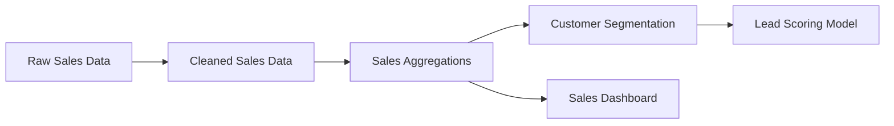

In Dagster, data pipelines are created using an asset-based approach. This overview will introduce you to the key concepts and steps involved in building a Dagster pipeline.

  
Prerequisites

Before continuing, you should:
- Have Dagster installed. Refer to the [Installation guide](/getting-started/installation) for more information.
- Complete the [Quickstart](/getting-started/quickstart)

Dagster uses assets as the building blocks of data pipelines. An asset represents a data object, such as a table, file, or machine learning model, that your pipeline produces or updates.

As you define multiple assets and their dependencies, Dagster automatically creates an asset graph. This graph represents the structure and flow of your data pipeline. These nodes are not the individual operations that create the assets, but rather the assets themselves.

## Steps to create a pipeline

Most Dagster pipelines follow these steps:

1. **Define data assets**: Start by creating individual assets using the `@asset` decorator. Each asset represents a data object in your pipeline.

2. **Create dependencies**: Connect your assets by specifying dependencies, allowing Dagster to understand the flow of data through your pipeline.

3. **Enrich with metadata**: Add context and improve observability by enriching your assets with metadata, such as descriptions, owners, and data quality checks.

4. **Partition your data**: For large datasets or time-based processing, use Dagster's partitioning feature to efficiently manage and process your data.

5. **Represent external sources**: Integrate external data sources into your pipeline to create a comprehensive view of your data ecosystem.

## Next steps

To start building your Dagster pipeline, dive into the following guides:

- [Define data assets](/guides/build/create-a-pipeline/data-assets)
- [Create dependencies between assets](/guides/build/assets-concepts/asset-dependencies)
- [Enrich assets with metadata](/guides/build/create-a-pipeline/metadata)
- [Partition assets](/guides/build/create-a-pipeline/partitioning)
- [Represent external data sources](/guides/build/create-a-pipeline/external-assets)

By following these guides, you'll learn how to create powerful, maintainable data pipelines using Dagster's asset-based approach.
