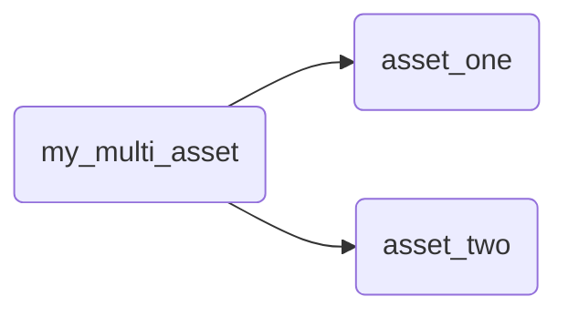
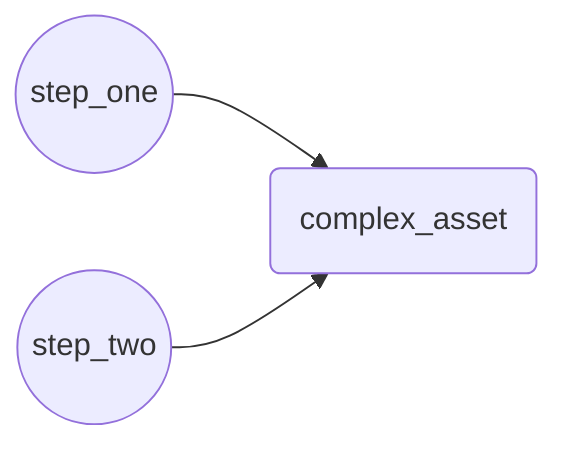

The most common way to create a data asset in Dagster is by annotating a function with an asset decorator. The function computes the contents of the asset, such as a database table or file.

Dagster supports several ways of creating assets, but this guide will focus on using Python decorators to define data assets.

  
Prerequisites

To follow the steps in this guide, you'll need:

- To have Dagster installed. Refer to the [Installation](/getting-started/installation) guide for more information.

Dagster has four types of asset decorators:

| Decorator            | Description                                                                                                                    |
| -------------------- | ------------------------------------------------------------------------------------------------------------------------------ |
| `@asset`             | Defines a single asset. [See an example](#single-asset).                                                                       |
| `@multi_asset`       | Outputs multiple assets from a single operation. [See an example](#multi-asset).                                               |
| `@graph_asset`       | Outputs a single asset from multiple operations without making each operation itself an asset. [See an example](#graph-asset). |
| `@graph_multi_asset` | Outputs multiple assets from multiple operations                                                                               |

## Defining operations that create a single asset \{#single-asset}

The simplest way to define a data asset in Dagster is by using the `@asset` decorator. This decorator marks a Python function as an asset.

<CodeExample filePath="guides/data-assets/data-assets/asset_decorator.py" language="python" title="Using @dg.asset decorator" />

In this example, `my_data_asset` is an asset that logs its output. Dagster automatically tracks its dependencies and handles its execution within the pipeline.

## Defining operations that create multiple assets \{#multi-asset}

When you need to generate multiple assets from a single operation, you can use the `@multi_asset` decorator. This allows you to output multiple assets while maintaining a single processing function, which could be useful for:

- Making a single call to an API that updates multiple tables
- Using the same in-memory object to compute multiple assets

In this example, `my_multi_asset` produces two assets: `asset_one` and `asset_two`. Each is derived from the same function, which makes it easier to handle related data transformations together:

<CodeExample filePath="guides/data-assets/data-assets/multi_asset_decorator.py" language="python" title="Using @dg.multi_asset decorator" />

This example could be expressed as:

## Defining multiple operations that create a single asset \{#graph-asset}

For cases where you need to perform multiple operations to produce a single asset, you can use the `@graph_asset` decorator. This approach encapsulates a series of operations and exposes them as a single asset, allowing you to model complex pipelines while only exposing the final output.

<CodeExample filePath="guides/data-assets/data-assets/graph_asset_decorator.py" language="python" title="Using @dg.graph_asset decorator" />

In this example, `complex_asset` is an asset that's the result of two operations: `step_one` and `step_two`. These steps are combined into a single asset, abstracting away the intermediate representations.

This example could be expressed as:

## Next steps

- Learn to create [dependencies between assets](/guides/asset-dependencies)
- Enrich Dagster's built-in data catalog with [asset metadata](/guides/metadata)
- Learn to use a [factory pattern](/guides/asset-factories) to create multiple, similar assets
