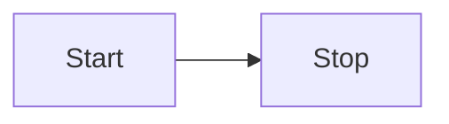

## Dagster approach to documentation style

We will build out our own approach over time, but for now, we roughly follow the [GitHub Docs approach to style](https://docs.github.com/en/contributing/style-guide-and-content-model/style-guide#the-github-docs-approach-to-style) and the [GitHub Docs voice and tone guidelines](https://docs.github.com/en/contributing/style-guide-and-content-model/style-guide#voice-and-tone).

### General guidelines

- Use the active voice as much as possible. Sometimes you may need to use the passive voice when the object that is being acted on is the focus of the sentence.
- Avoid superlatives like `very`, `easy`, `extremely`, and `simply` .
- See the [Dagster docs contributing guidelines](https://github.com/dagster-io/dagster/blob/master/docs/CONTRIBUTING.md) for information on code example formatting, custom and built-in Docusaurus components, and more.

## Acronyms and abbreviations

- **Always define acronyms and abbreviations before using them,** even if they're well-known. The definition should be the first instance of the acronym in the content. After it's defined, it can be used instead of the full name, for example, `Amazon Web Services (AWS) supports Redshift. AWS has a free tier.`
- Include the brand or provider's name when first naming a product, feature, or service. Any time thereafter in the same page, just the product, feature, or service name can be used, e.g. `Amazon S3`, and then `S3` thereafter.

## Admonitions

[Admonitions](https://docusaurus.io/docs/next/markdown-features/admonitions) are formatted as follows:

```
:::note

Here's a note

:::
```

:::note

Here's a note.

:::

Available admonitions:

- `:::note`
- `:::tip`
- `:::info`
- `:::warning`
- `:::danger`

You can specify your own title for admonitions:

```
:::note My cool title

Here's a note.

:::
```

## API docs

When updating docstrings or reStructuredText files, you will need to follow the [reStructuredText syntax](https://www.sphinx-doc.org/en/master/usage/restructuredtext/basics.html). Headings are formatted as follows:

```
H1 heading
==========

H2 heading
----------

H3 heading
^^^^^^^^^^
```

## CLI invocation examples

CLI invocations often include both a command and its output, which are logically separate and which users might want to copy and paste separately. We have a special component for this:

`<\CliInvocationExample path="path/to/file.txt" />`

The `path` is relative to the `./examples/` directory for maximum flexibility. The contents of the file are expected to either contain just a command, or a command and its output, separated by a blank line. The syntax of the command is bash.

Some CLI invocations may be brief enough that we don't want to include them in a separate file. In that case, we can use the `contents` prop:

```sh
<CliInvocationExample contents="uv add dagster-sling" />
```

For more information on testing the CLI commands used in docs, see [the README in docs tests](https://github.com/dagster-io/dagster/blob/master/examples/docs_snippets/docs_snippets_tests/snippet_checks/README.md).

## Code examples

To include code snippets, use the following format:

`<\CodeExample path="path/to/file.py" />`

You can optionally include [additional properties](https://github.com/dagster-io/dagster/blob/master/docs/src/components/CodeExample.tsx#L6), such as `language`, `title`, `lineStart`, `lineEnd`, `startAfter`, `endBefore`, and `trimMainBlock` (to remove or include the `main` block):

`<\CodeExample path="path/to/file.py" language="python" startAfter="start-after-comment" endBefore="end-before-comment" title="My example" trimMainBlock={false} />`

The `path` is relative to the `./examples/` directory for maximum flexibility; it is sometimes useful to be able to reference the fully-featured projects in `/examples/`. However, if you're writing new example code for docs that consists of one or a few short scripts to demonstrate the use of a single feature, you should put that code in the `/examples/docs_snippets/docs_snippets/` directory.

At minimum, all `.py` files in the `docs_snippets` directory are tested by attempting to load the Python files.
You can write additional tests for them in the `docs_snippets_test` folder. See that folder for more information.

You can also write tests to regenerate and test CLI snippets in the `docs_snippets_test/snippet_checks` folder. See that folder for more information.

To type-check the code snippets during development, run the following command from the Dagster root folder.
This will run `pyright` on all new/changed files relative to the master branch.

```
make quick_pyright
```

### Line selection

When referencing a subset of lines from a file, it is recommended to use the `startAfter` and `endBefore` props, which requires creating comments in the original source code. For example:

```
<CodeExample
  path="docs_snippets/docs_snippets/concepts/assets/multi_component_asset_key.py"
  startAfter="start_marker"
  endBefore="end_marker"
/>
```

```python
from dagster import AssetIn, asset


# start_marker
@asset(key_prefix=["one", "two", "three"])
def upstream_asset():
    return [1, 2, 3]
# end_marker


@asset(ins={"upstream_asset": AssetIn(key_prefix=["one", "two", "three"])})
def downstream_asset(upstream_asset):
    return upstream_asset + [4]

```

### Line highlighting

Highlighting code examples can be done by creating `highlight-start` and `highlight-end` comments.

```python
@dg.asset
# highlight-start
def iris_dataset(iris_db: SnowflakeResource) -> None:
    # highlight-end
    iris_df = pd.read_csv("https://docs.dagster.io/assets/iris.csv")
```

## Diagrams

You can use [Mermaid.js](https://mermaid.js.org/syntax/flowchart.html) to create diagrams. For example:



Refer to the [Mermaid.js documentation](https://mermaid.js.org/) for more info.

Generally try and match the Dagster color palette:

```
%%{
  init: {
    'theme': 'base',
    'themeVariables': {
      'primaryColor': '#4F43DD',
      'primaryTextColor': '#FFFFFF',
      'primaryBorderColor': '#231F1B',
      'lineColor': '#DEDDFF',
      'secondaryColor': '#BDBAB7',
      'tertiaryColor': '#FFFFFF'
    }
  }
}%%
```

- Source file for [draw.io](http://draw.io) component library: [https://drive.google.com/file/d/1FGDdKmNms7CMaNrwJx8JOzE_wv8h_csJ/view?usp=sharing](https://drive.google.com/file/d/1FGDdKmNms7CMaNrwJx8JOzE_wv8h_csJ/view?usp=sharing)
- Library file for loading into draw.io: [https://drive.google.com/file/d/1omCVzoNhi2aLYL2bWbiT4-r3TLvsobMa/view?usp=sharing](https://drive.google.com/file/d/1omCVzoNhi2aLYL2bWbiT4-r3TLvsobMa/view?usp=sharing)

## Front matter

Each Docusaurus doc can include [front matter](https://docusaurus.io/docs/markdown-features#front-matter), which is metadata about the doc. For a list of accepted fields, see the [Docusaurus docs](https://docusaurus.io/docs/api/plugins/@docusaurus/plugin-content-docs#markdown-front-matter).

### Descriptions

The llms-txt plugin recreates llms.txt and llms-full.txt in the `build` folder every time `yarn build` is run. This plugin appends each page's title and front matter description to llms.txt, and the entire contents of each page to llms-full.txt.

### Canonical URL

Since we have `trailingSlash: false` set in `vercel.json`, canonical URLs for docs do not include a trailing slash. However, by default, Docusaurus includes a trailing slash for index page URLs, which can harm SEO for the docs site. To get around this, we set the `canonicalUrl` in the front matter of index pages.

### Slug

We set the slug in the front matter of index pages so the slug that is displayed in a browser for index pages is the same as the canonical URL.

### Integrations docs front matter

The front matter for integration docs (e.g. [Databricks](https://docs.dagster.io/integrations/libraries/databricks) or [Delta Lake](https://docs.dagster.io/integrations/libraries/deltalake/)) is aligned with the public API that is used in the integrations marketplace -- please check with the `@dagster-io/docs` team before changing it.

Dagster-supported integrations pages use the following front matter:

```
title: Dagster & CoolIntegration
sidebar_label: CoolIntegration
description: A very cool integration.
tags: [dagster-supported, etl]
source: https://github.com/tree/master/path/to/coolintegration/code
pypi: https://pypi.org/project/cool-integration/
sidebar_custom_props:
  logo: images/integrations/coolintegration.svg
```

Community-supported integrations have a slightly different set of tags and sidebar_custom_props:

```
title: Dagster & CoolIntegration
sidebar_label: CoolIntegration
description: A very cool integration from the community.
tags: [community-supported, etl]
source: https://github.com/tree/master/path/to/coolintegration/code
pypi: https://pypi.org/project/cool-integration/
sidebar_custom_props:
  logo: images/integrations/coolintegration.svg
  community: true
```

## Header boundaries

Previously, horizontal rules had to be defined between each level-two header: `---`.

This is no longer required, as the horizontal rule has been included in the CSS rules.

## Images and screenshots

### Best practices

- In general, try to minimize the use of screenshots, since they are hard to maintain.
- Image names must be hyphen-separated for SEO. (This is also true for file and path names.)
- Include [alt text](https://webaim.org/techniques/alttext/) on all screenshots.

### Formatting

```

```

### Image file location

Images are located in [/docs/static/images](https://github.com/dagster-io/dagster/tree/master/docs/static/images).

### Taking screenshots

Screenshots are to be at least 1920x1080 resolution, and can be captured using your preferred screenshot tool.

On MacOS the Command+Shift+5 hotkey opens a screenshot utility that can be useful for capturing windows and selections.

## Links

- Link to other docs (especially API docs) where relevant.
- When linking to other docs, put the link at the end of the sentence: `For more information, see [Defining assets](/guides/build/assets/defining-assets)`.
- In general, try to follow [web accessibility best practices](https://webaim.org/techniques/hypertext/link_text) for links:
  - **Avoid uninformative link phrases**, like "click here", "more", "read more". Whenever possible, use the full page name when linking to another doc: `For more information, see [Testing sensors](https://docs.dagster.io/guides/automate/sensors/testing-sensors)`

### Dagster docs links

#### Use full paths

Docusaurus doesn't always render relative links correctly, which can result in users seeing intermittent 404s when accessing those links. Use full paths instead of relative links, like this:

```
For more information, see "[Defining assets](/guides/build/assets/defining-assets)".
```

instead of this:

```
For more information, see "[Defining assets](defining-assets)".
```

#### Use non-trailing slash links

For example, use `/guides/build/assets/defining-assets` instead of `/guides/build/assets/defining-assets/`.

**Context:** Links to Dagster docs with trailing slashes automatically redirect to non-trailing slash links. While that's helpful for docs links we don't control, too many redirects on our own pages can confuse search engines and cause SEO issues.

### API docs links

To create a link to the Python API docs, use the [`PyObject` component](https://github.com/dagster-io/dagster/blob/master/docs/src/components/PyObject.tsx).

**Required properties**

- `module`: The module name
- `section`: The section name in the docs (i.e. the name of the page)
- `object`: The class or method
- `integration`: The name of the integration, which should be the same as the directory that contains the integration API doc. Required for integration libraries.

**Optional properties**

- pluralize
- displayText
- decorator

The following example creates a link like this: [@assets](https://docs.dagster.io/api/dagster/assets#dagster.asset):

`<PyObject module="dagster" section="assets" object="asset" decorator pluralize />`

**Dagster core API links**

The following `PyObject` will result in a URL of `https://docs.dagster.io/api/dagster/assets#dagster.MaterializeResult`:

`<PyObject module="dagster" section="assets" object="MaterializeResult" />`

**Integration library links**

To link to an integration library, use the `integration` parameter in the `PyObject`. The `module` should be the name of the library and the `integration` should be the name of the directory that contains the API doc:

`<PyObject section="libraries" integration="dbt" module="dagster_dbt" object="DbtProject" />`

Note that if the class name is different from the module name, you will need to prepend the class name to the object:

`<PyObject module="dagster_aws" integration="aws" section="libraries" object="s3.s3_pickle_io_manager" />`

### Code reference links

To create a custom admonition linking to GitHub at the specific version of code used in the docs, you can use the `CodeReferenceLink` component:

```
<CodeReferenceLink filePath="examples/tutorial_notebook_assets/" />
```

Which will be rendered as:

<CodeReferenceLink filePath="examples/tutorial_notebook_assets/" />

On the 1.10 version of docs, this creates a link to `https://github.com/dagster-io/dagster/tree/1.10.0/examples/tutorial_notebook_assets/`.

## Lists

- Use ordered lists only when the order of items matters (for example, when listing steps in a procedure).
- Use unordered lists when the order of items doesn't matter.

## Prerequisites

Use regular Markdown headings for prerequisites:

```
## Prerequisites

- Install this
- Configure that
```

A prerequisites section should only include steps that the reader must take in order to successfully complete the steps in the documentation.

## Procedural steps

- Use numbered steps for [procedures](/about/contributing-docs/content-model#procedural-content).
- Each step should describe an action the user can take, for example, "Click **Materialize all**". Steps can be marked as optional in parentheses: "(Optional) Click **Materialize all**".
- In general, when writing procedural steps, it is best to describe the outcome of an action, then describe the action(s) needed to achieve it. For example: "To sign in, enter your username and password, then click **Sign in**". This keeps the focus on the task the user is trying to complete, not the intricacies of the UI or implementation details of the code needed to complete the task.

## Tabs

Tabs are formatted as follows:

```
<Tabs>
  <TabItem value="github" label="GitHub" default>
    This is AWS-specific content.
  </TabItem>
  <TabItem value="gitlab" label="GitLab">
    This is GCP-specific content.
  </TabItem>
</Tabs>
```

You can add labels to tags, customize headings, and sync tab choices with the `groupId` prop. For more information, see the [Docusaurus Tabs docs](https://docusaurus.io/docs/markdown-features/tabs).

Use `**strong**` to emphasize content in tabs. Do not use Markdown headings, since those will generate confusing items in the right sidebar.

### Synced tabs

Groups of tabs can be synced with the `groupId` parameter:

```html
<Tabs groupId="operating-systems">
  <TabItem value="win" label="Windows">Use Ctrl + C to copy.</TabItem>
  <TabItem value="mac" label="macOS">Use Command + C to copy.</TabItem>
</Tabs>

<Tabs groupId="operating-systems">
  <TabItem value="win" label="Windows">Use Ctrl + V to paste.</TabItem>
  <TabItem value="mac" label="macOS">Use Command + V to paste.</TabItem>
</Tabs>
```

For more information, see the [Docusaurus documentation](https://docusaurus.io/docs/markdown-features/tabs#syncing-tab-choices).

## Tables

[Use HTML](https://www.markdownguide.org/hacks/#table-formatting) to add line breaks and lists to tables.

## Tags

[Tags](https://docusaurus.io/docs/create-doc#doc-tags) can be defined inline or in [tags.yml](https://github.com/dagster-io/dagster/blob/master/docs/docs/tags.yml). Tags defined in tags.yml allow creation of tag landing pages, like https://docs.dagster.io/tags/integrations/etl. If you create a new kind of tag, be sure to update tags.yml so a landing page is created for the tag.

The `sidebar_custom_props` values are used to render the doc cards on the integrations index page.

## Terminology

- The names of programming languages (`Python`, `Rust`) should follow the official style guidelines for that language.

### **Key terms and definitions**

| **Term**              | **Definition**                                                                                                                                       | **Notes**                                                                                                     | **Formatting** |
| --------------------- | ---------------------------------------------------------------------------------------------------------------------------------------------------- | ------------------------------------------------------------------------------------------------------------- | -------------- |
| Asset                 | An **asset** is an object in persistent storage, such as a table, file, or persisted machine learning model.                                         |                                                                                                               |                |
| Asset graph           | Refers to the Asset graph in the Dagster UI, accessed via the **View global lineage** link.                                                          |                                                                                                               |                |
| Asset materialization | An event indicating that an op has materialized an asset.                                                                                            |                                                                                                               |                |
| Asset observation     | An event that records metadata about a given asset. Unlike asset materializations, asset observations do not signify that an asset has been mutated. |                                                                                                               |                |
| Backfill              |                                                                                                                                                      |                                                                                                               |                |
| Branch deployments    | A Dagster-specific term, a branch deployment automatically creates a staging environment of Dagster code in a Dagster Cloud instance.                |                                                                                                               |                |
| CLI                   | An acronym for **command line interface.**                                                                                                           |                                                                                                               |                |
| Code location         | A collection of Dagster code definitions, accessible from a Python file or module, that are loaded by Dagster tools.                                 |                                                                                                               |                |
| Component             |                                                                                                                                                      |                                                                                                               |                |
| Config                |                                                                                                                                                      |                                                                                                               |                |
| Configuration         |                                                                                                                                                      |                                                                                                               |                |
| DAG                   | An acronym for **directed acylic graph.**                                                                                                            | Use this term explicitly when referring to the graph itself, and not in a generic way to refer to a pipeline. |

Not interchangeable with "Asset graph". | |
| Dagster+ | The name of Dagster's cloud-based deployment offering. | | |
| Dagster daemon | | | |
| Dagster instance | | | |
| Declarative automation | | | |
| Definition(s) | | | |
| Deployment | | | |
| Graph | | | |
| Graph-backed asset | | | |
| Hybrid | The hosting configuration in Dagster+ in which a customer provides their own agent and has control over their own data plane. | | |
| I/O manager | User-provided objects that store asset and op outputs and load them as inputs to downstream assets/ops. | | |
| Integration | | | |
| Job | | | |
| Materialize / Materialization | To execute an operation that will produce an asset. | | |
| Multi-asset | A multi-asset represents a set of software-defined assets that are all updated by the same op or graph. | | |
| Op | | | |
| Partition | | | |
| Pipeline | A predefined set of steps and all the components required to complete a move and transformation of data for a given task. | | |
| Platform | The tools, infrastructure, and code customers build to run their internal data projects. | Dagster is the **control plane for a company's data platform**. We are not the platform. | |
| Project | | | |
| Run | A single instance of the execution of a job. | | |
| Run coordinator | | | |
| Run launcher | | | |
| Run monitoring | | | |
| Run retry | | | |
| Schedule | | | |
| Secret | | | |
| Sensor | | | |
| Serverless | The hosting configuration in Dagster+ in which Dagster manages both the control and data planes for a client. | | |
| Software-defined asset | A **Software-defined asset** is a Dagster object that couples an asset to the function and upstream assets that are used to produce its contents. | | |

## Titles and headings

- Use sentence case for titles and headings. For example, `Building pipelines with Databricks`, `Metadata and tags`.
- The H1 for the page is inherited from the title, so you don't need to include it, unless it differs from the title. In general, try not to have these different, since that's confusing for readers.

## UI components

- When referring to buttons, links, and other UI components that contain copy, the reference in docs should exactly match what's in the UI. This includes capitalization.
- Format text for UI components and labels in bold, for example `The **Asset Catalog**`
- Buttons are clicked, not hit, pressed, or pushed.

