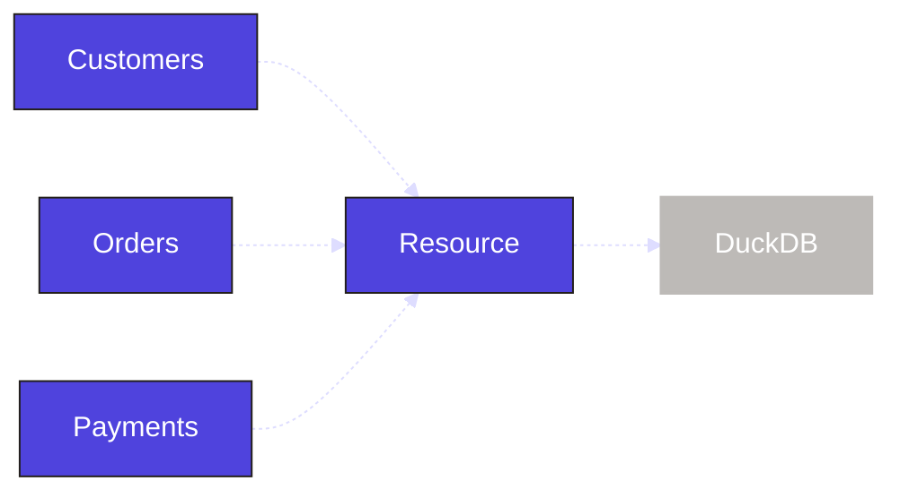

Right now, our assets represent pointers to files in S3. This is a good first step in building out the asset graph, but it would be better if they represented tables in our database.

In this step, we will load that data into [DuckDB](https://duckdb.org), an analytical database. Since the same database will be used across all three assets, rather than adding the connection logic to each asset, we will use a [resource](/guides/build/external-resources) to centralize the connection in a single object that can be shared across all Dagster objects.

## 1. Define the DuckDB resource

In Dagster, resources are reusable objects that provide external context or functionality, such as database connections, clients, or configurations. Resources can be used by many different Dagster objects.

First, install the `dagster-duckdb` library:

<Tabs groupId="package-manager">
   <TabItem value="uv" label="uv">
      Install the required dependencies:

         ```shell
         uv add dagster-duckdb
         ```

   </TabItem>

   <TabItem value="pip" label="pip">
      Install the required dependencies:

         ```shell
         pip install dagster-duckdb
         ```

   </TabItem>
</Tabs>

<CliInvocationExample path="docs_snippets/docs_snippets/guides/tutorials/dagster-tutorial/commands/dg-scaffold-resources.txt" />

This adds a generic resources file to our project. The `resources.py` file is now part of the `dagster-tutorial` module:

<CliInvocationExample path="docs_snippets/docs_snippets/guides/tutorials/dagster-tutorial/tree/resources.txt" />

Within this file, we will define a `DuckDBResource` from the `dagster-duckdb` library. This consolidates the database connection in one place. Next, we will define a `resources` function with the <PyObject section="definitions" module="dagster" object="Definitions" decorator />. This function maps all resources to specific keys that can be used throughout the project:

<CodeExample
  path="docs_snippets/docs_snippets/guides/tutorials/dagster-tutorial/src/dagster_tutorial/defs/resources.py"
  language="python"
  title="src/dagster_tutorial/defs/resources.py"
/>

Here, we are setting the key `duckdb` to the `DuckDBResource` we just defined. Any Dagster object that uses this resource key will use the underlying DuckDB connection.



## 2. Add a resource to our assets

With the resource defined, we can update our asset code. First, set the `DuckDBResource` as a parameter in each asset, using the name `duckdb`. This matches the key we set when defining the resource and allows it to be used inside the asset. Then, use the `get_connection` method from the resource to connect to the database and execute the query to create the tables:

<CodeExample
  path="docs_snippets/docs_snippets/guides/tutorials/dagster-tutorial/src/dagster_tutorial/defs/assets.py"
  language="python"
  startAfter="start_define_assets_with_resources"
  endBefore="end_define_assets_with_resources"
  title="src/dagster_tutorial/defs/assets.py"
/>

Run `dg check` again to confirm that the assets and resources are configured correctly. If there is a mismatch between the key set in the resource and the key required by the asset, dg check will fail.

## 3. Viewing the resource

Back in the UI, your assets will not appear any different, but you can view the resource in the **Definitions** tab:

1. Click **Deployment**, then click "dagster-tutorial" to see your deployment.
2. Click **Definitions**.
3. Navigate to the "Resources" section to view all of your resources and select "duckdb".

   


4. Click on "Uses" for the resource to see the three assets that depend on the resource.

   
