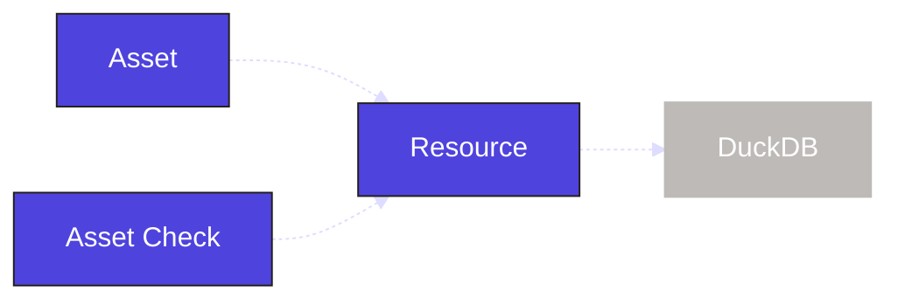

When building data applications, it is important to ensure the quality of all underlying entities. In this step, we will add checks to confirm that our assets are producing the data we expect.

## 1. Define an asset check

In Dagster, you define [asset checks](/guides/test/asset-checks) the same way you define assets. Asset checks run when an asset is materialized and verify that certain criteria are met based on the logic within the check.

To create one, define a function and decorate it with the <PyObject section="asset-checks" module="dagster" object="asset_check" decorator />. Within the asset check, set the `asset` parameter to indicate which asset the check runs against.

Here, we will create an asset check for the `orders_by_month` asset to ensure that there are rows in the underlying DuckDB table:

<CodeExample
  path="docs_snippets/docs_snippets/guides/tutorials/dagster-tutorial/src/dagster_tutorial/defs/assets.py"
  language="python"
  startAfter="start_define_asset_checks"
  endBefore="end_define_asset_checks"
  title="src/etl_tutorial/defs/assets.py"
/>

This asset check queries the table directly to determine if the data is valid. Based on the query result, it sets the <PyObject section="asset-checks" module="dagster" object="AssetCheckResult" /> to pass or fail.

:::info
The asset check uses the same `DuckDBResource` resource we defined for our assets. Resources can be shared across all objects in Dagster.

:::

## 2. Checking our asset check runs

In the Dagster UI at [http://127.0.0.1:3000](http://127.0.0.1:3000), you should now see an asset check associated with the `orders_by_month` asset:
#TODO Screenshot

Asset checks run automatically when an asset is materialized, but you can also execute them manually in the UI:

1. Reload your Definitions.
2. Navigate to the **Asset Details** page for the `orders_by_month` asset.
3. Select the **Checks** tab.
4. Click **Execute** for `orders_by_month_check` (assuming the asset has already been materialized).

#TODO Screenshot
