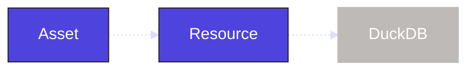

We've now created our own assets and combined them with assets from a component. We will circle back to the ingestion assets we defined and include another Dagster object to help how we manage our database connection with DuckDB.

In this step, you will:

- Add a DuckDB resource

## 1. Define the DuckDB resource

In Dagster, [resources](/guides/build/external-resources) are reusable components that provide external context or functionality such as  database connections, clients, or configurations. These can be used by a number of different Dagster objects but we will first apply them to our assets.

We will use the `dagster-duckdb` library so add it to our project:

```bash
uv pip install dagster-duckdb pandas
```

Next, we need to scaffold our resources in the same way as our assets using `dg`:

```bash
dg scaffold defs dagster.resources resources.py
```

This adds a file, `resources.py`, to the `etl_tutorial` module:

<CliInvocationExample path="docs_snippets/docs_snippets/guides/tutorials/etl_tutorial/tree/resources.txt" />

Within this file we will define the resource using the <PyObject section="definitions" module="dagster" object="Definitions" decorator />.

<CodeExample
  path="docs_snippets/docs_snippets/guides/tutorials/etl_tutorial/src/etl_tutorial/defs/resources.py"
  language="python"
  title="src/etl_tutorial/defs/resources.py"
/>

This centralizes our connection to DuckDB into a single object. Currently each of our assets handles that connection separately. Now the connection can be shared across all our assets.



## 2. Add a resource to our assets

With our resource defined we need to update our asset code. Since all of our ingestion assets rely on the `import_url_to_duckdb` to execute the query we will first update that function to use the `DuckDBResource` to handle query execution:

<CodeExample
  path="docs_snippets/docs_snippets/guides/tutorials/etl_tutorial/src/etl_tutorial/defs/assets.py"
  language="python"
  startAfter="start_import_url_to_duckdb_with_resource"
  endBefore="end_import_url_to_duckdb_with_resource"
  title="src/etl_tutorial/defs/assets/py"
/>

The `DuckDBResource` is designed to handle concurrent queries so we no longer need the `serialize_duckdb_query` function.

Now we can update the assets themselves. The only difference is that each asset will now include a `DuckDBResource` input parameter set to `duckdb` (which is the key we set in the `resources.py`):

<CodeExample
  path="docs_snippets/docs_snippets/guides/tutorials/etl_tutorial/src/etl_tutorial/defs/assets.py"
  language="python"
  startAfter="start_ingest_assets_2"
  endBefore="end_ingest_assets_2"
  title="src/etl_tutorial/defs/assets.py"
/>

The `DuckDBResource` connection will then be passed to the `import_url_to_duckdb` responsible for running the query.

Back in the UI, your assets will not appear any different. However you can view it within the definition.

1. Click **Deployment**, then click "etl-tutorial" to see your deployment.
2. Click **Definitions**.
3. Navigate to the "Resources" section to view all of your resources and select "duckdb".


You can see that this resource has 3 uses which lines up with our three assets.


## Summary

We have now introduced resources for our project. The `etl_tutorial` module should look like this:

<CliInvocationExample path="docs_snippets/docs_snippets/guides/tutorials/etl_tutorial/tree/step-2.txt" />

Resources are very helpful as projects grow more complex. This helps ensure that all assets are using the same connection details and reduces the amount of custom code that needs to be written. We will also see that resources can be used by other Dagster objects.

## Next steps

- Continue this tutorial with your [data quality](/etl-pipeline-tutorial/data-quality)
