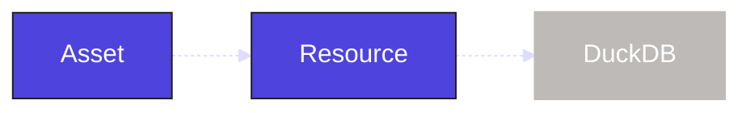

We have integrated with Sling and dbt to bring in and model the data. Next we will define a custom asset to see some more of the internals of Dagster. In this step, you will:

- Build software-defined assets
- Add a DuckDB resource

## Relationship between components and definitions

TODO

## 1. Create an asset

Before we begin we will need to include the Python libraries that the asset will use:

```bash
uv pip install dagster-duckdb pandas
```

When building our own assets, the first step is to scaffold the assets file with `dg`.

```bash
dg scaffold defs dagster.asset assets.py
```

This adds a file, `assets.py`, to the `etl_tutorial` module:

<CliInvocationExample path="docs_snippets/docs_snippets/guides/tutorials/etl_tutorial/tree/assets.txt" />

We will put the code for our first asset in this file. Assets are functions decorated with <PyObject section="assets" module="dagster" object="asset" decorator />. This asset will be downstream from models of our dbt project so we will include the `deps` attribute to link our asset into the same graph.

The logic of our asset will create a new table in DuckDB that joins the staging orders and customers tables from the dbt models together.

<CodeExample
  path="docs_snippets/docs_snippets/guides/tutorials/etl_tutorial/src/etl_tutorial/defs/assets.py"
  language="python"
  startAfter="start_joined_data_asset"
  endBefore="end_joined_data_asset"
  title="src/etl_tutorial/defs/assets/py"
/>

As well as creating the table, the asset will sample a preview of the results and record the number of rows in the table as metadata within Dagster.

:::info
Do not worry about the `automation_condition` in the `dg.asset` decorator for now. This is not necessary but will make more sense when we discuss automation later.
:::

There is one more thing we need to define. Since our asset uses the same DuckDB database as Sling and dbt and relies on a `DuckDBResource` resource. In Dagster, [Resources](/api/dagster/resources) are the external services, tools, and storage backends you need to do your job. We need to define that resource.

## 2. Define the DuckDB resource

We can use `dg` to scaffold our resource file in the same way as our assets.

```bash
dg scaffold defs dagster.resources resources.py
```

This adds a file, `resources.py`, to the `etl_tutorial` module:

<CliInvocationExample path="docs_snippets/docs_snippets/guides/tutorials/etl_tutorial/tree/resources.txt" />

Within this file we will define the resource using the <PyObject section="resources" module="dagster" object="resource" decorator />.

<CodeExample
  path="docs_snippets/docs_snippets/guides/tutorials/etl_tutorial/src/etl_tutorial/defs/resources.py"
  language="python"
  title="src/etl_tutorial/defs/resources/py"
/>

This will allow all assets within the Dagster project to access the DuckDB database connection.



## Summary

We have now started to add in our own custom assets into the Dagster project. The `etl_tutorial` module should look like this:

<CliInvocationExample path="docs_snippets/docs_snippets/guides/tutorials/etl_tutorial/tree/step-2.txt" />

There is a lot more we can do with assets to make them more production ready.

## Next steps

- Continue this tutorial with your [data quality](/etl-pipeline-tutorial/data-quality)
