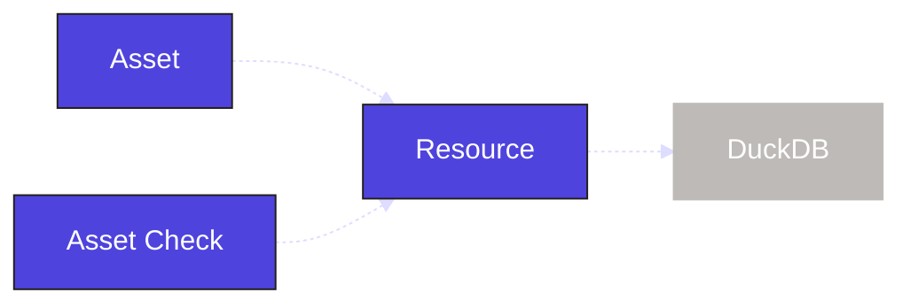

Data quality is critical in data pipelines. Inspecting individual assets ensures that data quality issues are caught before they affect the entire pipeline. In this step, you will:

- Define an asset check
- Execute that asset check in the UI

## 1. Define an asset check

In Dagster, you define [asset checks](/guides/test/asset-checks) the same way you define assets. Asset checks run when an asset is materialized and ensure that certain criteria are met.

You can place an asset check in the `assets.py` file alongside the asset it validates. In our case, we'll query the `raw_customers` table—created by our asset—and verify that the `id` column contains no null values:

<CodeExample
  path="docs_snippets/docs_snippets/guides/tutorials/etl_tutorial/src/etl_tutorial/defs/assets.py"
  language="python"
  startAfter="start_asset_check"
  endBefore="end_asset_check"
  title="src/etl_tutorial/defs/assets.py"
/>

:::info
The asset check is using the same `DuckDBResource` resource we defined for the asset. Resources can be shared across all objects in Dagster.

:::

In the Dagster UI, you can now see that an asset check is associated with the `joined_data` asset:

Asset checks will run when an asset is materialized, but asset checks can also be executed manually in the UI:

1. Reload your Definitions.
2. Navigate to the Asset Details page for the `raw_customers` asset.
3. Select the "Checks" tab.
4. Click the **Execute** button (assuming the asset has already executed) for `missing_dimension_check`.

   

## Summary

The structure of the `etl_tutorial` module has remained the same:

<CliInvocationExample path="docs_snippets/docs_snippets/guides/tutorials/etl_tutorial/tree/step-2.txt" />

But there are now data checks on the assets we have created to help ensure the quality of the data in our pipeline.

## Next steps

- Continue this tutorial with [creating and materializing partitioned assets](/etl-pipeline-tutorial/partition-asset)
