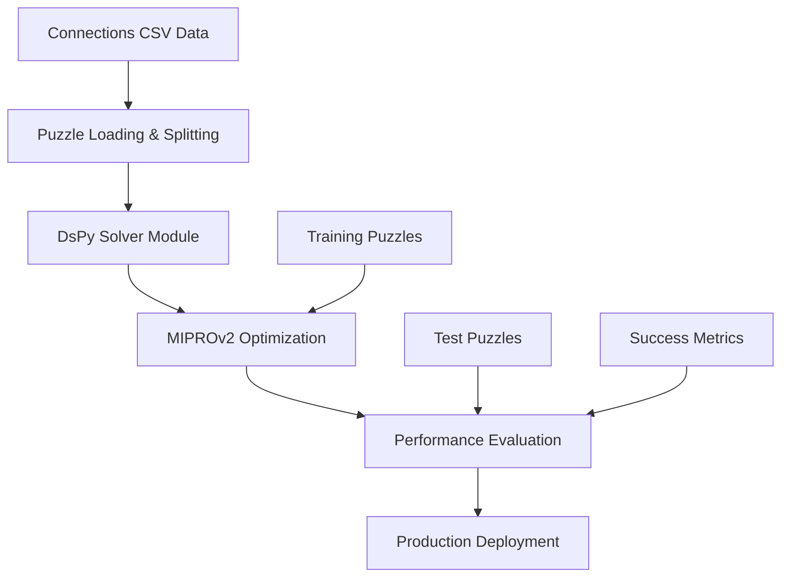

In this tutorial, you'll build an AI system that solves [NYT Connections puzzles](https://www.nytimes.com/games/connections) using [DsPy](https://dspy.ai/) for structured reasoning and Dagster for pipeline orchestration. DsPy is a framework for building modular AI software that can be compiled into effective prompts and optimized automatically.

This example demonstrates how to:

- Load and process Connections puzzle data
- Build a DsPy solver module with game logic
- Optimize the solver using MIPROv2 automatic optimization
- Evaluate puzzle-solving performance with custom metrics
- Deploy and monitor AI systems in production

## Prerequisites

To follow the steps in this guide, you'll need:

- Basic Python knowledge
- Python 3.9+ installed on your system. Refer to the [Installation guide](/getting-started/installation) for information.
- Understanding of language models and AI pipelines
- A Google Gemini API key (get one at [Google AI Studio](https://aistudio.google.com/))
- Familiarity with puzzle-solving and game logic
- Basic knowledge of the NYT Connections puzzle format

## Step 1: Set up your Dagster environment

First, set up a new Dagster project with DsPy dependencies.

1. Clone the [Dagster repo](https://github.com/dagster-io/dagster) and navigate to the project:

   ```bash
   cd examples/docs_projects/project_dspy
   ```

2. Install the required dependencies with `uv`:

   ```bash
   uv sync
   ```

3. Activate the virtual environment:

   <Tabs>
     <TabItem value="macos" label="MacOS">
       ```source .venv/bin/activate ```
     </TabItem>
     <TabItem value="windows" label="Windows">
       ```.venv\Scripts\activate ```
     </TabItem>
   </Tabs>

4. Set up your environment variables by copying the template:

   ```bash
   cp .env.example .env
   ```

   Then populate the required fields:

   - `GEMINI_API_KEY`: Your Google Gemini API key for language model access
   - `GEMINI_MODEL`: The Gemini model to use (default: gemini-2.0-flash-exp)
   - `DAGSTER_CLOUD_API_TOKEN`: (Optional) For Dagster Cloud deployment

## Step 2: Launch the Dagster webserver

To make sure Dagster and its dependencies were installed correctly, navigate to the project root directory and start the Dagster webserver:

```bash
dg dev
```

Navigate to [http://127.0.0.1:3000](http://127.0.0.1:3000) to view the Dagster UI.

## Architecture overview

The DsPy pipeline consists of several key components:



## Next steps

- Continue this tutorial with [puzzle data ingestion](/examples/full-pipelines/dspy/data-ingestion)
