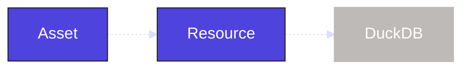

We've now created our own ingest assets and combined them with assets from the dbt component to model the data. In this step, we will revisit the ingest assets, and add another Dagster object to assist with managing our DuckDB connection. Currently, each of our assets handles its own connection separately. Adding a [resource](/guides/build/external-resources) will allow us to centralize our connection to DuckDB in a single object that can be shared across all our Dagster objects.

## 1. Define the DuckDB resource

In Dagster, resources are reusable objects that provide external context or functionality, such as database connections, clients, or configurations. Resources can be used by a number of different Dagster objects.

First, we will need to install the `dagster-duckdb` and `pandas` libraries:

<Tabs groupId="package-manager">
   <TabItem value="uv" label="uv">
      Install the required dependencies:

         ```shell
         uv add dagster-duckdb pandas
         ```

   </TabItem>

   <TabItem value="pip" label="pip">
      Install the required dependencies:

         ```shell
         pip install dagster-duckdb pandas
         ```

   </TabItem>
</Tabs>

Next, we need to scaffold our resources file with `dg`:

<CliInvocationExample path="docs_projects/project_etl_tutorial/commands/dg-scaffold-resources.txt" />

This adds a generic resources file to our project. The `resources.py`, is now part of our `etl_tutorial` module:

<CliInvocationExample path="docs_projects/project_etl_tutorial/tree/resources.txt" />

Within this file, we will define our `DuckDBResource` resource from the `dagster-duckdb` library. This consolidates the database connection in one place. Next, we will define a `resources` function with the <PyObject section="definitions" module="dagster" object="Definitions" decorator />. This function will map all of our resources to specific keys throughout our Dagster project:

<CodeExample
  path="docs_projects/project_etl_tutorial/src/etl_tutorial/defs/resources.py"
  language="python"
  title="src/etl_tutorial/defs/resources.py"
/>

Here we are setting the key `duckdb` to the `DuckDBResource` we just defined. Now any Dagster object that uses that resource key will use the underlying resource set for our DuckDB database.



## 2. Add a resource to our assets

With our resource defined, we need to update our asset code. Since all of our ingestion assets rely on the `import_url_to_duckdb` to execute the query, we will first update that function to use the `DuckDBResource` to handle query execution:

<CodeExample
  path="docs_projects/project_etl_tutorial/src/etl_tutorial/defs/assets.py"
  language="python"
  startAfter="start_import_url_to_duckdb_with_resource"
  endBefore="end_import_url_to_duckdb_with_resource"
  title="src/etl_tutorial/defs/assets.py"
/>

The `DuckDBResource` is designed to handle concurrent queries, so we no longer need the `serialize_duckdb_query` function. Now we can update the assets themselves. We will add `duckdb` as a parameter to each asset function. Within our Dagster project, the `DuckDBResource` will now be available which we can pass through to the `import_url_to_duckdb` function:

<CodeExample
  path="docs_projects/project_etl_tutorial/src/etl_tutorial/defs/assets.py"
  language="python"
  startAfter="start_ingest_assets_2"
  endBefore="end_ingest_assets_2"
  title="src/etl_tutorial/defs/assets.py"
/>

We can run `dg check` again to ensure that the assets and resources are configured properly. If there was a mismatch between the key set in the resource and the resource key required by the asset, `dg check` would fail.

## 3. Viewing the resource

Back in the UI, your assets will not appear any different, but you can view the resource in the **Definitions** tab:

1. Click **Deployment**, then click "etl-tutorial" to see your deployment.
2. Click **Definitions**.
3. Navigate to the "Resources" section to view all of your resources and select "duckdb".


You can see that this resource has three uses that line up with our three assets:


## Summary

We have introduced resources into our project. The `etl_tutorial` module should look like this:

<CliInvocationExample path="docs_projects/project_etl_tutorial/tree/step-2.txt" />

Resources are very helpful as projects grow more complex and help ensure that all assets are using the same connection details and reduce the amount of custom code that needs to be written. We will also see that resources can be used by other Dagster objects.

## Next steps

In the next step, we will [ensure data quality with asset checks](/examples/full-pipelines/etl-pipeline/data-quality).
