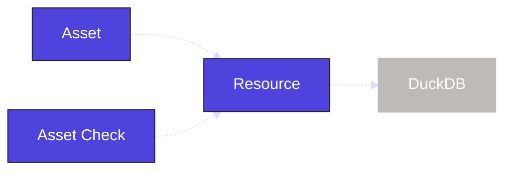

Data quality is critical in data pipelines. Inspecting individual assets ensures that data quality issues are caught before they affect the entire pipeline. In this step, you will:

- Define an asset check
- Execute that asset check in the UI

## 1. Define an asset check

In Dagster, you can define [asset checks](/guides/test/asset-checks) the same way you define assets. Asset checks run when an asset is materialized and ensure that certain criteria are met based on logic defined within the asset check.

You can place an asset check in the `assets.py` file alongside the asset it validates. Defining an asset check is similar to creating an asset. We define a function and decorate it with <PyObject section="asset-checks" module="dagster" object="asset_check" decorator />. Within the asset check, we need to set the `asset` parameter, which will determine which asset the asset check runs against.

In our case, we'll create an asset check on the `raw_customers` asset. We want to make sure that the underlying DuckDB table in that asset does not have any nulls in the `id` column:

<CodeExample
  path="docs_projects/project_etl_tutorial/src/etl_tutorial/defs/assets.py"
  language="python"
  startAfter="start_asset_check"
  endBefore="end_asset_check"
  title="src/etl_tutorial/defs/assets.py"
/>

Our asset check queries the table directly to determine if the data is valid. Based on the result of the query, we either set the <PyObject section="asset-checks" module="dagster" object="AssetCheckResult" /> to pass or fail.

:::info
The asset check is using the same `DuckDBResource` resource we defined for the asset. Resources can be shared across all objects in Dagster.

:::

Run `dg dev` (if it is not already running) and go to the Dagster UI [http://127.0.0.1:3000](http://127.0.0.1:3000). You should now see that an asset check is associated with the `joined_data` asset:

Asset checks will run when an asset is materialized, but asset checks can also be executed manually in the UI:

1. Reload your Definitions.
2. Navigate to the Asset Details page for the `raw_customers` asset.
3. Select the "Checks" tab.
4. Click the **Execute** button (assuming the asset has already executed) for `missing_dimension_check`.

   

## Summary

The structure of the `etl_tutorial` module has remained the same:

<CliInvocationExample path="docs_projects/project_etl_tutorial/tree/step-2.txt" />

But there are now data checks on the assets we have created to help ensure the quality of the data in our pipeline.

## Next steps

- Continue this tutorial with [creating and materializing partitioned assets](/examples/full-pipelines/etl-pipeline/partition-asset)
