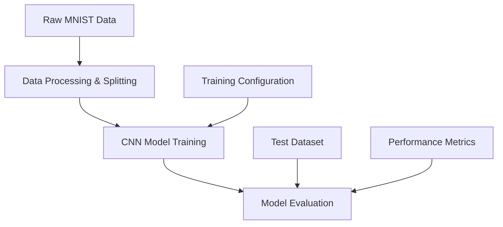

In this tutorial, you'll build a complete CNN-based digit classifier using Dagster and PyTorch, covering the entire ML lifecycle with production-ready practices.

This example demonstrates how to:

- Build production-ready ML pipelines using Dagster's asset-based architecture
- Train and deploy CNN models with automated quality gates and rollback capabilities
- Implement configurable training workflows that adapt across development and production environments
- Create scalable inference services supporting both batch and real-time prediction scenarios

You will learn to:

- Structure ML workflows as interconnected Dagster assets with automatic dependency tracking
- Configure model training parameters through Dagster's configuration system without code changes
- Implement comprehensive model evaluation with automated deployment decision-making
- Design storage abstractions that work seamlessly across local and cloud environments

## Prerequisites

To follow the steps in this guide, you'll need:

- Basic Python knowledge
- Python 3.9+ installed on your system. Refer to the [Installation guide](/getting-started/installation) for information.
- Basic familiarity with machine learning concepts (neural networks, training/validation splits)
- Understanding of PyTorch fundamentals (tensors, models, training loops)

## Step 1: Set up your Dagster environment

First, set up a new Dagster project with the ML dependencies.

1. Clone the [Dagster repo](https://github.com/dagster-io/dagster) and navigate to the project:

   ```bash
   cd examples/docs_projects/project_ml
   ```

2. Install the required dependencies with `uv`:

   ```bash
   uv sync
   ```

3. Activate the virtual environment:

   <Tabs>
     <TabItem value="macos" label="MacOS">
       ```source .venv/bin/activate ```
     </TabItem>
     <TabItem value="windows" label="Windows">
       ```.venv\Scripts\activate ```
     </TabItem>
   </Tabs>

## Step 2: Launch the Dagster webserver

To make sure Dagster and its dependencies were installed correctly, navigate to the project root directory and start the Dagster webserver:

```bash
dg dev
```

Navigate to [http://127.0.0.1:3000](http://127.0.0.1:3000) to view the Dagster UI.

## Architecture Overview

The ML pipeline consists of several key components:



The pipeline demonstrates:

- **Asset-based ML workflows**: Each pipeline stage is modeled as a Dagster asset with clear dependencies, metadata tracking, and lineage visualization
- **Configuration-driven training**: Model architecture, hyperparameters, and training strategies can be adjusted through configuration without code changes
- **Automated quality gates**: Models are automatically evaluated and deployed based on performance thresholds, with manual override capabilities
- **Flexible storage backends**: Abstract storage interfaces support both local development and cloud production environments seamlessly
- **Production-ready inference**: Scalable prediction services handle both high-throughput batch processing and low-latency real-time requests

## Next steps

- Continue this tutorial with [data ingestion](/examples/full-pipelines/ml/data-ingestion)
