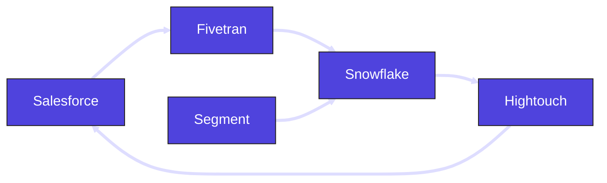

# ETL/Reverse ETL

## Objective

Build a platform that ingests data from multiple sources (Salesforce and Segment), using an ETL tool (Fivetran). The data is modeled within the data warehouse (Snowflake using dbt). Once the modeling is complete, the final datasets are exported back into Salesforce using a reverse ETL tool (Hightouch).

## Architecture

## Dagster Architecture

### 1. Salesforce ingestion with Fivetran

The integration between Salesforce and Snowflake is defined in Fivetran, allowing a web-based workflow to configure and manage the connections.

Within Dagster, Fivetran assets are generated by loading the Fivetran workspace. This process creates individual Dagster assets for each Salesforce entity that Fivetran ingests. Dagster then controls the execution of the Fivetran ingestion through scheduled runs.

**Dagster Features**

- `dagster_fivetran`
- `schedules`

### 2. dbt modeling in Snowflake

Each model within the dbt project will be created as a Dagster asset. Models that depend on tables managed by Fivetran can be configured in two ways: they can participate in an event-driven workflow with continuous automation, running automatically after the upstream Fivetran asset is materialized, or they can be placed on their own independent schedule, separate from the Fivetran ingestion schedule.

**Dagster Features**

- `dagster_dbt`
- `declarative automation`
- `schedule`
- `asset checks`

### 3. Segment ingestion into Snowflake

Separate from the Salesforce ingestion, data from Segment is also brought into the system. While Segment manages its own data replication, corresponding assets are still represented in the Dagster asset catalog. These assets connect to downstream dependencies to maintain a complete and accurate lineage graph.

### 4. Export data into Salesforce with Hightouch

An export job is created in Hightouch to take a table from Snowflake and export it back into a Salesforce entity. Dagster can load the Hightouch organization and generate assets that map directly to the Hightouch jobs.

**Dagster Features**

- `dagster_hightouch`
- `jobs`