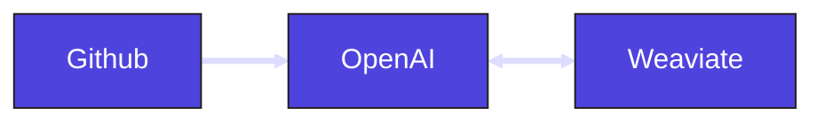

# Retrieval-Augmented Generation (RAG)

## Objective

Build a retrieval-augmented generation (RAG) system that extracts data from GitHub using the GitHub API. The extracted content is stored in a vector database (Weaviate) to enable efficient semantic search. When a user submits a question through an asset at run time, relevant context is retrieved from Weaviate and passed to OpenAI to generate a response grounded in the source material.

## Architecture



## Dagster Architecture


### 1. Github ingestion

Data is extracted from GitHub using the GitHub GraphQL API and can be implemented as a custom resource in Dagster. To avoid unnecessary re-importing, the data can be partitioned and scheduled, ensuring only new or updated content is fetched during each run.

**Dagster Features**

- `resource`
- `partitions`
- `schedule`

### 2. Generate embeddings

The raw unstructured data from GitHub must be converted into vector embeddings before it can be inserted into a vector database. Using an LLM like OpenAI, the text is transformed into embeddings that capture its semantic meaning for efficient retrieval.

**Dagster Features**

- `dagster_openai`

### 3. Upsert embeddings into Weaviate

An index is managed in Weaviate to store embeddings, with new or updated GitHub embeddings continuously loaded into the index as changes occur.


**Dagster Features**

- `dagster_weaviate`

### 4. Retrieve information with OpenAI

An asset is configured with a run configuration to enable dynamic runtime execution. This allows questions to be posed to the LLM with the added context of data stored in the vector database.

```yaml
ops:
  openai_retrieval:
    config:
      question: What is Dagster?
```

**Dagster Features**

- `config`
- `dagster_openai`
