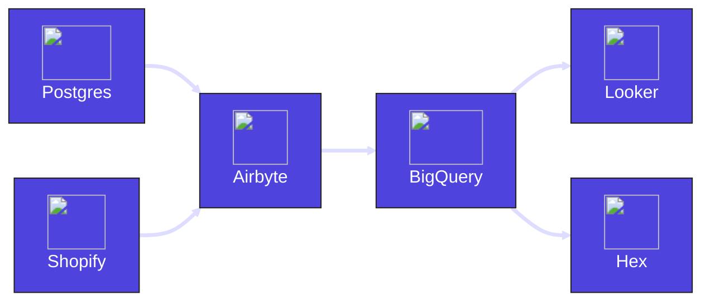

## Objective

Build a platform that ingests data from multiple sources (Postgres and Shopify), using an ETL tool (Airbyte). The data is modeled within the data warehouse (BigQuery using dbt). Once the modeling is complete, the datasets are analyzed in Notebooks (Hex) and presented in the dashboards (Looker).

## Dagster Architecture

### 1. Shopify and Postgres ingestion with Airbyte

The integration between Shopify and Postgres with BigQuery is defined in Airbyte and can be run separately from Dagster.

Within Dagster, Airbyte assets are generated by loading the Airbyte instance (either Cloud or self-hosted). This creates individual Dagster assets for each entity in Shopify or tables in Postgres that Airbyte ingests. Dagster then controls the execution of the Airbyte ingestion through scheduled runs.

**Dagster Features**

- [Dagster Airbyte](/integrations/libraries/airbyte)
- [Schedules](/guides/automate/schedules)

---

### 2. dbt modeling in BigQuery

Each model within the dbt project will be created as a Dagster asset. Models depend on tables managed by Airbyte. Using declarative automation in Dagster, models can be set to trigger automatically when the upstream Airbyte assets materialize.

Data quality is ensured through Dagster's automatic generation of asset checks for tests defined within the dbt project.

**Dagster Features**

- [Dagster dbt](/integrations/libraries/dbt)
- [Declarative Automation](/guides/automate/declarative-automation)
- [Schedules](/guides/automate/schedules)
- [Asset checks](/guides/test/asset-checks)

---

### 3. Analyze data in Hex

After the data has been modeled with dbt, additional non-SQL based analysis can be handled with Notebooks in Hex.

**Dagster Features**

- [Dagster Hex](/integrations/libraries/hex)

---

### 4. Present data in Looker

Dashboards are maintained in Looker with full lineage of their inputs. Once again using declarative automation, dashboards can be synced as soon as their upstream dependencies are refreshed, ensuring up to date reporting.

**Dagster Features**

- [Dagster Looker](/integrations/libraries/looker)
- [Declarative Automation](/guides/automate/declarative-automation)
