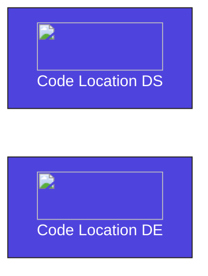

## Objective

Build a platform that has two separate code locations which each run their own environment (dependencies as well as Python and Dagster versions).



## Dagster Architecture


### 1. Set up the `dg.toml`

There are two separate [code locations](/deployment/code-locations), `data-engineering` and `data-science`. Both are created using the [`create-dagster` CLI](/api/clis/create-dagster).

```
.
├── data-engineering
├── data-science
├── dg.toml
├── pyproject.toml
└── uv.lock
```

In order to launch both of these code locations together we can configure a (`dg.toml` file)[api/clis/dg-cli/dg-cli-configuration#user-configuration-file].

**Dagster Features**

- [Code locations](/deployment/code-locations)

---

### 2. dbt modeling in BigQuery

```
.
└── data-engineering
    ├── pyproject.toml
    ├── README.md
    └── src
        └── data_engineering
            ├── definitions.py
            └── definitions.py
```

Each model within the dbt project will be created as a Dagster asset. Models depend on tables managed by Airbyte. Using declarative automation in Dagster, models can be set to trigger automatically when the upstream Airbyte assets materialize.

Data quality is ensured through Dagster's automatic generation of asset checks for tests defined within the dbt project.

---

### 3. Analyze data in Hex

After the data has been modeled with dbt, additional non-SQL based analysis can be handled with Notebooks in Hex.

```
.
└── data-engineering
    ├── pyproject.toml
    ├── README.md
    └── src
        └── data_engineering
            ├── definitions.py
            └── definitions.py
```
