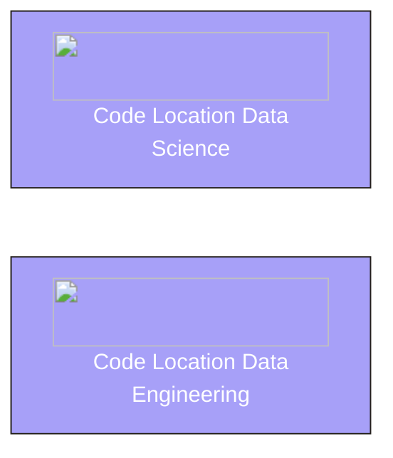

## Objective

Build a platform that supports two separate code locations, each running in its own environment (with distinct dependencies, Python versions, and Dagster versions).



## Dagster Architecture


### 1. Set up the `dg.toml`

There are two separate [code locations](/deployment/code-locations), `data-engineering` and `data-science`. Both are created using the [`create-dagster` CLI](/api/clis/create-dagster).

```
.
├── data-engineering
├── data-science
├── dg.toml
├── pyproject.toml
└── uv.lock
```

To launch both of these code locations together, configure a (`dg.toml` file)[api/clis/dg-cli/dg-cli-configuration#user-configuration-file]. This file defines multiple workspaces and ensures each code location is registered with the same Dagster deployment.

**Dagster Features**

- [Code locations](/deployment/code-locations)

---

### 2. Data science code location

The data-science code location contains machine learning workflows, experimentation pipelines, and data preparation tasks. Its environment is tuned for heavier numerical computation and may include libraries like `pandas`, `scikit-learn`, or `pytorch`.

```
.
└── data-engineering
    ├── pyproject.toml
    ├── README.md
    └── src
        └── data_engineering
            └── definitions.py
```

---

### 3. Data engineering code location

The data-engineering code location is focused on ETL/ELT workflows, database synchronization, and other data movement or transformation jobs. It requires a lighter dependency set optimized for reliability and scalability.

```
.
└── data-engineering
    ├── pyproject.toml
    ├── README.md
    └── src
        └── data_engineering
            └── definitions.py
```
