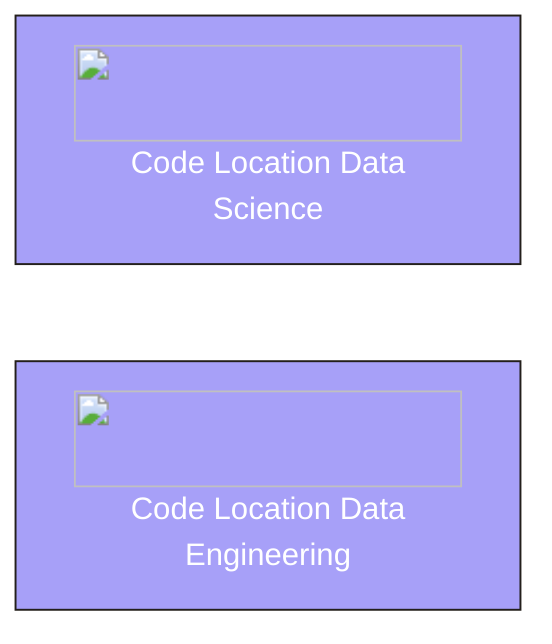

## Objective

Build a platform that supports two separate code locations, each running in its own environment (with distinct dependencies, Python versions, and Dagster versions).



## Dagster Architecture


### 1. Structure workspaces

In Dagster you define one or more workspaces. These are the Python projects that contain your Dagster code. As your Dagster projects grows it makes sense to have multiple workspaces such as a `data-engineering` workspace and `data-science` workspace with different dependencies.

Both of these workspaces are created using the [`create-dagster` CLI](/api/clis/create-dagster) but are developed separately.

However even though they exist as separate workspaces, both can be included in the same Dagster deployment using a (`dg.toml` file)[api/clis/dg-cli/dg-cli-configuration#user-configuration-file]. This file defines multiple workspaces but ensure that all workspaces as registered as part of the same Dagster deployment.

```
.
├── data-engineering # workspace
├── data-science # workspace
├── dg.toml
├── pyproject.toml
└── uv.lock
```

**Dagster Features**

- [Managing workspaces](/guides/build/projects/multiple-projects)

---

### 2. Data engineering code location

Each workspace exists independently. The `data-engineering` workspace focuses on ETL/ELT workflows, database synchronization, and other data movement or transformation jobs. It requires a lighter dependency set optimized for reliability and scalability.

```
.
└── data-engineering
    ├── pyproject.toml
    ├── README.md
    └── src
        └── data_science
            └── definitions.py
```

The workspace is deployed to Dagster as a [code location](/deployment/code-locations). A code location consists of the workspace’s code along with its environment. This is where Dagster executes runs within the Dagster instance.

**Dagster Features**

- [Code locations](/deployment/code-locations)

---

### 3. Data science code location

A deployed Dagster instance can have multiple code locations. In addition to the data-engineering code location, a `data-science` code location can be configured for machine learning workflows, experimentation pipelines, and data preparation tasks.

```
.
└── data-science
    ├── pyproject.toml
    ├── README.md
    └── src
        └── data_science
            └── definitions.py
```

Although the `data-science` code location executes separately, it can still reference assets from the data-engineering code location.

```python
@dg.asset(
    deps=[
        dg.AssetKey("data_engineering_asset") # exists in the data-engineering project
        ]
    )
def data_science_asset(): ...
```

This enables the asset graph to connect workflows and dependencies, even when they span multiple code locations.

### 4. Managing Access control

When deploying on [Dagster+](/deployment/dagster-plus), you can fine-tune access to code locations for different users. This allows certain users to view and depend on assets in other code locations without necessarily having permission to edit or execute them.

**Dagster Features**

- [Role-based access control](/deployment/dagster-plus/authentication-and-access-control/rbac)
