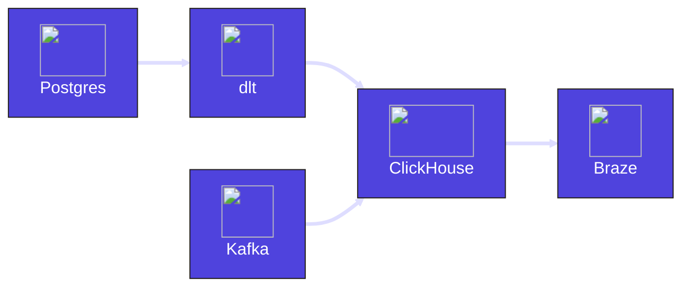

## Objective

Build an abandoned cart notification system that ingests customer data (Postgres) alongside real-time cart data (Kafka). A real-time view (ClickHouse) calculates which users have cart items that haven't been included in an order within the past hour. Newly identified abandoned carts are then sent downstream to the marketing platform (Braze).

## Architecture

## Dagster Architecture

### 1. Postgres ingestion with dlt

The integration between Postgres and Clickhouse is defined in dlt via YAML configuration in the code alongside the Dagster code. Dagster executes dlt on a schedule to extract stateful customer data into Clickhouse.

**Dagster Features**

- [Dagster dlt](/integrations/libraries/dlt)
- [Schedules](/guides/automate/schedules)

---

### 2. Kafka ingestion

Real-time data on carts is brought into Clickhouse from the Kafka topic.

**Dagster Features**

- [Declarative Automation](/guides/automate/declarative-automation)

---

### 3. Abandoned cart materialization

The customer data is combined with the real-time cart data to identify users who have not acted on their cart within the last hour. This materialized view lives in Clickhouse (which can be managed with a custom resource), capturing only abandoned carts from the last 3 hours to prevent the view from growing too large over time.

**Dagster Features**

- [Resources](/guides/build/external-resources)

---

### 4. Notifications sent to the marketing tool

A sensor checks the abandoned cart view in Clickhouse for new abandoned carts which are sent to Braze via their API.

**Dagster Features**

- [Sensors](/guides/automate/sensors)
