Dagster provides a variety of abstractions for building and orchestrating data pipelines. These concepts enable a modular, declarative approach to data engineering, making it easier to manage dependencies, monitor execution, and ensure data quality.

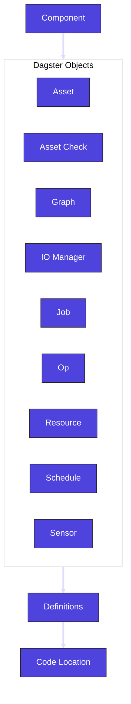

## Asset

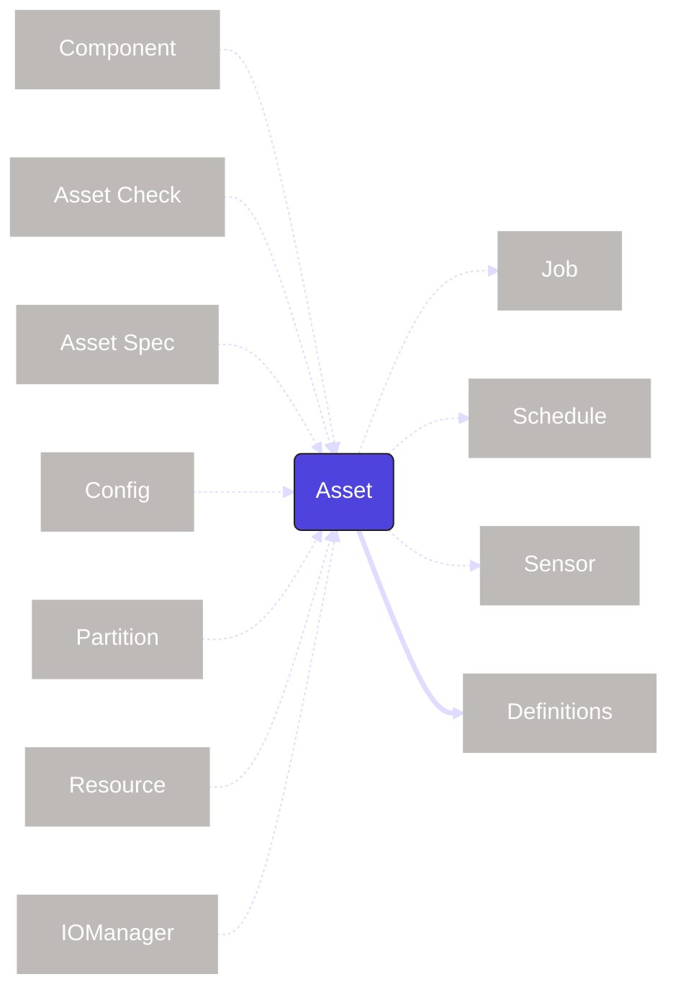

An <PyObject section="assets" module="dagster" object="asset" /> represents a logical unit of data such as a table, dataset, or machine learning model. Assets can have dependencies on other assets, forming the data lineage for your pipelines. As the core abstraction in Dagster, assets can interact with many other Dagster entities to facilitate certain tasks. When you define an asset, either with the <PyObject section="assets" module="dagster" object="asset" decorator /> decorator or via a [component](/guides/build/components), the definition is automatically added to a top-level <PyObject section="definitions" module="dagster" object="Definitions" /> object.

To dive deeper into how assets shape the way you design your data platform, [check out our deep-dive on assets](https://dagster.io/blog/software-defined-assets).

| Concept                     | Relationship                                                        |
| --------------------------- | ------------------------------------------------------------------- |
| [asset check](#asset-check) | `asset` may use an `asset check`                                    |
| [asset spec](#asset-spec)   | `asset` is described by an `asset spec`                             |
| [component](#component)     | `asset` may be programmatically built by a component                |
| [config](#config)           | `asset` may use a `config`                                          |
| [definitions](#definitions) | `asset` is added to a top-level `Definitions` object to be deployed |
| [io manager](#io-manager)   | `asset` may use a `io manager`                                      |
| [partition](#partition)     | `asset` may use a `partition`                                       |
| [resource](#resource)       | `asset` may use a `resource`                                        |
| [job](#job)                 | `asset` may be used in a `job`                                      |
| [schedule](#schedule)       | `asset` may be used in a `schedule`                                 |
| [sensor](#sensor)           | `asset` may be used in a `sensor`                                   |

## Asset check

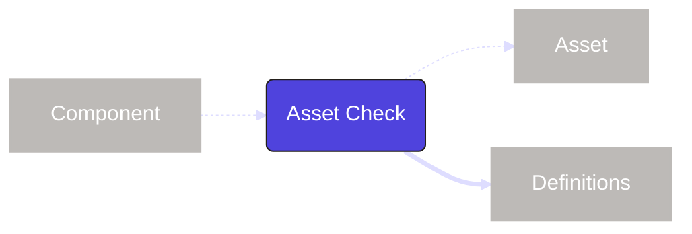

An <PyObject section="asset-checks" module="dagster" object="asset_check" /> is associated with an <PyObject section="assets" module="dagster" object="asset" /> to ensure it meets certain expectations around data quality, freshness or completeness. Asset checks run when the asset is executed and store metadata about the related run and if all the conditions of the check were met.

| Concept                     | Relationship                                                              |
| --------------------------- | ------------------------------------------------------------------------- |
| [asset](#asset)             | `asset check` may be used by an `asset`                                   |
| [definitions](#definitions) | `asset check` is added to a top-level `Definitions` object to be deployed |

## Asset spec

Specs are standalone objects that describe the identity and metadata of Dagster entities without defining their behavior. For example, an <PyObject module="dagster" section="assets" object="AssetSpec" /> contains essential information like the asset's <PyObject module="dagster" section="assets" object="AssetKey" displayText="key" /> (its unique identifier) and [tags](/guides/build/assets/metadata-and-tags) (labels for organizing and annotating the asset), but it doesn't include the logic for materializing that asset.

| Concept         | Relationship                                                      |
| --------------- | ----------------------------------------------------------------- |
| [asset](#asset) | `asset spec` may describe the identity and metadata of an `asset` |

## Code location

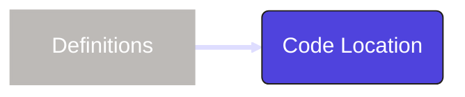

A [code location](/guides/build/projects) is a collection of Dagster entity [definitions](#definitions) deployed in a specific environment. A code location determines the Python environment (including the version of Dagster being used as well as any other Python dependencies). A Dagster project can have multiple code locations, helping isolate dependencies.

| Concept                     | Relationship                                                             |
| --------------------------- | ------------------------------------------------------------------------ |
| [definitions](#definitions) | `code location` must contain at least one top-level `Definitions` object |

## Component

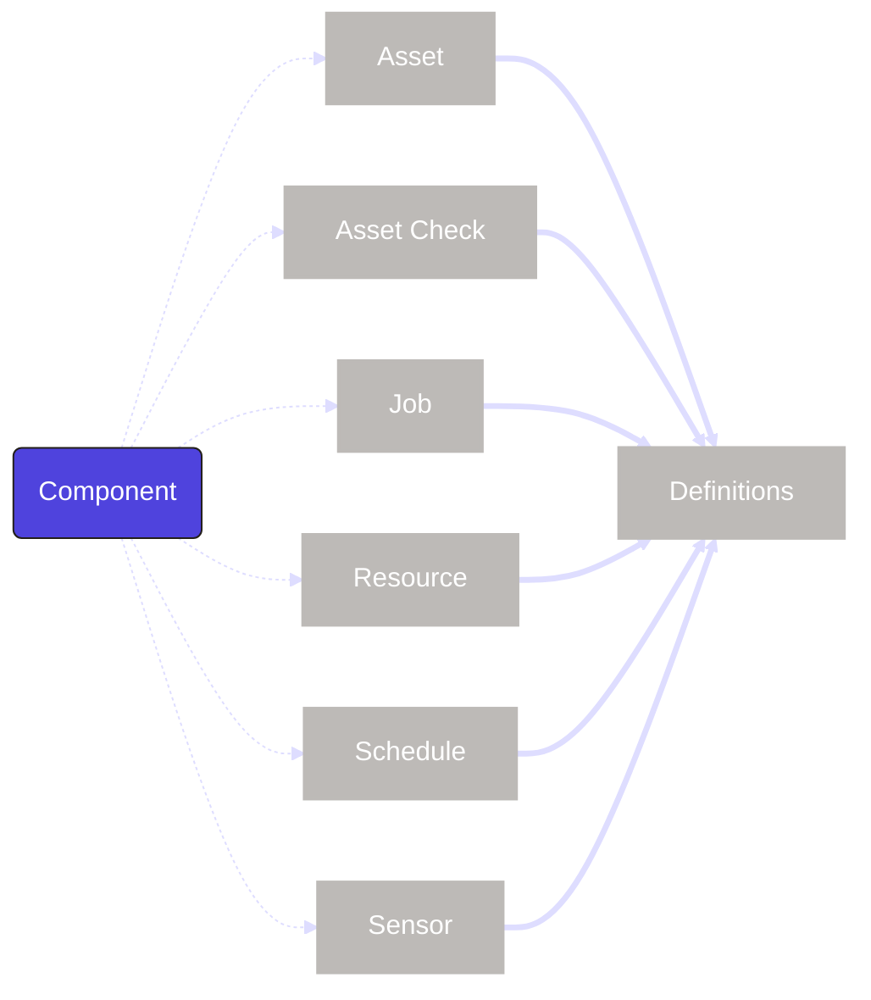

Components are objects that programmatically build <PyObject section="assets" module="dagster" object="asset" pluralize /> and other Dagster entity definitions, such as <PyObject section="asset-checks" module="dagster" object="asset_check" pluralize />, <PyObject section="schedules-sensors" module="dagster" object="schedule" pluralize />, <PyObject section="resources" module="dagster" object="ResourceDefinition" displayText="resources" />, and <PyObject section="schedules-sensors" module="dagster" object="sensor" pluralize />. They accept schematized configuration parameters (which are specified using YAML or lightweight Python) and use them to build the actual definitions you need. Components are designed to help you quickly bootstrap parts of your Dagster project and serve as templates for repeatable patterns.

| Concept                     | Relationship                                              |
| --------------------------- | --------------------------------------------------------- |
| [asset](#asset)             | `component` builds `assets` and other `definitions`       |
| [asset check](#asset-check) | `component` builds `asset_checks` and other `definitions` |
| [definitions](#definitions) | `component` builds `assets` and other `definitions`       |
| [job](#job)                 | `component` builds `jobs` and other `definitions`         |
| [schedule](#schedule)       | `component` builds `schedules` and other `definitions`    |
| [sensor](#sensor)           | `component` builds `sensors` and other `definitions`      |
| [resource](#resource)       | `component` builds `resources` and other `definitions`    |

## Config

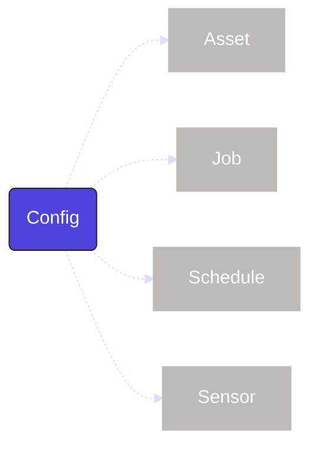

A <PyObject section="config" module="dagster" object="Config" displayText="config" /> is used to specify config schema for assets, jobs, schedules, and sensors. A <PyObject section="config" module="dagster" object="RunConfig" /> is a container for all the configuration that can be passed to a run. This allows for parameterization and the reuse of pipelines to serve multiple purposes.

| Concept               | Relationship                         |
| --------------------- | ------------------------------------ |
| [asset](#asset)       | `config` may be used by an `asset`   |
| [job](#job)           | `config` may be used by a `job`      |
| [schedule](#schedule) | `config` may be used by a `schedule` |
| [sensor](#sensor)     | `config` may be used by a `sensor`   |

## Definitions

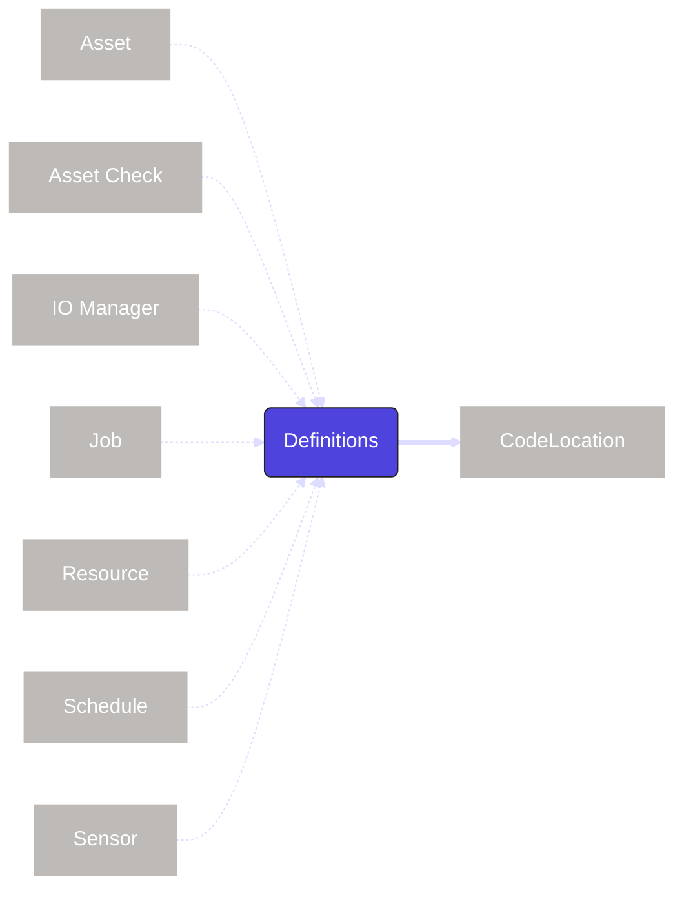

In Dagster, "definitions" means two things:

- The objects that combine metadata about Dagster entities with Python functions that define how they behave, for example, <PyObject section="assets" module="dagster" object="asset" />, <PyObject section="schedules-sensors" module="dagster" object="ScheduleDefinition" /> , and [resource](/api/dagster/resources) definitions.
- The top-level <PyObject section="definitions" module="dagster" object="Definitions" /> object that contains references to all the definitions in a Dagster project. Entities included in the `Definitions` object will be deployed and visible within the Dagster UI.

| Concept                         | Relationship                                                                     |
| ------------------------------- | -------------------------------------------------------------------------------- |
| [asset](#asset)                 | Top-level `Definitions` object may contain one or more `asset` definitions       |
| [asset check](#asset-check)     | Top-level `Definitions` object may contain one or more `asset check` definitions |
| [io manager](#io-manager)       | Top-level `Definitions` object may contain one or more `io manager` definitions  |
| [job](#job)                     | Top-level `Definitions` object may contain one or more `job` definitions         |
| [resource](#resource)           | Top-level `Definitions` object may contain one or more `resource` definitions    |
| [schedule](#schedule)           | Top-level `Definitions` object may contain one or more `schedule` definitions    |
| [sensor](#sensor)               | Top-level `Definitions` object may contain one or more `sensor` definitions      |
| [component](#component)         | `definition` may be the output of a `component`                                  |
| [code location](#code-location) | `definitions` must be deployed in a `code location`                              |

## Graph

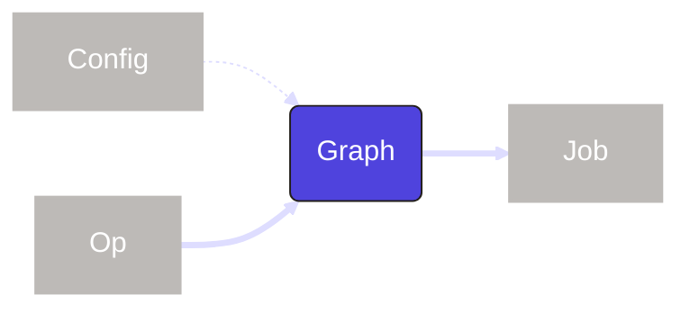

A <PyObject section="graphs" module="dagster" object="GraphDefinition" method="to_job" /> connects multiple <PyObject section="ops" module="dagster" object="op" pluralize /> together to form a DAG. If you are using <PyObject section="assets" module="dagster" object="asset" pluralize />, you will not need to use graphs directly.

| Concept           | Relationship                             |
| ----------------- | ---------------------------------------- |
| [config](#config) | `graph` may use a `config`               |
| [op](#op)         | `graph` must include one or more `ops`   |
| [job](#job)       | `graph` must be part of `job` to execute |

## I/O manager

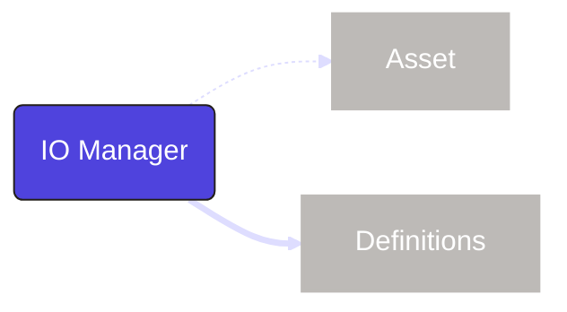

An <PyObject section="io-managers" module="dagster" object="IOManager" /> defines how data is stored and retrieved between the execution of <PyObject section="assets" module="dagster" object="asset" pluralize /> and <PyObject section="ops" module="dagster" object="op" pluralize />. This allows for a customizable storage and format at any interaction in a pipeline.

| Concept                     | Relationship                                                             |
| --------------------------- | ------------------------------------------------------------------------ |
| [asset](#asset)             | `io manager` may be used by an `asset`                                   |
| [definitions](#definitions) | `io manager` is added to a top-level `Definitions` object to be deployed |

## Job

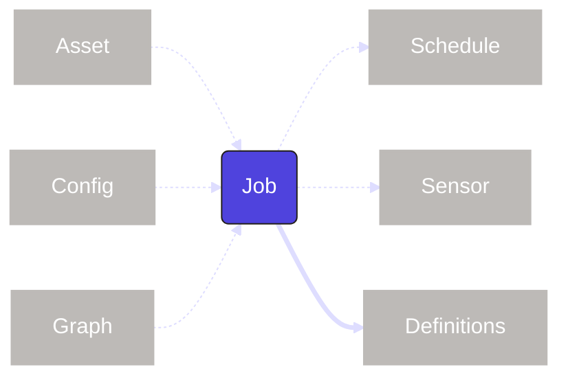

A <PyObject section="jobs" module="dagster" object="job" /> is a subset of <PyObject section="assets" module="dagster" object="asset" pluralize /> or the <PyObject section="graphs" module="dagster" object="GraphDefinition" method="to_job" /> of <PyObject section="ops" module="dagster" object="op" pluralize />. Jobs are the main form of execution in Dagster.

| Concept                     | Relationship                                                      |
| --------------------------- | ----------------------------------------------------------------- |
| [asset](#asset)             | `job` may contain a selection of `assets`                         |
| [config](#config)           | `job` may use a `config`                                          |
| [graph](#graph)             | `job` may contain a `graph`                                       |
| [schedule](#schedule)       | `job` may be used by a `schedule`                                 |
| [sensor](#sensor)           | `job` may be used by a `sensor`                                   |
| [definitions](#definitions) | `job` is added to a top-level `Definitions` object to be deployed |

## Op

An <PyObject section="ops" module="dagster" object="op" /> is a computational unit of work. Ops are arranged into a <PyObject section="graphs" module="dagster" object="GraphDefinition" method="to_job" /> to dictate their order. Ops have largely been replaced by <PyObject section="assets" module="dagster" object="asset" pluralize />.

| Concept         | Relationship                                 |
| --------------- | -------------------------------------------- |
| [type](#type)   | `op` may use a `type`                        |
| [graph](#graph) | `op` must be contained in `graph` to execute |

## Partition

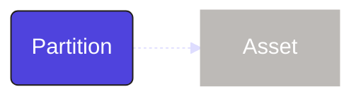

A <PyObject section="partitions" object="PartitionsDefinition" /> represents a logical slice of a dataset or computation mapped to a certain segments (such as increments of time). Partitions enable incremental processing, making workflows more efficient by only running on relevant subsets of data.

| Concept         | Relationship                          |
| --------------- | ------------------------------------- |
| [asset](#asset) | `partition` may be used by an `asset` |

## Resource

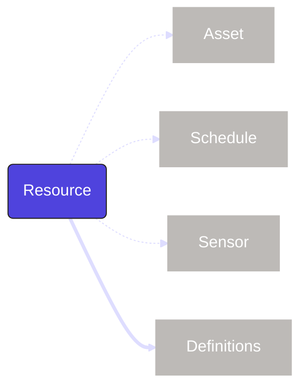

A <PyObject section="resources" module="dagster" object="ResourceDefinition"/> is a way to make external resources (like database or API connections) available to Dagster entities (like assets, schedules, or sensors) during job execution, and to clean up after execution resolves. A <PyObject section="resources" module="dagster" object="ConfigurableResource" /> is a resource that uses structured configuration. For more information, see [Configuring resources](/guides/build/external-resources/configuring-resources).

| Concept                     | Relationship                                                           |
| --------------------------- | ---------------------------------------------------------------------- |
| [asset](#asset)             | `resource` may be used by an `asset`                                   |
| [schedule](#schedule)       | `resource` may be used by a `schedule`                                 |
| [sensor](#sensor)           | `resource` may be used by a `sensor`                                   |
| [definitions](#definitions) | `resource` is added to a top-level `Definitions` object to be deployed |

## Type

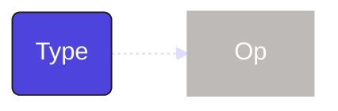

A `type` is a way to define and validate the data passed between <PyObject section="ops" module="dagster" object="op" pluralize />.

| Concept   | Relationship                  |
| --------- | ----------------------------- |
| [op](#op) | `type` may be used by an `op` |

## Schedule

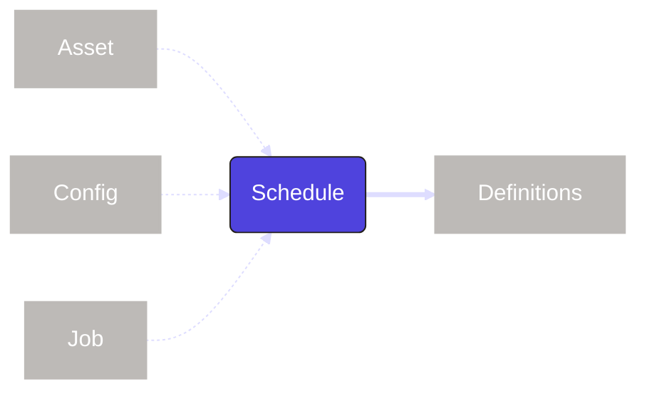

A <PyObject section="schedules-sensors" module="dagster" object="ScheduleDefinition" /> is a way to automate <PyObject section="jobs" module="dagster" object="job" pluralize /> or <PyObject section="assets" module="dagster" object="asset" pluralize /> to occur on a specified interval. In the cases that a job or asset is parameterized, the schedule can also be set with a run configuration (<PyObject section="config" module="dagster" object="RunConfig" />) to match.

| Concept                     | Relationship                                                                  |
| --------------------------- | ----------------------------------------------------------------------------- |
| [asset](#asset)             | `schedule` may include a `job` or selection of `assets`                       |
| [config](#config)           | `schedule` may include a `config` if the `job` or `assets` include a `config` |
| [job](#job)                 | `schedule` may include a `job` or selection of `assets`                       |
| [definitions](#definitions) | `schedule` is added to a top-level `Definitions` object to be deployed        |

## Sensor

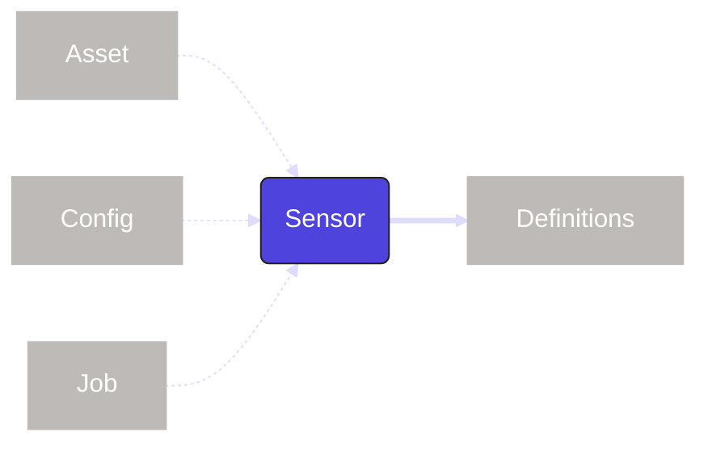

A <PyObject section="schedules-sensors" module="dagster" object="sensor" /> is a way to trigger <PyObject section="jobs" module="dagster" object="job" pluralize /> or <PyObject section="assets" module="dagster" object="asset" pluralize /> when an event occurs, such as a file being uploaded or a push notification. In the cases that a job or asset is parameterized, the sensor can also be set with a run configuration (<PyObject section="config" module="dagster" object="RunConfig" />) to match.

| Concept                     | Relationship                                                                |
| --------------------------- | --------------------------------------------------------------------------- |
| [asset](#asset)             | `sensor` may include a `job` or selection of `assets`                       |
| [config](#config)           | `sensor` may include a `config` if the `job` or `assets` include a `config` |
| [job](#job)                 | `sensor` may include a `job` or selection of `assets`                       |
| [definitions](#definitions) | `sensor` is added to a top-level `Definitions` object to be deployed        |
