Dagster provides a variety of abstractions for building and orchestrating data pipelines. These concepts enable a modular, declarative approach to data engineering, making it easier to manage dependencies, monitor execution, and ensure data quality.

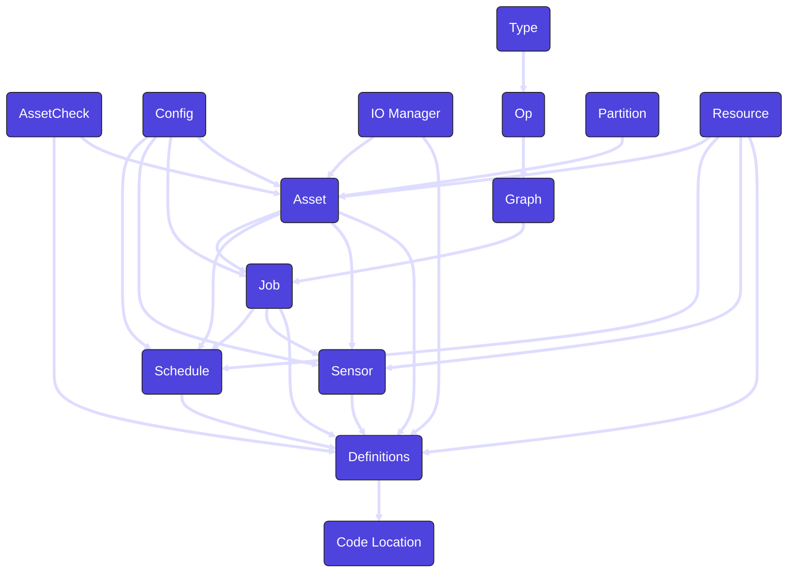

### Asset

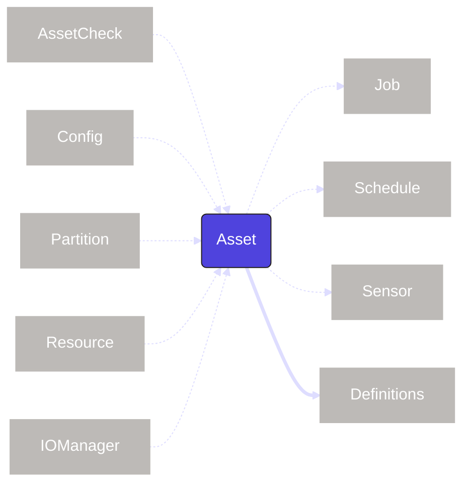

An <PyObject section="assets" module="dagster" object="asset" /> represents a logical unit of data such as a table, dataset, or machine learning model. Assets can have dependencies on other assets, forming the data lineage for your pipelines. As the core abstraction in Dagster, assets can interact with many other Dagster concepts to facilitate certain tasks.

| Concept                             | Relationship                                          |
| ----------------------------------- | ----------------------------------------------------- |
| [asset check](concepts#asset-check) | `asset` may use an `asset check`                      |
| [config](concepts#config)           | `asset` may use a `config`                            |
| [io manager](concepts#io-manager)   | `asset` may use a `io manager`                        |
| [partition](concepts#partition)     | `asset` may use a `partition`                         |
| [resource](concepts#resource)       | `asset` may use a `resource`                          |
| [job](concepts#job)                 | `asset` may be used in a `job`                        |
| [schedule](concepts#schedule)       | `asset` may be used in a `schedule`                   |
| [sensor](concepts#sensor)           | `asset` may be used in a `sensor`                     |
| [definitions](concepts#definitions) | `asset` must be set in a `definitions` to be deployed |

### Asset Check

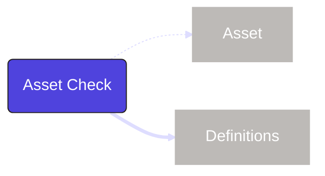

An <PyObject section="asset-checks" module="dagster" object="asset_check" /> is associated with an <PyObject section="assets" module="dagster" object="asset" /> to ensure it meets certain expectations around data quality, freshness or completeness. Asset checks run when the asset is executed and store metadata about the related run and if all the conditions of the check were met.

| Concept                             | Relationship                                                |
| ----------------------------------- | ----------------------------------------------------------- |
| [asset](concepts#asset)             | `asset check` may be used by an `asset`                     |
| [definitions](concepts#definitions) | `asset check` must be set in a `definitions` to be deployed |

### Code Location

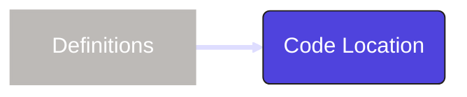

A `code location` is a collection of <PyObject section="definitions" module="dagster" object="Definitions" /> deployed in a specific environment. A code location determines the Python environment (including the version of Dagster being used as well as any other Python dependencies). A Dagster project can have multiple code locations, helping isolate dependencies.

| Concept                             | Relationship                                            |
| ----------------------------------- | ------------------------------------------------------- |
| [definitions](concepts#definitions) | `code location` must contain at least one `definitions` |

### Config

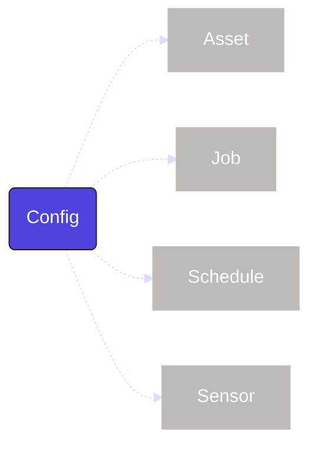

A <PyObject section="config" module="dagster" object="RunConfig" /> is a set schema applied to a Dagster object that is input at the time of execution. This allows for parameterization and the reuse of pipelines to serve multiple purposes.

| Concept                       | Relationship                         |
| ----------------------------- | ------------------------------------ |
| [asset](concepts#asset)       | `config` may be used by an `asset`   |
| [job](concepts#job)           | `config` may be used by a `job`      |
| [schedule](concepts#schedule) | `config` may be used by a `schedule` |
| [sensor](concepts#sensor)     | `config` may be used by a `sensor`   |

### Definitions

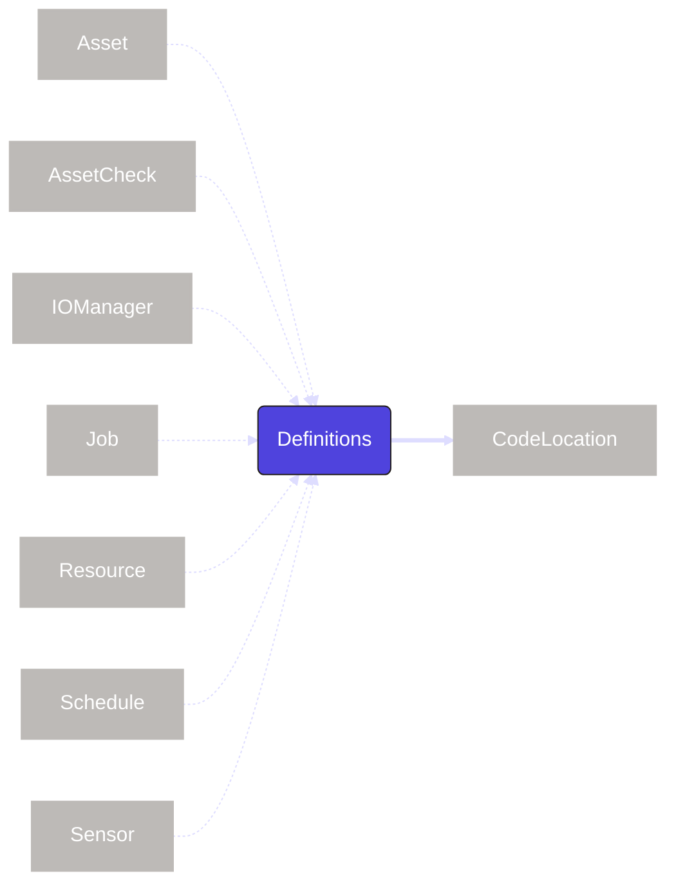

<PyObject section="definitions" module="dagster" object="Definitions" /> is a top-level construct that contains
references to all the objects of a Dagster project, such as
<PyObject section="assets" module="dagster" object="asset" pluralize />,
<PyObject section="jobs" module="dagster" object="job" pluralize /> and
<PyObject section="schedules-sensors" module="dagster" object="ScheduleDefinition" pluralize />. Only objects included
in the definitions will be deployed and visible within the Dagster UI.

| Concept                                 | Relationship                                         |
| --------------------------------------- | ---------------------------------------------------- |
| [asset](concepts#asset)                 | `definitions` may contain one or more `assets`       |
| [asset check](concepts#asset-check)     | `definitions` may contain one or more `asset checks` |
| [io manager](concepts#io-manager)       | `definitions` may contain one or more `io managers`  |
| [job](concepts#job)                     | `definitions` may contain one or more `jobs`         |
| [resource](concepts#resource)           | `definitions` may contain one or more `resources`    |
| [schedule](concepts#schedule)           | `definitions` may contain one or more `schedules`    |
| [sensor](concepts#sensor)               | `definitions` may contain one or more `sensors`      |
| [code location](concepts#code-location) | `definitions` must be deployed in a `code location`  |

### Graph

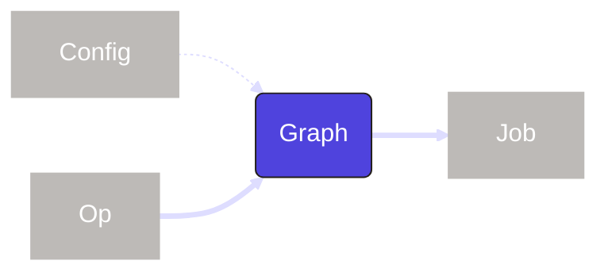

A <PyObject section="graphs" module="dagster" object="GraphDefinition" method="to_job" /> connects multiple <PyObject section="ops" module="dagster" object="op" pluralize /> together to form a DAG. If you are using <PyObject section="assets" module="dagster" object="asset" pluralize />, you will not need to use graphs directly.

| Concept                   | Relationship                             |
| ------------------------- | ---------------------------------------- |
| [config](concepts#config) | `graph` may use a `config`               |
| [op](concepts#op)         | `graph` must include one or more `ops`   |
| [job](concepts#job)       | `graph` must be part of `job` to execute |

### IO Manager

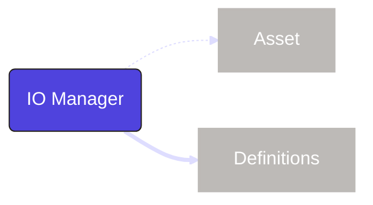

An <PyObject section="io-managers" module="dagster" object="IOManager" /> defines how data is stored and retrieved between the execution of <PyObject section="assets" module="dagster" object="asset" pluralize /> and <PyObject section="ops" module="dagster" object="op" pluralize />. This allows for a customizable storage and format at any interaction in a pipeline.

| Concept                             | Relationship                                               |
| ----------------------------------- | ---------------------------------------------------------- |
| [asset](concepts#asset)             | `io manager` may be used by an `asset`                     |
| [definitions](concepts#definitions) | `io manager` must be set in a `definitions` to be deployed |

### Job

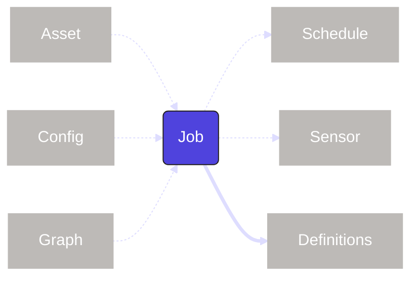

A <PyObject section="jobs" module="dagster" object="job" /> is a subset of <PyObject section="assets" module="dagster" object="asset" pluralize /> or the <PyObject section="graphs" module="dagster" object="GraphDefinition" method="to_job" /> of <PyObject section="ops" module="dagster" object="op" pluralize />. Jobs are the main form of execution in Dagster.

| Concept                             | Relationship                                        |
| ----------------------------------- | --------------------------------------------------- |
| [asset](concepts#asset)             | `job` may contain a selection of `assets`           |
| [config](concepts#config)           | `job` may use a `config`                            |
| [graph](concepts#graph)             | `job` may contain a `graph`                         |
| [schedule](concepts#schedule)       | `job` may be used by a `schedule`                   |
| [sensor](concepts#sensor)           | `job` may be used by a `sensor`                     |
| [definitions](concepts#definitions) | `job` must be set in a `definitions` to be deployed |

### Op

An <PyObject section="ops" module="dagster" object="op" /> is a computational unit of work. Ops are arranged into a <PyObject section="graphs" module="dagster" object="GraphDefinition" method="to_job" /> to dictate their order. Ops have largely been replaced by <PyObject section="assets" module="dagster" object="asset" pluralize />.

| Concept                 | Relationship                                 |
| ----------------------- | -------------------------------------------- |
| [type](concepts#type)   | `op` may use a `type`                        |
| [graph](concepts#graph) | `op` must be contained in `graph` to execute |

### Partition

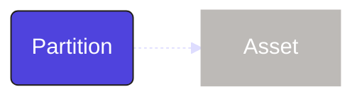

A <PyObject section="partitions" object="PartitionsDefinition" /> represents a logical slice of a dataset or computation mapped to a certain segments (such as increments of time). Partitions enable incremental processing, making workflows more efficient by only running on relevant subsets of data.

| Concept                 | Relationship                          |
| ----------------------- | ------------------------------------- |
| [asset](concepts#asset) | `partition` may be used by an `asset` |

### Resource

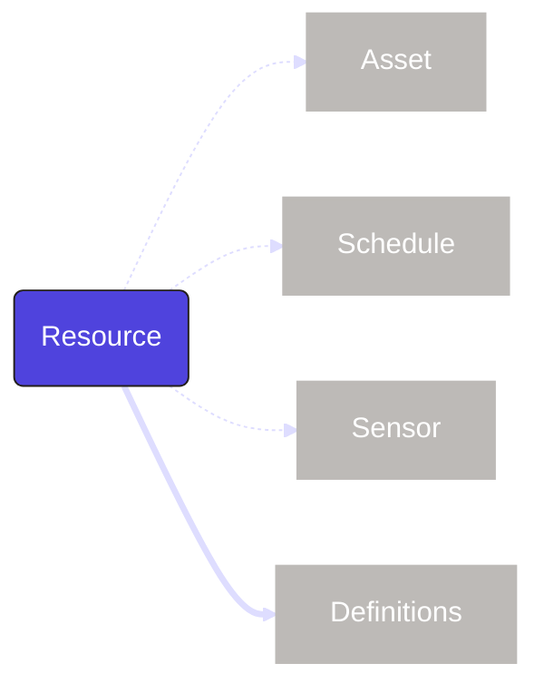

A <PyObject section="resources" module="dagster" object="ConfigurableResource"/> is a configurable external dependency. These can be databases, APIs, or anything outside of Dagster.

| Concept                             | Relationship                                             |
| ----------------------------------- | -------------------------------------------------------- |
| [asset](concepts#asset)             | `resource` may be used by an `asset`                     |
| [schedule](concepts#schedule)       | `resource` may be used by a `schedule`                   |
| [sensor](concepts#sensor)           | `resource` may be used by a `sensor`                     |
| [definitions](concepts#definitions) | `resource` must be set in a `definitions` to be deployed |

### Type

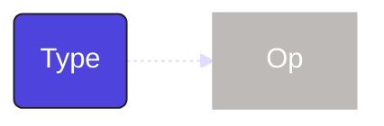

A `type` is a way to define and validate the data passed between <PyObject section="ops" module="dagster" object="op" pluralize />.

| Concept           | Relationship                  |
| ----------------- | ----------------------------- |
| [op](concepts#op) | `type` may be used by an `op` |

### Schedule

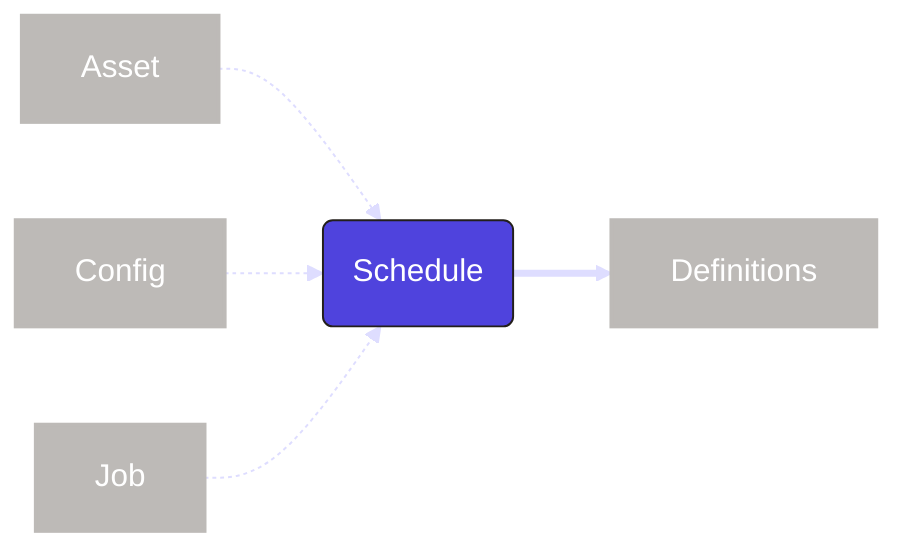

A <PyObject section="schedules-sensors" module="dagster" object="ScheduleDefinition" /> is a way to automate <PyObject section="jobs" module="dagster" object="job" pluralize /> or <PyObject section="assets" module="dagster" object="asset" pluralize /> to occur on a specified interval. In the cases that a job or asset is parameterized, the schedule can also be set with a run configuration (<PyObject section="config" module="dagster" object="RunConfig" />) to match.

| Concept                             | Relationship                                                                  |
| ----------------------------------- | ----------------------------------------------------------------------------- |
| [asset](concepts#asset)             | `schedule` may include a `job` or selection of `assets`                       |
| [config](concepts#config)           | `schedule` may include a `config` if the `job` or `assets` include a `config` |
| [job](concepts#job)                 | `schedule` may include a `job` or selection of `assets`                       |
| [definitions](concepts#definitions) | `schedule` must be set in a `definitions` to be deployed                      |

### Sensor

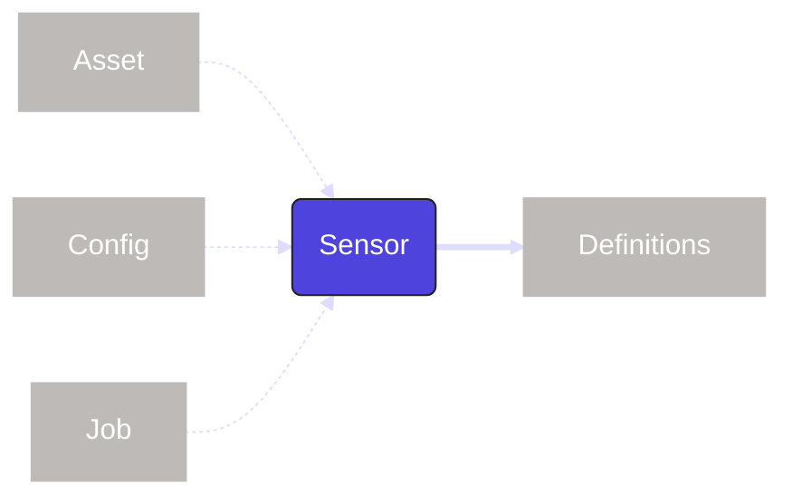

A `sensor` is a way to trigger <PyObject section="jobs" module="dagster" object="job" pluralize /> or <PyObject section="assets" module="dagster" object="asset" pluralize /> when an event occurs, such as a file being uploaded or a push notification. In the cases that a job or asset is parameterized, the sensor can also be set with a run configuration (<PyObject section="config" module="dagster" object="RunConfig" />) to match.

| Concept                             | Relationship                                                                |
| ----------------------------------- | --------------------------------------------------------------------------- |
| [asset](concepts#asset)             | `sensor` may include a `job` or selection of `assets`                       |
| [config](concepts#config)           | `sensor` may include a `config` if the `job` or `assets` include a `config` |
| [job](concepts#job)                 | `sensor` may include a `job` or selection of `assets`                       |
| [definitions](concepts#definitions) | `sensor` must be set in a `definitions` to be deployed                      |
