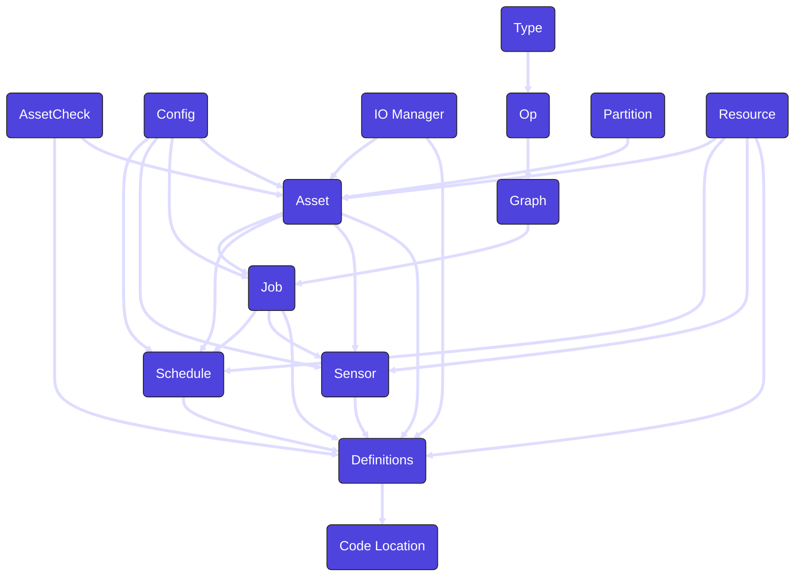

Dagster provides a variety of abstractions for building and orchestrating data pipelines. These concepts enable a modular, declarative approach to data engineering, making it easier to manage dependencies, monitor execution, and ensure data quality.

### Asset

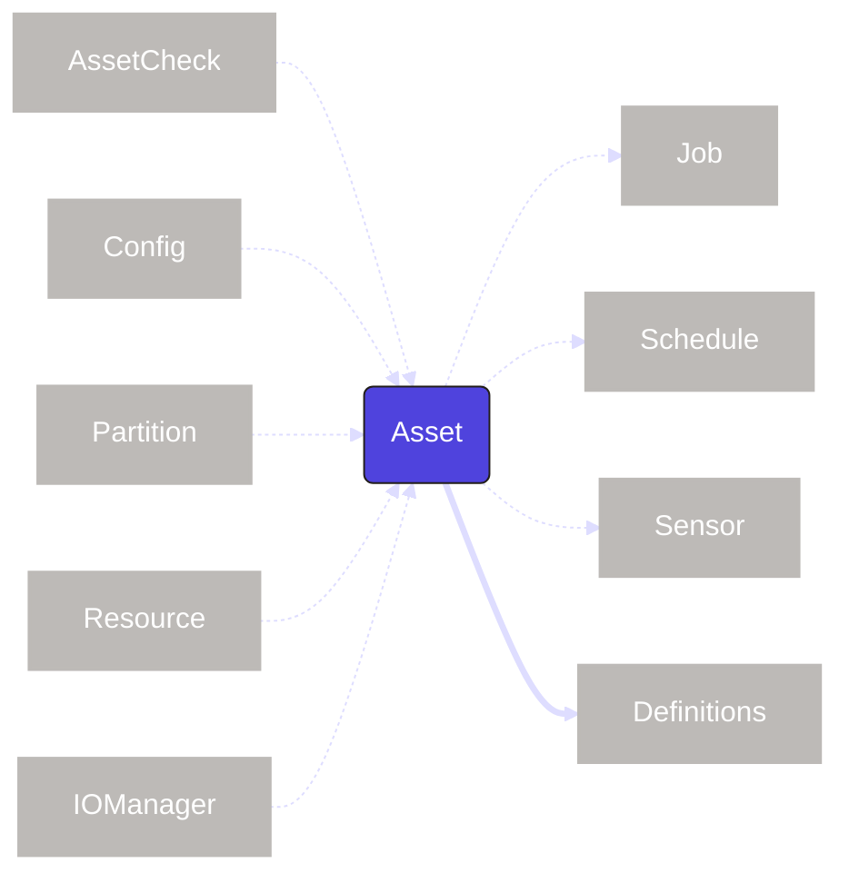

An `asset` represents a logical unit of data such as a table, dataset, or machine learning model. Assets can have dependencies on other assets, forming the data lineage for your pipelines. As the core abstraction in Dagster, assets can interact with many other Dagster concepts to facilitate certain tasks.

| Concept | Relationship | Required |
| --- | --- | --- |
| [asset check](concepts#asset-check) | `asset` may use an `asset check` | No |
| [config](concepts#config) | `asset` may use a `config` | No |
| [io manager](concepts#io-manager) | `asset` may use a `io manager` | No |
| [partition](concepts#partition) | `asset` may use a `partition` | No |
| [resource](concepts#resource) | `asset` may use a `resource` | No |
| [job](concepts#job) | `asset` may be used in a `job` | No |
| [schedule](concepts#schedule) | `asset` may be used in a `schedule` | No |
| [sensor](concepts#sensor) | `asset` may be used in a `sensor` | No |
| [definitions](concepts#definitions) | `asset` must be set in a `definitions` to be deployed | Yes |

### Asset Check

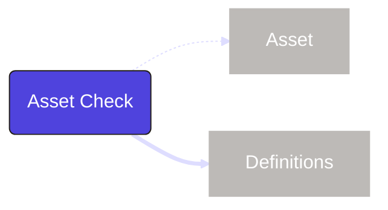

An `asset check` is associated with an `asset` to ensure it meets certain expectations around data quality, freshness or completeness. Asset checks run when the asset is executed and store metadata about the related run and if all the conditions of the check were met.

| Concept | Relationship | Required |
| --- | --- | --- |
| [asset](concepts#asset) | `asset check` may be used by an `asset` | No |
| [definitions](concepts#definitions) | `asset check` must be set in a `definitions` to be deployed | Yes |

### Code Location

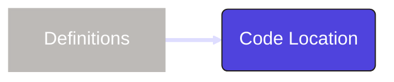

A `code location` is a collection of `definitions` deployed in a specific environment. A code location determines the Python environment (including the version of Dagster being used as well as any other Python dependencies). A Dagster project can have multiple code locations, helping isolate dependencies.

| Concept | Relationship | Required |
| --- | --- | --- |
| [definitions](concepts#definitions) | `code location` must contain at least one `definitions` | Yes |

### Config

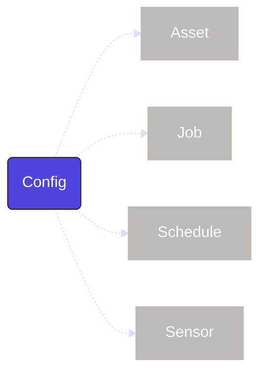

A `config` is a set schema applied to a Dagster object that is input at the time of execution. This allows for parameterization and the reuse of pipelines to serve multiple purposes.

| Concept | Relationship | Required |
| --- | --- | --- |
| [asset](concepts#asset) | `config` may be used by an `asset` | No |
| [job](concepts#job) | `config` may be used by a `job` | No |
| [schedule](concepts#schedule) | `config` may be used by a `schedule` | No |
| [sensor](concepts#sensor) | `config` may be used by a `sensor` | No |

### Definitions

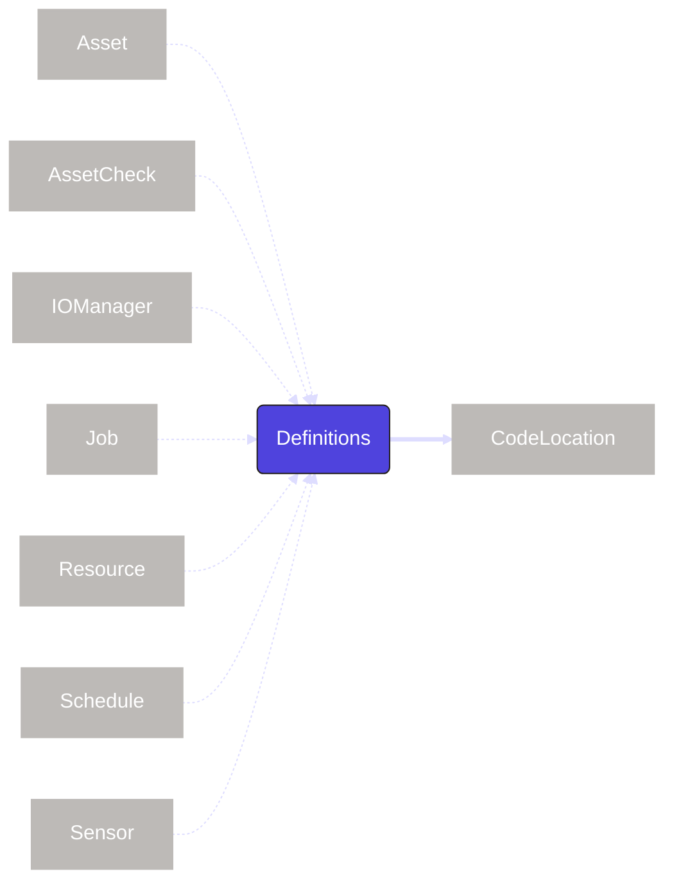

A `definitions` is a top-level construct containing all the objects of a Dagster project, such as `assets`, `jobs` and `schedules`. Only objects included in the definitions will be deployed and visible within the Dagster UI.

| Concept | Relationship | Required |
| --- | --- | --- |
| [asset](concepts#asset) | `definitions` may contain one or more `assets` | No |
| [asset check](concepts#asset-check) | `definitions` may contain one or more `asset checks` | No |
| [io manager](concepts#io-manager) | `definitions` may contain one or more `io managers` | No |
| [job](concepts#job) | `definitions` may contain one or more `jobs` | No |
| [resource](concepts#resource) | `definitions` may contain one or more `resources` | No |
| [schedule](concepts#schedule) | `definitions` may contain one or more `schedules` | No |
| [sensor](concepts#sensor) | `definitions` may contain one or more `sensors` | No |
| [code location](concepts#code-location) | `definitions` must be deployed in a `code location` | Yes |

### Graph

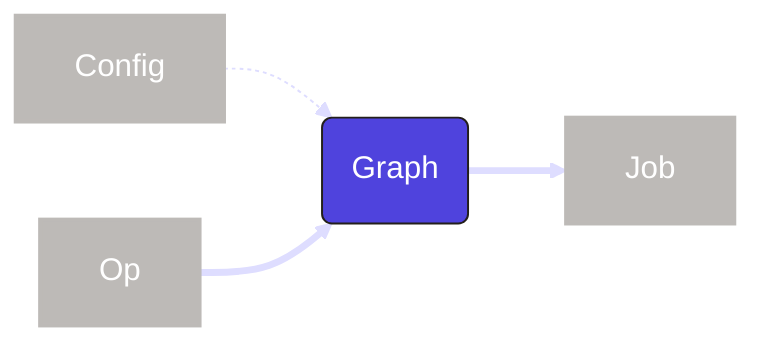

A `graph` connects multiple `ops` together to form a DAG. If you are using `assets`, you will not need to use graphs.

| Concept | Relationship | Required |
| --- | --- | --- |
| [config](concepts#config) | `graph` may use a `config` | No |
| [op](concepts#op) | `graph` must include one or more `ops` | Yes |
| [job](concepts#job) | `graph` must be part of `job` to execute | Yes |

### IO Manager

An `io manager` defines how data is stored and retrieved between the execution of `assets` and `ops`. This allows for a customizable storage and format at any interaction in a pipeline.

| Concept | Relationship | Required |
| --- | --- | --- |
| [asset](concepts#asset) | `io manager` may be used by an `asset` | No |
| [definitions](concepts#definitions) | `io manager` must be set in a `definitions` to be deployed | Yes |

### Job

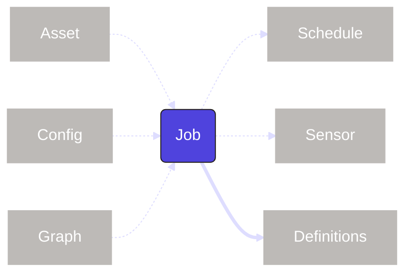

A `job` is a subset of `assets` or the `graph` of `ops`. Jobs are the main form of execution in Dagster.

| Concept | Relationship | Required |
| --- | --- | --- |
| [asset](concepts#asset) | `job` may contain a selection of `assets` | No |
| [config](concepts#config) | `job` may contain use `config` | No |
| [graph](concepts#graph) | `job` may contain a `graph` | No |
| [schedule](concepts#schedule) | `job` may be used by a `schedule` | No |
| [sensor](concepts#sensor) | `job` may be used by a `sensor` | No |
| [definitions](concepts#definitions) | `job` must be set in a `definitions` to be deployed | Yes |

### Op

An `op` is a computational unit of work. Ops are arranged into a `graph` to dictate their order. Ops have largely been replaced by `assets`.

| Concept | Relationship | Required |
| --- | --- | --- |
| [type](concepts#type) | `op` may use a `type` | No |
| [graph](concepts#type) | `op` must be contained in `graph` to execute | Yes |

### Partition

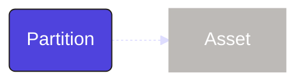

A `partition` represents a logical slice of a dataset or computation mapped to a certain segments (such as increments of time). Partitions enable incremental processing, making workflows more efficient by only running on relevant subsets of data.

| Concept | Relationship | Required |
| --- | --- | --- |
| [asset](concepts#asset) | `partition` may be used by an `asset` | No |

### Resource

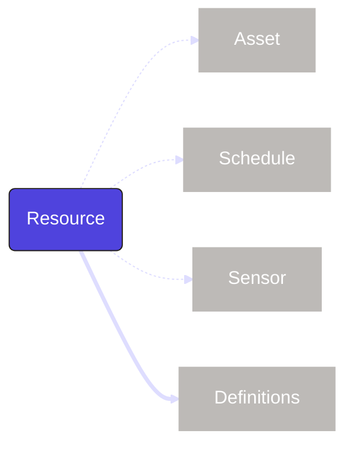

A `resource` is a configurable external dependency. These can be databases, APIs, or anything outside of Dagster.

| Concept | Relationship | Required |
| --- | --- | --- |
| [asset](concepts#asset) | `resource` may be used by an `asset` | No |
| [schedule](concepts#schedule) | `resource` may be used by an `schedule` | No |
| [sensor](concepts#sensor) | `resource` may be used by an `sensor` | No |
| [definitions](concepts#definitions) | `resource` must be set in a `definitions` to be deployed | Yes |

### Type

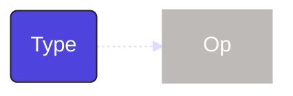

A `type` is a way to define and validate the data passed between `ops`.

| Concept | Relationship | Required |
| --- | --- | --- |
| [op](concepts#op) | `type` may be used by an `op` | No |

### Schedule

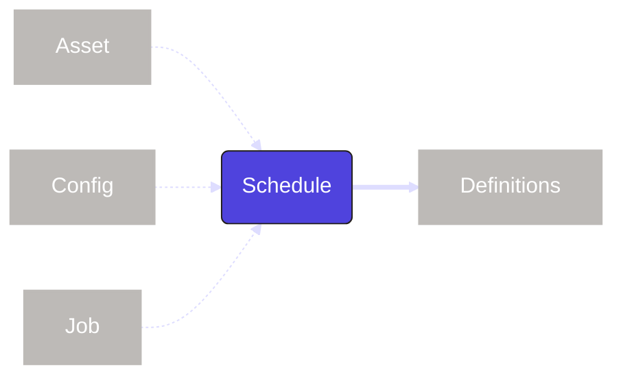

A `schedule` is a way to automate `jobs` or `assets` to occur on a specified interval. In the cases that a job or asset is parameterized, the schedule can also be set with a run configuration (`config`) to match.

| Concept | Relationship | Required |
| --- | --- | --- |
| [asset](concepts#asset) | `schedule` may include a `job` or selection of `assets` | No |
| [config](concepts#config) | `schedule` may include a `config` if the `job` or `assets` include a `config` | No |
| [job](concepts#job) | `schedule` may include a `job` or selection of `assets` | No |
| [definitions](concepts#definitions) | `schedule` must be set in a `definitions` to be deployed | Yes |

### Sensor

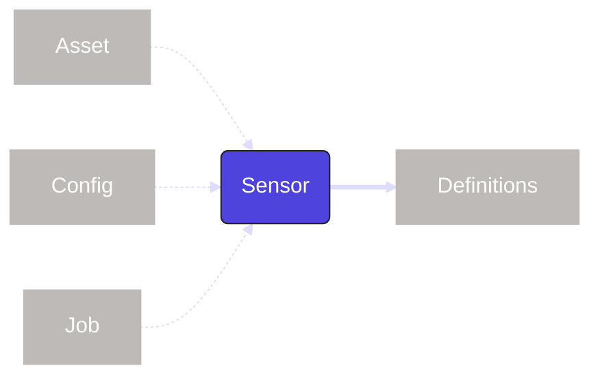

A `sensor` is a way to trigger `jobs` or `assets` when an event occurs, such as a file being uploaded or a push notification. In the cases that a job or asset is parameterized, the sensor can also be set with a run configuration (`config`) to match.

| Concept | Relationship | Required |
| --- | --- | --- |
| [asset](concepts#asset) | `sensor` may include a `job` or selection of `assets` | No |
| [config](concepts#config) | `sensor` may include a `config` if the `job` or `assets` include a `config` | No |
| [job](concepts#job) | `sensor` may include a `job` or selection of `assets` | No |
| [definitions](concepts#definitions) | `sensor` must be set in a `definitions` to be deployed | Yes |
