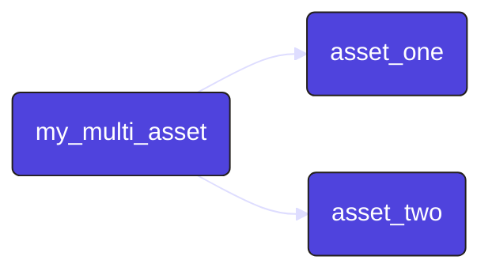
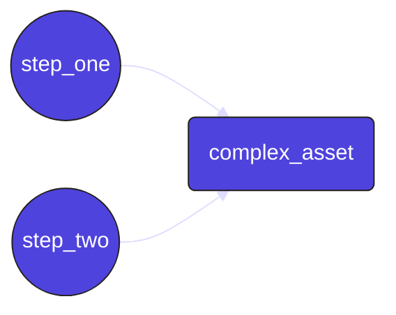

The most common way to create a data asset in Dagster is by annotating a Python function with an <PyObject section="assets" module="dagster" object="asset" decorator /> decorator. The function computes the contents of the asset, such as a database table or file.

An asset definition includes the following:

* An `AssetKey`, which is a handle for referring to the asset.
* A set of upstream asset keys, which refer to assets that the contents of the asset definition are derived from.
* A Python function, which is responsible for computing the contents of the asset from its upstream dependencies and storing the results.

<details>
  <summary>Prerequisites</summary>

To run the code in this article, you'll need to install Dagster. For more information, see the [Installation guide](/getting-started/installation).

</details>

## Asset decorators

Dagster has four types of asset decorators:

| Decorator            | Description                                                                                                                    |
| -------------------- | ------------------------------------------------------------------------------------------------------------------------------ |
| `@asset`             | Defines a single asset. [See an example](#single-asset).                                                                       |
| `@multi_asset`       | Outputs multiple assets from a single operation. [See an example](#multi-asset).                                               |
| `@graph_asset`       | Outputs a single asset from multiple operations without making each operation itself an asset. [See an example](#graph-asset). |
| `@graph_multi_asset` | Outputs multiple assets from multiple operations                                                                               |

## Defining operations that create a single asset \{#single-asset}

The simplest way to define a data asset in Dagster is by using the <PyObject section="assets" module="dagster" object="asset" decorator />  decorator. This decorator marks a Python function as an asset.

<CodeExample path="docs_snippets/docs_snippets/guides/data-assets/data-assets/asset_decorator.py" language="python" title="Using @dg.asset decorator" />

In this example, `weekly_sales_report` is an asset that logs its output. Dagster automatically tracks its dependencies and handles its execution within the pipeline.

## Defining operations that create multiple assets \{#multi-asset}

When you need to generate multiple assets from a single operation, you can use the <PyObject section="assets" module="dagster" object="multi_asset" decorator />  decorator. This allows you to output multiple assets while maintaining a single processing function, which could be useful for:

- Making a single call to an API that updates multiple tables
- Using the same in-memory object to compute multiple assets

In this example, `my_multi_asset` produces two assets: `asset_one` and `asset_two`. Each is derived from the same function, which makes it easier to handle related data transformations together:

<CodeExample path="docs_snippets/docs_snippets/guides/data-assets/data-assets/multi_asset_decorator.py" language="python" title="Using @dg.multi_asset decorator" />

This example could be expressed as:



## Defining multiple operations that create a single asset \{#graph-asset}

For cases where you need to perform multiple operations to produce a single asset, you can use the <PyObject section="assets" module="dagster" object="graph_asset" decorator /> decorator. This approach encapsulates a series of operations and exposes them as a single asset, allowing you to model complex pipelines while only exposing the final output.

<CodeExample path="docs_snippets/docs_snippets/guides/data-assets/data-assets/graph_asset_decorator.py" language="python" title="Using @dg.graph_asset decorator" />

In this example, `complex_asset` is an asset that's the result of two operations: `step_one` and `step_two`. These steps are combined into a single asset, abstracting away the intermediate representations.

This example could be expressed as:



## Asset context

When defining an asset, you can optionally provide a first parameter, `context`. When this parameter is supplied, Dagster will supply an <PyObject section="execution" module="dagster" object="AssetExecutionContext" /> object to the body of the asset which provides access to system information like loggers and the current run ID.

For example, to access the logger and log an info message:

```python
from dagster import AssetExecutionContext, asset


@asset
def context_asset(context: AssetExecutionContext):
    context.log.info(f"My run ID is {context.run.run_id}")
    ...

```

## Asset code versions

Assets may be assigned a `code_version`. Versions let you help Dagster track what assets haven't been re-materialized since their code has changed, and avoid performing redundant computation.

```python

@asset(code_version="1")
def asset_with_version():
    with open("data/asset_with_version.json", "w") as f:
        json.dump(100, f)

```

When an asset with a code version is materialized, the generated `AssetMaterialization` is tagged with the version. The UI will indicate when an asset has a different code version than the code version used for its most recent materialization.

## Assets with multi-part keys

Assets are often objects in systems with hierarchical namespaces, like filesystems. Because of this, it often makes sense for an asset key to be a list of strings, instead of just a single string. To define an asset with a multi-part asset key, use the `key_prefix` argument with a list of strings. The full asset key is formed by prepending the `key_prefix` to the asset name (which defaults to the name of the decorated function).

<CodeExample path="docs_snippets/docs_snippets/concepts/assets/multi_component_asset_key.py" startAfter="start_marker" endBefore="end_marker" />

## Next steps

- Enrich Dagster's built-in data catalog with [asset metadata](/guides/build/assets/metadata-and-tags/)
- Learn to [pass data between assets](/guides/build/assets/passing-data-between-assets)
- Learn to use a [factory pattern](/guides/build/assets/creating-asset-factories) to create multiple, similar assets
