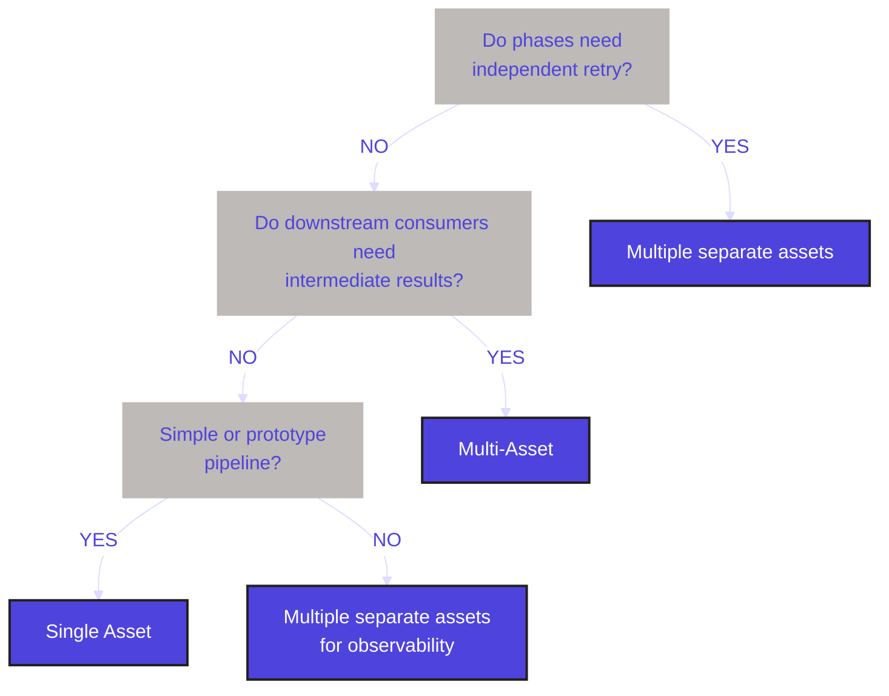

When modeling an ETL pipeline (or any multi-step process) in Dagster, you can represent it at different levels of granularity. There are three common approaches:

- [Combining all phases into a single asset](#single-asset)
- [Splitting each phase into its own asset](#separate-assets) with explicit dependencies
- [Producing multiple assets from a single operation](#multi-asset) with the <PyObject section="assets" module="dagster" object="multi_asset" decorator /> decorator

## Combining all phases into a single asset {#single-asset}

The simplest approach is to combine all phases—extract, load, and transform—into one asset. A single materialization runs one function that performs all phases. This works well for simple pipelines and quick prototypes, or when you don't need to retry individual phases or see each step in the UI. In the example below, `customer_etl_single` runs extract, load, and transform in one function.

<CodeExample
  path="docs_snippets/docs_snippets/guides/data-assets/asset-granularity/single_asset_etl.py"
  language="python"
  startAfter="start_single_asset"
  endBefore="end_single_asset"
  title="src/<project_name>/assets.py"
/>

| Benefits | Downsides |
|----------|-----------|
|<ul><li>Simple to understand and reason about</li><li>One materialization = one execution</li><li>Minimal orchestration overhead</li><li>Good for operations that always run together</li></ul> | <ul><li>No visibility into individual phases in the UI</li><li>Cannot independently retry extract vs. transform</li><li>Cannot selectively run only one step</li><li>If extract succeeds but transform fails, you must re-run the entire pipeline</li></ul> |

## Splitting each phase into its own asset {#separate-assets}

When you need visibility into each phase, the ability to retry steps independently, or have downstream assets that depend on intermediate results, you can split extract, load, and transform into separate assets. Each phase becomes its own asset; downstream assets depend on upstream ones through function parameters or `deps`. Data between phases typically flows through an [I/O manager](/guides/build/io-managers/defining-a-custom-io-manager) or [external storage](/guides/build/external-resources).

In the example below, `orders_extract`, `orders_load`, and `orders_transform` are three assets. Dagster infers the dependency chain from the function parameters: `orders_load` receives the output of `orders_extract`, and `orders_transform` receives the output of `orders_load`. Each phase appears in the asset graph and can be materialized or retried on its own.

<CodeExample
  path="docs_snippets/docs_snippets/guides/data-assets/asset-granularity/three_asset_etl.py"
  language="python"
  startAfter="start_three_assets"
  endBefore="end_three_assets"
  title="src/<project_name>/assets.py"
/>

| Benefits | Downsides |
|----------|-----------|
|<ul><li>Full visibility into each phase in the UI</li><li>Can independently retry failed phases</li><li>Can selectively run only certain phases (e.g., just transform)</li><li>Intermediate results are visible in the Dagster UI</li><li>Better for debugging and monitoring</li><li>Can set different retry policies per phase</li></ul> | <ul><li>More assets to manage</li><li>Explicit dependency management</li><li>Data between phases typically goes through storage (I/O manager or external storage), which may add I/O overhead</li><li>More complex job and dependency definitions</li></ul> |

## Producing multiple assets from a single operation {#multi-asset}

When operations are tightly coupled, but you still want separate assets for downstream consumers—and you want to pass data between phases in memory without writing to storage in between—use the <PyObject section="assets" module="dagster" object="multi_asset" decorator /> decorator. A single function produces multiple assets in one run; all outputs are produced atomically (all succeed or all fail).

In the example below, `inventory_etl_multi_asset` returns three values that become the assets `inventory_raw`, `inventory_staged`, and `inventory_final`. Data flows from extract to load to transform in memory, so there is no intermediate I/O. Downstream assets can depend on any of the three outputs. With `can_subset=False`, all three are always materialized together.

<CodeExample
  path="docs_snippets/docs_snippets/guides/data-assets/asset-granularity/multi_asset_etl.py"
  language="python"
  startAfter="start_multi_asset"
  endBefore="end_multi_asset"
  title="src/<project_name>/assets.py"
/>

| Benefits | Downsides |
|----------|-----------|
|<ul><li>Atomic execution: all outputs succeed or all fail</li><li>Separate assets for downstream consumers to depend on</li><li>Can pass data between outputs in memory, without intermediate I/O</li><li>Lower I/O overhead than multiple separate assets</li><li>All assets visible separately in the Dagster UI</li><li>Best balance of simplicity and observability when you need both atomic execution and separate assets for consumers</li></ul> | <ul><li>Cannot independently retry individual outputs</li><li>All outputs must succeed or all fail</li><li>Slightly more complex than a single asset</li><li>Cannot selectively materialize just one output (unless you use subsetting; see [Graph-backed assets](/guides/build/assets/graph-backed-assets))</li></ul> |

## Comparing the approaches

| Approach | Assets created | Execution model | Independent retry | Selective execution | UI visibility | I/O between phases | Downstream dependencies | Complexity | Best for |
|----------|----------------|-----------------|-------------------|---------------------|---------------|--------------------|-------------------------|------------|----------|
| **Single asset** | One | Single function | No | No | One asset | In-memory | One target | Low | Prototypes |
| **Multiple separate assets** | One per phase | Multiple functions with deps | Yes | Yes | Multiple assets with lineage | External storage | Multiple targets | Medium | Production, debugging |
| **Multi-asset** | Multiple | Single function, multiple outputs | No | No (unless subsettable) | Multiple assets (one operation) | In-memory | Multiple targets | Medium | Coupled ops, many consumers |

:::tip

Whichever approach you use, you can [schedule materializations](/guides/automate/schedules) or run assets on demand with [declarative automation](/guides/automate/declarative-automation). To target which assets run in a job or schedule, you can use [asset selection](/guides/build/assets/asset-selection-syntax). For example, you can target assets by [group](/guides/build/assets/metadata-and-tags/adding-attributes-to-assets).

:::

You can use the following flowchart to decide which approach fits your pipeline:

## Next steps

- [Defining assets](/guides/build/assets/defining-assets) — decorators and basic patterns
- [Passing data between assets](/guides/build/assets/passing-data-between-assets) — I/O managers and explicit storage
- [Graph-backed assets](/guides/build/assets/graph-backed-assets) — multiple ops behind a single or multi-asset
- [Asset selection syntax](/guides/build/assets/asset-selection-syntax) — select assets by group, key, and more for jobs and schedules
