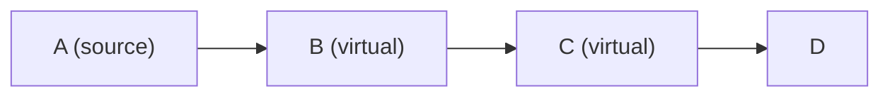
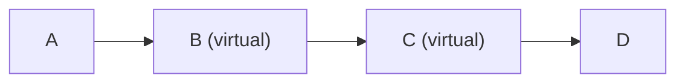

import Preview from '@site/docs/partials/\_Preview.md';

<Preview />

import ScaffoldAsset from '@site/docs/partials/\_ScaffoldAsset.md';

<ScaffoldAsset />

Some assets in a pipeline represent lightweight transformations that don't persist their own data independently. The most common example is a **database view**, which defines a query over other tables but doesn't store its own copy of the data. Other examples include non-materialized dbt models, temporary staging tables, or any derived asset whose contents are always computed on the fly from upstream data.

These assets exist in the lineage graph but shouldn't be treated as independent materialization targets. **Virtual assets** let you model these by marking them with `is_virtual=True`, which changes how Dagster handles staleness, execution ordering, and automation for them. While database views are the most typical use case, virtual assets are a general-purpose mechanism that can represent any asset whose data is derived transparently from its upstream dependencies.

## Defining virtual assets

You can mark an asset as virtual using the `is_virtual` parameter on the <PyObject section="assets" module="dagster" object="asset" decorator /> decorator or on <PyObject section="assets" module="dagster" object="AssetSpec" />.

In the following example, the `@asset` decorator is used to define a virtual asset:

<CodeExample
  path="docs_snippets/docs_snippets/concepts/assets/virtual_assets.py"
  startAfter="start_decorator"
  endBefore="end_decorator"
  title="src/<project_name>/defs/assets.py"
/>

Alternatively, `AssetSpec` can be used to define a virtual asset:

<CodeExample
  path="docs_snippets/docs_snippets/concepts/assets/virtual_assets.py"
  startAfter="start_spec"
  title="src/<project_name>/defs/assets.py"
/>

## How virtual assets affect staleness

Staleness status in the **Dagster UI** is calculated _through_ virtual assets rather than _at_ them. This means:

- **Virtual assets are not marked as stale** just because an upstream asset has been updated. Because a virtual asset like a database view always reflects the current state of its upstream data, there is nothing to refresh.
- **Downstream non-virtual assets can be marked as stale** if a non-virtual ancestor behind one or more virtual assets has been updated. Dagster traces through the virtual assets to find the nearest non-virtual ancestors and uses those to determine staleness.

For example, given the following graph:

If asset `A` is materialized with new data, assets `B` and `C` will not be marked as stale. However, asset `D` will be marked as stale because its non-virtual ancestor `A` has been updated since `D` was last materialized.

## How virtual assets affect execution

When virtual assets are excluded from an execution (for example, because a database view doesn't need to be independently materialized), Dagster creates execution dependencies through them. If non-virtual assets on either side of a chain of virtual assets are both selected for execution, Dagster ensures the upstream asset completes before the downstream asset begins.

For example, given the following graph:

If you execute assets `A` and `D` together without selecting `B` or `C`, Dagster will ensure that `A` completes before `D` begins, because `D` transitively depends on `A` through the virtual assets.

## Virtual assets and Declarative Automation

When using Declarative Automation, dependency-based automation conditions like `any_deps_match()` and `all_deps_match()` evaluate against direct parent assets by default. If a direct parent is a virtual asset, the condition evaluates against that virtual asset rather than looking through it. For more information, see [Declarative Automation](/guides/automate/declarative-automation).

To make automation conditions look through virtual assets to their non-virtual ancestors, use the `.resolve_through_virtual()` modifier. For more information, see:

- [Customizing on_cron: resolving dependencies through virtual assets](/guides/automate/declarative-automation/customizing-automation-conditions/customizing-on-cron-condition#resolving-dependencies-through-virtual-assets-views)
- [Customizing eager: resolving dependencies through virtual assets](/guides/automate/declarative-automation/customizing-automation-conditions/customizing-eager-condition#resolving-dependencies-through-virtual-assets-views)
