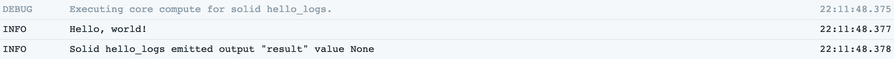
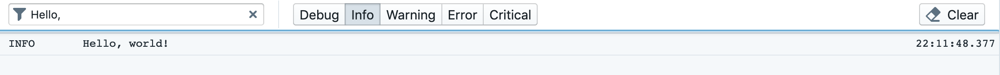
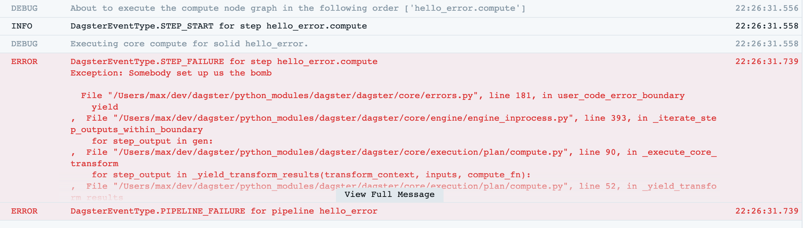

# Logging Guide

- [The log guide](#The-log-guide)
  - [Logging from a solid](#Logging-from-a-solid)
  - [The built-in loggers](#The-built-in-loggers)
  - [Debugging with logs](#Debugging-with-logs)
  - [Configuring the built-in loggers](#Configuring-the-built-in-loggers)
  - [Modes and logging](#Modes-and-logging)
  - [Implementing custom loggers](#Implementing-custom-loggers)

## Logging from a solid

Dagster includes a rich and extensible logging system. Any solid can emit log messages at any point
in its computation:

```python
from dagster import solid

@solid
def hello_logs(context):
    context.log.info('Hello, world!')
```

The `context` object passed to every solid execution includes a built-in log manager, `context.log`,
which exposes the usual `debug`, `info`, `warning`, `error`, and `critical` methods you would expect
anywhere else in Python.

## The built-in loggers

When you run Dagster pipelines in Dagit, you'll have noticed that log messages are visible as
colored messages in the console:

<pre>
<span style="color: green">2019-05-31 15:11:48</span> - <span style="color:blue">dagster</span> - <span style="color:grey">INFO</span> -
        orig_message = "Hello, world!"
      log_message_id = "49854579-e4d1-4289-8453-b3e177b20056"
       log_timestamp = "2019-05-31T22:11:48.376372"
              run_id = "4542c167-1b8c-40c7-b9b6-434b882ba734"
            pipeline = "hello_logs_pipeline"
            step_key = "hello_logs.compute"
               solid = "hello_logs"
    solid_definition = "hello_logs"
</pre>

Logs also stream back to the Dagit frontend in real time:



Dagit exposes a powerful facility for filtering log messages based on free-text search and log
level:



## Debugging with logs

What happens if we introduce an error into our solid logic?

```
from dagster import solid

@solid
def hello_logs(context):
    raise Exception('Somebody set up us the bomb')
```

Errors in user code are caught by the Dagster machinery to ensure pipelines gracefully halt or
continue to execute, but messages including the original tracebacks get logged both to the console
and back to Dagit.

<pre>
<span style="color:green">2019-05-31 15:26:31</span> - <span style="color:blue">dagster</span> - <span style="color:grey">ERROR</span> -
<span style="color:red">        orig_message = "Execution of step \"hello_error.compute\" failed."
      log_message_id = "7eb6836b-f91e-4cdc-a82b-906dbf2fd0a5"
       log_timestamp = "2019-09-04T03:15:48.695104"
              run_id = "9f38a6dc-fab7-408d-8692-5126c89b4fc0"
            pipeline = "hello_error_pipeline"
execution_epoch_time = 1567566948.6136389
            step_key = "hello_error.compute"
               solid = "hello_error"
    solid_definition = "hello_error"
       dagster_event = {"event_specific_data": [["Exception: Somebody set up us the bomb\n", ["  File \"/Users/sashankthupukari/projects/dagster/python_modules/dagster/dagster/core/errors.py\", line 104, in user_code_error_boundary\n    yield\n", "  File \"/Users/sashankthupukari/projects/dagster/python_modules/dagster/dagster/core/engine/engine_inprocess.py\", line 571, in _user_event_sequence_for_step_compute_fn\n    for event in gen:\n", "  File \"/Users/sashankthupukari/projects/dagster/python_modules/dagster/dagster/core/execution/plan/compute.py\", line 75, in _execute_core_compute\n    for step_output in _yield_compute_results(compute_context, inputs, compute_fn):\n", "  File \"/Users/sashankthupukari/projects/dagster/python_modules/dagster/dagster/core/execution/plan/compute.py\", line 52, in _yield_compute_results\n    for event in user_event_sequence:\n", "  File \"/Users/sashankthupukari/projects/dagster/python_modules/dagster/dagster/core/definitions/decorators.py\", line 340, in compute\n    result = fn(context, **kwargs)\n", "  File \"/Users/sashankthupukari/projects/dagster-playground/hello_dag.py\", line 6, in hello_error\n    raise Exception('Somebody set up us the bomb')\n"], "Exception"], null], "event_type_value": "STEP_FAILURE", "logging_tags": {"execution_epoch_time": 1567566948.6136389, "pipeline": "hello_error_pipeline", "solid": "hello_error", "solid_definition": "hello_error", "step_key": "hello_error.compute"}, "message": "Execution of step \"hello_error.compute\" failed.", "pipeline_name": "hello_error_pipeline", "solid_handle": ["hello_error", "hello_error", null], "step_key": "hello_error.compute", "step_kind_value": "COMPUTE"}
       pipeline_name = "hello_error_pipeline"
</span>
</pre>

Messages at level `ERROR` or above are highlighted both in Dagit and in the console logs, so
we can easily pick them out of logs even without filtering.



In many cases, especially for local development, this log viewer, coupled with solid reexecution,
is sufficient to enable a fast debug cycle for data pipelines.

## Configuring the built-in loggers

Suppose that we've gotten the kinks out of our pipelines developing locally, and now we want to run
in production—without all of the log spew from `DEBUG` messages that was helpful during development.

Just like solids, loggers can be configured when you run a pipeline. For example, to filter all
messages below `ERROR` out of the colored console logger, add the following snippet to your config
YAML:

```yaml
loggers:
  console:
    config:
      log_level: ERROR
```

## Modes and logging

Logging is environment-specific: you don't want messages generated by data scientists' local
development loops to be aggregated with production messages; on the other hand, you may find that
in production console logging is irrelevant or even counterproductive.

Dagster recognizes this by attaching loggers to modes so that you can seamlessly switch from, e.g.,
Cloudwatch logging in production to console logging in development and test, without changing any
of your code.

```python
from dagster import pipeline
from dagster.loggers import colored_console_logger
from dagster_aws.loggers import cloudwatch_logger

@pipeline(
    mode_defs=[
        ModeDefinition(name='local', logger_defs={'console': colored_console_logger}),
        ModeDefinition(name='prod', logger_defs={'cloudwatch': cloudwatch_logger})
    ]
)
def hello_modes():
    hello_logs()
```

From Dagit, you can switch your pipeline mode to 'prod' and edit config in order to use the new Cloudwatch logger, e.g.:

```yaml
loggers:
  cloudwatch:
    config:
      log_level: ERROR
      log_group_name: /my/cool/cloudwatch/log/group
      log_stream_name: very_good_log_stream
```

## Implementing custom loggers

You may find yourself wanting to add or supplement the built-in loggers so that Dagster logs
are integrated with the rest of your log aggregation and monitoring infrastructure.

For example, you may be operating in a containerized environment where container stdout is
aggregated by a tool such as Logstash. In this kind of environment, where logs will be aggregated
and parsed by machine, the multi-line output from the default colored console logger is unhelpful.
Instead, we'd much prefer to see single-line, structured log messages like:

```
{"orig_message": "Hello, world!", "log_message_id": "49854579-e4d1-4289-8453-b3e177b20056", ...}
```

In fact, a logger that prints JSON-formatted single-line messages like this to the console is
already included as `dagster.loggers.json_console_logger`. But let's look at how we might
implement a simplified version of this logger.

Loggers are defined internally using the `LoggerDefinition` class, but, following a common pattern
in the Dagster codebase, the `@logger` decorator exposes a simpler API for the common use case and
is typically what you'll use to define your own loggers. The decorated function should take a single
argument, the `init_context` available during logger initialization, and return a `logging.Logger`.

```python
import json
import logging

@logger(
    {
        'log_level': Field(str, is_required=False, default_value='INFO'),
        'name': Field(str, is_required=False, default_value='dagster'),
    },
    description='A JSON-formatted console logger',
)
def json_console_logger(init_context):
    level = init_context.logger_config['log_level']
    name = init_context.logger_config['name']

    klass = logging.getLoggerClass()
    logger_ = klass(name, level=level)

    handler = logging.StreamHandler()

    class JsonFormatter(logging.Formatter):
        def format(self, record):
            return json.dumps(record.__dict__)

    handler.setFormatter(JsonFormatter())
    logger_.addHandler(handler)

    return logger_
```

As you can see, this decorator takes a `config_field` argument, representing the config that users
can pass to the logger, e.g.:

```yaml
loggers:
  json_console:
    config:
      log_level: INFO
```

Note that it's also possible to emit log messages during the initialization of a logger, by calling,
e.g., `init_context.log.info`.
