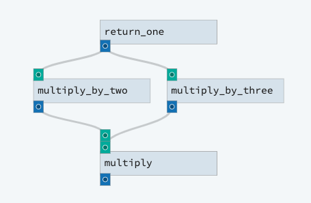

An actual DAG
-------------

Next we will build a slightly more topologically complex DAG that demonstrates how dagster
determines the execution order of solids in a pipeline:

.. literalinclude:: ../../../../examples/dagster_examples/intro_tutorial/actual_dag.py
   :lines: 1-28
   :caption: actual_dag.py

Again, it is worth noting how we are connecting *inputs* and *outputs* rather than just *tasks*.
``multiply`` associates its dependencies with specific inputs in the pipeline definition

When you execute this example, you'll see that ``return_one`` executes first, followed by
``multiply_by_two`` and ``multiply_by_three`` -- in any order -- and ``multiply`` executes last,
after ``multiply_by_two`` and ``multiply_by_three`` have both executed.

In more sophisticated execution environments, ``multiply_by_two`` and ``multiply_by_three`` could
execute not just in any order, but at the same time, since their inputs don't depend on each other's
outputs -- but both would still have to execute after ``return_one`` (because they depend on its
output to satisfy their inputs) and before ``multiply`` (because their outputs in turn are
depended on by the input of ``multiply``).

Try it in dagit or from the command line:

.. code-block:: console

   $ dagster pipeline execute -f actual_dag.py -n actual_dag_pipeline

What's the output of this DAG?

We've seen how to wire solids together into DAGs. Now let's look more deeply at their
:doc:`Inputs <inputs>`, and start to explore how solids can interact with their external
environment.
