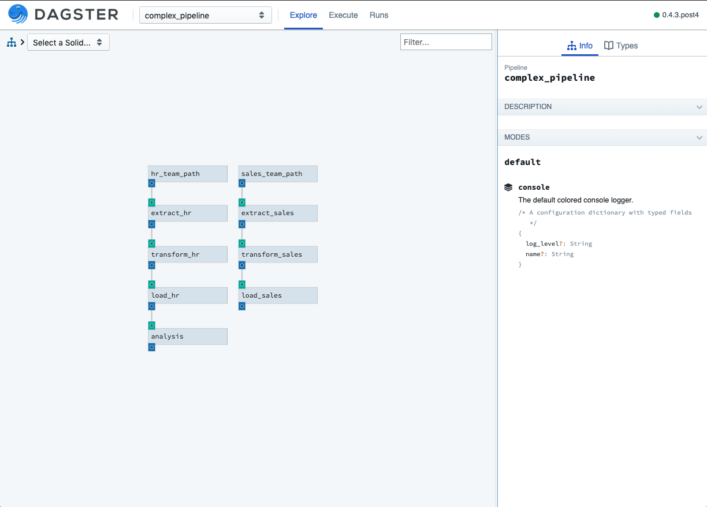
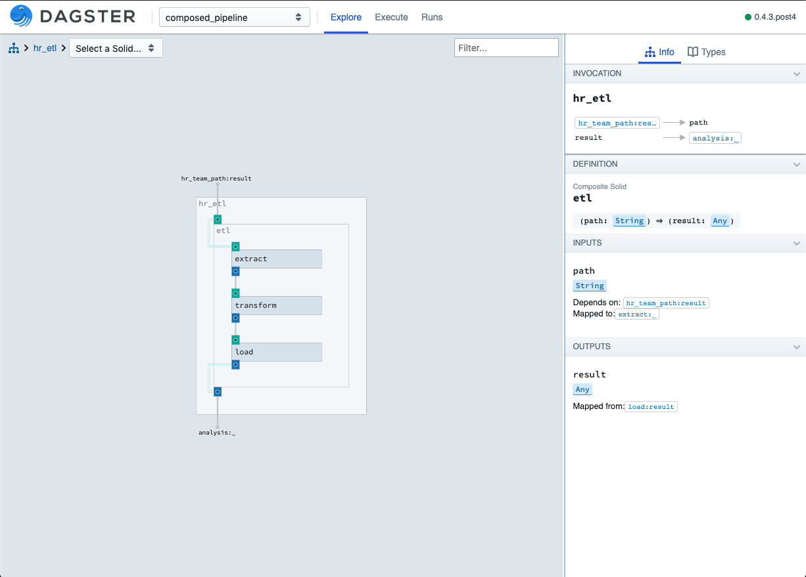
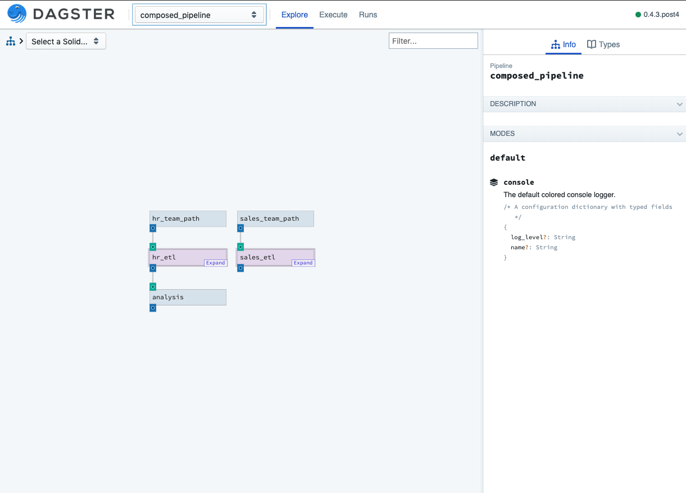

Composing Solids
----------------

To help manage the level of complexity that data applications tend to reach,
dagster provides a unit of abstraction for composing a solid from other solids. We call this type
of solid a **Composite Solid**.

This ability to compose solids can be used to:
    - organize large or complicated graphs
    - abstract away complexity
    - wrap re-usable solids with domain specific information

Refactoring a DAG of solids using composites is a very familiar experience to refactoring code
with functions.

Defining a composite solid is similar to defining a pipeline, but can also provide mapping
information to control how data and configuration flows in and out of its inner graph of solids.

For examples, lets take this pipeline that performs the same work over two different sources:

.. literalinclude:: ../../../../examples/dagster_examples/intro_tutorial/composition.py
   :linenos:
   :lines: 83-93
   :caption: composition.py

While this is a contrived example, it's clear how given the ability to refactor we could
remove the redundancy.

We can define a composite solid to perform the redundant work and then invoke it for each of our two
inputs.

.. literalinclude:: ../../../../examples/dagster_examples/intro_tutorial/composition.py
   :linenos:
   :lines: 95-101
   :caption: composition.py

A composite solid presents an interface of inputs and outputs like any other solid. To do this you may optionally
map inputs and outputs from its constituent solids. In the example above, we map the input to the ``extract``
soild and then return the output of the ``load`` solid allowing us to pass it to ``analysis``.

.. literalinclude:: ../../../../examples/dagster_examples/intro_tutorial/composition.py
   :linenos:
   :lines: 104-108
   :caption: composition.py

