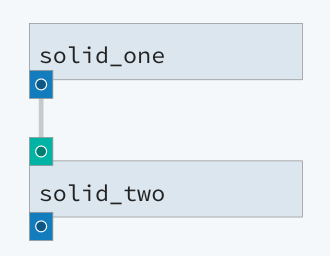

Hello, DAG
----------
One of the core capabilities of dagster is the ability to express data pipelines as arbitrary
directed acyclic graphs (DAGs) of solids.

We'll define a very simple two-solid pipeline whose first solid returns a hardcoded string,
and whose second solid concatenates two copies of its input. The output of the pipeline should be
two concatenated copies of the hardcoded string.

.. literalinclude:: ../../../../examples/dagster_examples/intro_tutorial/hello_dag.py
   :caption: hello_dag.py

This pipeline introduces a few new concepts.

1.  Solids can have **inputs**. Inputs let us connect solids to each other by specifying solids'
    dependencies on each other. As we'll see later, we can optionally also have dagster check the
    types of the inputs at runtime.

    In this case, the system has introspected the function signature of `solid_two` to create an
    instance of :py:class:`InputDefinition <dagster.InputDefinition>`. You are free to construct
    these explicitly.

2.  Solids' **dependencies** are expressed in the body of the pipeline function. You use traditional
    function calls to construct a representation of the dependency graph. These functions are
    invoked at pipeline construction time and do *not* actually execute the body of the solid.
    You can learn more about these in the
    :doc:`composition functions section <composition_functions>`.

    .. literalinclude::  ../../../../examples/dagster_examples/intro_tutorial/hello_dag.py
       :lines: 14-16

    The above pipeline constructs a two solid pipeline with solid_two depending on solid_one.

Let's visualize the DAG we've just defined in dagit.

.. code-block:: console

   $ dagit -f hello_dag.py -n hello_dag_pipeline

Navigate to http://127.0.0.1:3000/hello_dag_pipeline/explore or choose the hello_dag_pipeline
from the dropdown:

One of the distinguishing features of dagster that separates it from many workflow engines is that
dependencies connect *inputs* and *outputs* rather than just *tasks*. An author of a dagster
pipeline defines the flow of execution by defining the flow of *data* within that
execution. This is core to the programming model of dagster, where each step in the pipeline
-- the solid -- is a *functional* unit of computation.

Now run the pipeline we've just defined, either from dagit or from the command line:

.. code-block:: console

    $ dagster pipeline execute -f hello_dag.py -n hello_dag_pipeline

In the next section, :doc:`An actual DAG <actual_dag>`, we'll build our first DAG with interesting
topology and see how dagster determines the execution order of a pipeline.
