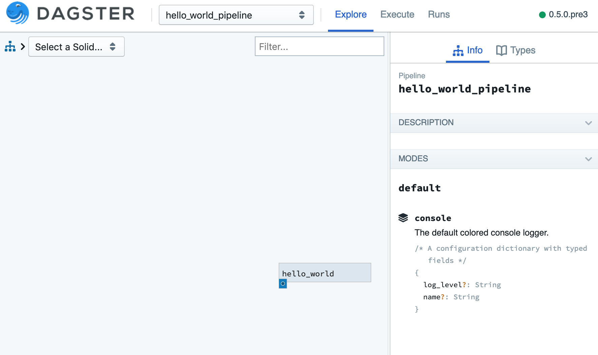
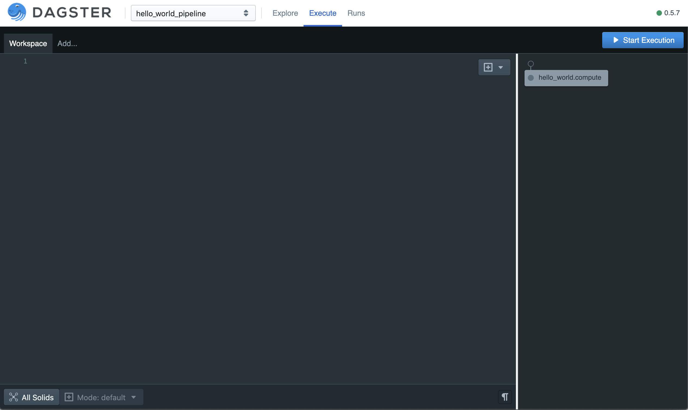

Hello, World
------------
See :doc:`../../install/install` for instructions installing dagster (the core library) and dagit (the
web UI tool used to visualize your data pipelines) on your platform of choice.

Let's write our first pipeline and save it as ``hello_world.py``. (You can find this, and all of the
tutorial code, at ``dagster/examples/dagster_examples/intro_tutorial``.)

.. literalinclude:: ../../../../examples/dagster_examples/intro_tutorial/hello_world.py
   :linenos:
   :lines: 1-13
   :caption: hello_world.py

This example introduces the core **solid** and **pipeline** concepts:

1.  A **solid** is a functional unit of computation in a data pipeline. In this example, we use the
    decorator :py:func:`@solid <dagster.solid>` to mark the function ``hello_world``
    as a solid: a functional unit which takes no inputs and returns the output ``'hello'`` every
    time it's run. Note every solid receives a context argument as its first argument. We'll explain
    its purpose and usage later in this tutorial. For now, this is unused in this example so we just
    name it ``_`` to indicate that.

2.  A **pipeline** is a set of solids arranged into a DAG of computation that produces data assets.
    In this example, the function decorated call to :py:func:`@pipeline <dagster.pipeline>` defines
    a pipeline with a single solid.

Pipeline Execution
^^^^^^^^^^^^^^^^^^

Assuming you've saved this pipeline as ``hello_world.py``, we can execute it via any of three
different mechanisms:

1. The CLI utility ``dagster``
2. The GUI tool ``dagit``
3. Using dagster as a library within your own script.

CLI
~~~

.. code-block:: console

    $ dagster pipeline execute -f hello_world.py -n hello_world_pipeline
    2019-07-03 14:52:22 - dagster - INFO -
            orig_message = "Solid 'hello_world' emitted output 'result' value 'hello'"
          log_message_id = "9699de18-c262-484a-ba61-9be96f4bbe8a"
           log_timestamp = "2019-07-03T21:52:22.077101"
                  run_id = "5cc6ed3c-66d4-49cd-a198-be9e761fa90d"
                pipeline = "hello_world_pipeline"
    execution_epoch_time = 1562190742.07246
                step_key = "hello_world.compute"
                   solid = "hello_world"
        solid_definition = "hello_world"

There's a lot of information in these log lines (we'll get to how you can use, and customize,
them later), but you can see that the third message is:
``Solid 'hello_world' emitted output 'result' value 'hello'``. Success!

Dagit
~~~~~

To visualize your pipeline (which only has one node) in dagit, you can run:

.. code-block:: console

   $ dagit -f hello_world.py -n hello_world_pipeline
   Serving on http://127.0.0.1:3000

You should be able to navigate to http://127.0.0.1:3000/hello_world_pipeline/explore in your web
browser and view your pipeline.

There are lots of ways to execute dagster pipelines. If you navigate to the "Execute"
tab (http://127.0.0.1:3000/hello_world_pipeline/execute), you can execute your pipeline directly
from dagit by clicking the "Start Execution" button.

A new window will open, and you'll see the pipeline execution commence with logs; here, you can
filter logs by level and search over the results

.. image:: hello_world_figure_three.png

Library
~~~~~~~

If you'd rather execute your pipelines as a script, you can do that without using the dagster CLI
at all. Just add a few lines to ``hello_world.py`` (highlighted in yellow):

.. literalinclude:: ../../../../examples/dagster_examples/intro_tutorial/hello_world.py
   :linenos:
   :caption: hello_world.py
   :emphasize-lines: 15-17

Then you can just run:

.. code-block:: console

    $ python hello_world.py

Next, let's build our first multi-solid DAG in :doc:`Hello, DAG <hello_dag>`!
