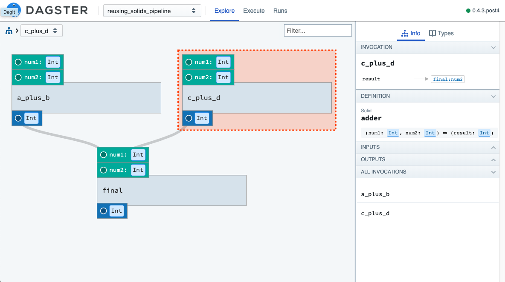

Reusing Solids
---------------

So far we have been using solids tailor-made for each pipeline they were resident in, and have
only used a single instance of that solid. However, solids are, at their core, a specialized type
of function. And like functions, they should be reusable and not tied to a particular call site.

Imagine we have some solids that perform generic mathematical computations and we want them to
be reusable. E.g. we want to have a generic ``adder`` solid and use it a couple times within
a pipeline. Using APIs presented so far, that would be impossible: there would be a name collision
if one included two copies of the solid.

Instead we introduce the ``alias`` call that allows the user to create multiple, named instances
of a single solid:

.. literalinclude:: ../../../../examples/dagster_examples/intro_tutorial/reusing_solids.py
   :linenos:
   :caption: reusing_solids.py

You'll notice that now have two copies of the adder solid.

We only add solids to the pipeline when they are invoked. Here we invoke them only after we have
given them aliases allowing us to have two invocations of the same underlying solid definition with
unique names.

If you inspect this in dagit, you'll see those two instances. You'll also notice that the notion
of an *invocation* and a *definition* are actually different. The invocation is named and bound
via a dependency graph to other invocations. The definition is the generic, resuable piece of logic
that is invoked many times within this pipeline.

You'll also notice in the right-hand column

You also use the aliases in the environment config. In order to execute this pipeline, use
the following config file:

.. literalinclude:: ../../../../examples/dagster_examples/intro_tutorial/reusing_solids.yaml
   :linenos:
   :caption: reusing_solids.yaml

Load this in dagit and you'll see that the node are the graph are labeled with
their instance name.

.. code-block:: sh

        $ dagit -f part_thirteen.py -n define_part_thirteen_step_two

Now these arithmetic operations are not particularly interesting, but one
can imagine reusable solids doing more useful things like uploading files
to cloud storage, unzipping files, etc.
