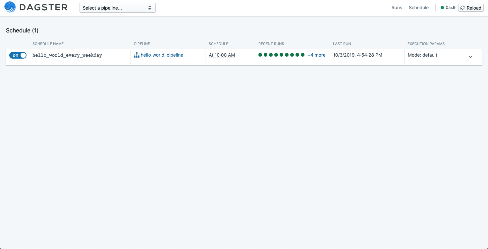

# Scheduler

After defining our pipelines, we can use dagster’s scheduler abstraction to schedule runs. We can also use dagit to control and monitor schedules.

Just like before, we’ll first define a pipeline and a repository, and then create a yaml file to get started. The goal will be to schedule the pipeline to run once a day at 10:00 AM.

```python
from dagster import RepositoryDefinition, pipeline, solid

@solid
def hello_world(_):
    pass

@pipeline
def hello_world_pipeline():
    hello_world()

def define_repo():
    return RepositoryDefinition(
        name='scheduler_demo_repository',
        pipeline_defs=[hello_world_pipeline]
    )
```

```yaml
repository:
  file: repos.py
  fn: define_repo
```

## Schedule Definitions

We define a schedule by creating a `ScheduleDefinition`. We can control how often a schedule runs by setting `cron_schedule` , which takes a cron schedule expression.

```python
from dagster import ScheduleDefinition

hello_world_every_day = ScheduleDefinition(
    name="hello_world_every_day",
    cron_schedule="0 10 * * *",
    pipeline_name="hello_world_pipeline",
    environment_dict={"storage": {"filesystem": {}}}
)
```

## System Cron Scheduler

Dagster provides pluggable support for different schedulers. For now, we've implemented only one scheduler type — a `SystemCronScheduler`, which is available in the `dagster_cron` library. To install, run:

```
$ pip install dagster-cron
```

Next, we use the `@schedules` decorator to define which `Scheduler` implementation to use, as well as mark the function `define_schedules` which returns a list of `ScheduleDefinitions`.

```python
from dagster import schedules, ScheduleDefinition
from dagster_cron import SystemCronScheduler

@schedules(scheduler=SystemCronScheduler)
def define_scheduler():
    hello_world_every_day = ScheduleDefinition(
        name="hello_world_every_day",
        cron_schedule="0 10 * * *",
        pipeline_name="hello_world_pipeline",
        environment_dict={"storage": {"filesystem": {}}}
    )

    return [hello_world_every_day]
```

To point dagster to our new scheduler, we add a `scheduler` key to `repository.yaml`

```yaml
repository:
  file: repos.py
  fn: define_repo
scheduler:
  file: repos.py
  fn: define_scheduler
```

## Starting Schedules

Whenever we make changes to schedule definitions, we need to run an `up` command to appropriately create, update, or remove schedules in the underlying cron file to be consistent with the schedule definitions defined in code.

To preview changes, first run:

```
$ dagster schedule up --preview
Planned Changes:
  + hello_world_every_day (add)
```

After confirming schedule changes are as expected, run:

```
$ dagster schedule up
Changes:
  + hello_world_every_day (add)
```

Now, we can load dagit to view the schedule to start it, and monitor runs from the schedule:



## Cron Filters

If you need to define a more specific schedule than cron allows, you can pass a function in the `should_execute` argument to `ScheduleDefinition`.

For example, we can define a filter that only returns `True` on weekdays:

```python
import datetime

def weekday_filter():
    weekno = datetime.datetime.today().weekday()
    # Returns true if current day is a weekday
    return weekno < 5
```

If we combine this `should_execute` filter with a `cron_schedule` that runs at 10:00am every day, then we’ll have a schedule that runs at 10:00am only on weekdays.

```python
hello_world_every_weekday = ScheduleDefinition(
    name="hello_world_every_weekday",
    cron_schedule="0 10 * * *",
    pipeline_name="hello_world_pipeline",
    environment_dict={"storage": {"filesystem": {}}},
    should_execute=weekday_filter,
)
```
