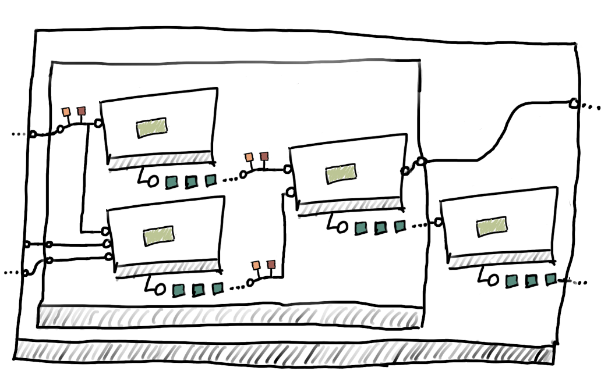

Reference
---------
As you get started with Dagster, you'll find that there are a number of important concepts
underpinning the system. Some of these concepts, like DAGs, will undoubtably be familiar
if you've previously worked with tools like Airflow. However, Dagster has some important differences
from other workflow systems to facilitate operating at a higher level of abstraction.

Solid
^^^^^

A solid is a functional unit of computation with defined inputs and outputs. Solids can be strung
together into `pipelines <#pipeline>`__ by defining `dependencies <#dependency-definition>`__
between their inputs and outputs.  Solids are reusable, and instances of a solid may appear many
times in a given pipeline, or across many different pipelines.

Solids often wrap code written in or intended to execute in other systems (e.g., SQL statements,
Jupyter notebooks, or Spark jobs written in Scala), providing a common interface for defining,
orchestrating, and managing data processing applications with heterogeneous components.

Solids can optionally define the types of their inputs and outputs, and can define a typed schema
so that their inputs can be read from external configuration files. Solids can also enforce
`expectations <#expectation>`__ on their inputs and outputs.

Solids are defined using the :func:`@lambda_solid <dagster.lambda_solid>` or
:func:`@solid <dagster.solid>` decorators, or using the underlying
:class:`SolidDefinition <dagster.SolidDefinition>` class. These APIs wrap an underlying
`compute function`, making its metadata queryable by higher-level tools.

You can check out `the solid guide <../learn/guides/solid/solid.html>`__ for a deeper dive on
solids and how they can be used.

Compute Function
^^^^^^^^^^^^^^^^

.. image:: compute_fn.png
    :scale: 40 %
    :align: center

The user-supplied function which forms the heart of a solid definition. The compute functions are
the business logic defined by you as the user; this business logic is what will be executed when the
solid is invoked by the Dagster engine.

Outputs
^^^^^^^

.. image:: outputs.png
    :scale: 40 %
    :align: center

An output is how a solid's compute function communicates the name and value of an output to Dagster.

Solid compute functions are expected to yield a stream of outputs. Implementers of a solid must
ensure their compute function yields :class:`Output <dagster.Output>` objects:

.. code-block:: python

    @solid(output_defs=[OutputDefinition(int, 'one'), OutputDefinition(int, 'two')])
    def return_one_and_two(_):
        yield Output(1, 'one')
        yield Output(2, 'two')

By referring to the names of these outputs, downstream solids can selectively depend on certain
outputs of a solid and not others.

In the common case where only a single output is yielded, Dagster provides sugar allowing the user
to just return a value instead of yielding it, and will automatically wrap the returned value in a
:class:`Output <dagster.Output>` class:

.. code-block:: python

    @solid
    def return_one(_):
        return 1

.. _pipeline:

Pipelines & DAGs
^^^^^^^^^^^^^^^^

.. image:: pipeline.png
    :scale: 40 %
    :align: center

DAG is short for `directed acyclic graph`. In this context, we are concerned with graphs where the
nodes are computations and the edges are dependencies between those computations. The dependencies
are `directed` because the outputs of one computation are the inputs to another.
These graphs are `acyclic` because there are no circular dependencies -- in other words, the graph
has a clear beginning and end, and we can always figure out what order to execute its nodes in.

In Dagster, pipelines are directed acyclic graphs (DAGs) of solids -- that is, they are made up of a
number of solids which have data `dependencies <#dependency-definition>`__ on each other (but no
circular dependencies).

These pipelines are created with the Dagster :func:`@pipeline <dagster.pipeline>` decorator. Any
solids invoked from within a pipeline definition function will automatically be added to the
pipeline DAG.

Paired with appropriate configuration, the pipeline can be compiled by the Dagster engine into an
execution plan that is executable on various compute substrates. To support these substrates,
pipeline execution is managed via :class:`ModeDefinition <dagster.ModeDefinition>`, which permit
specifying different modes for execution.

Concretely, a pipeline might include mode definitions for local testing (where databases and
other resources will be mocked, in-memory, or local) and for running in production (where resources
will require different credentials and expose configuration options). When a pipeline is compiled
with a config corresponding to one of these modes, it yields an execution plan suitable for the
given environment. The `tutorial on Modes <../learn/tutorial/resources.html#modes>`__ showcases how
you can combine resources and modes in pipeline execution.

.. _dependency-definition:

Dependencies
^^^^^^^^^^^^

.. image:: dependency.png
    :scale: 40 %
    :align: center

Solids are linked together into `pipelines <#pipeline>`__ by defining the dependencies between
their inputs and outputs. An important difference between Dagster and other workflow systems is that
in Dagster, dependencies are expressed as data dependencies, not how or when they execute.

This difference enables Dagster to support a much richer modeling of dependencies -- instead of
merely ensuring that the order of execution is correct, dependencies in Dagster provide a variety of
compile- and run-time checks.

Dependencies are expressed using Dagster's simple function invocation DSL; you can check out the
`tutorial <../learn/tutorial/actual_dag.html>`__ for an example of composing solids with
dependencies.

Resources
^^^^^^^^^

.. image:: resource.png
    :scale: 40 %
    :align: center

Resources are pipeline-scoped, and are typically used to expose features of the execution
environment (like EMR, Redshift, Spark, BigQuery, etc.) to solids during pipeline execution.
Resources bound to pipeline execution through modes, and can also clean up after execution resolves.
They are typically defined using the :func:`@resource <dagster.resource>` decorator or using the
:class:`ResourceDefinition` class directly.

Repository
^^^^^^^^^^

.. image:: repository.png
    :scale: 40 %
    :align: center

A repository is a collection of pipelines that can be made available to the Dagit UI and other
higher-level tools. Repositories are defined using the
:class:`RepositoryDefinition <dagster.RepositoryDefinition>` class, and made available to
higher-level tools with a special ``repository.yaml`` file that tells the tools where to look for a
repository definition.

Composite Solids
^^^^^^^^^^^^^^^^

To help manage the level of complexity that data applications tend to reach, dagster provides a unit
of abstraction for composing a solid from other solids. We call this type of solid a **Composite
Solid**.

This ability to compose solids can be used to:
    - organize large or complicated graphs
    - abstract away complexity
    - wrap re-usable solids with domain specific information

Refactoring a DAG of solids using composites is a very familiar experience to refactoring code
with functions.

Defining a composite solid is similar to defining a pipeline, but can also provide mapping
information to control how data and configuration flows in and out of its inner graph of solids. You
can see an example of composition in action in the
`tutorial <../learn/tutorial/composite_solids.html>`__.

Dagster Types
^^^^^^^^^^^^^

The Dagster type system allows authors of solids and pipelines to optionally and gradually define
the types of the data that flows between solids, and so to introduce compile-time and runtime checks
into their pipelines.

Types also allow for custom materialization, and are typically defined using the
:class:`DagsterType <dagster.DagsterType>`.

Environment Config
^^^^^^^^^^^^^^^^^^

Environment config defines the external environment with which a pipeline will interact for a given
execution plan. Environment config can be used to change solid behavior, define pipeline- or
solid-scoped resources and data that will be available during execution, or even shim solid inputs.

Environment config is complementary to data (solid inputs and outputs) -- think of inputs and
outputs as specifying `what` data a pipeline operates on, and config as specifying `how` it
operates.

Concretely, imagine a pipeline of solids operating on a data warehouse. The solids might emit and
consume table partition coordinates and aggregate statistics as inputs and outputs -- the data on
which they operate. Environment config might specify how to connect to the warehouse (so that the
pipeline could also operate against a local test database), how to log the results of intermediate
computations, or where to put artifacts like plots and summary tables.

Configuration Schemas
^^^^^^^^^^^^^^^^^^^^^

In Dagster, configuration is explicitly typed with configuration schemas. Configuration schemas
define how users can config pipelines. They tell the Dagster engine how to type check user-supplied
environment config against the pipeline and enable many errors to be caught with rich messaging at
compile time.

When creating resources :func:`@resource <dagster.solid>`, solids :func:`@solid <dagster.solid>`, or
loggers :func:`@logger <dagster.logger>`, you can supply a configuration schema to define the
available configuration for that object.

Execution Plan
^^^^^^^^^^^^^^
An execution plan is a concrete plan for executing a DAG of execution steps created by compiling a
pipeline and a config. The execution plan is aware of the topological ordering of the execution
steps, enabling physical execution on one of the available executor engines (e.g., in-process,
multiprocess, using Airflow).

Users do not directly instantiate or manipulate execution plans.

Execution Step
^^^^^^^^^^^^^^

Execution steps are concrete computations. When a pipeline is compiled with an environment config,
each solid is compiled into one or more corresponding execution steps. Some execution steps are
generated in order to compute the core compute functions of solids, but execution steps may also be
generated in order to materialize outputs, check expectations against outputs, etc.

Users do not directly instantiate or manipulate execution steps.

Dagster Event
^^^^^^^^^^^^^

When a pipeline is executed, a stream of events communicate the progress of its execution. This
includes top level events when the pipeline starts and completes, when execution steps succeed,
fail, or are skipped due to upstream failures, and when outputs are generated and materialized.

Users do not directly instantiate or manipulate Dagster events, but they are consumed by the GraphQL
interface that supports the Dagit tool.
