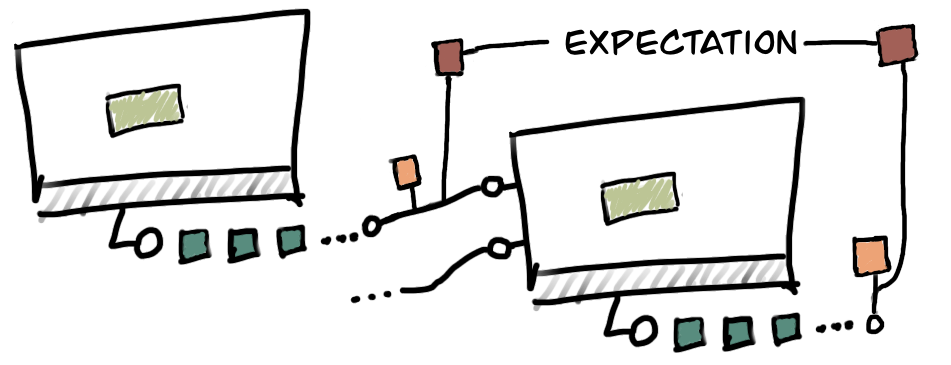

Reference
---------
As you get started with Dagster, you'll find that there are a number of important concepts
underpinning the system. Some of these concepts, like `DAGs <#dag>`__, will undoubtably be familiar
if you've previously worked with tools like Airflow. However, Dagster has some important differences
from other workflow systems to facilitate operating at a higher level of abstraction.

Solid
^^^^^

.. image:: solid.png
    :scale: 40 %
    :align: center

A solid is a functional unit of computation with defined inputs and outputs. Solids can be strung
together into `pipelines <#pipeline>`__ by defining `dependencies <#dependency-definition>`__
between their inputs and outputs.  Solids are reusable and instances of a solid may appear many
times in a given pipeline, or across many different pipelines.

Solids often wrap code written in or intended to execute in other systems (e.g., SQL statements,
Jupyter notebooks, or Spark jobs written in Scala), providing a common interface for defining,
orchestrating, and managing data processing applications with heterogeneous components.

Solids can optionally define the types of their inputs and outputs, and can define a typed schema
so that their inputs can be read from external configuration files. Solids can also enforce
`expectations <#expectation>`__ on their inputs and outputs.

Solids are defined using the :func:`@lambda_solid <dagster.lambda_solid>` or
:func:`@solid <dagster.solid>` decorators, or using the underlying
:class:`SolidDefinition <dagster.SolidDefinition>` class. These APIs wrap an underlying
`compute function`, making its metadata queryable by higher-level tools.

Compute Function
^^^^^^^^^^^^^^^^^^

The user-supplied function which forms the heart of a solid definition. The compute functions are
the business logic defined by you as the user; this business logic is what will be executed when the
solid is invoked by the Dagster engine.

Result
^^^^^^

A result is how a solid's compute function communicates the value of an output, and its
name, to Dagster.

Solid compute functions are expected to yield a stream of results. Implementers of a solid must
ensure their tranform yields :class:`Result <dagster.Result>` objects.

In the common case where only a single result is yielded, the machinery provides sugar allowing
the user to return a value instead of yielding it, and automatically wrapping the value in the
:class:`Result <dagster.Result>` class.

.. _dependency-definition:

Dependency Definition
^^^^^^^^^^^^^^^^^^^^^

.. image:: dependency.png
    :scale: 40 %
    :align: center

Solids are linked together into `pipelines <#pipeline>`__ by defining the dependencies between
their inputs and outputs. Dependencies are data-driven, not workflow-driven -- they define what
data is required for solids to execute, not how or when they execute.

This reflects an important separation of concerns -- the same pipeline may have very different
execution semantics depending on the environment in which it runs or the way in which it is
scheduled, but these conditions should be expressed separately from its underlying structure.

Dependencies are defined when constructing pipelines, using the
:class:`DependencyDefinition <dagster.DependencyDefinition>` class.

Intermediates
^^^^^^^^^^^^^

.. image:: materialization.png
    :scale: 42 %
    :align: center

The intermediate outputs of solids in a pipeline can be materialized. The Dagster engine can
materialize outputs in a number of formats (e.g., json, pickle), and can store materialized
intermediates locally or in object stores such as S3 or GCS.

Materialized intermediates make it possible to introspect the intermediate state of a pipeline
execution and ask questions like, "Exactly what output did this solid have on this particular run?"
This is useful when auditing or debugging pipelines, and makes it possible to establish the
`provenance` of data artifacts.

Materialized intermediates also enable `partial re-execution` of pipelines "starting from" a
materialized state of the upstream execution. This is useful when a pipeline fails halfway through,
or in order to explore how new logic in part of a pipeline would have operated on outputs from
previous runs of the pipeline.

Expectation
^^^^^^^^^^^

An expectation is a function that determines whether the input or output of a solid passes a
given condition -- for instance, that a value is non-null, or that it is distributed in a certain
way.

Expectations can be used to enforce runtime data quality and integrity constraints, so that
pipelines fail early -- before any downstream solids execute on bad data.

Expectations are defined using the :class:`ExpectationDefinition <dagster.ExpectationDefinition>`
class. We also provide a `thin wrapper <https://github.com/dagster-io/dagster/tree/master/python_modules/libraries/dagster-ge>`_
around the `great_expectations <https://github.com/great-expectations/great_expectations>`_ library
so you can use its existing repertoire of expectartions with Dagster.

.. _pipeline:

Pipeline
^^^^^^^^

.. image:: pipeline.png
    :scale: 40 %
    :align: center

Data pipelines are directed acyclic graphs (DAGs) of solids -- that is, they are made up of a number
of solids which have data `dependencies <#dependency-definition>`__ on each other (but no circular
dependencies), along with a set of associated pipeline context definitions, which declare the various
environments in which a pipeline can execute.

Pipelines are defined using the :class:`PipelineDefinition <dagster.PipelineDefinition>` class.

When a pipeline is combined with a given config conforming to one of its declared contexts, it can
be compiled by the Dagster engine into an execution plan that can be executed on various compute
substrates.

Concretely, a pipeline might include context definitions for local testing (where databases and
other resources will be mocked, in-memory, or local) and for running in production (where resources
will require different credentials and expose configuration options). When a pipeline is compiled
with a config corresponding to one of these contexts, it yields an execution plan suitable for the
given environment.

Resources
^^^^^^^^^

.. image:: resource.png
    :scale: 40 %
    :align: center

Resources are pipeline-scoped and typically used to expose features of the execution environment
(like database connections) to solids during pipeline execution. Resources can also clean up
after execution resolves. They are typically defined using the :func:`@resource <dagster.resource>`
decorator or using the :class:`ResourceDefinition` class directly.

Repository
^^^^^^^^^^

.. image:: repository.png
    :scale: 40 %
    :align: center

A repository is a collection of pipelines that can be made available to the Dagit UI and other
higher-level tools. Repositories are defined using the
:class:`RepositoryDefinition <dagster.RepositoryDefinition>` class, and made available to
higher-level tools with a special ``repository.yaml`` file that tells the tools where to look for a
repository definition.

Dagster Types
^^^^^^^^^^^^^

The Dagster type system allows authors of solids and pipelines to optionally and gradually define
the types of the data that flows between solids, and so to introduce compile-time and runtime checks
into their pipelines.

Types also allow for custom materialization, and are typically defined using the
:func:`@dagster_type <dagster.dagster_type>` decorator or the
:func:`as_dagster_type <dagster.as_dagster_type>` API. It is also possible to inherit from
:class:`RuntimeType <dagster.RuntimeType>` directly.

Environment Config
^^^^^^^^^^^^^^^^^^

Environment config defines the external environment with which a pipeline will interact for a given
execution plan. Environment config can be used to change solid behavior, define pipeline- or
solid-scoped resources and data that will be available during execution, or even shim solid inputs.

Environment config is complementary to data (solid inputs and outputs) -- think of inputs and
outputs as specifying `what` data a pipeline operates on, and config as specifying `how` it
operates.

Concretely, imagine a pipeline of solids operating on a data warehouse. The solids might emit and
consume table partition IDs and aggregate statistics as inputs and outputs -- the data on which they
operate. Environment config might specify how to connect to the warehouse (so that the pipeline
could also operate against a local test database), how to log the results of intermediate
computations, or where to put artifacts like plots and summary tables.

Configuration Schemas
^^^^^^^^^^^^^^^^^^^^^

Configuration schemas define how users can config pipelines (using either Python dicts, YAML,
or JSON). They tell the Dagster engine how to type check environment config provided in one of
these formats against the pipeline context and enable many errors to be caught with rich messaging
at compile time.

Config fields are defined using the :class:`Field <dagster.Field>` class.

DAG
^^^

DAG is short for `directed acyclic graph`. In this context, we are concerned with graphs where the
nodes are computations and the edges are dependencies between those computations. The dependencies
are `directed` because the outputs of one computation are the inputs to another.
These graphs are `acyclic` because there are no circular dependencies -- in other words, the graph
has a clear beginning and end, and we can always figure out what order to execute its nodes in.

Execution Plan
^^^^^^^^^^^^^^
An execution plan is a concrete plan for executing a DAG of execution steps created by compiling a
pipeline and a config. The execution plan is aware of the topological ordering of the execution
steps, enabling physical execution on one of the available executor engines (e.g., in-process,
multiprocess, using Airflow).

Users do not directly instantiate or manipulate execution plans.

Execution Step
^^^^^^^^^^^^^^

Execution steps are concrete computations, one or more of which corresponds to a solid in a pipeline
that has been compiled with a config. Some execution steps are generated in order to compute the
core compute functions of solids, but execution steps may also be generated in order to
materialize outputs, check expectations against outputs, etc.

Users do not directly instantiate or manipulate execution steps.

Dagster Event
^^^^^^^^^^^^^

When a pipeline is executed, a stream of events communicate the progress of its execution. This
includes top level events when the pipeline starts and completes, when execution steps succeed,
fail, or are skipped due to upstream failures, and when outputs are generated and materialized.

Users do not directly instantiate or manipulate Dagster events, but they are consumed by the GraphQL
interface that supports the Dagit tool.

InputDefinition
^^^^^^^^^^^^^^^

Optionally typed definition of the data that a solid requires in order to execute. Defined inputs
may often also be shimmed through config. Inputs are defined using the
:class:`InputDefinition <dagster.InputDefinition>` class, usually when defining a solid.

OutputDefinition
^^^^^^^^^^^^^^^^

Optionally typed definition of the result that a solid will produce. Outputs are defined using the
:class:`OutputDefinition <dagster.OutputDefinition>` class, usually when defining a solid.
