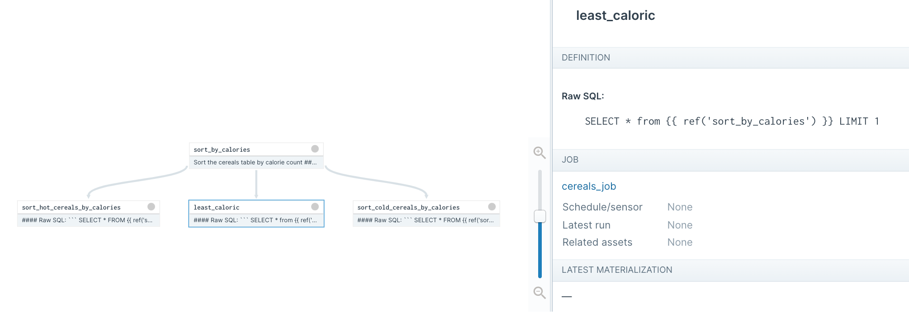

# DBT Assets Runbook

This runbook shows you how to:

* Load a dbt project into Dagster for viewing and local development
* Export the DAG to Airflow for production execution

## Step 0: Check out the code
```
git clone -b dbt-assets-demo --single-branch https://github.com/dagster-io/dagster.git --depth 1
```

`$REPO_ROOT` indicates the root of the Dagster repo. Most of the example code lines inside `$REPO_ROOT/examples/assets_dbt/`.


## Step 1: DBT project

We use the DBT project that we use to test our dagster-dbt integration.  It’s located at `$REPO_ROOT/python_modules/libraries/dagster-dbt/dagster_dbt_tests/dagster_dbt_test_project/.`  It contains four DBT models that summarize a small dataset of cereals.

There’s also a profiles.yml at `$REPO_ROOT/examples/assets_dbt/profiles.yml`, which points to a Snowflake database.


## Step 2: Dagster job

### Install Dagster

Install the Dagster core package, the Dagster DBT integration, and the Dagster web UI (Dagit).

```
pip install dagster dagster-dbt dagit
```

### Build a Dagster job from the DBT models

Write a Python module that loads a DBT project into a Dagster job: `$REPO_ROOT/examples/assets_dbt/dagster_job.py`.

It first loads each model from the DBT project into a Dagster asset.

```
assets = load_assets_from_dbt(DBT_PROJECT_DIR, DBT_PROFILES_DIR)
```

Then it builds a Dagster job, that, when executed, will materialize all the assets:

```
activity_stats = build_assets_job(
    "activity_stats",
    assets,
    resource_defs={
        "dbt": dbt_cli_resource.configured(
            {"profiles-dir": DBT_PROFILES_DIR, "project-dir": DBT_PROJECT_DIR}
        ),
    },
)
```

### Load the job in Dagit

```
dagit -f $REPO_ROOT/examples/assets_dbt/dagster_job.py
```

The DBT models will show up on the Dagit assets page: http://localhost:3000/workspace/__repository__cereals_job@dagster_job.py/assets.  You can click on any one of them to see it inside the asset graph.  You'll see something like this:

<p align="center">

</p>


You can right-click on an asset to launch a job that materializes it (requires setting the right Snowflake credentials in profiles.yml).


## Step 3: Airflow DAG

Build an Airflow DAG from the Dagster DAG.

Add `$REPO_ROOT/examples/assets_dbt/` to your `PYTHONPATH`.  This will allow Airflow to locate the `dagster_job` module.

### Build and Airflow DAG from the Dagster DAG

Create a file inside your Airflow DAGs directory, with the contents of `$REPO_ROOT/examples/assets_dbt/airflow_dag.py`.

The crux of it is the following, which constructs an Airflow DAG from the Dagster job.

```
dag, tasks = make_airflow_dag(
    module_name="dagster_job",
    pipeline_name="cereals_job",
    dag_kwargs={"default_args": DEFAULT_ARGS, "max_active_runs": 1},
)
```

### Boot Airflow

The DAG should show up in Airflow, with a task per DBT model.


