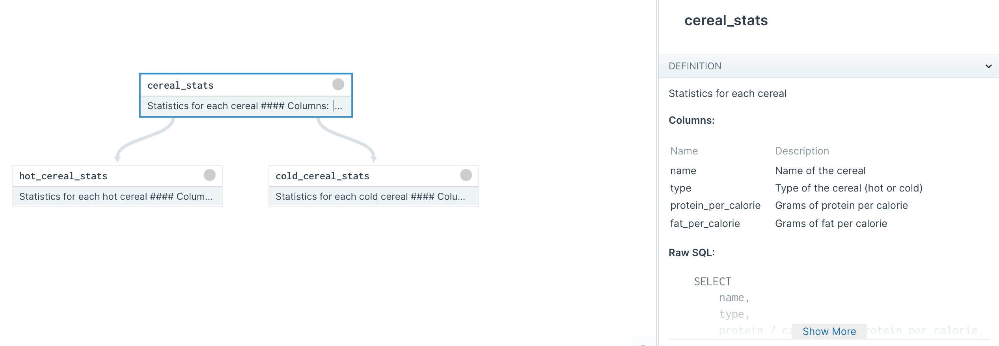

# DBT Assets Runbook

This runbook shows how to load a dbt project into Dagster for viewing and local development

## Step 0: Check out the code
```
git clone -b dbt-assets-demo --single-branch https://github.com/dagster-io/dagster.git --depth 1
```

The example code lines inside `examples/assets_dbt/`.

```
cd examples/assets_dbt/
```

## Step 1: DBT project

The DBT project lies in the `dbt_project` dir.  It contains three DBT models that summarize nutritional information a small dataset of cereals.

There’s also a `profiles.yml`, which points to a Snowflake database.


## Step 2: Dagster job

### Install Dagster

Install the Dagster core package, the Dagster DBT integration, and the Dagster web UI (Dagit).

```
pip install dagster dagster-dbt dagit
```

### Build a Dagster job from the DBT models

Write a Python module that loads a DBT project into a Dagster job: `dagster_job.py`.

It first loads each model from the DBT project into a Dagster asset.

```
assets = load_assets_from_dbt(DBT_PROJECT_DIR, DBT_PROFILES_DIR)
```

Then it builds a Dagster job, that, when executed, will materialize all the assets:

```
activity_stats = build_assets_job(
    "activity_stats",
    assets,
    resource_defs={
        "dbt": dbt_cli_resource.configured(
            {"profiles-dir": DBT_PROFILES_DIR, "project-dir": DBT_PROJECT_DIR}
        ),
    },
)
```

### Load the job in Dagit

```
dagit -f dagster_job.py
```

The DBT models will show up on the Dagit assets page: http://localhost:3000/workspace/__repository__cereals_job@dagster_job.py/assets.  You can click on any one of them to see it inside the asset graph.  You'll see something like this:

<p align="center">

</p>


You can right-click on an asset to launch a job that materializes it (requires setting the right Snowflake credentials in profiles.yml and running `dbt seed`).

After materializing the assets, you'll see the run times filled out like this:

<p align="center">

</p>
