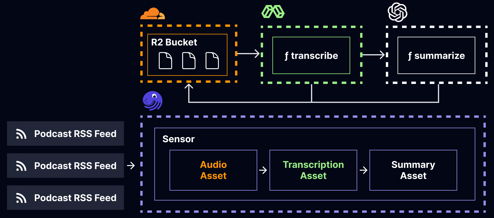
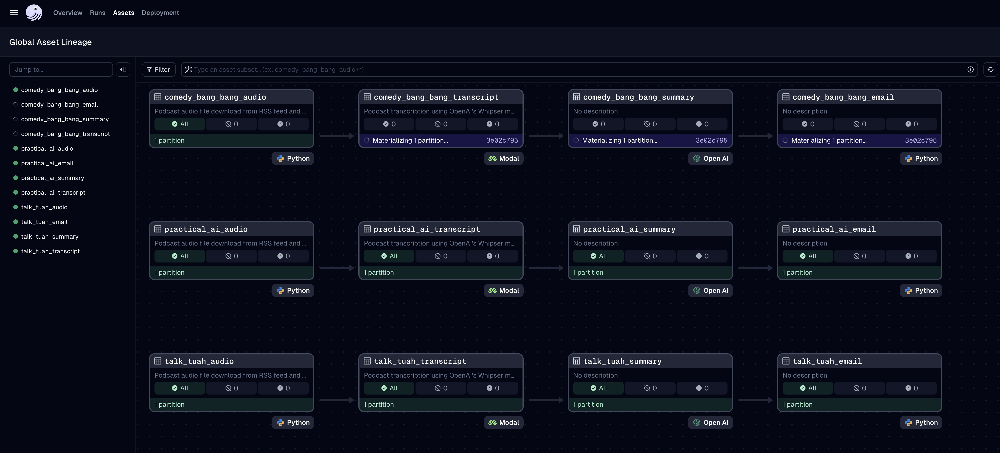
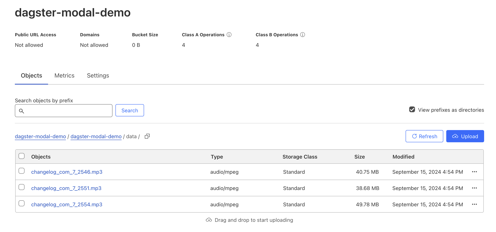
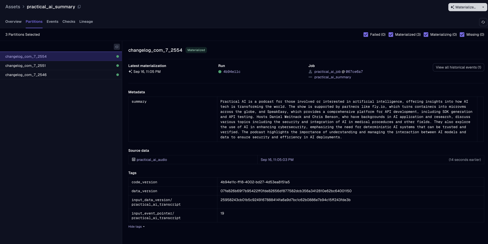

## Dagster × Modal Demo


Orchestrate your flexible compute workloads with the combined forces of Dagster and Modal.

In this example project we show how you can write a pipeline that automatically detects newly
published podcasts, transcribes them using the power of GPUs, and notifies you with the summary so
that you can focus on the things that truly matter (not listening to people talk into fancy
microphones).

### Architecture



### Example Asset Lineage



## Getting started

Install the project dependencies:

```sh
pip install -e ".[dev]"
```

Run Dagster:

```sh
dagster dev
```

Open http://localhost:3000 in your browser.

## References

Modal

- [Modal Docs](https://modal.com/docs)
- [Modal Docs: Parallel podcast transcription using Whisper](https://modal.com/docs/examples/whisper-transcriber#example-parallel-podcast-transcription-using-whisper)
- [Modal Docs: Mounting Cloudflare R2 Buckets](https://modal.com/docs/guide/cloud-bucket-mounts#mounting-cloudflare-r2-buckets)

Dagster

- [Dagster Docs](https://docs.dagster.io/)
- [Dagster Docs: Pipes Subprocess Reference](https://docs.dagster.io/concepts/dagster-pipes/subprocess/reference)
- [Dagster Docs: OpenAI Integration](https://docs.dagster.io/integrations/openai)
- [Dagster Docs: AWS Integration](https://docs.dagster.io/_apidocs/libraries/dagster-aws#s3)

OpenAI

- [OpenAI Whisper](https://github.com/openai/whisper)
- [OpenAI Cookbook: Summarizing Long Documents](https://cookbook.openai.com/examples/summarizing_long_documents)

Miscellaneous

- [`yagmail` for Sending Email from Python](https://github.com/kootenpv/yagmail)

## More Screenshots

<details>
<summary>Screenshot of R2 Storage</summary>



</details>

<details>
<summary>Screenshot of Summary Asset</summary>



</details>

## Example Podcast Feeds

Podcasts are sourced from RSS feeds as; a table containing a sample of feeds is below:

| Title                                             | RSS Feed                                                          |
| ------------------------------------------------- | ----------------------------------------------------------------- |
| Practical AI: Machine Learning, Data Science, LLM | [RSS Feed](https://changelog.com/practicalai/feed)                |
| The Data Exchange with Ben Lorica                 | [RSS Feed](https://feeds.buzzsprout.com/682433.rss)               |
| Hub & Spoken: Data                                | [RSS Feed](https://cynozure.libsyn.com/rss)                       |
| Making Data Simple                                | [RSS Feed](http://feeds.feedburner.com/IBM-big-data-hub-podcasts) |
| The Data Chief                                    | [RSS Feed](https://feeds.simplecast.com/75zUZHD_)                 |
