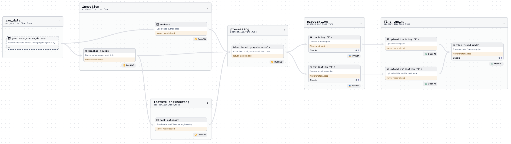

## Dagster × OpenAI Fine-Tune Demo

Fine-tune a custom model to detect specific features from Goodreads data.

In this example project we show how you can write a pipeline that ingests data from Goodreads
with DuckDB and then generates features for modeling. You can then use this data to fine-tune
a model in OpenAI to identify that feature while also validating the model against the base
model is was built against.

### Example Asset Lineage



## Getting started

Install the project dependencies:

```sh
pip install -e ".[dev]"
```

Run Dagster:

```sh
dagster dev
```

Open http://localhost:3000 in your browser.

## References

Dagster

- [Dagster Docs](https://docs.dagster.io/)
- [Dagster Docs: DuckDB](https://docs.dagster.io/_apidocs/libraries/dagster-duckdb)
- [Dagster Docs: OpenAI Integration](https://docs.dagster.io/integrations/openai)

DuckDB

- [DuckDB Docs](https://duckdb.org/docs/)

OpenAI

- [OpenAI Fine-Tuning](https://platform.openai.com/docs/guides/fine-tuning)
- [OpenAI Cookbook: How to fine-tune chat models](https://cookbook.openai.com/examples/how_to_finetune_chat_models)
- [OpenAI Cookbook: Data preparation and analysis for chat model fine-tuning](https://cookbook.openai.com/examples/chat_finetuning_data_prep)
