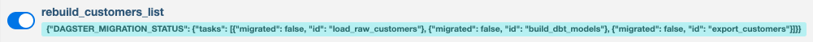
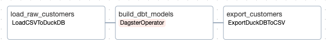

## Example: Migrating an Airflow DAG to Dagster

This example demonstrates how to migrate an Airflow DAG to Dagster using the `dagster-airlift` package. It contains code examples of how to peer, observe, and migrate assets from an Airflow DAG to Dagster.
The below guide will walk through each of these steps in detail.

## Example Structure

```plaintext
tutorial_example
├── shared: Contains shared Python & SQL code used Airflow and proxied Dagster code
│
├── dagster_defs: Contains Dagster definitions
│   ├── stages: Contains reference implementations of each stage of the migration process
│   ├── definitions.py: Empty starter file for following along with the tutorial
│
├── airflow_dags: Contains the Airflow DAG and associated files
│   ├── proxied_state: Contains migration state files for each DAG, see migration step below
│   ├── dags.py: The Airflow DAG definition
```

## Guide

This tutorial will walk through the process of peering, observing, and migrating assets from an Airflow DAG to Dagster.

First, clone the tutorial example repo locally, and enter the repo directory.

```bash
gh repo clone dagster-io/airlift-tutorial
cd airlift-tutorial
```

First we strongly recommend that you setup a fresh virtual environment and that you use `uv`.

```bash
pip install uv
uv venv
source .venv/bin/activate
```

## Running Airflow locally

The tutorial example involves running a local Airflow instance. This can be done by running the following commands from the root of the `tutorial-example` directory.

First, install the required python packages:

```bash
make airflow_install
```

Next, scaffold the Airflow instance, and initialize the dbt project:

```bash
make airflow_setup
```

Finally, run the Airflow instance with environment variables set:

```bash
make airflow_run
```

This will run the Airflow Web UI in a shell. You should now be able to access the Airflow UI at [http://localhost:8080](http://localhost:8080), with the default username and password set to `admin`.

You should be able to see the `rebuild_customers_list` DAG in the Airflow UI, made up of three tasks: `load_raw_customers`, `run_dbt_model`, and `export_customers`.

## Peering Dagster to your Airflow instance

The first step is to peer your Airflow instance with a Dagster code location, which will create an asset representation of each of your Airflow DAGs that you can view in Dagster. This process does not require any changes to your Airflow instance.

First, you will want a new shell and navigate to the same directory. You will need to set up the `dagster-airlift` package in your Dagster environment:

```bash
source .venv/bin/activate
uv pip install 'dagster-airlift[core]' dagster-webserver dagster
```

Next, create a `Definitions` object using `build_defs_from_airflow_instance`. You can use the empty [`tutorial_example/dagster_defs/definitions.py`](./tutorial_example/dagster_defs/definitions.py) file as a starting point:

```python
# tutorial_example/dagster_defs/stages/peer.py
from dagster_airlift.core import AirflowInstance, BasicAuthBackend, build_defs_from_airflow_instance

defs = build_defs_from_airflow_instance(
    airflow_instance=AirflowInstance(
        # other backends available (e.g. MwaaSessionAuthBackend)
        auth_backend=BasicAuthBackend(
            webserver_url="http://localhost:8080",
            username="admin",
            password="admin",
        ),
        name="airflow_instance_one",
    )
)
```

This function creates:

- An external asset representing each DAG. This asset is marked as materialized whenever a DAG run completes.
- A sensor that polls the Airflow instance for operational information. This sensor is responsible for creating materializations when a DAG executes. The sensor must remain on in order to properly update execution status.

Let's set up some environment variables, and then point Dagster to see the asset created from our Airflow DAG:

```bash
# Set up environment variables to point to the examples/tutorial-example directory on your machine
export TUTORIAL_EXAMPLE_DIR=$(pwd)
export TUTORIAL_DBT_PROJECT_DIR="$TUTORIAL_EXAMPLE_DIR/tutorial_example/shared/dbt"
export AIRFLOW_HOME="$TUTORIAL_EXAMPLE_DIR/.airflow_home"
dagster dev -f tutorial_example/dagster_defs/definitions.py
```

<p align="center">


</p>

If we kick off a run of the `rebuild_customers_list` DAG in Airflow, we should see the corresponding asset materialize in Dagster.

<p align="center">


</p>

_Note: When the code location loads, Dagster will query the Airflow REST API in order to build a representation of your DAGs. In order for Dagster to reflect changes to your DAGs, you will need to reload your code location._

<details>
<summary>
Peering to multiple instances
</summary>

Airlift supports peering to multiple Airflow instances, as you can invoke `create_airflow_instance_defs` multiple times and combine them with `Definitions.merge`:

```python
from dagster import Definitions

from dagster_airlift.core import AirflowInstance, build_defs_from_airflow_instance

defs = Definitions.merge(
    build_defs_from_airflow_instance(
        airflow_instance=AirflowInstance(
            auth_backend=BasicAuthBackend(
                webserver_url="http://yourcompany.com/instance_one",
                username="admin",
                password="admin",
            ),
            name="airflow_instance_one",
        )
    ),
    build_defs_from_airflow_instance(
        airflow_instance=AirflowInstance(
            auth_backend=BasicAuthBackend(
                webserver_url="http://yourcompany.com/instance_two",
                username="admin",
                password="admin",
            ),
            name="airflow_instance_two",
        )
    ),
)
```

</details>

## Observing Assets

The next step is to represent our Airflow workflows more richly by observing the data assets that are produced by our tasks. In order to do this, we must define the relevant assets in the Dagster code location.

In our example, we have three sequential tasks:

1. `load_raw_customers` loads a CSV file of raw customer data into duckdb.
2. `run_dbt_model` builds a series of dbt models (from [jaffle shop](https://github.com/dbt-labs/jaffle_shop_duckdb)) combining customer, order, and payment data.
3. `export_customers` exports a CSV representation of the final customer file from duckdb to disk.

We will first create a set of asset specs that correspond to the assets produced by these tasks. We will then annotate these asset specs so that Dagster can associate them with the Airflow tasks that produce them.

The first and third tasks involve a single table each. We can manually construct specs for these two tasks. Dagster provides the `assets_with_task_mappings` utility to annotate our asset specs with the tasks that produce them. Assets which are properly annotated will be materialized by the Airlift sensor once the corresponding task completes: These annotated specs are then provided to the `defs` argument to `build_defs_from_airflow_instance`.

We will also create a set of dbt asset definitions for the `build_dbt_models` task.
We can use the `dagster-dbt`-supplied decorator `@dbt_assets` to generate these definitions using Dagster's dbt integration.

First, you need to install the extra that has the dbt factory:

```bash
uv pip install 'dagster-airlift[dbt]'
```

Then, we will construct our assets:

```python
# tutorial_example/dagster_defs/stages/observe.py
import os
from pathlib import Path

from dagster import AssetExecutionContext, AssetSpec, Definitions
from dagster_airlift.core import (
    AirflowInstance,
    BasicAuthBackend,
    assets_with_task_mappings,
    build_defs_from_airflow_instance,
)
from dagster_dbt import DbtCliResource, DbtProject, dbt_assets


def dbt_project_path() -> Path:
    env_val = os.getenv("TUTORIAL_DBT_PROJECT_DIR")
    assert env_val, "TUTORIAL_DBT_PROJECT_DIR must be set"
    return Path(env_val)


@dbt_assets(
    manifest=dbt_project_path() / "target" / "manifest.json",
    project=DbtProject(dbt_project_path()),
)
def dbt_project_assets(context: AssetExecutionContext, dbt: DbtCliResource):
    yield from dbt.cli(["build"], context=context).stream()


mapped_assets = assets_with_task_mappings(
    dag_id="rebuild_customers_list",
    task_mappings={
        "load_raw_customers": [AssetSpec(key=["raw_data", "raw_customers"])],
        "build_dbt_models": [dbt_project_assets],
        "export_customers": [AssetSpec(key="customers_csv", deps=["customers"])],
    },
)


defs = build_defs_from_airflow_instance(
    airflow_instance=AirflowInstance(
        auth_backend=BasicAuthBackend(
            webserver_url="http://localhost:8080",
            username="admin",
            password="admin",
        ),
        name="airflow_instance_one",
    ),
    defs=Definitions(
        assets=mapped_assets,
        resources={"dbt": DbtCliResource(project_dir=dbt_project_path())},
    ),
)
```

### Viewing observed assets

Once your assets are set up, you should be able to reload your Dagster definitions and see a full representation of the dbt project and other data assets in your code.

<p align="center">


</p>

Kicking off a run of the DAG in Airflow, you should see the newly created assets materialize in Dagster as each task completes.

_Note: There will be some delay between task completion and assets materializing in Dagster, managed by the sensor. This sensor runs every 30 seconds by default (you can reduce down to one second via the `minimum_interval_seconds` argument to `sensor`), so there will be some delay._

### Adding partitions

If your assets represent a time-partitioned data source, Airlift can automatically associate your materializations to the relevant partitions.
In the case of `rebuild_customers_list`, data is daily partitioned in each created table, and as a result we've added a `@daily` cron schedule to the DAG to make sure it runs every day. We can likewise add a `DailyPartitionsDefinition` to each of our assets.

```python
# tutorial_example/dagster_defs/stages/observe_with_partitions.py
import os
from pathlib import Path

from dagster import AssetExecutionContext, AssetSpec, Definitions, DailyPartitionsDefinition
from dagster_airlift.core import (
    AirflowInstance,
    BasicAuthBackend,
    assets_with_task_mappings,
    build_defs_from_airflow_instance,
)
from dagster_dbt import DbtCliResource, DbtProject, dbt_assets
from dagster._time import get_current_datetime_midnight

PARTITIONS_DEF = DailyPartitionsDefinition(start_date=get_current_datetime_midnight())


def dbt_project_path() -> Path:
    env_val = os.getenv("TUTORIAL_DBT_PROJECT_DIR")
    assert env_val, "TUTORIAL_DBT_PROJECT_DIR must be set"
    return Path(env_val)


@dbt_assets(
    manifest=dbt_project_path() / "target" / "manifest.json",
    project=DbtProject(dbt_project_path()),
    partitions_def=PARTITIONS_DEF,
)
def dbt_project_assets(context: AssetExecutionContext, dbt: DbtCliResource):
    yield from dbt.cli(["build"], context=context).stream()


mapped_assets = assets_with_task_mappings(
    dag_id="rebuild_customers_list",
    task_mappings={
        "load_raw_customers": [AssetSpec(key=["raw_data", "raw_customers"], partitions_def=PARTITIONS_DEF)],
        "build_dbt_models": [dbt_project_assets],
        "export_customers": [AssetSpec(key="customers_csv", deps=["customers"], partitions_def=PARTITIONS_DEF)],
    },
)


defs = build_defs_from_airflow_instance(
    airflow_instance=AirflowInstance(
        auth_backend=BasicAuthBackend(
            webserver_url="http://localhost:8080",
            username="admin",
            password="admin",
        ),
        name="airflow_instance_one",
    ),
    defs=Definitions(
        assets=mapped_assets,
        resources={"dbt": DbtCliResource(project_dir=dbt_project_path())},
    ),
)
```

Now, every time the sensor synthesizes a materialization for an asset, it will automatically have a partition associated with it.

<p align="center">


</p>

In order for partitioned assets to work out of the box with `dagster-airlift`, the following things need to be true:

- The asset can only be time-window partitioned. This means static, dynamic, and multi partitioned definitions will require custom functionality.
- The partitioning scheme must match up with the [logical_date / execution_date](https://airflow.apache.org/docs/apache-airflow/stable/faq.html#what-does-execution-date-mean) of corresponding Airflow runs. That is, each logical*date should correspond \_exactly* to a partition in Dagster.

## Migrating Assets

Once you have created corresponding definitions in Dagster to your Airflow tasks, you can proxy execution to Dagster on a per-task basis while Airflow is still controlling scheduling and orchestration.
Once a task has been proxied, Airflow will kick off materializations of corresponding Dagster assets in place of executing the business logic of that task.

To begin proxying tasks in a DAG, first you will need a file to track proxying state. In your Airflow DAG directory, create a `proxied_state` folder, and in it create a yaml file with the same name as your DAG. The included example at [`airflow_dags/proxied_state`](./tutorial_example/airflow_dags/proxied_state) is used by `make airflow_run`, and can be used as a template for your own proxied state files.

Given our example DAG `rebuild_customers_list` with three tasks, `load_raw_customers`, `run_dbt_model`, and `export_customers`, [`proxied_state/rebuild_customers_list.yaml`](./tutorial_example/airflow_dags/proxied_state/rebuild_customers_list.yaml) should look like the following:

```yaml
# tutorial_example/airflow_dags/proxied_state/rebuild_customers_list.yaml
tasks:
  - id: load_raw_customers
    proxied: False
  - id: build_dbt_models
    proxied: False
  - id: export_customers
    proxied: False
```

Next, you will need to modify your Airflow DAG to make it aware of the proxied state. This is already done in the example DAG:

```python
# tutorial_example/snippets/dags_truncated.py
# Dags file can be found at tutorial_example/airflow_dags/dags.py
from pathlib import Path

from airflow import DAG
from dagster_airlift.in_airflow import proxying_to_dagster
from dagster_airlift.in_airflow.proxied_state import load_proxied_state_from_yaml

dag = DAG("rebuild_customers_list", ...)

...

# Set this to True to begin the proxying process
PROXYING = False

if PROXYING:
    proxying_to_dagster(
        global_vars=globals(),
        proxied_state=load_proxied_state_from_yaml(Path(__file__).parent / "proxied_state"),
    )
```

Set `PROXYING` to `True` or eliminate the `if` statement.

The DAG will now display its proxied state in the Airflow UI. (There is some latency as Airflow evaluates the Python file periodically.)

<p align="center">



</p>

### Migrating individual tasks

In order to proxy a task, you must do two things:

1. First, ensure all associated assets are executable in Dagster by providing asset definitions in place of bare asset specs.
2. The `proxied: False` status in the `proxied_state` YAML folder must be adjusted to `proxied: True`.

Any task marked as proxied will use the `DefaultProxyToDagsterOperator` when executed as part of the DAG. This operator will use the Dagster GraphQL API to initiate a Dagster run of the assets corresponding to the task.

The proxied file acts as the source of truth for proxied state. The information is attached to the DAG and then accessed by Dagster via the REST API.

A task which has been proxied can be easily toggled back to run in Airflow (for example, if a bug in implementation was encountered) simply by editing the file to `proxied: False`.

#### Supporting custom authorization

If your Dagster deployment lives behind a custom auth backend, you can customize the Airflow-to-Dagster proxying behavior to authenticate to your backend.
`proxying_to_dagster` can take a parameter `dagster_operator_klass`, which allows you to define a custom `BaseProxyToDagsterOperator` class. This allows you to
override how a session is created. Let's say for example, your Dagster installation requires an access key to be set whenever a request is made, and that access key is set in an Airflow `Variable` called `my_api_key`.
We can create a custom `BaseProxyToDagsterOperator` subclass which will retrieve that variable value and set it on the session, so that any requests to Dagster's graphql API
will be made using that api key.

```python
# tutorial_example/snippets/custom_operator_examples/custom_proxy.py
from pathlib import Path

import requests
from airflow import DAG
from airflow.utils.context import Context
from dagster_airlift.in_airflow import BaseProxyTaskToDagsterOperator, proxying_to_dagster
from dagster_airlift.in_airflow.proxied_state import load_proxied_state_from_yaml


class CustomProxyToDagsterOperator(BaseProxyTaskToDagsterOperator):
    def get_dagster_session(self, context: Context) -> requests.Session:
        if "var" not in context:
            raise ValueError("No variables found in context")
        api_key = context["var"]["value"].get("my_api_key")
        session = requests.Session()
        session.headers.update({"Authorization": f"Bearer {api_key}"})
        return session

    def get_dagster_url(self, context: Context) -> str:
        return "https://dagster.example.com/"


dag = DAG(
    dag_id="custom_proxy_example",
)

# At the end of your dag file
proxying_to_dagster(
    global_vars=globals(),
    proxied_state=load_proxied_state_from_yaml(Path(__file__).parent / "proxied_state"),
    build_from_task_fn=CustomProxyToDagsterOperator.build_from_task,
)
```

#### Dagster Plus Authorization

You can use a customer proxy operator to establish a connection to a Dagster plus deployment. The below example proxies to Dagster Plus using organization name, deployment name, and user token set as
Airflow Variables. To set a Dagster+ user token, follow this guide: https://docs.dagster.io/dagster-plus/account/managing-user-agent-tokens#managing-user-tokens.

```python
# tutorial_example/snippets/custom_operator_examples/plus_proxy_operator.py
import requests
from airflow.utils.context import Context
from dagster_airlift.in_airflow import BaseProxyTaskToDagsterOperator


class DagsterCloudProxyOperator(BaseProxyTaskToDagsterOperator):
    def get_variable(self, context: Context, var_name: str) -> str:
        if "var" not in context:
            raise ValueError("No variables found in context")
        return context["var"]["value"][var_name]

    def get_dagster_session(self, context: Context) -> requests.Session:
        dagster_cloud_user_token = self.get_variable(context, "dagster_cloud_user_token")
        session = requests.Session()
        session.headers.update({"Dagster-Cloud-Api-Token": dagster_cloud_user_token})
        return session

    def get_dagster_url(self, context: Context) -> str:
        org_name = self.get_variable(context, "dagster_plus_organization_name")
        deployment_name = self.get_variable(context, "dagster_plus_deployment_name")
        return f"https://{org_name}.dagster.plus/{deployment_name}"
```

#### Migrating common operators

For some common operator patterns, like our dbt operator, Dagster supplies factories to build software defined assets for our tasks. In fact, the `@dbt_assets` decorator used earlier already backs its assets with definitions, so we can toggle the proxied state of the `build_dbt_models` task to `proxied: True` in the proxied state file:

```yaml
# tutorial_example/snippets/dbt_proxied.yaml
tasks:
  - id: load_raw_customers
    proxied: False
  - id: build_dbt_models
    proxied: True
  - id: export_customers
    proxied: False
```

**Important**: It may take up to 30 seconds for the proxied state in the Airflow UI to reflect this change. You must subsequently reload the definitions in Dagster via the UI or by restarting `dagster dev`.

You can now run the `rebuild_customers_list` DAG in Airflow, and the `build_dbt_models` task will be executed in a Dagster run:

<p align="center">



</p>

You'll note that we proxied a task in the _middle_ of the Airflow DAG. The Airflow DAG structure and execution history is stable in the Airflow UI, but execution of `build_dbt_models` has moved to Dagster.

#### Migrating the remaining custom operators

For all other operator types, we will need to build our own asset definitions. We recommend creating a factory function whose arguments match the inputs to your Airflow operator. Then, you can use this factory to build definitions for each Airflow task.

For example, our `load_raw_customers` task uses a custom `LoadCSVToDuckDB` operator. We'll define a function `load_csv_to_duckdb_defs` factory to build corresponding software-defined assets. Similarly for `export_customers` we'll define a function `export_duckdb_to_csv_defs` to build SDAs:

```python
# tutorial_example/dagster_defs/stages/migrate.py
import os
from pathlib import Path

from dagster import (
    AssetExecutionContext,
    AssetsDefinition,
    AssetSpec,
    Definitions,
    materialize,
    multi_asset,
)
from dagster_airlift.core import (
    AirflowInstance,
    BasicAuthBackend,
    assets_with_task_mappings,
    build_defs_from_airflow_instance,
)
from dagster_dbt import DbtCliResource, DbtProject, dbt_assets

# Code also invoked from Airflow
from tutorial_example.shared.export_duckdb_to_csv import ExportDuckDbToCsvArgs, export_duckdb_to_csv
from tutorial_example.shared.load_csv_to_duckdb import LoadCsvToDuckDbArgs, load_csv_to_duckdb


def dbt_project_path() -> Path:
    env_val = os.getenv("TUTORIAL_DBT_PROJECT_DIR")
    assert env_val, "TUTORIAL_DBT_PROJECT_DIR must be set"
    return Path(env_val)


def airflow_dags_path() -> Path:
    return Path(os.environ["TUTORIAL_EXAMPLE_DIR"]) / "tutorial_example" / "airflow_dags"


def load_csv_to_duckdb_asset(spec: AssetSpec, args: LoadCsvToDuckDbArgs) -> AssetsDefinition:
    @multi_asset(name=f"load_{args.table_name}", specs=[spec])
    def _multi_asset() -> None:
        load_csv_to_duckdb(args)

    return _multi_asset


def export_duckdb_to_csv_defs(spec: AssetSpec, args: ExportDuckDbToCsvArgs) -> AssetsDefinition:
    @multi_asset(name=f"export_{args.table_name}", specs=[spec])
    def _multi_asset() -> None:
        export_duckdb_to_csv(args)

    return _multi_asset


@dbt_assets(
    manifest=dbt_project_path() / "target" / "manifest.json",
    project=DbtProject(dbt_project_path()),
)
def dbt_project_assets(context: AssetExecutionContext, dbt: DbtCliResource):
    yield from dbt.cli(["build"], context=context).stream()


mapped_assets = assets_with_task_mappings(
    dag_id="rebuild_customers_list",
    task_mappings={
        "load_raw_customers": [
            load_csv_to_duckdb_asset(
                AssetSpec(key=["raw_data", "raw_customers"]),
                LoadCsvToDuckDbArgs(
                    table_name="raw_customers",
                    csv_path=airflow_dags_path() / "raw_customers.csv",
                    duckdb_path=Path(os.environ["AIRFLOW_HOME"]) / "jaffle_shop.duckdb",
                    names=["id", "first_name", "last_name"],
                    duckdb_schema="raw_data",
                    duckdb_database_name="jaffle_shop",
                ),
            )
        ],
        "build_dbt_models":
        # load rich set of assets from dbt project
        [dbt_project_assets],
        "export_customers": [
            export_duckdb_to_csv_defs(
                AssetSpec(key="customers_csv", deps=["customers"]),
                ExportDuckDbToCsvArgs(
                    table_name="customers",
                    csv_path=Path(os.environ["TUTORIAL_EXAMPLE_DIR"]) / "customers.csv",
                    duckdb_path=Path(os.environ["AIRFLOW_HOME"]) / "jaffle_shop.duckdb",
                    duckdb_database_name="jaffle_shop",
                ),
            )
        ],
    },
)


defs = build_defs_from_airflow_instance(
    airflow_instance=AirflowInstance(
        auth_backend=BasicAuthBackend(
            webserver_url="http://localhost:8080",
            username="admin",
            password="admin",
        ),
        name="airflow_instance_one",
    ),
    defs=Definitions(
        assets=mapped_assets,
        resources={"dbt": DbtCliResource(project_dir=dbt_project_path())},
    ),
)
```

We can then toggle the proxied state of the remaining tasks in the `proxied_state` file:

```yaml
# tutorial_example/snippets/all_proxied.yaml
tasks:
  - id: load_raw_customers
    proxied: True
  - id: build_dbt_models
    proxied: True
  - id: export_customers
    proxied: True
```

## Decomissioning an Airflow DAG

Once we are confident in our migrated versions of the tasks, we can decommission the Airflow DAG. First, we can remove the DAG from our Airflow DAG directory.

Next, we can strip the task associations from our Dagster definitions. This can be done by removing the `assets_with_task_mappings` call. We can use this opportunity to attach our assets to a `ScheduleDefinition` so that Dagster's scheduler can manage their execution:

```python
# tutorial_example/dagster_defs/stages/standalone.py
import os
from pathlib import Path

from dagster import (
    AssetCheckResult,
    AssetCheckSeverity,
    AssetExecutionContext,
    AssetKey,
    AssetsDefinition,
    AssetSelection,
    AssetSpec,
    Definitions,
    ScheduleDefinition,
    asset_check,
    multi_asset,
)
from dagster_dbt import DbtCliResource, DbtProject, dbt_assets

# Code also invoked from Airflow
from tutorial_example.shared.export_duckdb_to_csv import ExportDuckDbToCsvArgs, export_duckdb_to_csv
from tutorial_example.shared.load_csv_to_duckdb import LoadCsvToDuckDbArgs, load_csv_to_duckdb


def dbt_project_path() -> Path:
    env_val = os.getenv("TUTORIAL_DBT_PROJECT_DIR")
    assert env_val, "TUTORIAL_DBT_PROJECT_DIR must be set"
    return Path(env_val)


def airflow_dags_path() -> Path:
    return Path(os.environ["TUTORIAL_EXAMPLE_DIR"]) / "tutorial_example" / "airflow_dags"


def load_csv_to_duckdb_asset(spec: AssetSpec, args: LoadCsvToDuckDbArgs) -> AssetsDefinition:
    @multi_asset(name=f"load_{args.table_name}", specs=[spec])
    def _multi_asset() -> None:
        load_csv_to_duckdb(args)

    return _multi_asset


def export_duckdb_to_csv_defs(spec: AssetSpec, args: ExportDuckDbToCsvArgs) -> AssetsDefinition:
    @multi_asset(name=f"export_{args.table_name}", specs=[spec])
    def _multi_asset() -> None:
        export_duckdb_to_csv(args)

    return _multi_asset


@dbt_assets(
    manifest=dbt_project_path() / "target" / "manifest.json",
    project=DbtProject(dbt_project_path()),
)
def dbt_project_assets(context: AssetExecutionContext, dbt: DbtCliResource):
    yield from dbt.cli(["build"], context=context).stream()


assets = [
    load_csv_to_duckdb_asset(
        AssetSpec(key=["raw_data", "raw_customers"]),
        LoadCsvToDuckDbArgs(
            table_name="raw_customers",
            csv_path=airflow_dags_path() / "raw_customers.csv",
            duckdb_path=Path(os.environ["AIRFLOW_HOME"]) / "jaffle_shop.duckdb",
            names=["id", "first_name", "last_name"],
            duckdb_schema="raw_data",
            duckdb_database_name="jaffle_shop",
        ),
    ),
    dbt_project_assets,
    export_duckdb_to_csv_defs(
        AssetSpec(key="customers_csv", deps=["customers"]),
        ExportDuckDbToCsvArgs(
            table_name="customers",
            csv_path=Path(os.environ["TUTORIAL_EXAMPLE_DIR"]) / "customers.csv",
            duckdb_path=Path(os.environ["AIRFLOW_HOME"]) / "jaffle_shop.duckdb",
            duckdb_database_name="jaffle_shop",
        ),
    ),
]


@asset_check(asset=AssetKey(["customers_csv"]))
def validate_exported_csv() -> AssetCheckResult:
    csv_path = Path(os.environ["TUTORIAL_EXAMPLE_DIR"]) / "customers.csv"

    if not csv_path.exists():
        return AssetCheckResult(passed=False, description=f"Export CSV {csv_path} does not exist")

    rows = len(csv_path.read_text().split("\n"))
    if rows < 2:
        return AssetCheckResult(
            passed=False,
            description=f"Export CSV {csv_path} is empty",
            severity=AssetCheckSeverity.WARN,
        )

    return AssetCheckResult(
        passed=True,
        description=f"Export CSV {csv_path} exists",
        metadata={"rows": rows},
    )


rebuild_customer_list_schedule = rebuild_customers_list_schedule = ScheduleDefinition(
    name="rebuild_customers_list_schedule",
    target=AssetSelection.assets(*assets),
    cron_schedule="0 0 * * *",
)


defs = Definitions(
    assets=assets,
    schedules=[rebuild_customer_list_schedule],
    asset_checks=[validate_exported_csv],
    resources={"dbt": DbtCliResource(project_dir=dbt_project_path())},
)
```

## Addendum: Adding asset checks

Once you have peered your Airflow DAGs in Dagster, regardless of migration progress, you can begin to add asset checks to your Dagster code. Asset checks can be used to validate the quality of your data assets, and can provide additional observability and value on top of your Airflow DAG even before migration starts.

For example, given a peered version of our DAG, we can add an asset check to ensure that the final `customers` CSV output exists and has a non-zero number of rows:

```python
# tutorial_example/dagster_defs/stages/peer_with_check.py
import os
from pathlib import Path

from dagster import AssetCheckResult, AssetCheckSeverity, AssetKey, Definitions, asset_check
from dagster_airlift.core import AirflowInstance, BasicAuthBackend, build_defs_from_airflow_instance


# Attach a check to the DAG representation asset, which will be executed by Dagster
# any time the DAG is run in Airflow
@asset_check(asset=AssetKey(["airflow_instance_one", "dag", "rebuild_customers_list"]))
def validate_exported_csv() -> AssetCheckResult:
    csv_path = Path(os.environ["TUTORIAL_EXAMPLE_DIR"]) / "customers.csv"

    if not csv_path.exists():
        return AssetCheckResult(passed=False, description=f"Export CSV {csv_path} does not exist")

    rows = len(csv_path.read_text().split("\n"))
    if rows < 2:
        return AssetCheckResult(
            passed=False,
            description=f"Export CSV {csv_path} is empty",
            severity=AssetCheckSeverity.WARN,
        )

    return AssetCheckResult(
        passed=True,
        description=f"Export CSV {csv_path} exists",
        metadata={"rows": rows},
    )


defs = Definitions.merge(
    build_defs_from_airflow_instance(
        airflow_instance=AirflowInstance(
            # other backends available (e.g. MwaaSessionAuthBackend)
            auth_backend=BasicAuthBackend(
                webserver_url="http://localhost:8080",
                username="admin",
                password="admin",
            ),
            name="airflow_instance_one",
        )
    ),
    Definitions(asset_checks=[validate_exported_csv]),
)
```

Once we have introduced representations of the assets produced by our Airflow tasks, we can directly attach asset checks to these assets. These checks will run once the corresponding task completes, regardless of whether the task is executed in Airflow or Dagster.

<details>
<summary>
Asset checks on an observed or migrated DAG
</summary>

```python
# tutorial_example/dagster_defs/stages/migrate_with_check.py
import os
from pathlib import Path

from dagster import (
    AssetCheckResult,
    AssetCheckSeverity,
    AssetExecutionContext,
    AssetKey,
    AssetsDefinition,
    AssetSpec,
    Definitions,
    asset_check,
    materialize,
    multi_asset,
)
from dagster_airlift.core import (
    AirflowInstance,
    BasicAuthBackend,
    assets_with_task_mappings,
    build_defs_from_airflow_instance,
)
from dagster_dbt import DbtCliResource, DbtProject, dbt_assets

# Code also invoked from Airflow
from tutorial_example.shared.export_duckdb_to_csv import ExportDuckDbToCsvArgs, export_duckdb_to_csv
from tutorial_example.shared.load_csv_to_duckdb import LoadCsvToDuckDbArgs, load_csv_to_duckdb


def dbt_project_path() -> Path:
    env_val = os.getenv("TUTORIAL_DBT_PROJECT_DIR")
    assert env_val, "TUTORIAL_DBT_PROJECT_DIR must be set"
    return Path(env_val)


def airflow_dags_path() -> Path:
    return Path(os.environ["TUTORIAL_EXAMPLE_DIR"]) / "tutorial_example" / "airflow_dags"


def load_csv_to_duckdb_asset(spec: AssetSpec, args: LoadCsvToDuckDbArgs) -> AssetsDefinition:
    @multi_asset(name=f"load_{args.table_name}", specs=[spec])
    def _multi_asset() -> None:
        load_csv_to_duckdb(args)

    return _multi_asset


def export_duckdb_to_csv_defs(spec: AssetSpec, args: ExportDuckDbToCsvArgs) -> AssetsDefinition:
    @multi_asset(name=f"export_{args.table_name}", specs=[spec])
    def _multi_asset() -> None:
        export_duckdb_to_csv(args)

    return _multi_asset


@dbt_assets(
    manifest=dbt_project_path() / "target" / "manifest.json",
    project=DbtProject(dbt_project_path()),
)
def dbt_project_assets(context: AssetExecutionContext, dbt: DbtCliResource):
    yield from dbt.cli(["build"], context=context).stream()


mapped_assets = assets_with_task_mappings(
    dag_id="rebuild_customers_list",
    task_mappings={
        "load_raw_customers": [
            load_csv_to_duckdb_asset(
                AssetSpec(key=["raw_data", "raw_customers"]),
                LoadCsvToDuckDbArgs(
                    table_name="raw_customers",
                    csv_path=airflow_dags_path() / "raw_customers.csv",
                    duckdb_path=Path(os.environ["AIRFLOW_HOME"]) / "jaffle_shop.duckdb",
                    names=["id", "first_name", "last_name"],
                    duckdb_schema="raw_data",
                    duckdb_database_name="jaffle_shop",
                ),
            )
        ],
        "build_dbt_models":
        # load rich set of assets from dbt project
        [dbt_project_assets],
        "export_customers": [
            export_duckdb_to_csv_defs(
                AssetSpec(key="customers_csv", deps=["customers"]),
                ExportDuckDbToCsvArgs(
                    table_name="customers",
                    csv_path=Path(os.environ["TUTORIAL_EXAMPLE_DIR"]) / "customers.csv",
                    duckdb_path=Path(os.environ["AIRFLOW_HOME"]) / "jaffle_shop.duckdb",
                    duckdb_database_name="jaffle_shop",
                ),
            )
        ],
    },
)


@asset_check(asset=AssetKey(["customers_csv"]))
def validate_exported_csv() -> AssetCheckResult:
    csv_path = Path(os.environ["TUTORIAL_EXAMPLE_DIR"]) / "customers.csv"

    if not csv_path.exists():
        return AssetCheckResult(passed=False, description=f"Export CSV {csv_path} does not exist")

    rows = len(csv_path.read_text().split("\n"))
    if rows < 2:
        return AssetCheckResult(
            passed=False,
            description=f"Export CSV {csv_path} is empty",
            severity=AssetCheckSeverity.WARN,
        )

    return AssetCheckResult(
        passed=True,
        description=f"Export CSV {csv_path} exists",
        metadata={"rows": rows},
    )


defs = build_defs_from_airflow_instance(
    airflow_instance=AirflowInstance(
        auth_backend=BasicAuthBackend(
            webserver_url="http://localhost:8080",
            username="admin",
            password="admin",
        ),
        name="airflow_instance_one",
    ),
    defs=Definitions(
        assets=mapped_assets,
        asset_checks=[validate_exported_csv],
        resources={"dbt": DbtCliResource(project_dir=dbt_project_path())},
    ),
)
```

</details>

## Migrating an entire DAG at once

There may be DAGs for which you want to migrate the entire thing at once rather than on a per-task basis.
Some reasons for taking this approach:

- You're making use of "dynamic tasks" in Airflow, which don't conform neatly to the task mapping protocol we've laid out above.
- You want to make more substantial refactors to the dag structure that don't conform to the existing task structure

For cases like this, we allow you to map assets to a full DAG.

### Observing DAG-mapped assets

At the observation stage, you'll call `assets_with_dag_mappings` instead of `assets_with_task_mappings`.

For our `rebuild_customers_list` DAG, let's take a look at what the new observation code looks like:

```python
# tutorial_example/dagster_defs/stages/observe_dag_level.py
import os
from pathlib import Path

from dagster import AssetExecutionContext, AssetSpec, Definitions
from dagster_airlift.core import (
    AirflowInstance,
    BasicAuthBackend,
    assets_with_dag_mappings,
    build_defs_from_airflow_instance,
)
from dagster_dbt import DbtCliResource, DbtProject, dbt_assets


def dbt_project_path() -> Path:
    env_val = os.getenv("TUTORIAL_DBT_PROJECT_DIR")
    assert env_val, "TUTORIAL_DBT_PROJECT_DIR must be set"
    return Path(env_val)


@dbt_assets(
    manifest=dbt_project_path() / "target" / "manifest.json",
    project=DbtProject(dbt_project_path()),
)
def dbt_project_assets(context: AssetExecutionContext, dbt: DbtCliResource):
    yield from dbt.cli(["build"], context=context).stream()


# Instead of mapping assets to individual tasks, we map them to the entire DAG.
mapped_assets = assets_with_dag_mappings(
    dag_mappings={
        "rebuild_customers_list": [
            AssetSpec(key=["raw_data", "raw_customers"]),
            dbt_project_assets,
            AssetSpec(key="customers_csv", deps=["customers"]),
        ],
    },
)


defs = build_defs_from_airflow_instance(
    airflow_instance=AirflowInstance(
        auth_backend=BasicAuthBackend(
            webserver_url="http://localhost:8080",
            username="admin",
            password="admin",
        ),
        name="airflow_instance_one",
    ),
    defs=Definitions(
        assets=mapped_assets,
        resources={"dbt": DbtCliResource(project_dir=dbt_project_path())},
    ),
)
```

Now, instead of getting a materialization when a particular task completes, each mapped asset will receive a materialization when the entire DAG completes.

### Migrating DAG-mapped assets

Recall that in the task-by-task migration step, we "proxy" execution on a task by task basis, which is controlled by a yaml document.
For DAG-mapped assets, execution is proxied on a per-DAG basis.
Proxying execution to Dagster will require all assets mapped to that DAG be _executable_ within Dagster.
Let's take a look at some fully migrated code mapped to DAGs instead of tasks:

```python
# tutorial_example/dagster_defs/stages/migrate_dag_level.py
import os
from pathlib import Path

from dagster import (
    AssetExecutionContext,
    AssetsDefinition,
    AssetSpec,
    Definitions,
    materialize,
    multi_asset,
)
from dagster_airlift.core import (
    AirflowInstance,
    BasicAuthBackend,
    assets_with_dag_mappings,
    build_defs_from_airflow_instance,
)
from dagster_dbt import DbtCliResource, DbtProject, dbt_assets

# Code also invoked from Airflow
from tutorial_example.shared.export_duckdb_to_csv import ExportDuckDbToCsvArgs, export_duckdb_to_csv
from tutorial_example.shared.load_csv_to_duckdb import LoadCsvToDuckDbArgs, load_csv_to_duckdb


def dbt_project_path() -> Path:
    env_val = os.getenv("TUTORIAL_DBT_PROJECT_DIR")
    assert env_val, "TUTORIAL_DBT_PROJECT_DIR must be set"
    return Path(env_val)


def airflow_dags_path() -> Path:
    return Path(os.environ["TUTORIAL_EXAMPLE_DIR"]) / "tutorial_example" / "airflow_dags"


def load_csv_to_duckdb_asset(spec: AssetSpec, args: LoadCsvToDuckDbArgs) -> AssetsDefinition:
    @multi_asset(name=f"load_{args.table_name}", specs=[spec])
    def _multi_asset() -> None:
        load_csv_to_duckdb(args)

    return _multi_asset


def export_duckdb_to_csv_defs(spec: AssetSpec, args: ExportDuckDbToCsvArgs) -> AssetsDefinition:
    @multi_asset(name=f"export_{args.table_name}", specs=[spec])
    def _multi_asset() -> None:
        export_duckdb_to_csv(args)

    return _multi_asset


@dbt_assets(
    manifest=dbt_project_path() / "target" / "manifest.json",
    project=DbtProject(dbt_project_path()),
)
def dbt_project_assets(context: AssetExecutionContext, dbt: DbtCliResource):
    yield from dbt.cli(["build"], context=context).stream()


mapped_assets = assets_with_dag_mappings(
    dag_mappings={
        "rebuild_customers_list": [
            load_csv_to_duckdb_asset(
                AssetSpec(key=["raw_data", "raw_customers"]),
                LoadCsvToDuckDbArgs(
                    table_name="raw_customers",
                    csv_path=airflow_dags_path() / "raw_customers.csv",
                    duckdb_path=Path(os.environ["AIRFLOW_HOME"]) / "jaffle_shop.duckdb",
                    names=["id", "first_name", "last_name"],
                    duckdb_schema="raw_data",
                    duckdb_database_name="jaffle_shop",
                ),
            ),
            dbt_project_assets,
            export_duckdb_to_csv_defs(
                AssetSpec(key="customers_csv", deps=["customers"]),
                ExportDuckDbToCsvArgs(
                    table_name="customers",
                    csv_path=Path(os.environ["TUTORIAL_EXAMPLE_DIR"]) / "customers.csv",
                    duckdb_path=Path(os.environ["AIRFLOW_HOME"]) / "jaffle_shop.duckdb",
                    duckdb_database_name="jaffle_shop",
                ),
            ),
        ],
    },
)


defs = build_defs_from_airflow_instance(
    airflow_instance=AirflowInstance(
        auth_backend=BasicAuthBackend(
            webserver_url="http://localhost:8080",
            username="admin",
            password="admin",
        ),
        name="airflow_instance_one",
    ),
    defs=Definitions(
        assets=mapped_assets,
        resources={"dbt": DbtCliResource(project_dir=dbt_project_path())},
    ),
)
```

Now that all of our assets are fully executable, we can create a simple yaml file to proxy execution for the whole dag:

```yaml
# tutorial_example/snippets/rebuild_customers_list.yaml
proxied: True
```

We will similarly use `proxying_to_dagster` at the end of our DAG file (the code is exactly the same here as it was for the per-task migration step)

```python
# tutorial_example/snippets/dags_truncated.py
# Dags file can be found at tutorial_example/airflow_dags/dags.py
from pathlib import Path

from airflow import DAG
from dagster_airlift.in_airflow import proxying_to_dagster
from dagster_airlift.in_airflow.proxied_state import load_proxied_state_from_yaml

dag = DAG("rebuild_customers_list", ...)

...

# Set this to True to begin the proxying process
PROXYING = False

if PROXYING:
    proxying_to_dagster(
        global_vars=globals(),
        proxied_state=load_proxied_state_from_yaml(Path(__file__).parent / "proxied_state"),
    )
```

Once the `proxied` bit is flipped to True, we can go to the Airflow UI, and we'll see that our tasks have been replaced with a single task.

<p align="center">


</p>

When performing dag-level mapping, we don't preserve task structure in the Airflow dags. This single task will materialize all mapped Dagster assets instead of executing the original Airflow task business logic.

We can similarly mark `proxied` back to `False`, and the original task structure and business logic will return unchanged.

### Customizing DAG proxying operator

Similar to how we can customize the operator we construct on a per-dag basis, we can customize the operator we construct on a per-dag basis. We can use the `build_from_dag_fn` argument of `proxying_to_dagster` to provide a custom operator in place of the default.

For example, let's take a look at the following custom operator which expects an API key to be provided as a variable:

```python
# tutorial_example/snippets/custom_operator_examples/custom_dag_level_proxy.py
from pathlib import Path

import requests
from airflow import DAG
from airflow.utils.context import Context
from dagster_airlift.in_airflow import BaseProxyDAGToDagsterOperator, proxying_to_dagster
from dagster_airlift.in_airflow.proxied_state import load_proxied_state_from_yaml


class CustomProxyToDagsterOperator(BaseProxyDAGToDagsterOperator):
    def get_dagster_session(self, context: Context) -> requests.Session:
        if "var" not in context:
            raise ValueError("No variables found in context")
        api_key = context["var"]["value"].get("my_api_key")
        session = requests.Session()
        session.headers.update({"Authorization": f"Bearer {api_key}"})
        return session

    def get_dagster_url(self, context: Context) -> str:
        return "https://dagster.example.com/"

    # This method controls how the operator is built from the dag.
    @classmethod
    def build_from_dag(cls, dag: DAG):
        return CustomProxyToDagsterOperator(dag=dag, task_id="OVERRIDDEN")


dag = DAG(
    dag_id="custom_dag_level_proxy_example",
)

# At the end of your dag file
proxying_to_dagster(
    global_vars=globals(),
    proxied_state=load_proxied_state_from_yaml(Path(__file__).parent / "proxied_state"),
    build_from_dag_fn=CustomProxyToDagsterOperator.build_from_dag,
)
```

`BaseProxyDAGToDagsterOperator` has three abstract methods which must be implemented:

- `get_dagster_session`, which controls the creation of a valid session to access the Dagster graphql API.
- `get_dagster_url`, which retrieves the domain at which the dagster webserver lives.
- `build_from_dag`, which controls how the proxying task is constructed from the provided DAG.
