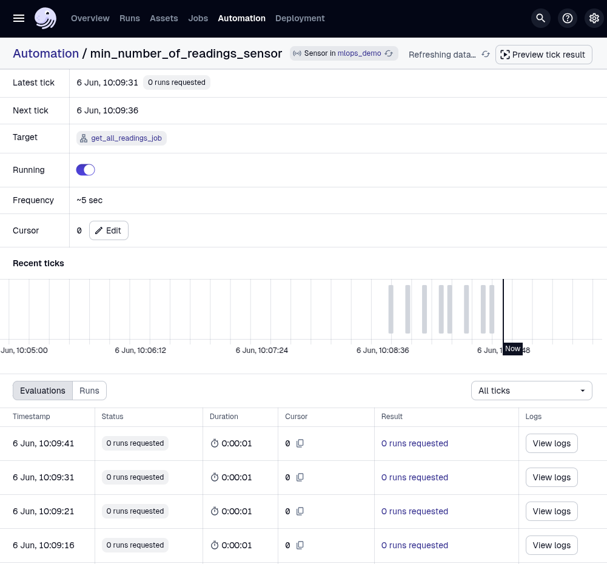
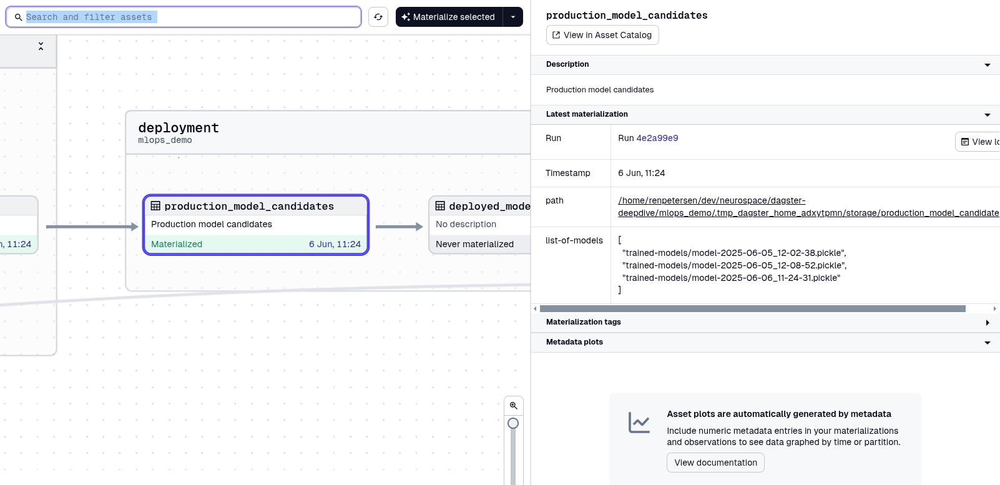

# MLOps Demo
This is a demonstration of how to use Dagster for machine-learning operations.

## The scenario
The data used for the demonstration is simulated sensor output (temperatures, torque etc.) from a number of fictive "machines".
Whatever those machines might be in this context, is not important.
What's important, is that the machine sensor values are read in the morning, and based on these values,
we need to predict whether that particular machine will fail during the day.
By the end of the day, we will know whether a particular machine has failed.
This is new data that we can use to improve the model, and thus it makes perfect sense to implement some kind of MLOps.

## How to use

### Install Python dependencies
First, install all necessary packages by running
```
pipenv sync
```
If you don't have `pipenv` you can use the `requirements.txt` file.

### Start RabbitMQ
Sensor readings and daily machine statuses are simulated using a RabbitMQ queue.
To start RabbitMQ run
```
docker compose up
```

### Start Dagster
Now, to get Dagster running first activate the virtual environment by running
```
pipenv shell
```
Next, run
```
cd mlops_demo && dagster dev
```
Dagster will start and should be accessible on http://127.0.0.1:3000 within a few seconds.

1. Verify that the sensors are running by going to "Automation" and choosing `min_number_of_readings_sensor`. It should look something like the image below.
1. Activate the `default_automation_condition_sensor`.




### Start publising readings
Now we are ready to start receiving sensor readings and daily machine statuses. To do this, go to the folder `sensor_data`.
```
cd sensor_data
```
To publish sensor readings, run the script `publish_sensor_readings.sh` (you can also use the Python script for more customization possibilities)
```
./publish_sensor_readings.sh
```
The script will wait for you to type `more` before anything is published. Each time you type `more`, 500 messages are sent. For now, type `more` once to publish just 500 readings.
Watch how Dagster starts materializing the assets `sensor_readings`, `cleaned_readings`, and `historic_readings`. 
When Dagster has finished, the file `cleaned_readings.json` (the "database") will contain 500 messages.

Type `more` one more time to publish 500 more readings. 

### Publish daily machine statuses
To pubslish the daily machine statuses you can use the script `publish_machine_statuses.sh` in the same manner.

Now publish 500 statuses.

### Train a model
Now you have published 1000 sensor readings and 500 daily machine statuses. We can now train a model.

Start by materializing the asset `joined_cleaned_readings_and_statuses`.

Look at the metadata `num_matches` for this asset when it finished.
It should be 500, meaning that we have received the status (the label) for 500 readings (the features).
We also have 500 readings for which we have no label, but this can obviously not be used for training.

Go to "Jobs" and run the job `train_ml_model`. Watch how the assets in the `model_training` group starts materializing. 

When training finished, look at the metadata for the asset `trained_model`.
Here you can see metrics for the trained model.

### Deploying a model
When a new model has been trained, the `production_model_candidates` asset will auto-materialize.
This asset will contain a list of candidate models, see the image below.



At the moment all trained models are considered candidates, but in a prodcution setting it would make sense to only consider models that are actually better than the current model.
To deploy a model, materialize the asset `deployed_model`.
This assets takes as input a `.pickle` file path.
In the "Launchpad" window that opens up, write this
```
ops:
  deployed_model:
    config:
      model_name: '[MODEL_NAME]'
```
replacing `[MODEL_NAME]` with one paths found in the metadata output of the `production_model_candidates` asset.
The deployed model will now be used to make predictions on incoming readings.
Watch how the `devices_at_risk` asset starts to materialize.
This will produce a list of devices at risk of failure, and this list can be seen in the asset metadata.

### Retrain
Now go back and publish 500 more machine statuses.
Now we have 1000 readings and 1000 statuses so we have more data for training a model.
Re-run the `train_ml_model` job and investigate the metadata for the `trained_model` asset. You can see how model scores are evolving.
Now deploy the new model and watch how the "devices at risk" list changes.


### Reset everything
To reset everything do the following

1. Stop Dagster (Ctrl+C)
1. Delete the files `cleaned_daily_statuses.jsonl` and `cleaned_readings.jsonl`.
1. Delete the contents of the folder `trained-models`.
1. Empty the RabbitMQ queues (if you always publish minimum 500 messages, this should not be necessary as Dagster will empty the queues entirely).
```
docker exec rabbitmq rabbitmqctl purge_queue daily_statuses
docker exec rabbitmq rabbitmqctl purge_queue readings
```