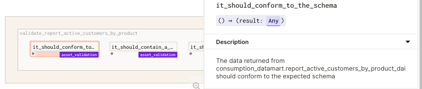

# 8. Start by monitoring asset quality

* **Status**: Proposed <br/>
* **Date**: 2021-12-29 <br/>
* **Deciders**: David Laing <br/>

## Context

ACME Executives frequently consult the Active Customer report when making decisions.  
This report is driven by a simple query against a view in the Data Mart

```
SELECT *
FROM consumption_datamart.report_active_customers_by_product_daily
```    

The `consumption_datamart` asset delivers value each time this report - and thus a query against the mart - is run.

However, if the query fails for some reason no value can be delivered.  For the periods of time the data mart is "down" it may as well not exist
from the perspective of delivering value to business users.

Framed this way, it is clear that the ACME Data team needs a way to measure the quality of the asset(s) they deliver, including:

1. Freshness - is the data up-to-date?
2. Correctness - is the schema correct?
3. Warning count - are the number of detected data defects at an acceptable level?

Based on these quality measurements the team can monitor the ongoing quality of their data assets. ACME's Data team can begin to leverage 
SRE (Software Reliability Engineering) concepts to target objective levels of quality - ie, SLOs (Service Level Objectives).  Techniques like
error budgets can be used to focus engineering investment in the areas that need improvements to meet the targeted SLOs.

## Decision

Starting with the end in mind we begin the process of building a data asset by building the monitoring that validates the 
quality of the asset that will be delivered. Concretely, we define an attribute of the data asset to be delivered and 
write a data quality test to validate whether that attribute exists.

Initially the test will fail since the data asset hasn't been created.  Rather than being a problem this is actually an opportunity 
to validate that the test detects the problem and that the failure reported gives enough information to be useful in understanding what has gone wrong.

By implementing each test as a `@op()` and grouping them into `@graph()`s related to different assets we can build up a suite of 
Data Quality tests:



Using Dagster's `@job()` abstraction for running the same graphs in different contexts we can: 

1. Run scheduled data quality monitoring job(s) against our "production" data assets
2. Guide the development of the data assets by running the same data quality tests against local development resources 
   via a testing framework like `pytest`

## Alternatives

1. A typical approach would be to start by building the automation pipelines that create the data mart.
    Waterfall approach. No deliverable until near the end. end up with QA happening at the end.  Once delivered (late)
    documentation & monitoring is skipped.  Probably "works" on day 1.  No way to know if
    continues to work in year 2.  Confidence & context drains over time.
    Notice how:
      * The quality of the asset at delivery date + 1 month is unknown
      * Validation of the quality at delivery date was probably rushed and poorly understood.
      * There is no feedback loop to incorporate real world experience back into the monitoring of quality

    QA in the above workflow inevitably leads to disappointment.
