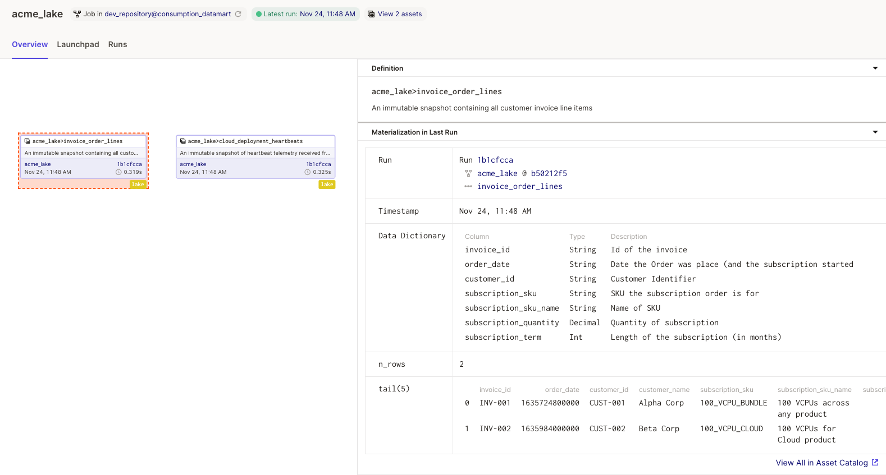

# 5. Each lake table is represented by a Dagster Asset

* **Status**: Decided <br/>
* **Date**: 2021-11-22 <br/>
* **Deciders**: David Laing <br/>

## Context

Building the `consumption_datamart` depends on upstream assets stored in ACME's Lake.  The schema of these lake tables need to be documented and the 
data read and validated.

## Decision

Each lake table will be represented by a Dagster Asset.  The Dagster Asset will:

* Document the lake tables' schema
* Read data from the lake and
* Validate that the data read conforms to the expected schema

## Consequences

Asset status and documentation can be viewed through Dagit

When Dagit is loaded with a workspace that include the `consumption_datamart` module - ie:

```bash
path/to/github.com/dagster-io/dagster $ dagit -w examples/test_driven_software_defined_assets/workspace.yaml
```

the acme_lake assets view shows details of data assets in the lake and the last time they were materialized


