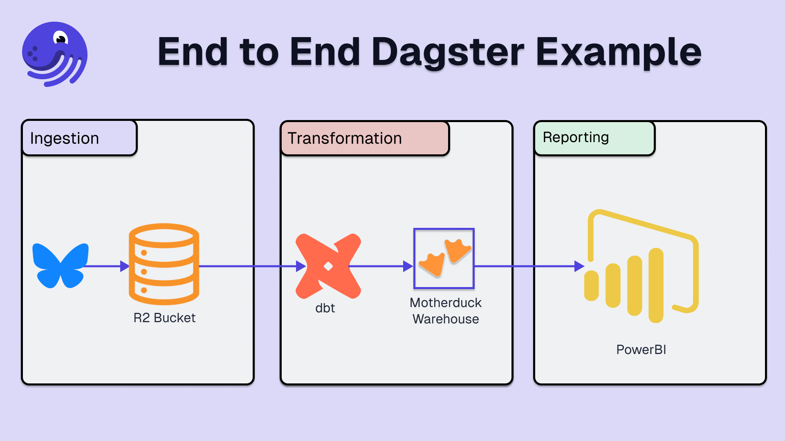

# project_atproto_dashboard

An end-to-end demonstration of ingestion data from the ATProto API, modeling it with dbt, and presenting it with Power BI.




## Features used

1. Ingestion of data-related Bluesky posts
   - Dynamic partitions
   - Declarative automation
   - Concurrency limits
2. Modelling data using _dbt_
3. Representing data in a dashboard

## Getting started

### Environment Setup

Ensure the following environments have been populated in your `.env` file. Start by copying the
template.

```
cp .env.example .env
```

And then populate the fields.

### Development

Install the project dependencies:

    pip install -e ".[dev]"

Start Dagster:

    DAGSTER_HOME=$(pwd) dagster dev

### Unit testing

Tests are in the `project_atproto_dashboard_tests` directory and you can run tests using `pytest`:

    pytest project_atproto_dashboard_tests

## Resources

- https://docs.bsky.app/docs/tutorials/viewing-feeds
- https://docs.bsky.app/docs/advanced-guides/rate-limits
- https://atproto.blue/en/latest/atproto_client/auth.html#session-string
- https://tenacity.readthedocs.io/en/latest/#waiting-before-retrying
